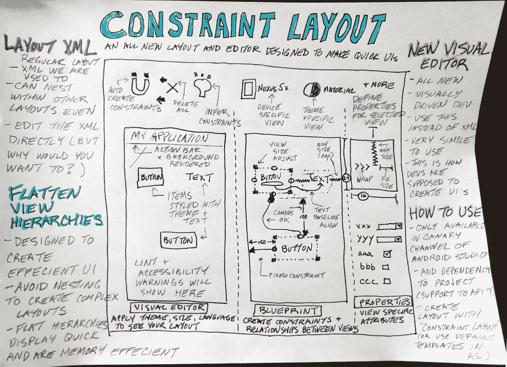
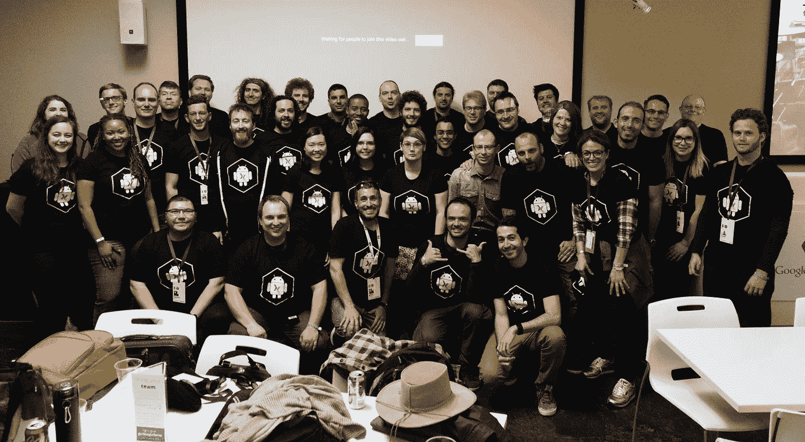

# Android 新 ConstraintLayout 的第一印象

> 原文：<https://medium.com/google-developer-experts/first-impressions-of-androids-new-constraintlayout-c6d081b2bc2a?source=collection_archive---------0----------------------->

在谷歌 IO 之后， [*安卓 GDE*](https://developers.google.com/experts/) *团队聚在一起，收集我们对大会最重要公告的想法。这是我们对新约束布局的想法总结。*

High-level Constraint Layout basic concepts

在 IO 2016 上，更令人兴奋的[公告](http://android-developers.blogspot.com/2016/05/android-studio-22-preview-new-ui.html)(特别是对专注于 UI 的开发人员而言)之一是一个名为 *ConstraintLayout* (CL)的新布局容器和工具。

这个工具还处于早期阶段。目前只能从 Android Studio 的[金丝雀频道获得。我们预计它会很快成熟(他们已经在发布的第一周内推出了他们的第一个更新)。我们希望这种布局类型最终会成为所有顶级界面的默认布局。](http://tools.android.com/download/studio/canary/latest)

## ConstraintLayout 视图类型

基本上，新的 CL 只是另一个简单的 XML 布局类型。这与你可能已经在使用的其他布局没有太大区别(比如 *RelativeLayout* 或 *LinearLayout* )。事实上，CL 可以像任何其他布局一样使用——它可以嵌套到其他布局中，甚至可以用于 API 9。查看和编辑 XML 是可能的，但是当我们问谷歌员工这个问题时，他们都回答说:“T20 你可以，但是你为什么要用？”。这主要是作为一个面向视觉的工具来设计的。

新布局基于*约束。这些描述了您的视图(或屏幕)之间的关系，具有响应的性质。这些属性与 *RelativeLayout* 使用的属性非常相似(如:*Android:layout _ alignParentBottom = " true "*)。*

如果 CL 仅仅是另一个布局容器，就没有什么好兴奋的了。但是，CL 不仅仅是另一种布局类型*。这是一个全新的布局容器，旨在帮助开发人员创建复杂的布局，优化快速渲染。这是因为它会生成平面视图层次结构(请阅读这篇[文章](http://blog.venmo.com/hf2t3h4x98p5e13z82pl8j66ngcmry/performance-tuning-on-android)以了解为什么这很重要)。这将真正帮助开发人员创建具有复杂界面的应用程序，快速显示，没有视觉抖动或暂停，消耗最少的内存资源。# perfmatters-)*

> 这应该摆脱了“这里应该用什么布局”这种答案来源于经验(和失败)的新手问题。现在有了一个顶级容器，它被设计成每个人都应该经常使用的主要容器

## 约束布局编辑器

除了新的布局类型之外，还有一个全新的可视化编辑器来简化这些新布局的创建。可视化编辑器旨在成为开发人员与其布局交互的主要方式。我们不打算详细介绍这个工具的用法，因为[丽贝卡](https://developers.google.com/experts/people/rebecca-franks)已经在[这篇文章中做得很好了，](http://riggaroo.co.za/constraintlayout-101-new-layout-builder-android-studio/)还有[的文档](http://tools.android.com/tech-docs/layout-editor)。

> 这主要是作为一个可视化工具而设计的，从头开始重新编写，并不是现有可视化编辑器的发展

新的可视化编辑器使用起来很有趣。它由 3 个主要工具组成:

*   可视化编辑器—显示您的用户界面在特定屏幕上的外观以及应用的特定主题
*   蓝图编辑器——这是人们花费大部分时间的地方，也是开发人员定义他们的视图之间的关系的地方
*   属性编辑器—将特定属性应用于选定的视图。

大多数开发人员的交互将使用蓝图视图来完成。如果您启用了“自动连接”按钮并将一个视图(如*按钮*或*文本视图*)拖动到屏幕上，编辑器将自动创建*约束*(连接到其他对象或屏幕边缘)。创建约束时，会显示一个很好的动画。

删除和重新创建约束很容易，甚至还有一个*“推断约束”*按钮，它会猜测整个布局的约束。当我们尝试这样做时，它的效果和预期的一样好。我们认为开发人员将利用这一点开始，然后调整约束来微调细节。

总的来说，所有的编辑器都非常简单易用。如果你习惯于用 *RelativeLayouts* 构建 ui，这看起来会很熟悉。然而，如果你已经嵌套了大量的 LinearLayouts 来构建复杂的布局，那么，为你感到羞耻，这将是学习如何以正确的方式构建响应性布局的好时机。

## 这一切将走向何方？

对于这个工具来说，现在还为时尚早。对于谷歌的所有事情，我们都抱着谨慎乐观的态度。

我们欢迎有一天设计师能够理解 Android 视图布局的基本概念，甚至使用工具。从原型工具(如 Sketch 或 Adobe Illustrator)导出布局的可能性很可能会出现(直接来自 Google 或社区)。

目前可以将现有布局直接导入工具。在某些时候，这可能是值得做的事情，因为这应该会提高每个应用程序的整体性能。此时，我们认为在生产中广泛使用它之前让它成熟一点是明智的。

我们担心向面向视觉的开发的转变会如何影响开发工作流。例如，如何为代码评审跟踪布局的变化？

当创建*约束时，*蓝图*编辑器显示动画。*它们很慢，你必须在动画结束前停止约束生成。看起来这将是乏味的(希望有一个关闭动画的选项)。

## 结论

我们对这个新的 UI 概念感到兴奋，并且认为使用 *ConstraintLayout* 在不久的将来会非常有用。

Some of the Andoid GDEs at post-IO gathering