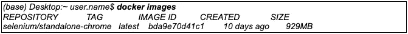

# 使用 Selenium 进入 Docker 的第一步

> 原文：<https://medium.com/globant/first-steps-into-docker-with-selenium-bdfc3185c157?source=collection_archive---------2----------------------->

# 介绍

当在自动化团队中工作时，我们的自动化测试用例的执行是需要考虑的重要一点。

有几次，我们使用虚拟机来配置我们的环境，并与团队的其他成员共享它，但是维护这种工作方案既昂贵又繁琐。

一个更高效、更轻便的替代方法是使用容器，这就是 Docker 的用武之地。

在下面几行中，我们将看到如何创建我们的容器来在 Selenium 中运行我们的自动化测试。

# Docker 是什么？

Docker 是一个开源工具，其诞生的目的是自动化应用程序部署。

使用 docker，我们可以通过设计 Docker 映像来快速创建和运行容器。

但是你可能会问，什么是图像？

图像是一个模板，我们在其中定义一旦我们启动它，我们的容器将执行。换句话说，容器只不过是一个运行的映像

# 利益

在使用 docker 的好处中，我们可以强调的是，它比虚拟机要轻得多。它不仅为我们提供了更好的可移植性，也方便了部署。

当使用容器时，环境的一致性更高，并且被版本化，实现改变更容易。

通过托管完整的系统及其依赖项，Docker 让我们可以快速创建开发和测试环境，我们可以确保整个团队拥有相同的环境，并保证正确的操作。

在下图中，我们可以看到使用容器和虚拟机的架构之间的差异。

**图片下载自*【https://docker.com】

*当你考虑一个具有持续集成和持续交付(CI/CD)的坚实过程的组织时，像 Docker 这样的工具的使用极大地促进了这个过程的维护，并且给了我们在周期的任何时间在任何平台上运行我们的测试的自由*

*了解了 Docker 是什么以及它是如何工作的基础知识之后，在这篇博文的剩余部分，我将只关注我们在容器中的 Selenium 测试的执行。*

*如果你有兴趣了解更多关于 Docker 的信息，我很荣幸邀请你访问官方网站，在这里可以找到关于这款优秀工具的所有信息:[https://docs.docker.com/](https://docs.docker.com/)。*

# *不足之处*

*和我们使用的每一个工具一样，Docker 也有一些需要考虑的缺点。*

*首先，如果我们想到一个基于容器的架构，根据项目的不同，我们将可能最终管理大量具有不同应用程序和系统的映像和容器。因此，为了实现对这些容器的有效管理，我们需要像 Kubernetes 这样的附加工具。*

*另一个值得考虑的缺点是它必须作为根用户运行。从 19.03 版本开始，它可以在没有 root 权限的情况下运行，但 Docker 团队不能像使用 root 权限一样保证它的正确操作。*

*有一些具有类似特征的应用程序允许我们克服这些复杂性。在这篇文章中，我们不会深究它们，但我会提出两种选择，这样你就可以对每一种做出自己的分析。*

*- **波德曼**([https://波德曼. io](https://podman.io/) )*

*Podman 是一个容器管理器，如 Docker，但它有一个特点，即它不需要守护进程。它还允许您在没有 root 权限的情况下运行它。此外，它还支持 Docker 和 OCI 图像的处理。*

*- **LXC-Linux 容器**([https://linuxcontainers.org/lxc/introduction/](https://linuxcontainers.org/lxc/introduction/))*

*LXC 是一项相当复杂的技术，它允许我们在操作系统级别进行虚拟化。Docker 的主要区别在于它允许我们独立运行多个 Linux 环境。它可以是 Docker 的一个很好的替代方案，因为它不需要 root 权限，而且更安全。*

# *安装 Docker*

*第一步是进入 Docker 的官方网站[(https://docs.docker.com/get-docker/](https://docs.docker.com/get-docker/))并选择我们正在使用的平台进行下载。在任何平台上安装都非常简单。在我的情况下，我将使用 MAC 来写这篇博客，但对于 Windows 用户，我留给你这个指南，它被完美地解释了:*

*[https://docs.docker.com/docker-for-windows/install/](https://docs.docker.com/docker-for-windows/install/)。*

*Docker.dmg 文件将被下载到我们的机器上，我们必须执行它来开始安装。*

*安装完成后，下一步是启动它(与任何应用程序一样)，为了验证我们安装的版本，我们从终端执行命令' *docker version* '。结果应该是这样的:*

**

*如果您没有得到这个结果，这是因为 Docker 没有运行或发生了安装错误。*

# *使用 Selenium 运行 docker 映像*

*Selenium 团队为我们提供了不同的 Docker 映像，这些映像已经用不同的执行方案创建，可以在他们的 Docker hub 配置文件中查阅:[https://hub.docker.com/u/selenium](https://hub.docker.com/u/selenium)。*

*在这篇博文中，我们将重点关注包含 Chrome 驱动程序([https://hub.docker.com/r/selenium/standalone-chrome](https://hub.docker.com/r/selenium/standalone-chrome))的图片，但是你可以完美地使用任何选项。*

*要下载选定的图像，我们必须使用' *docker pull* '命令，后跟我们要下载的图像的名称。之后，Docker 将开始下载图像，一旦下载完成，我们将获得如下结果:*

**

*为了验证图像下载正确，我们使用' *docker images* '命令。它向我们展示了我们机器上的所有图像。*

**

*有了已经下载的 Docker 映像，您所要做的就是用这个映像运行容器。为此，我们将使用命令'*docker run-d-p 4444:4444-v/dev/shm:/dev/shm selenium/standalone-chrome:latest*'。*

*当 Docker 执行一个容器时，它返回它的标识符。在示例中，您可以看到在执行命令后，终端向我们显示了如下字符串:*

**

*为了保证我们的容器正在运行，我们还可以使用' *docker ps* '命令。这将显示在我们的机器上运行的所有容器的列表。*

**

*从命令输出中可以看出，容器正在端口 **0.0.0.0:4444** 上运行。这个信息非常重要，因为当我们运行测试时，我们必须指定我们想要使用哪个 Selenium 服务器。*

# *运行测试*

*此时，我们已经运行了带有 Selenium 的容器，我们只需要针对该容器运行我们的测试。*

*例如，在这篇博文中，我们将运行一个简单的 Python 脚本，该脚本包含一个 Google 搜索并将模拟结果打印到控制台。*

## ***testCase.py** :*

**

*正如我们在代码中看到的，我将测试指向这个地址:[**http://localhost:4444/wd/hub**，](http://localhost:4444/wd/hub,)哪个 IP 和端口是我们在 Selenium 容器中定义的。*

*然后，我们转到我们的项目所在的文件夹，并继续执行它。在我的例子中，它在用户的根中。*

**

*一旦我们的测试完成，我们可以停止集装箱，如果我们想要的。为此，我们使用命令一旦我们的测试完成，我们可以停止容器，如果我们想要的。为此，我们使用命令' *docker stop* '，我们必须指定我们想要停止的集装箱的 ID。*

*在命令输出中，我们将获得停止的容器的 ID。*

**

*就这样，我们已经有了运行 Selenium 的容器，我们的测试也准备好在容器中运行了。*

*在我们在过程中使用的例子中，我们在本地机器上运行容器，但是它可以被任何远程服务器代替，并且团队中的任何人都可以访问来运行我们的自动化测试。*

# *结论*

*正如我们在优点部分所评论的，您可以快速创建不同的测试环境。在这种情况下，您必须将 chrome 图像替换为 firefox 图像，其余的过程是相同的。*

*按照这个过程的步骤，在几分钟内，您就可以构建一个跨平台的测试环境来运行自动化测试。*

*Docker 的使用成本很低，无论大项目还是小项目都充分推荐。你必须记住，如果你添加越来越多的不同系统和应用程序的容器，你将需要像 Docker Swarm 或 Kubernetes 这样的工具来管理它们。*

*如果您是一个更高级的用户，您也可以从头开始创建自己的映像，为依赖项和其他工具的版本编写自己的配方。通过这种方式，您可以根据自己的需要自由地添加或删除容器中的元素，使其更轻便或更健壮，但这是另一篇博客的主题。*