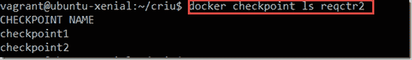

# Docker 检查点的第一步——创建和恢复正在运行的容器的快照

> 原文：<https://medium.com/oracledevs/first-steps-with-docker-checkpoint-to-create-and-restore-snapshots-of-running-containers-f85395d1b69f?source=collection_archive---------0----------------------->

Docker 容器可以停止和重新启动。在运行的容器中对文件系统所做的更改将在这种有意的停止和启动循环中继续存在。内存中的数据和正在运行的进程显然不会。崩溃的容器不能只是重新启动，如果可以重新启动，它将使文件系统处于不确定状态。当您在一个容器停止后启动它时，它将经历它的完整启动例程。如果需要启动负载较重的进程，比如数据库服务器进程，那么这个启动时间可能会很长，可能会有几秒或几十秒。

Linux 在用户空间中有一种称为 CRIU 或检查点/恢复的机制。使用该工具，您可以冻结正在运行的应用程序(或其一部分),并将其作为磁盘上的文件集合进行检查点检查。然后，您可以使用这些文件来恢复应用程序，并完全按照冻结时的状态运行它。详见[https://criu.org/Main_Page](https://criu.org/Main_Page)。Docker CE 对 CRIU 有(实验性的)支持。这意味着使用简单的 docker 命令，我们可以拍摄一个正在运行的容器的快照(docker check point create<container name><check point name>)。稍后，我们可以作为同一个容器(docker start–check point<check point name><container name>)或不同的容器启动该快照。

从检查点启动的容器与创建检查点时的容器处于相同的状态(内存和进程)。此外，容器从快照的启动时间非常短(亚秒)；对于启动时间相当长的容器，这种快速启动是一个巨大的好处。

在这篇文章中，我将讲述我与 CRIU 和 Docker 的最初步骤。我让它工作了。我确实在 Docker CE 的最近版本(17.12 和 18.x)中遇到了[问题](https://github.com/moby/moby/issues/35691)，所以我求助于 Docker CE 的 17.04。我还在旧版本的 CRIU 上遇到了[问题](https://github.com/checkpoint-restore/criu/commit/fb4f28f00af0f2d8c6fafdbafc74951f0caea925)，所以我构建了当前最新版本的 CRIU (3.8.1)而不是 Ubuntu Xenial 64 发行版中的版本(2.6)。

我将演示如何启动一个克隆 GitHub 存储库的容器，并启动一个简单的 REST API 作为节点应用程序；这需要 10 秒或更长时间。这个应用程序计算它处理的 GET 请求的数量(通过保存一些内存状态)。在处理了许多请求之后，我为这个容器创建了一个检查点。接下来，我又提出了几个请求，同时观察计数器的增加。然后，我停止集装箱，并从检查点开始一个新的集装箱。容器运行速度极快，不到 700 毫秒，因此它明显利用了创建快照时的容器状态。它在创建快照时继续计算请求数，显然是继承了它的内存状态。正如所期望的那样。

注意:检查点不会捕获容器中文件系统的更改。只有内存状态是快照的一部分。

注意 2: Kubernetes 还不支持检查点。这意味着 pod 不能从检查点启动容器。

在以后的文章中，我将描述这些快照的一个用例——在自动化测试场景和复杂数据集中。

我所经历的步骤(在我的 Windows 10 笔记本电脑上，使用了 vagger 2 . 0 . 3 和 VirtualBox 5.2.8):

*   使用 vagger 创建一个带有 Docker CE 18.x 的 Ubuntu 16.04 LTS (Xenial)虚拟机箱虚拟机
*   将 Docker 从 18.x 降级到 17.04
*   为实验选项配置 Docker
*   安装 CRIU 软件包
*   尝试使用 Docker 检查点的简单场景
*   构建 CRIU 最新版本
*   使用 Docker 检查点尝试更复杂的场景(在旧的 CRIU 版本中失败了)

# 使用 Docker CE 18.x 创建 Ubuntu 16.04 LTS (Xenial)虚拟机箱虚拟机

我的 Windows 10 笔记本电脑已经有了流浪者 2.0.3 和虚拟盒子 5.2.8。我使用下面的浮动文件创建了一个 VM，它是我在这个实验中的 Docker 主机:

创建(并启动)虚拟机后

```
vagrant up
```

我使用以下命令连接到虚拟机

```
vagrant ssh
```

在命令提示符下结束，准备行动。

为了确保我们是最新的，我跑了

```
sudo apt-get upgrade
```


# 将 Docker CE 降级到版本 17.04

在撰写本文时，最近的 Docker 版本(至少为 17.09 及更高版本——见[https://github.com/moby/moby/issues/35691](https://github.com/moby/moby/issues/35691))存在问题，因此我降级到 17.04 版本(如下所述:[https://forums . Docker . com/t/how-to-downgrade-Docker-to-a-specific-version/29523/4](https://forums.docker.com/t/how-to-downgrade-docker-to-a-specific-version/29523/4))。

首先删除由流浪者提供者安装的 Docker 版本:

```
sudo apt-get autoremove -y docker-ce \ && sudo apt-get purge docker-ce -y \ && sudo rm -rf /etc/docker/ \ && sudo rm -f /etc/systemd/system/multi-user.target.wants/docker.service \ && sudo rm -rf /var/lib/docker \ && sudo systemctl daemon-reload
```

然后安装所需的版本:

```
sudo apt-cache policy docker-ce sudo apt-get install -y docker-ce=17.04.0~ce-0~ubuntu-xenial
```

# 为实验选项配置 Docker

利用 CRIU 支持检查点是 Docker 中的一个实验性特性。为了利用它，必须启用实验选项。这已经完成(如 https://stack overflow . com/questions/44346322/how-to-run-docker-with-experimental-functions-on-Ubuntu-16-04 中所述)

```
sudo nano /etc/docker/daemon.json
```

增加

```
{ "experimental": true }
```

按 CTRL+X，选择 Y 并按 Enter 保存新文件。

重新启动 docker 服务:

```
sudo service docker restart
```

检查

```
docker version
```

如果实验真的启用了。

# 安装 CRIU 软件包

CRIU 的简单方法——它应该如何工作——就是简单地安装 CRIU 软件包:

```
sudo apt-get install criu
```

(例如参见[https://yipee . io/2017/06/saving-and-restore-container-state-with-criu/](https://yipee.io/2017/06/saving-and-restoring-container-state-with-criu/))

这个安装为我带来了 CRIU 软件包的 2.6 版本。对一些行动来说，这证明是足够的，而对另一些行动来说，这证明是不够的。


# 使用 CRIU 码头检查站尝试简单场景

目前我们有 Docker 17.04，Ubuntu 16.04 和 CRIU 2.6。这种组合可以让我们对 Docker 检查点机制有一个初步的了解。

运行一个简单的容器，该容器每秒向控制台写入一次计数器值(然后增加计数器)

```
docker run --security-opt=seccomp:unconfined --name cr -d busybox /bin/sh -c 'i=0; while true; do echo $i; i=$(expr $i + 1); sleep 1; done'
```

检查写入控制台的值:

```
docker logs cr
```

现在为容器创建一个 Docker 检查点:

```
docker checkpoint create  --leave-running=true cr checkpoint0
```


让容器运行一段时间，然后再次检查日志

```
docker logs cr
```


现在停止容器:

```
docker stop cr
```

并重新启动/重新创建容器—不是从头开始，而是从检查点开始:

```
docker start --checkpoint checkpoint0 cr
```

检查日志:

```
docker logs cr
```

您会发现日志在创建检查点的值(19)处恢复:


# 构建 CRIU 最新版本

当我尝试一个更复杂的场景时(见下一节)，我遇到了这个[问题](https://github.com/checkpoint-restore/criu/commit/fb4f28f00af0f2d8c6fafdbafc74951f0caea925)。我可以通过在我的 Ubuntu Docker 主机上构建最新版本的 CRIU 来解决这个问题。以下是我按照这些指示完成的步骤:[https://criu.org/Installation](https://criu.org/Installation)。

首先，删除当前安装的 CRIU 软件包:

```
sudo apt-get autoremove -y criu \ 
&& sudo apt-get purge criu -y \
```

然后，准备构建环境:

```
sudo apt-get install build-essential \ 
&& sudo apt-get install gcc   \ 
&& sudo apt-get install libprotobuf-dev libprotobuf-c0-dev protobuf-c-compiler protobuf-compiler python-protobuf \ 
&& sudo apt-get install pkg-config python-ipaddr iproute2 libcap-dev  libnl-3-dev libnet-dev --no-install-recommends
```

接下来，克隆 CRIU 的 GitHub 存储库:

```
git clone https://github.com/checkpoint-restore/criu
```

导航到包含代码库的 criu 目录

```
cd criu
```

并构建 criu 包:

```
make
```

当 make 完成后，我可以运行 CRIU:

```
sudo ./criu/criu check
```

查看安装是否成功。最终输出的消息应该是:看起来不错(尽管可能有一个或多个警告)。

使用

```
sudo ./criu/criu –V
```

了解当前安装的 CRIU 版本。

注意:CRIU 说明描述了在系统范围内安装 criu 的以下步骤。为了让 docker 从 Docker 检查点命令中利用 CRIU，似乎不需要这样做。

```
sudo apt-get install asciidoc  xmlto 
sudo make install criu check
```

现在，我们已经准备好接受更复杂的场景，这种场景之前在旧的 CRIU 版本中由于一个问题而失败了。

# 具有 Docker 检查点的更复杂的场景

这种情况在旧的 CRIU 版本中失败了——可能是因为这个[问题](https://github.com/checkpoint-restore/criu/commit/fb4f28f00af0f2d8c6fafdbafc74951f0caea925)。我可以通过在我的 Ubuntu Docker 主机上构建最新版本的 CRIU 来解决这个问题。

在本例中，我运行了一个基于 Docker 容器映像的容器，用于运行从 GitHub 存储库中下载的任何节点应用程序。容器将下载并运行的节点应用程序处理简单的 HTTP GET 请求:它对请求进行计数，并返回计数器的值作为对请求的响应。这个容器映像和这个应用程序在之前的文章中介绍过:[https://technology . amis . nl/2017/05/21/running-node-js-applications-from-github-in-generic-docker-container/](https://technology.amis.nl/2017/05/21/running-node-js-applications-from-github-in-generic-docker-container/)

这里您可以看到运行容器的命令—将被称为 *reqctr2* :

```
docker run --name reqctr2 -e "GIT_URL=https://github.com/lucasjellema/microservices-choreography-kubernetes-workshop-june2017" -e "APP_PORT=8080" -p 8005:8080 -e "APP_HOME=part1" -e "APP_STARTUP=requestCounter.js" lucasjellema/node-app-runner
```


应用程序启动和处理请求大约需要 15 秒钟。

一旦容器开始运行，就可以从 VM 外部发送请求——例如从我的笔记本电脑上运行的浏览器——由容器处理，http://192.168.188.106:8005/。

一次或多次请求后，计数器显示在 21:


此时，我为容器创建了一个检查点:

```
docker checkpoint create --leave-running=true reqctr2 checkpoint1
```


现在，我在浏览器中发出几个额外的请求，使计数器达到更高的值:


此时，我停止了容器—随后从检查点再次启动它**:**

```
docker stop reqctr2 docker start --checkpoint checkpoint1 reqctr2
```


容器继续运行不到一秒钟。

当我发出一个新请求时，我得到的值既不是 1(新容器的结果)，也不是 43(如果前一个容器仍在运行，我将得到的结果)。相反，我得到了


这是从快照中捕获的容器状态开始的下一个值。注意:因为我从浏览器发出 GET 请求，并且浏览器也试图检索 favicon，所以我在浏览器中每按一次 refresh，计数器就增加 2。

注意:我可以获得为容器创建的所有检查点的列表。显然，我应该在这些检查点的命名约定上投入更多的精力:

```
docker checkpoint ls reqctr2
```



我在这个场景中经历的流程可以想象成这样:


起点:Windows 笔记本电脑与流浪汉和虚拟框。一个 VM 已经被里面有 Docker 的流浪者创建了。Docker 和 CRIU 软件包的正确版本已经设置。

然后运行这些步骤:

1.  使用节点 JS 运行时基于映像启动 Docker 容器
2.  克隆包含节点 JS 应用程序的 GitHub 存储库
3.  运行 Node JS 应用程序—为 HTTP 请求做好准备
4.  处理来自 Windows 主机上的浏览器的 HTTP 请求
5.  为容器创建 Docker 检查点—容器状态的快照
6.  检查点保存在 Docker 主机上，以备后用
7.  从检查点启动容器。这个容器瞬间启动，不需要 GitHub 克隆和应用启动；它从创建检查点时的状态恢复
8.  容器处理 HTTP 请求——就像它的检查点前身一样

# 资源

来源于这个 GitHub repo:[https://GitHub . com/lucasjellema/docker-check point-first-steps](https://github.com/lucasjellema/docker-checkpoint-first-steps)

关于 CRIU 的文章:[http://www . admin-magazine . com/Archive/2014/22/Save-and-Restore-Linux-Processes-with-CRIU](http://www.admin-magazine.com/Archive/2014/22/Save-and-Restore-Linux-Processes-with-CRIU)

还有:关于 CRIU 和 Docker:[https://yipee . io/2017/06/saving-and-restoring-container-state-with-criu/。](https://yipee.io/2017/06/saving-and-restoring-container-state-with-criu/)

Docker 中关于检查点和恢复的文档:[https://github . com/Docker/CLI/blob/master/experimental/check point-Restore . MD](https://github.com/docker/cli/blob/master/experimental/checkpoint-restore.md)

Docker 支持页面:[https://criu.org/Docker;](https://criu.org/Docker;)在 Ubuntu 上安装 CRIU 包:[https://criu.org/Packages#Ubuntu](https://criu.org/Packages#Ubuntu)

安装并构建 https://criu.org/Installation 来源:[CRIU](https://criu.org/Installation)

关于流浪乞讨人员救助的文件:[https://www.vagrantup.com/docs/provisioning/docker.html](https://www.vagrantup.com/docs/provisioning/docker.html)

关于降级 Docker 的文章:[https://forums . Docker . com/t/how-to-降级-Docker-to-a-specific-version/29523/4](https://forums.docker.com/t/how-to-downgrade-docker-to-a-specific-version/29523/4)

为实验选项配置 Docker:[https://stack overflow . com/questions/44346322/how-to-run-Docker-with-experimental-functions-on-Ubuntu-16-04](https://stackoverflow.com/questions/44346322/how-to-run-docker-with-experimental-functions-on-ubuntu-16-04)

码头和检查站问题(至少在 17.09–18.03 中):【https://github.com/moby/moby/issues/35691 

*原载于 2018 年 4 月 8 日*[*technology . amis . nl*](https://technology.amis.nl/2018/04/08/first-steps-with-docker-checkpoint-to-create-and-restore-snapshots-of-running-containers/)*。*