# Oracle 自助服务集成云的第一步

> 原文：<https://medium.com/oracledevs/first-steps-with-oracle-self-service-integration-cloud-aef902102188?source=collection_archive---------1----------------------->

实现 SaaS 应用程序最佳使用的一个重要部分是在所述应用程序中集成各种功能。一个应用程序中的事件需要对其他应用程序产生影响。从简单的实际问题，如“当特定类型的文件上传到某个 Dropbox 或 OneDrive 文件夹时发送电子邮件”或“当创建 IRA 问题时更新 Google 文档”，到更深刻的操作，如“当新的销售线索添加到 Oracle Sales Cloud 时，在 Slack 渠道中发布新消息”或“当添加 Eloqua 帐户时，创建相同的帐户 Oracle Sales Cloud。”

Oracle Self Service Integration Cloud 提供了一个框架，用于定期轮询各种现成的业务应用程序以及您自己添加的任何应用程序(只要该应用程序可以通过调用 REST API 进行轮询)。在轮询操作中检索到的任何记录都可以用于触发其他应用程序中的操作。SSI 可以执行一些逻辑(过滤、循环、条件执行以及一些计算和转换),并创建请求消息发送到目标应用程序。许多配方都是现成的，而且可以很容易地为所有已知的业务应用程序以及我们自己添加的应用程序创建更多的配方。

请注意，SSI 将是面向 Oracle 集成云的新定制适配器开发套件的基础；显然，这将支持一个低代码，拖放容易创建适配器的图形体验。

在这篇文章中，有一些关于 SSI 的第一印象。

# 步骤 1:设置 SSI 实例

在云控制面板中，我打开了 SSI 的服务控制台。在这里，我选择了创建新实例的选项。

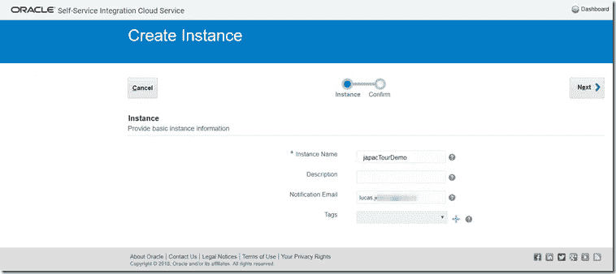

所需要的只是名字(名字中请不要有破折号！)和可选的用于发送“就绪”邮件的电子邮件地址。

确认选择并按创建:

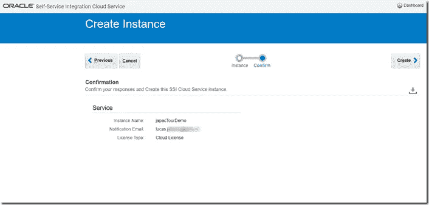

实例供应正在进行中:

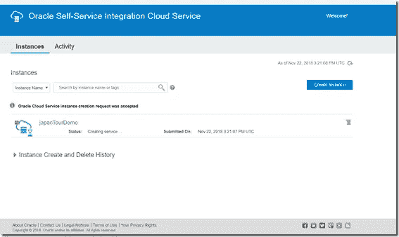

# 第二步:创建我的第一个 SSI 食谱

SSI 知道配方——由我们定义，用于我们的(与我们的)云应用程序的连接，并按照我们的方式运行。这些配方通常是预定义配方的自定义配置实例，即 SSI 提供的现成配方。配方会定期执行，这将产生配方作业历史记录。我们可以定义其他云应用程序定义(SSI 可以集成的新云应用程序，例如我们自己的定制应用程序和 SSI 目前不支持的 SaaS 应用程序，例如 GitHub、Twitter 或 SalesForce)。

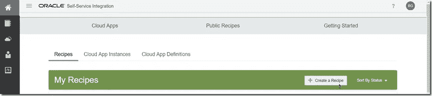

让我们基于两个现有的云应用程序创建一个新的配方。

以下是 SSI 目前预定义了触发器和操作的云应用程序列表:

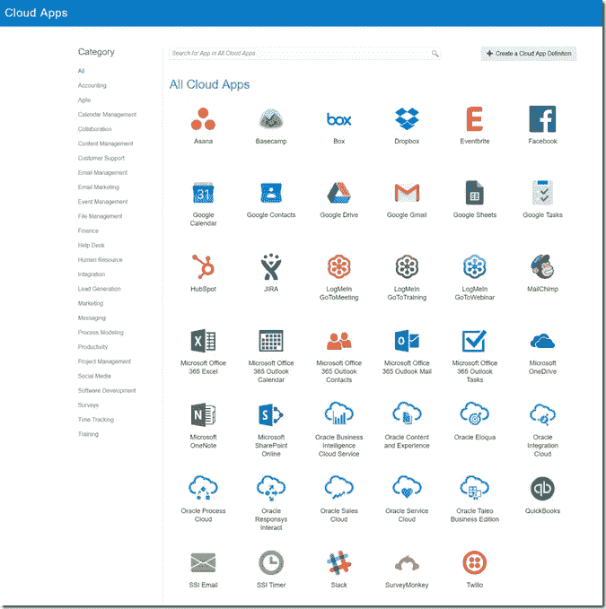

这些应用程序中的每一个都可以是一个配方中的源或目标——一个可以完全以声明方式定义的配方。

我将创建的这个不太有用的食谱将由我的 GMail 帐户收到的一封电子邮件触发。它的操作将包括编写并发送一封电子邮件到我的 Outlook 帐户，通知我有关该电子邮件的信息。我必须授权 SSI 使用两种 SaaS 电子邮件服务，添加一点关于观察哪个邮箱和触发哪些电子邮件的逻辑，并指定如何撰写外发电子邮件——部分来自传入电子邮件中可用的元素。

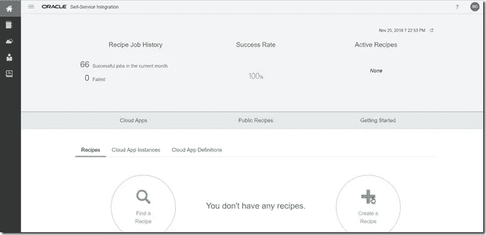

点击创建配方

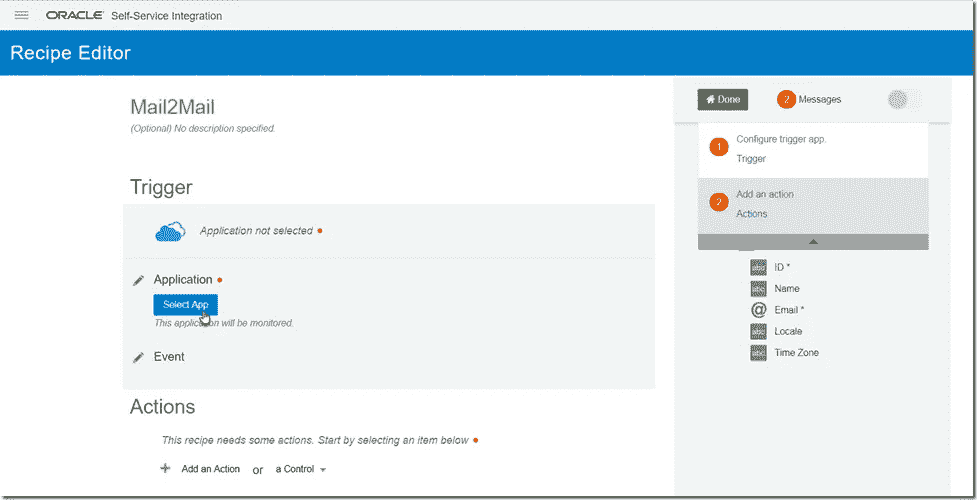

键入配方的名称。点击触发器，选择触发云应用。

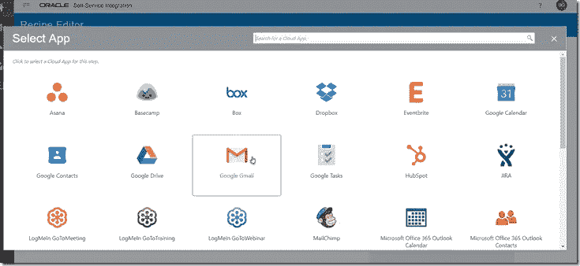

选择 Google Mail 作为触发云应用程序后，我需要授权 SSI 使用特定的 GMail 帐户:

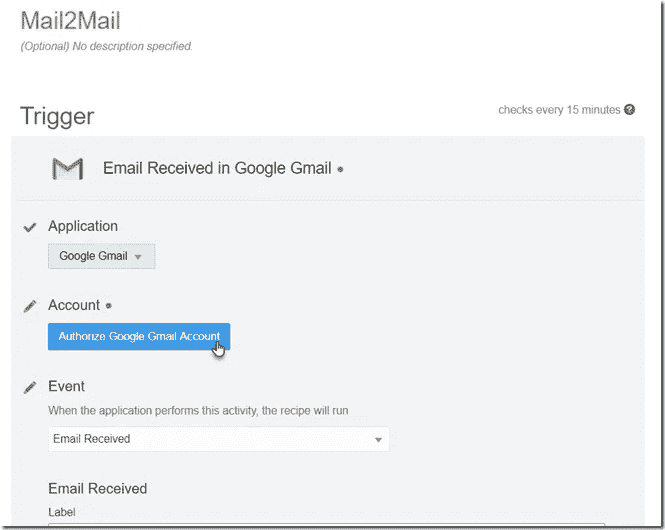

将出现“授权”对话框

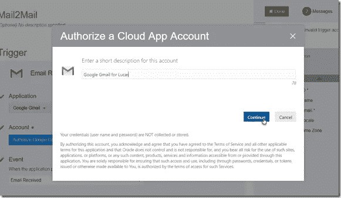

熟悉的 OAuth 交换发生了:

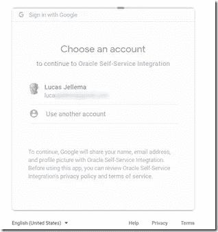

允许 SSI 对所选操作“使用”此帐户:

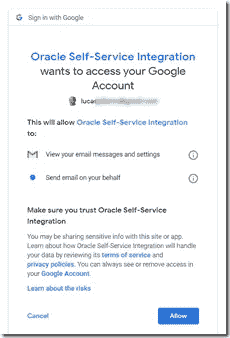

允许后，此云应用程序帐户设置如下:

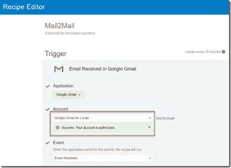

我们可以继续设计食谱。

请注意，在标签字段中，我们可以指明我们希望触发 GMail 帐户中哪些邮件的配方:

定义触发器后，我们可以定义触发器应该触发的一个或多个动作。

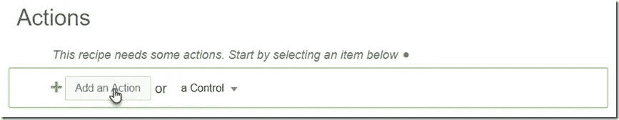

动作编辑器类似于触发器编辑器。

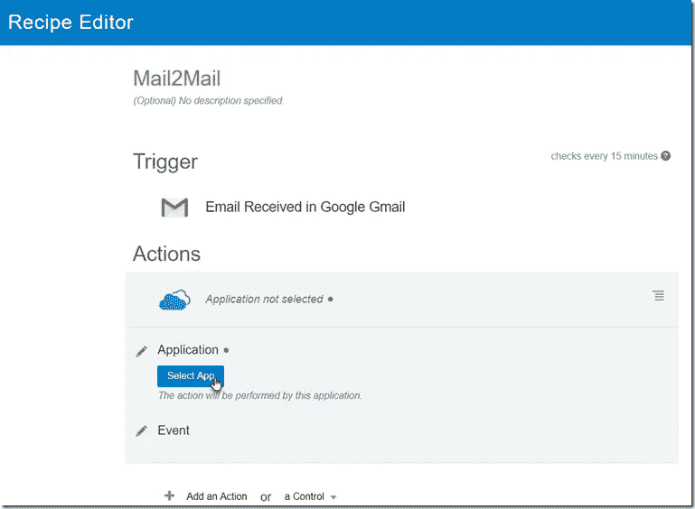

第一步是选择要成为动作对象的云应用。与之前类似，我选择我的 Office 365 Outlook 邮件帐户作为我的操作目标:

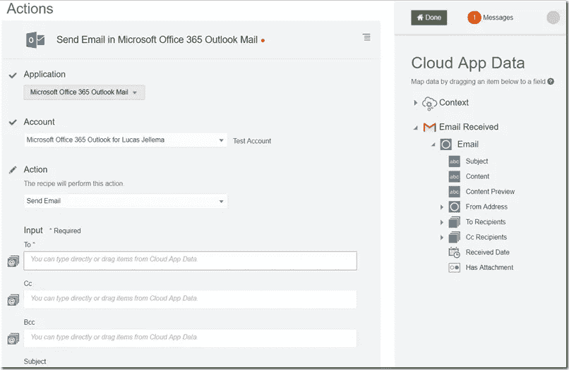

现在我提供行动的细节。什么是目标电子邮件地址，我想发送抄送或密件抄送副本？要发送的电子邮件的主题和正文是什么？

配置的操作可能如下所示:

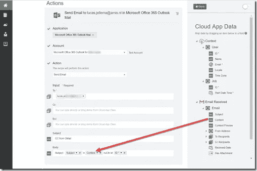

我保存了食谱。

# 激活配方

在食谱概述中，我可以钻取食谱来检查和编辑它们。我可以激活(和停用)配方:

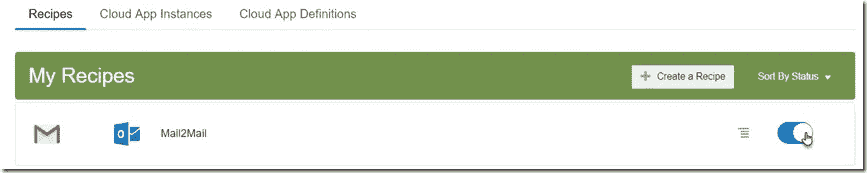

激活配方后，让我们在我的 GMail 文件夹中检查收到的电子邮件事件。我的 GMail 收件箱概览显示了以下内容:

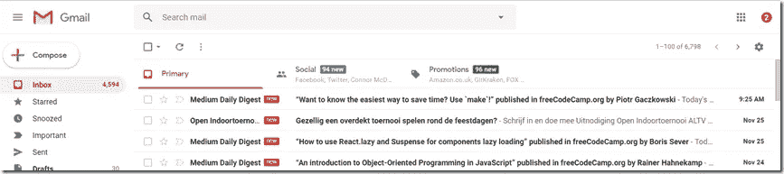

这些邮件触发了 SSI 配方。对于每一封邮件，都执行了编写和发送电子邮件的工作。

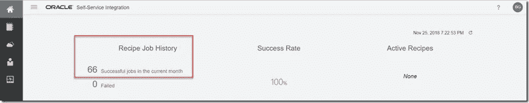

我们可以检查作业历史:

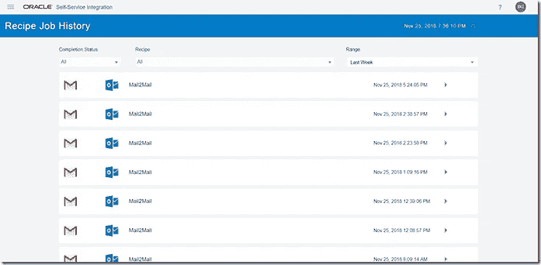

以及每个单独的作业执行日志:

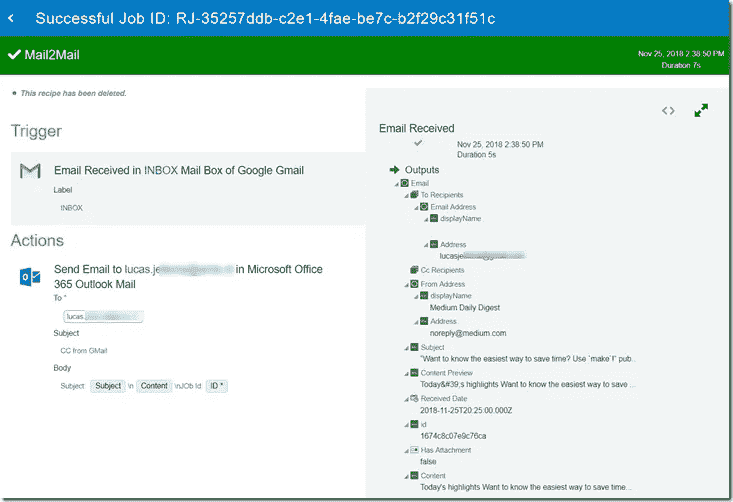

以下是 SSI 向我的 Outlook 邮件帐户发送的一些通知邮件，GMail 帐户收到的每封邮件对应一封邮件:

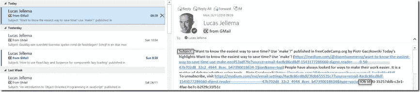

# 这和 IFTTT 有什么区别？

你可能熟悉 If This Then That 服务。该服务还允许您定义发送消息以响应触发器的方法。和 Oracle SSI 很像。受支持系统的范围肯定有所不同。Oracle SSI 对 Oracle SaaS 服务的支持远远超过 IFTTT。IFTTT 目前支持更广泛的第三方应用。两者都可以用来定义新的服务，例如与您自己的定制应用程序集成。这可能是真正的区别——对我来说，这两者如何比较还不是很清楚。我假设创建与 Oracle Cloud 上运行的定制应用程序进行交互的方法将被 SSI 很好地促进(这是它应该做的最起码的事情)，这可能会带来与 IFTTT 相比的差异。也许——但我还没有探索——在 SSI 上构建和运行定制食谱会比在 IFTTT 上容易得多。乍一看，SSI 上的管理似乎更容易，或者至少更具企业风格。

总拥有成本肯定会有差异。然而，IFTTT 的商业价格并不在他们的网站上(“联系销售”)——所以我现在就不详细介绍了。

# 最终:Apache Kafka 和甲骨文活动中心

SSI 带给我的一个想法是:我想利用 SSI 提供的现成的“适配器”来检测许多不同云应用程序中的事件。了解这些事件并访问相关的重要数据通常是集成解决方案的基础。如果 Apache Kafka(例如以 Oracle Event Hub Cloud Service 的形式)将作为云应用程序得到支持，我们可以轻松地创建一系列在 SaaS 应用程序中拦截事件的方法，并为这些事件发布 Kafka 事件消息，从而允许我充分利用广泛的工具、库和框架来处理 Kafka 事件。

SSI 目前还没有提供 Kafka 集成——它只能在 REST 方面进行讨论。上述方法的一个显而易见的方法是结合 SSI 方法，通过 REST 调用发布 Kafka 事件的无服务器函数。

# 资源

关于 SSI 的文档:[https://docs . Oracle . com/en/cloud/PAAs/self-service-integration-cloud/tasks . html](https://docs.oracle.com/en/cloud/paas/self-service-integration-cloud/tasks.html)

[odcl](https://technology.amis.nl/tag/odcl/) [菜谱](https://technology.amis.nl/tag/recipe/) [自助集成](https://technology.amis.nl/tag/self-service-integration/) [ssi](https://technology.amis.nl/tag/ssi/)

*原载于 2018 年 11 月 26 日*[*technology . amis . nl*](https://technology.amis.nl/2018/11/26/first-steps-with-oracle-self-service-integration-cloud/)*。*