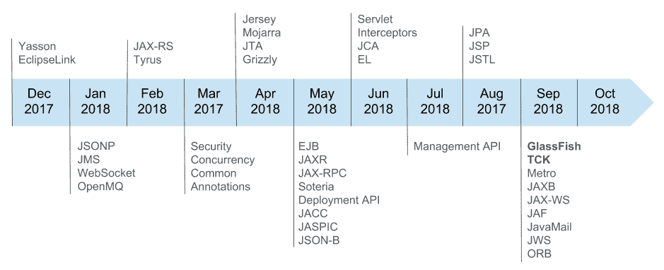
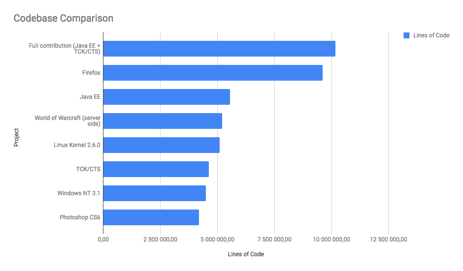
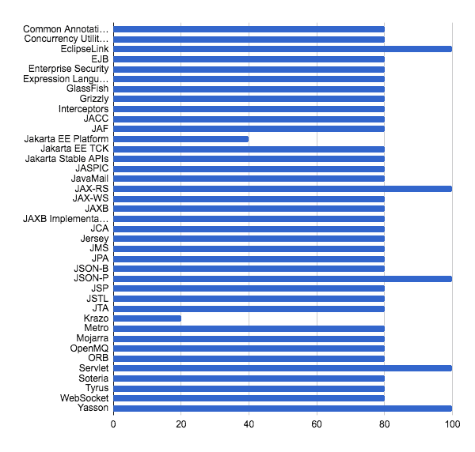
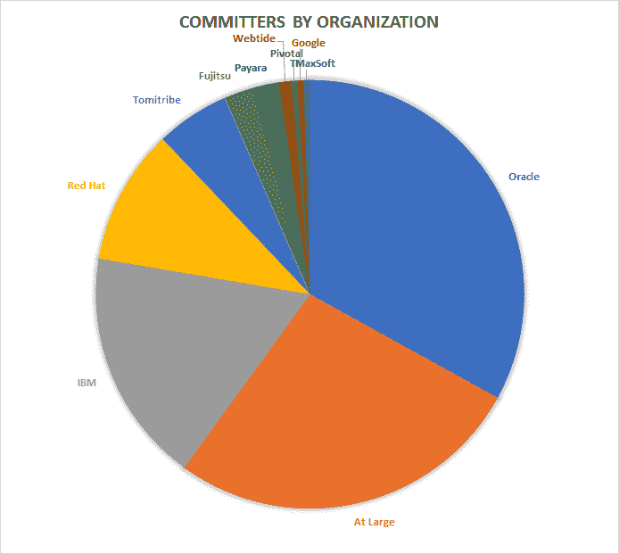
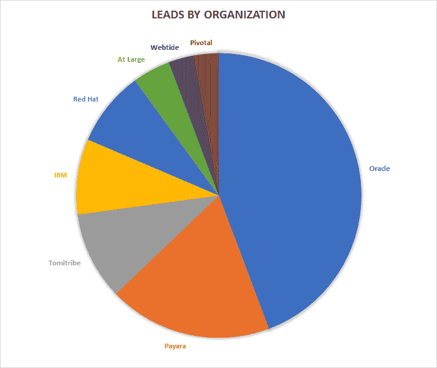

# 月食元年 EE4J

> 原文：<https://medium.com/oracledevs/first-year-of-eclipse-ee4j-d81e85f84e2e?source=collection_archive---------3----------------------->

将 Java EE 源代码转移到 Eclipse Foundation 的想法是在上一次 Oracle JavaOne 大会上宣布的。一年过去了，在这篇文章中，我将尝试总结这一年中我们做了什么，以及我们现在在哪里。

首先，我很高兴地宣布 **Eclipse GlassFish RC1 发布了！**

这里可以下载。这个版本不是最终版本。这是一个里程碑式的发布，旨在表明进展，并为开发人员提供最终产品的预览，以供他们使用、测试和提供反馈。

毫无疑问，这是 Jakarta EE 社区的白金奖杯，我们期望 Eclipse GlassFish 源代码将成为 Jakarta EE 规范实现的基础。

我们花了一年时间来实现它。我们从 Oracle Java EE 仓库一个接一个地转移项目，这是一个充满挑战的过程。我们必须通过 Oracle 和 Eclipse 方面的一系列审批。你可以在这里了解更多关于[的信息。](https://dmitrykornilov.net/2018/05/23/jakarta-ee-challenges/)

目前有 **39 个项目**被创建，并且 **88 个存储库**被转移。我在下面的图片上收集了有关项目资源何时转移的信息。

正如你所看到的，我们从 Eclipse link*和 Yasson* 开始，它们已经在 Eclipse Foundation，但是在 RT 项目下。从 Oracle GitHub 转移过来的第一批项目是 *JSONP* 、 *JMS* 、 *WebSocket* 和 *OpenMQ* 。2018 年 1 月做的。GlassFish 存储库和 *CTS/TCK* 存储库于 2018 年 9 月转移。

大多数项目都有 EPL 2.0 许可证，但其中一些是在更宽松的 EDL 许可证下转让的。对于过去与 JDK 共享代码库的项目来说确实如此，比如 *JAXB* 和 *JAX-WS* 。

现在，我想向您提供一些关于已完成工作量的愿景。让我们来看看 Java EE 代码库。一些项目(像大多数 API 项目一样)相对较小。实现通常要大得多，而且 TCK 代码库非常庞大。

更准确地说，Java EE 源代码包含超过**550 万行**代码和超过**220 万行**注释，包含在超过 **61，000 个**文件中。作为比较，它与魔兽世界和 Linux 内核 2.6.0 的服务器端差不多。

CTS/TCK 在超过 **34，000** 个文件中包含超过**460 万**行代码和超过**110 万**行注释。与 Windows NT 3.1 和 Photoshop CS6 的代码库不相上下。

我们总共在 **95k** 文件中转移了**1350 万行**代码。

Based on data provided by [https://informationisbeautiful.net](https://informationisbeautiful.net/visualizations/million-lines-of-code/)

值得一提的是，TCK/CTS 来源被关闭。这是社区第一次看到它并开始做出贡献。

很多工作都做了，但还是有事情要做。下面是来自 [Eclipse EE4J](http://www.eclipse.org/ee4j/status.php) 网站的项目现状:

上图显示了以下进展:

*   20%的项目提案已发布供机构群体审核
*   40%的项目负责人和资源已经到位
*   60%的初始贡献提供给 Eclipse IP 团队
*   80%的初始贡献被推送到 Git 存储库
*   100%的项目已经进行了第一次发布评审

并非所有的项目都是 100%的。大多数项目仍然需要通过发布评审并发布第一个 Eclipse 版本。这项工作正在进行中，目前进展顺利。社区高度参与。我数了数有超过 5 个提交/bug 报告的人，有超过 80 个活跃的贡献者，他们来自不同的供应商，包括 Oracle、IBM、Red Hat、Payara、Tomitribe 和其他公司。

我创建了两个饼图来展示不同的供应商是如何参与 EE4J 项目的。

第一个图表展示了每个组织的提交者。它总共代表 213 名提交人。如果此人的雇主未定义，他们被分配到*逍遥*组。

第二张图展示了按组织划分的项目领导。

为了实现我们的目标，必须保持较高的活动和参与水平。目前的主要目标是完成 Java EE 8 认证并发布 Eclipse GlassFish 的最终版本。

以下是目前的日程安排:

9 月 21 日—GF 构建所需的所有代码均已贡献。9 月 23 日——Eclipse GlassFish 构建。
10 月 1 日— Java EE 8 CTS 测试。在 Eclipse GlassFish 上运行 CTS 测试。10 月 22 日——Eclipse GlassFish 5.1——RC1 里程碑发布。
10 月 29 日——CI/CD 发布管道完工。
11 月 5 日—依赖关系更新。所有项目都发布到 OSSRH，并且依赖于其他组件的 Eclipse 版本。11 月 30 日——发布审核完成。12 月 14 日——Eclipse GlassFish 5.1 发布。所有 CTS 测试均通过。

到目前为止，我们正在按计划进行。我们需要保持节奏，为在 2018 年 12 月 14 日发布 Eclipse GlassFish 的最终版本做最后的努力。

在文章的最后，我想对 Jakarta EE 得到的社区和供应商的支持表示感谢。虽然 Oracle 做出了很大的贡献，但还需要一个社区来继续发展和增强 Jakarta EE。除了 Oracle 之外，这个版本还将在 Payara、Tomitribe、Red Hat、IBM 和各种独立社区成员的帮助下交付。我们很高兴看到这个社区走到一起，我们期待在未来几个月进一步发展。

此外，我想利用这个机会，并邀请人们参与雅加达电子工程的努力。这是有趣的时刻，不要错过！

[在](https://dmitrykornilov.net/2018/10/22/first-year-of-eclipse-ee4j/) [Dmitry 的技术博客](https://dmitrykornilov.net/)上的原创文章。