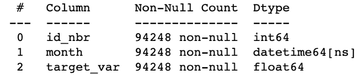
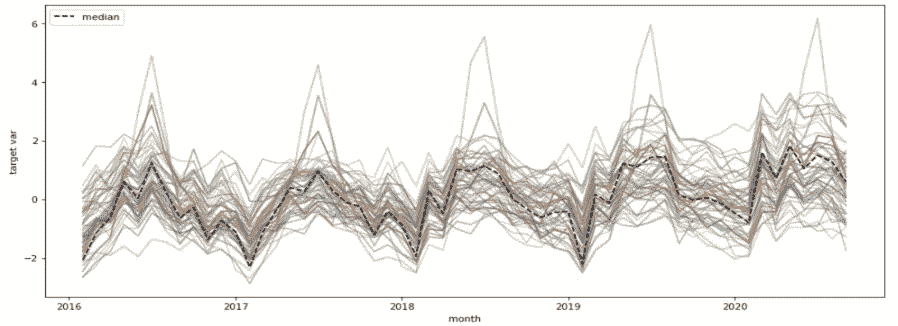
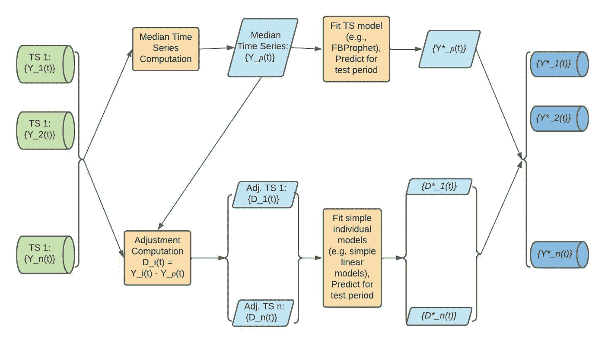
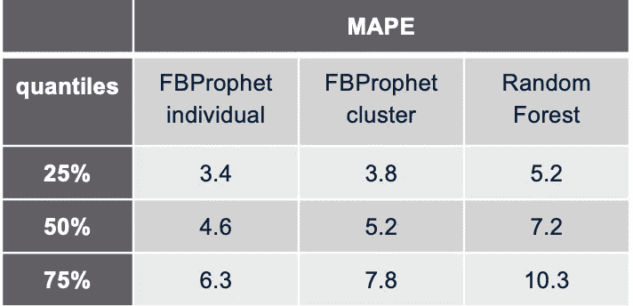

# 用单变量时间序列模型拟合一组序列

> 原文：<https://medium.com/walmartglobaltech/fitting-a-univariate-time-series-model-to-a-cluster-of-series-25cefd73f545?source=collection_archive---------0----------------------->

将单变量时间序列建模扩展到具有相似时间模式的多个序列


[Image Source](https://maheshbeldar.wordpress.com/home/the-pawns-crown/)

## **简介**

我们经常需要对大量的单变量时间序列进行同步预测。举个例子，在沃尔玛，我们需要为成千上万的时间序列生成预测，以便进行规划和资源分配。想到的第一种方法是为这些时间序列中的每一个拟合单变量时间序列模型，并使用这些单变量模型来生成未来预测。但是，为大量单变量数据拟合和验证复杂的时间序列模型(如 SARIMAX、Holt-Winters、FBProphet)不仅耗时，而且不切实际，尤其是对于拥有各种产品的大型零售或电子商务企业而言。除了时间复杂性之外，在生产中监控和维护这么多模型可能会很麻烦，而且成本很高。一种可能的“半监督”方法是创建“相似”时间序列的聚类，然后为每个聚类拟合一个复杂的模型。现在，将基于树或基于线性模型的回归量拟合到时间序列的聚类是很简单的，我们需要将落入一个聚类中的时间序列数据连接起来，并在特征向量中包含一个一次性编码的标识符，以调整各个影响。但是，这些回归模型，如果没有任何人工策划的时间序列的具体特征，往往无法捕捉通常的时间序列特征，例如，趋势，季节性，自相关等。另一方面，将时间序列模型拟合到多个单变量序列并不简单。有多变量时间序列建模技术，如向量自回归(VAR ),但这往往不是最佳选择，因为参数假设强，可扩展性和灵活性较差。在这篇博客中，我们将讨论如何扩展*的任何*单变量时间序列建模技术，以适应多个时间序列的聚类，这些时间序列的时间模式在本质上是“相似的”,同时保留它们各自的特征。通过将这种方法与时间序列聚类一起应用，我们已经成功地将模型拟合时间减少了 20 倍，模型数量减少了 500 倍，同时没有对预测准确性造成太大影响。

## 时间序列数据的聚类

时间序列聚类是我们在博客中提出的方法的先决条件。因此，我们想讨论为什么在处理许多单变量时间序列时聚类是一种好的方法，以及时间序列聚类的一些可能方法。



**Figure 1:** input data columns

对于我们的问题，聚类的目标是对那些具有“相似”时间模式的时间序列进行分组，这样，一个具有相似复杂性的单一模型可以捕获一个聚类中所有序列的“公共”时间模式，而不是单独的复杂模型。现在，在大多数情况下，数据以长格式存储，即每行代表(标识符，时间)对的时间序列值，例如，在图 1 中，“id_nbr”是我们的序列标识符，month 表示时间点，每月时间序列值存储在“target_var”列中。假设已经完成了数据的所有预处理，并且对于每个标识符，我们有统一长度的时间序列，我们可以旋转数据，以便每个时间序列将在行中表示，即，我们将有一个列数等于时间点数的数据帧，比如说 *m* ，并且行数将等于唯一标识符的数量，比如说 *N* 。我们可以将这个*N×m*数据集视为 *N* 个 *m* 维数据点，并尝试将“相似”的数据点聚集在一起。为了对相似的时间序列进行分组，我们使用了带有简单欧几里德距离的二分 k-means 算法。50 个数据点)因此，维数灾难并没有发挥很大的作用。



**Figure 2:** A set of time series falling into a cluster are plotted and colour-coded differently. The black dashed line represents the median time series of that cluster

在图 2 中，我们展示了一个获得的聚类示例，其中 x 轴表示时间(每月一次)，y 轴表示时间序列的值，聚类中的各个时间序列以不同的颜色编码。时间序列聚类的一些其他选择是针对非同步时间序列的基于 [DTW](https://en.wikipedia.org/wiki/Dynamic_time_warping) 的距离、针对高维时间序列聚类的基于 PCA 的维度缩减(例如，参见此处的[和](https://www.sciencedirect.com/science/article/abs/pii/S0306437907000518)等。

## 将时序模型拟合到时序群集



**Figure 3:** Workflow of fitting univariatetime series model for a cluster of series

假设*n*-许多单变量时间序列被分组为一个簇，其时间模式在本质上是“相似的”，如图 2 所示。让我们将这些 *n* 时间序列表示为{Y₁(t): t ∈ {T₁,…,Tₘ}},…，{Yₙ(t):t ∈ {T₁,…,Tₘ}}.我们可以计算这个集群的“代表性”时间序列，而不是为这些 *n* 序列中的每一个拟合单独的单变量模型。一个显而易见的选择可以是聚类质心，即通过在每个时间点对标识符取中值而获得的时间序列，表示为{yₚ(t)= Q₂(y₁(t),…,yₙ(t)):t∈{t₁,…,tₘ}}，其中 q₂是中值运算符。时间序列{Yₚ(t)}，比如说中值时间序列，是一个单变量时间序列，代表聚类中 *n* 序列的时间模式，因此，我们可以用任何单变量时间序列模型来拟合它。

一旦模型适合单变量中值时间序列，下一步就是为聚类中的所有时间序列生成预测。从单变量时间序列中位数模型(由{Y*ₚ(t)}表示)生成的预测是不够的，因为每个单独的序列都有自己对时间序列中位数的调整，如图 2 所示。为了解决这些个别的调整，我们首先计算调整系列由{Dᵢ(t) = Yᵢ(t)-Yₚ(t)}.作为主要的时间成分，例如趋势、季节性等。已经考虑到由单变量时间序列模型拟合到中位数序列，我们可以使用一个非常简单的方法来预测或预测的调整序列。例如，我们可以简单地使用前一年同月的值作为预测调整，或者建立一个简单的线性模型来生成调整预测{D*ᵢ(t)}.最后，对一个聚类中单个时间序列的预测由{Y*ᵢ(t) = Y*ₚ(t) + D*ᵢ(t)}.给出图 3 给出了所解释的方法的流程图。

## 代码片段的用例示例

现在，让我们将上述方法应用于一个真实的数据集。

如图 1 所示，输入数据包含落入单个聚类中的时间序列的每月目标值。列“target_var”将作为我们的目标变量，我们有 244 个时间序列中每个序列的 56 个月的数据。在开始建模之前，我们将这个数据集分为训练和测试两部分，这样我们可以在以后评估我们的方法。由于这是一个预测问题，我们需要在时间上划分数据集，而不是随机分割。

```
import pandas as pd
import numpy as np
from fbprophet import Prophettrain_range = [‘2016–02–01’, ‘2019–02–01’]
test_range = [‘2019–03–01’, ‘2020–02–01’]
date_col = ‘month’
target_col=‘target_var’features_to_use = [‘month_of_year_0’, ‘month_of_year_1’, ‘month_of_year_2’, ‘month_of_year_3’, ‘month_of_year_4’, ‘month_of_year_5’, ‘month_of_year_6’, ‘month_of_year_7’, ‘month_of_year_8’, ‘month_of_year_9’, ‘month_of_year_10’]df_train = df[(df[date_col]>=train_range[0]) & (df[date_col]<=train_range[1])]df_test = df[(df[date_col]>=test_range[0]) & (df[date_col]<=test_range[1])]
```

接下来，我们通过对所有单个序列进行月度聚合来计算该集群的代表性时间序列。

```
agg_df_train = df_train[[target_col, date_col]+ features_to_use].groupby(date_col).median().reset_index()
```

agg_df_train 有两列；一个是代表时间点的“月”,“目标值”是聚合目标变量的中值。由于这是一个单变量时间序列，我们可以用任何单变量模型来拟合它。对于我们的例子，我们使用 [FBProphet](https://facebook.github.io/prophet/docs/quick_start.html) 进行单变量时间序列建模。

```
agg_df_train.rename({‘month’:’ds’, ‘target_var’:’y’}, axis=1,inplace=True)model = Prophet(
growth=’linear’,
seasonality_mode=’additive’,
yearly_seasonality=False,
weekly_seasonality=False,
daily_seasonality=False
)if features_to_use != None:
  for i in features_to_use:
     model.add_regressor(i)
model.fit(agg_df_train)
```

我们可以使用这个 FBProphet 模型来生成中值时间序列的测试期预测。

```
agg_df_test = df_test[[target_col, date_col]+ features_to_use].groupby(date_col).median().reset_index()
agg_df_test.rename({‘month’:’ds’, ‘target_var’:’y’}, axis=1,inplace=True)
predictions = model.predict(df=agg_df_test.drop(‘y’, axis=1))
```

但是这些预测不能解决每个时间序列的单个调整因素，为此，我们首先计算训练期的调整序列(“delta_val”)，然后建立一个简单的线性模型来预测测试期。

```
df_train = df_train.merge(agg_df_train[[‘ds’, ‘y’]], right_on=’ds’, left_on=date_col, how=’left’)df_train[‘delta_val’] = df_train[target_col] — df_train[‘y’]df_test = df_test.merge(predictions[[‘ds’, ‘yhat’]], left_on=date_col, right_on=’ds’, how=’left’)df_actual_all = pd.concat([df_train, df_test])def get_linear_model_pred(train_test_df, test_dat):
  from sklearn.linear_model import LinearRegression
  train_test_df = train_test_df.sort_values(date_col).reset_index(drop=True)
  train_test_df['t'] = np.arange(0, train_test_df.shape[0])
  train_test_df['t2'] = train_test_df['t']**2
  train_df = train_test_df.loc[~train_test_df[date_col].astype(str).isin(test_dat['ds'].astype(str).values.tolist())].reset_index(drop=True)
  test_df = train_test_df.loc[train_test_df[date_col].astype(str).isin(test_dat['ds'].astype(str).values.tolist())].reset_index(drop=True)
  lm_obj = LinearRegression().fit(train_df[features_to_use+[‘t’, ‘t2’]],train_df[[‘delta_val’]])
  test_delta_pred = lm_obj.predict(test_df[features_to_use+[‘t’, ‘t2’]])
  return pd.DataFrame({'month': test_df[date_col].values,'test_delta_pred' : test_delta_pred[:,0]})test_df_delta = df_actual_all.groupby([‘id_nbr’]).apply(lambda x: get_linear_model_pred(x, agg_df_test)).reset_index(drop=False)df_test = df_test.merge(test_df_delta[[‘id_nbr’, date_col, ‘test_delta_pred’]], on=[‘id_nbr’, date_col], how=’left’)
```

最后，所有 244 个时间序列的预测通过将单个调整预测与中值预测相加而获得。

```
df_test[‘final_prediction’] = df_test[‘yhat’] +df_test[‘test_delta_pred’]
```

## 结果

如前一节所述，我们已经对一组 244 个单变量时间序列评估了上述方法。由于这是一个回归设置，我们使用平均绝对百分比误差或 MAPE 作为误差度量。MAPE 越低，生成的预测越好。在我们的用例中，已经为测试期间(12 个月)的单个时间序列计算了 MAPE，因此对于 244 个时间序列中的每一个，我们将有一个 MAPE 值来指示该序列的预测性能。在表 1 中，我们报告了 MAPE 值的 3 个分位数，以显示在聚类级别拟合 FBProphet 的性能，并与(a)将单个 FB prophet 拟合到 244 个单变量序列和(b)将随机森林模型(通过交叉验证选择超参数)拟合到整个聚类数据进行比较，其中单个序列采用一次性编码以调整单个影响，而月份一次性编码作为特征。



**Table 1:** Distribution of MAPE computed for different forecasting methodologies

显然，通过考虑基本的时间序列成分，聚类级别的 FBProphet 模型在没有任何人工策划的时间序列特定特征(例如滞后变量等)的情况下胜过随机森林模型。).如果我们与拟合单个 FBProphet 模型进行比较，精确度是相似的。另一方面，对一组 244 个时间序列(包括调整建模)在聚类级别拟合 FBProphet 只需要 3.2 秒，而对 244 个单独的时间序列拟合单独的 FB prophet 需要 2.24*244 = 546.6 秒！通过将同样的方法扩展到我们在沃尔玛处理的一个预测问题中的 5 万多个时间序列，我们节省了大量的时间和资源，但在预测准确性方面几乎没有损失。

## 结论

处理多个单变量时间序列在实践中并不少见。分析师正试图对多个领域的多个单变量时间序列进行同步预测，如金融、公共卫生、电子商务、供应链、气象等。仅举几个例子。这种半监督方法将具有相似时间模式的时间序列分组在一起，然后为每个聚类拟合一个单变量时间序列模型，可以显著减少模型训练和推理时间，以及维护生产中大量模型的复杂性和成本。通过将任何单变量时间序列模型扩展到相似时间模式的时间序列簇，这种方法带来了很大的灵活性，因此，如本博客所示，与拟合通用机器学习模型相比，这种方法可以显著提高预测精度。

我希望这篇博客为这种方法奠定基础，并鼓励读者将其应用于其他用例。

*致谢:*非常感谢 IDC 的 EBS NexTech 数据科学团队在与沃尔玛的一个重要预测项目合作时，对这一方法进行了审核。

## 参考

1.  时间序列聚类——十年回顾:[https://www . science direct . com/science/article/ABS/pii/s 0306437915000733](https://www.sciencedirect.com/science/article/abs/pii/S0306437915000733)
2.  动态时间扭曲:【https://en.wikipedia.org/wiki/Dynamic_time_warping】T4
3.  一种高效时间序列相似性分析的降维技术:[https://www . science direct . com/science/article/ABS/pii/s 0306437907000518](https://www.sciencedirect.com/science/article/abs/pii/S0306437907000518)
4.  对分 K-means:[https://medium . com/@ afrizalfir/对分-K means-clustering-5bc 17603 b8 a2](/@afrizalfir/bisecting-kmeans-clustering-5bc17603b8a2)
5.  FB prophet:[https://facebook.github.io/prophet/docs/quick_start.html](https://facebook.github.io/prophet/docs/quick_start.html)