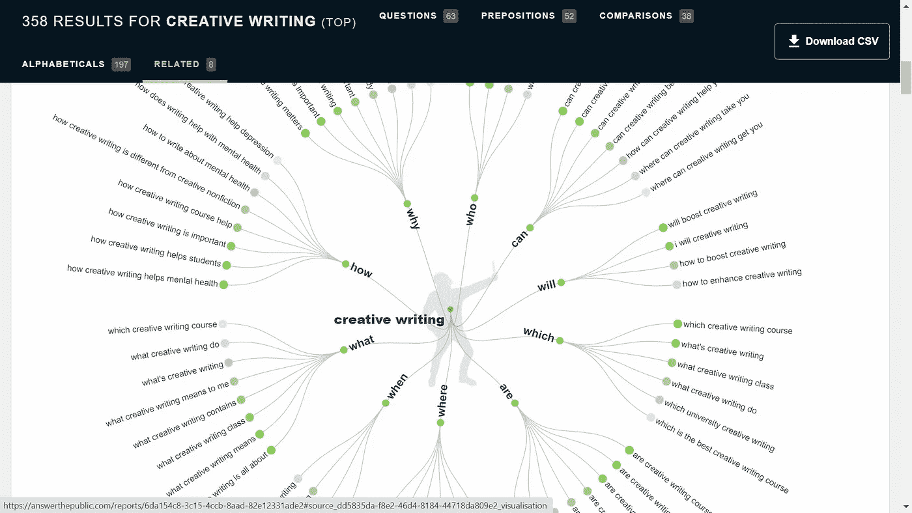
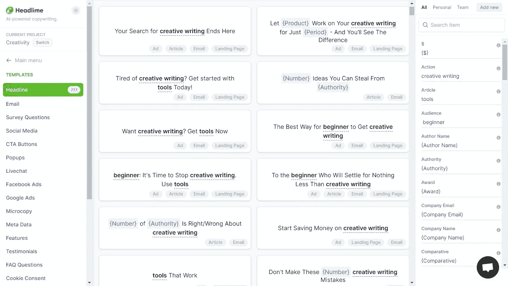
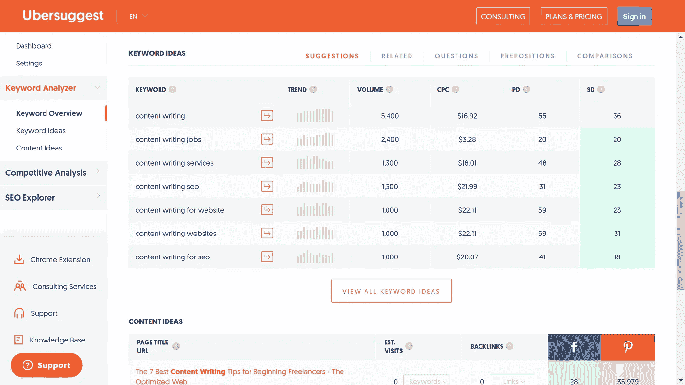
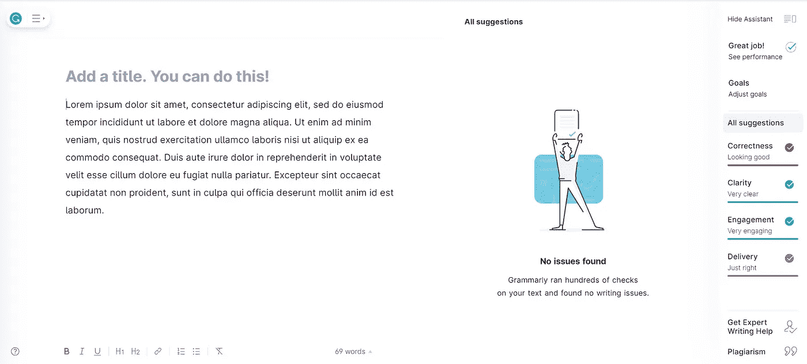
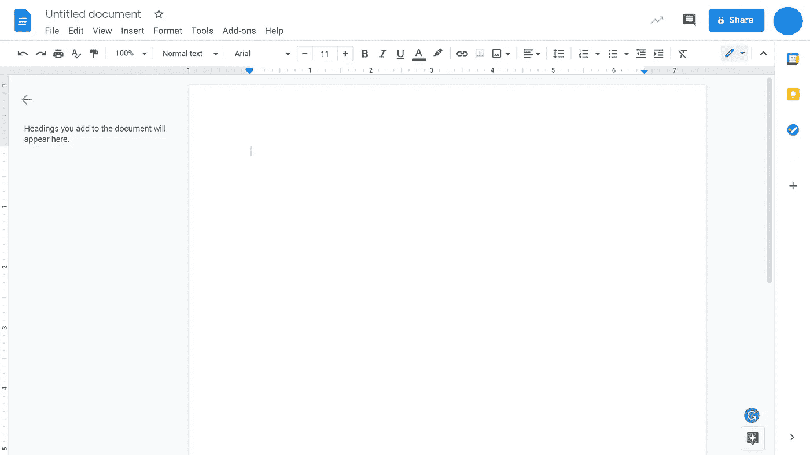

# 五个适合初学者的内容写作工具

> 原文：<https://medium.com/globant/five-content-writing-tools-for-beginners-825c04c0f966?source=collection_archive---------0----------------------->

Five Content Writing Tools for Beginners

内容写作是有挑战性的，直到我们写了几份。对于初学者来说，将想法写在纸上比组织想法更具挑战性。在我自己写了几篇之后，这里有五个工具可以帮助你优化和验证你的写作质量。这些工具不仅使写作更容易，而且通过使内容更容易搜索来帮助内容优化。

**回答大众头脑风暴**

帮助你集思广益的最好工具是 answerthepublic.com。你需要输入你写文章的主题。这个工具有助于用流程图来表达思想，说明主题在不同方向的应用。

回答公众是免费的。它不需要安装，可以从谷歌实时获取信息。它被称为反向搜索引擎，因为它通过将输入作为内容的关键字，将输出作为与我们想要在 google 上搜索的关键字相关的问题。

例如，当你在谷歌上搜索“创意写作”时，它会显示带有流行前缀的创意写作的流行建议。

当你在 answerthepublic.com 输入相同的关键词，它会显示 5 个类别的结果，这些类别是像谷歌这样最流行的搜索引擎的一部分。

A visual diagram of the engaging wheel for keyword search on Answerthepublic.com

这个工具读取不同谷歌搜索引擎用户的想法，并详细说明用于内容创作的结果。

这五个类别以视觉形式显示，解释如下:

1.  问题:这演示了关键字的关联，在我们的例子中是“创造性写作”,以及各种问题，如何时、如何、什么、哪里、哪个、将、能、是谁。这些问题在分支的末端有灰色、绿色和深绿色的点。彩色圆点表示该关键词在问题方向上的受欢迎程度——灰色表示最不受欢迎，深绿色表示最受欢迎。
2.  介词:这表示键入的关键字与用户通常搜索的各种介词之间的联系。用户通常搜索带有命题前缀的“内容写作”关键词:can、for、with、with、without、to、is 和 near。
3.  比较:比较选项卡将键入的关键字与用户在搜索引擎上搜索它们时通常比较的观点相关联。用户搜索由单词分隔的比较概念的关联，如 and、or 和 versus。
4.  按字母顺序:按字母顺序选项卡组织与键入的关键字相关联的想法，并按字母顺序将它们与关键字的前缀一起列出。如果“内容写作”是键入的关键字，那么字母“A”的类别将包含搜索前缀的列表，例如机构、应用、文章。
5.  相关:相关选项卡标识与输入的关键字押韵的想法。这些想法通常与用户在搜索引擎上的频繁搜索有关。

**Headlime.com 为您头条**

一篇好的内容的关键是一个好的标题。标题会吸引你的读者并产生好奇心。另一个很棒的工具是 Headlime.com，它可以根据用户输入的各种类别创建精彩的标题。

此工具允许您输入多种因素，如受众类型、权威、解决方案，并建议能引起受众共鸣的标题。

标题建议来源于用户在搜索引擎上进行的频繁搜索。这个工具是基本的，因此非常适合初学者。

Headline search result for creative writing keywords

# 关键词的超级建议

尼尔·帕特尔(Neil Patel)的 Ubersuggest 是为你的主题找出相关关键词的绝佳工具。你必须在你的标题中包含相关的关键词，这样谷歌才能恰当地索引你的网站内容。

该工具可识别关键词，并给出这些关键词的评分建议。选择合适关键词的技巧是找到并识别具有较高 SEO 难度分数的关键词，这些关键词对应于更具竞争力的关键词。

Results displayed by Ubersuggest for searched keywords

# 内容分析语法

即使是最熟练的作家也经常犯语法和拼写错误。Grammarly 是分析内容和识别语法错误的优秀工具。付费版本也方便了抄袭检查，并允许你设置观众参与目标。

Grammarly Tool in action

在语法上，AI 使用复杂的算法来理解输入的文本，并优化预测建议，同时分析作者设定的语气和目标受众。

除了突出潜在的语法错误，这个工具还可以检测剽窃。Grammarly 是一个免费的基于云的工具，它使用复杂的人工智能，需要高处理能力，因此，你不能在任何设备上下载它。

尽管文本的大小和格式各不相同，但语法人工智能完全能够通过同步资源库中存在的单词的组织结构来识别语言、书写模式、流畅性、词汇和内聚属性。

**谷歌文档写作**

谷歌文档是最好的工具，可以把你的图片和文档储存在云上。这个工具更容易使用，也更容易与你的朋友分享。

Docs 应用程序可以与你的所有设备同步，并提供下载插件的功能，如“幻灯片和文档图标”,用于将表情符号和信息图添加到你的笔记中 docu sign，用于添加签名；diagrams.net 的 draw.io，用于添加流程和流程图等智能绘图。

为了获得更好的可访问性，请始终为您使用的图像提供替代文本。替代文本有助于启用不同的功能来识别图像的上下文。

How Google Docs is used to record ideas

> *说出你的想法。――深思熟虑的头脑*

要写内容，一定要确定你的目标受众。分析你的内容的目的，评估你想通过你的内容传达的动机。

这是我们推荐给初学者的五个基本工具，可以让他们为自己的初始内容片段写出好的、令人印象深刻的内容。

始终在您的社交媒体上分享您的内容以获得全面的可见性，并接触各种出版物以增加您内容的受众流量。