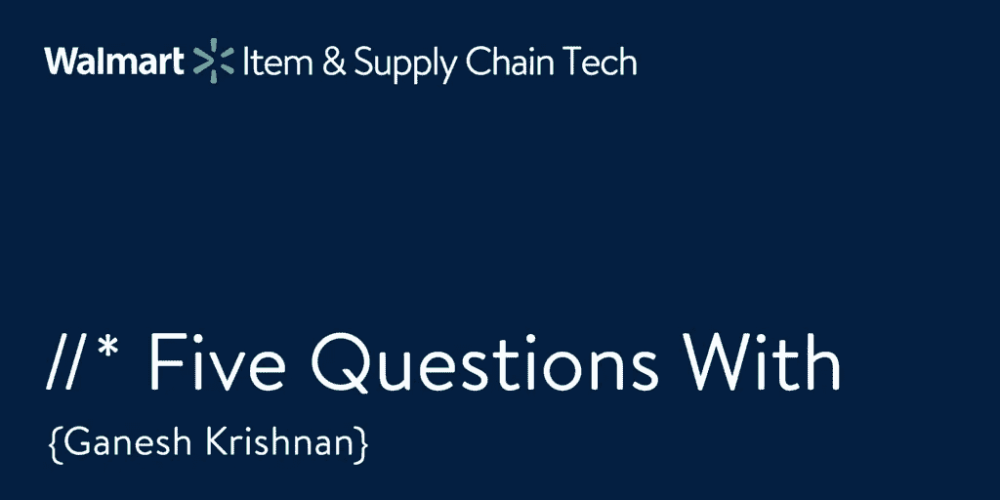

# 甘尼什·克里希南的五个问题

> 原文：<https://medium.com/walmartglobaltech/five-questions-with-ganesh-krishnan-1e563cc07294?source=collection_archive---------0----------------------->

(Image created and owned by Walmart Global Tech)

在沃尔玛全球技术公司，我们想知道是什么让我们的领导团队运转起来。是什么驱使他们？在他们的职业生涯中有哪些重要的教训？在这一期中，我与项目供应商工程副总裁[甘尼什·克里希南](/@ganeshwalmartlabs)坐在一起寻找答案。

**1。管理者和领导者的区别是什么？**

我同意一句经典的话:*经理是要把事情做好，领导者是要做正确的事情*。

**2。到目前为止，你在职业生涯中学到的最重要的一课是什么？**

他人反馈的重要性。

**3。如果你能回到 20 岁的自己，给你一条建议，你会说什么？**

我当时真的很关注技术，所以我会说要更多地关注软技能。我会更加强调所有权以及如何通过所有权进行思考。这是一个完整的心态，而且很重要。

**4。是什么让沃尔玛有别于你工作过的其他公司？**

绝对是人民。我们有非常优秀的员工——友好、忠于公司、聪明。一群好人。

**5。如果你有一种超能力，你会想要什么，为什么？**

既然我实际上不能拥有超能力，我只想一直做到最好。