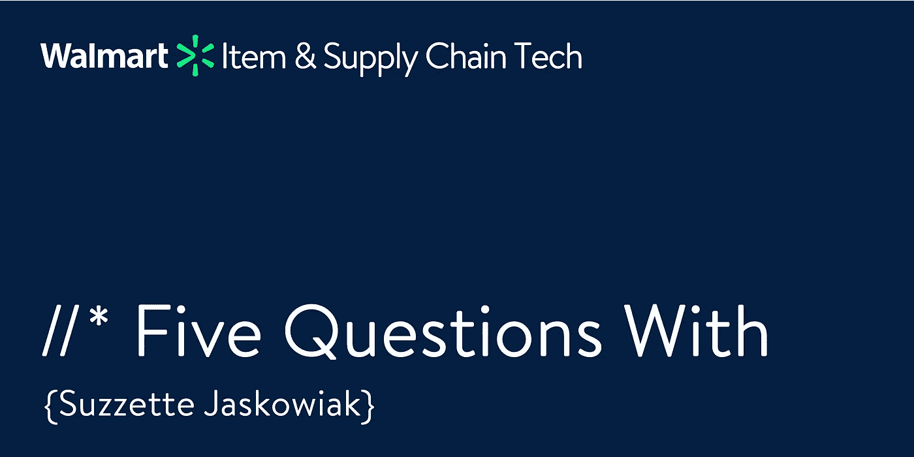

# 苏珊·贾斯克维克的五个问题

> 原文：<https://medium.com/walmartglobaltech/five-questions-with-suzzette-jaskowiak-7250f0477f80?source=collection_archive---------1----------------------->

(Image created and owned by Walmart Global Tech)

在沃尔玛全球技术公司，我们想知道是什么让我们的核心服务领导团队运转起来。是什么驱使他们？在他们的职业生涯中有哪些重要的教训？在这一期中，我采访了负责目录、企业项目和库存的副总裁 Suzzette Jaskowiak。

**1。** **你认为管理者和领导者的区别是什么？**

经理帮助人们从日常角度理解他们应该做什么，而领导者则设定愿景并激励人们朝着愿景努力。

**2。迄今为止，你在职业生涯中学到的最大教训是什么？**

在我职业生涯的早期，我从母亲那里学到了最重要的一课。她教我找出最大的挑战或最困难的问题，并集中精力去解决它。当你接受最艰难的挑战时，它为你提供最有趣的工作，使你能够快速建立你的职业生涯，并为组织产生最大的价值。

**3。** **如果你可以回到 20 岁的自己(或者职业生涯的开始)，给一个建议，你会说什么？**

大胆梦想，设定远大目标。不要只考虑下一个级别，而是考虑你想长期做什么，对我来说，那就是成为首席技术官或首席执行官。在我职业生涯的早期，我不会梦想那么大，但在过去的 10 年里，我有支持我的导师和领导者，他们帮助我认识到我有潜力和能力实现这一目标。

**4。是什么让沃尔玛有别于你工作过的其他公司？**

我感兴趣的一件事是沃尔玛挑战亚马逊的能力。沃尔玛是最有条件与亚马逊竞争的零售商，因为它的规模、客户基础、战略和技术。我是一个非常好胜的人，所以击败亚马逊的机会让我非常兴奋，我认为沃尔玛是唯一有机会的地方。

**5。如果你能拥有一种超能力，你希望是什么，为什么？**

我想成为一名忍者战士，就像电视节目*美国忍者战士*中的竞争者一样，他们在那里做所有这些疯狂的障碍课程。我喜欢运动和健身，但我远没有那个节目中忍者战士的运动能力、力量或耐力。他们的能力令人惊叹。