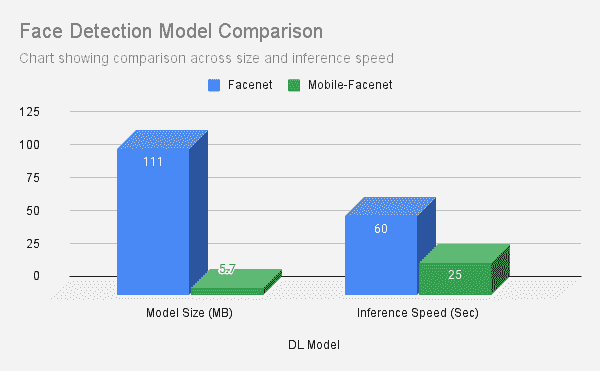

# 优化人工智能部署的五个步骤

> 原文：<https://medium.com/globant/five-steps-to-optimize-ai-deployments-b3f5e9d15dd7?source=collection_archive---------0----------------------->

## 我如何将 Docker 图像从 9.7 GB 减少到 3.7 GB

Source : Docker.com

随着许多组织专注于增强人工智能能力的研究，我们在[深度学习领域看到了许多行动和突破](https://en.wikipedia.org/wiki/Deep_learning)。  大多数最先进的模型都在 [TFHub](https://tfhub.dev/) ，[hugging face](https://huggingface.co/models)&[py torch](https://pytorch.org/vision/stable/models.html)上开源，供大家实验和欣赏。然而，这些模型中的大多数都很笨重，对于基于 CPU 的推理和部署来说用处不大。

> **我们提高了推理速度，并将 docker 图像的大小从 9.7 Gb 减少到 3.7 Gb(减少了 3 倍)，这也是本文的动机所在。**

在这篇文章中，我们想介绍一些我们使用 [Docker](https://www.docker.com/) 在云上部署深度学习模型时遵循的最佳实践和技巧。我们将讨论减小模型大小、提高推理速度、选择正确的模型、压缩 docker 图像的技巧以及代码重构的快速技巧。如果你是深度学习部署的新手，我在进一步阅读部分添加了优秀博客的参考。

# 提示和最佳实践

这篇文章的大部分内容都在谈论减少深度学习模型的大小，在最后，我们谈论一些压缩 [Docker](https://www.docker.com/) 图像的通用技巧。

Source : [Pexels.com](https://www.pexels.com/photo/woman-reading-book-256455/)

## 步骤 1:使用量化来减少边

让我们面对现实吧，当开发人员因为我们的模型太大而开始遇到 API 框架的内存问题时，这是一个额外的开销。虽然有许多方法来处理内存问题，但其中一个主要的方法是称为 [**量化**](https://in.mathworks.com/discovery/quantization.html) 的概念。

> 摘自 [PyTorch 官方文档](https://pytorch.org/docs/stable/quantization.html) :
> “量化是指以比浮点精度更低的位宽执行计算和存储张量的技术。量化模型对具有整数而非浮点值的张量执行一些或全部操作。这允许在许多硬件平台上使用更紧凑的模型表示和高性能的矢量化运算。”

因此，量化一个模型会导致精确度的少量降低，但是在模型尺寸方面却有神奇的效果。量化通常可以在训练后或训练期间进行，所有领先的深度学习框架都提供了现成的量化选项。要了解更多关于量化的知识，请参考这个[博客](http://How to accelerate and compress neural networks with quantization | by Tivadar Danka | Towards Data Science)进行深入探讨。

## 步骤 2:使用 ONNX 运行时提高推理速度

Source : [ONNX Website](https://onnx.ai/)

[ONNX](https://onnx.ai/) 是开放神经网络交换的缩写，以其硬件优化和运行时而闻名。使用 ONNX 运行时进行推理可以加快推理速度。基于您正在使用的模型，可以直接选择 ONNX 来量化模型，然后使用 ONNX 会话来进行推断。

在我们的例子中，由于我们已经部署了 [T5 模型](https://huggingface.co/docs/transformers/model_doc/t5) , [FastT5](https://github.com/Ki6an/fastT5) 包为我们提供了量化和模型尺寸缩减，同时精度损失最小。下面的代码片段显示了量化 T5 模型并将其导出为 ONNX 格式以便更快推断的步骤。

Fig. Showing Steps to Quantize the model using FastT5 Model

在上面的代码中，我们执行函数`generate_onnx_representation()`，它负责下载和转换 ONNX 表示的模型。步骤 2 负责量化，在接下来的步骤中，我们导出模型。以下是上述步骤的结果:

我们可以观察到，随着上述每个步骤的执行，模型大小是如何缩小的。对于 ONNX 的实际演练，请参考这个[博客](https://towardsdatascience.com/onnx-easily-exchange-deep-learning-models-f3c42100fd77)。

## 第三步:选择合适的型号

大多数深度学习模型被部署为应用程序中的依赖项，或者作为 API 服务暴露给不同的应用程序。无论哪种方式，通常都有一个轻量级的模型，只需很少的修改就可以重用。我们需要做一个实地调查，看看是否有一个边缘设备兼容的模型可用于 CPU 绑定的推理。

例如，下图显示了最广泛使用的人脸检测模型之一——Facenet 及其 lite 变体在大小和推理速度上的差异。

我们看到，当比较规模和推理速度时， [Mobile-Facenet](https://arxiv.org/pdf/1804.07573) 明显是 [Facenet](https://arxiv.org/abs/1503.03832) 的赢家。这是以模型精度的最小损失为代价的。

同样，预训练的 [T5](https://huggingface.co/docs/transformers/model_doc/t5) 和 T5 量化模型(**大约)之间的模型大小也有显著差异。尺寸缩小 3 倍**。因此，**评估各种备选方案并选择最佳型号**会显著影响整体规模

Source : [Docker.com](https://www.docker.com/)

## 步骤 4:压缩 docker 图像的技巧

Docker 是快速安全部署的行业选择。然而，当我们构建图像时，我们可以很容易地观察到图像大小是多么的臃肿。大多数时候，规模是如此之大，以至于构建没有完成就崩溃了(错误 2)。这主要是由于两个主要原因:

*   添加过多的运行命令
    层是由 Docker-file 中的运行命令引入的。每个 Run 命令都会添加一个构建层，然后导致内存开销。
*   使用 [PIP](https://pypi.org/project/pip/) 命令安装 Python 框架。
    PIP 在下载、提取、构建(DEB)工作流中执行。因此，每个包安装请求都必须首先下载所有的依赖项，构建二进制文件，然后安装它们。像 PyTorch 这样的框架并不是轻量级的，这个过程会消耗大量内存。

以下是压缩 Docker 图像的提示:

*   **减少层次，即运行命令** 在一个单一的语句中组合层次将减少许多不必要的层次，并使用一个单一的命令执行大多数东西。例如，下面是我们最初的 Docker 文件:

可以重写为:

这减少了所需的层数，从而加快了构建速度并减少了内存消耗。

*   **尽可能使用 Python 轮子** [轮子文件](https://realpython.com/python-wheels/)对 Python 的安装过程是一个福音。它们预先构建了所需的所有依赖项和索引，并且非常轻便，可以通过互联网传输，并且需要的空间非常少。一个简单的`pip install torch == x.x`可以轻易消耗大约 900 MB 到 1.3 GB 的磁盘空间。因此，用兼容的 linux PyTorch wheel 文件( [PyTorch 稳定版本](https://download.pytorch.org/whl/torch_stable.html))替换`torch==1.9.0`行会显著减少内存。

## 步骤 5:使用内存分析器并重构代码

最后，每当使用像 [Flask](https://flask.palletsprojects.com/en/2.0.x/) 或 [FastAPI](https://fastapi.tiangolo.com/) 这样的 API 框架部署深度学习模型时，确保我们针对内存泄漏分析我们的代码，并插入它们以避免由于**内存溢出**而导致的失败。我们特别面对 Flask 的这个问题，并使用 [FIL Profile](https://pythonspeed.com/articles/memory-profiler-data-scientists/) 包来跟踪内存消耗并重新调整我们的代码。此外，这个[栈溢出帖子](https://stackoverflow.com/questions/49991234/flask-app-memory-leak-caused-by-each-api-call)对我们堵住漏洞帮助很大。

# 结论

以下快照捕获了 Docker 映像的初始大小、详细的逐步缩减和最终状态。

下面显示了我的 docker 图像的初始大小。

Snapshot showing size of initial Docker image

以下是我通过应用上述步骤能够节省的金额

这是我最后得到的最终图像尺寸:

Snapshot showing final Docker image post optimization

因此，使用上述最佳实践，我们能够将 Docker 映像大小从 9.7 GB 减少到 3.7 GB，这对于部署在 Azure 应用服务或 Azure 功能上来说是非常健壮的。代码剖析和重构的使用帮助我们能够使执行时间和延迟与业务 KPI 相匹配。我希望这篇博客能帮助您减少部署时间。

# 进一步阅读

*   DL 部署初学者指南
    [端到端机器学习:从数据收集到部署🚀艾哈迈德·贝斯贝斯](/swlh/end-to-end-machine-learning-from-data-collection-to-deployment-ce74f51ca203)
*   Docker 镜像优化策略:
    [https://medium . com/sci force/strategies-of-Docker-images-optimization-2c a9 cc 5719 b 6](/sciforce/strategies-of-docker-images-optimization-2ca9cc5719b6)
*   模型量化讲解:
    [如何用量化加速压缩神经网络|作者蒂瓦达·卡丹|走向数据科学](https://towardsdatascience.com/how-to-accelerate-and-compress-neural-networks-with-quantization-edfbbabb6af7)
*   ONNX 官网:
    【https://onnx.ai/ 
*   使用 dockers
    [部署 DL 模型的快速介绍 https://towards data science . com/how-to-deploy-large-size-deep-learning-models-into-production-66b 851d 17 f 33](https://towardsdatascience.com/how-to-deploy-large-size-deep-learning-models-into-production-66b851d17f33)