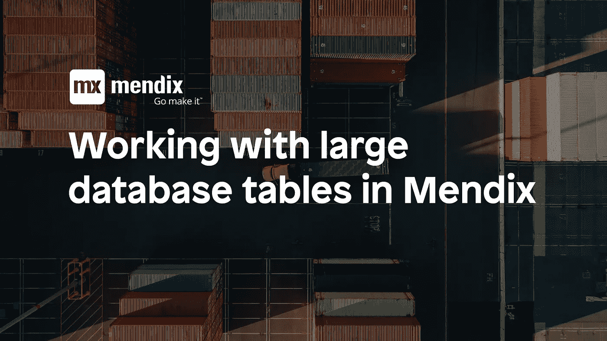
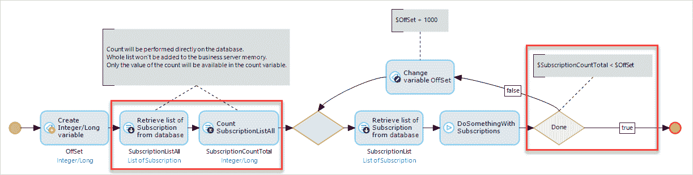
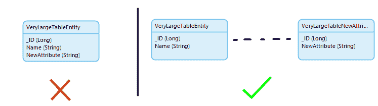
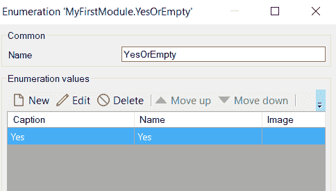

# 在 Mendix 中使用大型数据库表的五个技巧

> 原文：<https://medium.com/mendix/five-tips-for-working-with-large-database-tables-in-mendix-170210f6f6fd?source=collection_archive---------0----------------------->

在这篇博文中，我想分享我在从事一个大型数据库表项目时学到的一些经验。首先，让我们定义 Mendix 中的大 for 表。

# 大表=超过 1 000 000 行

在我们的例子中，我们有 1 亿行。最重要的是，这张桌子非常活跃。几乎每天都有一百万行新数据被插入。一旦项目中的表接近这个大小，您就需要开始考虑以前不必担心的事情。像添加一个新的布尔属性这样非常小的变化都会对应用程序的性能产生很大的影响。

不再拖延，根据我的个人经验，这里有五个建议。

# 技巧 1:使用批处理

这个很明显，甚至被[门迪克斯](https://docs.mendix.com/howto/monitoring-troubleshooting/detect-and-resolve-performance-issues#5-2-slow-database-commits)推荐。在单独的事务中运行批处理也有帮助(参见[开始和结束事务](https://docs.mendix.com/appstore/modules/community-commons-function-library#4-7-orm))。另外，不要忘记试验批量大小。在我们的例子中，100 是一个神奇的数字。

# 提示 2:用雪花石膏代替 UUID

> 通用唯一标识符(UUID)是一个 128 位的数字，用于识别计算机系统中的信息。[https://en.wikipedia.org/wiki/Universally_unique_identifier](https://en.wikipedia.org/wiki/Universally_unique_identifier)

除了由 Mendix 生成的内部 id 之外，UUIDs 通常用作对象的附加标识符。UUIDs 的优点是它们可以由外部系统生成/发送。然后，这些 UUIDs 可以用于将对象软链接在一起，或者引用来自外部系统的对象。

不幸的是，Mendix 不支持特殊的 UUID 类型，这与大多数数据库模式不同。所以 UUIDs 被存储为字符串，这在内存方面不是很有效。但更重要的是，索引和检索字符串比同等的 UUID 类型(PostgreSQL)慢 2-5 倍。

我们寻求的解决方案是用 [SnowflakeIDs](https://developer.twitter.com/en/docs/basics/twitter-ids) 替换 UUIDs。这些是类似于 UUID 唯一 ID，但是长度只有 64 位(而不是 UUID 的 128 位)。这意味着它们可以存储在一个`bigint`(长)列中。这使得我们项目中的数据检索速度平均提高了 10 倍。

# 技巧 3:新实体+软链接可能比添加属性更好

向大型表中添加新属性可能会有问题。尤其是当新属性要在主流程之外设置以更新大表中的行时，这会导致[数据库锁定问题和性能下降](https://docs.mendix.com/howto/general/community-best-practices-for-app-performance#4-microflow-best-practices)。这种危险可以通过使用软链接来消除。

> 与由数据库约束支持的关联(硬链接)不同，软链接仅通过它们的名称和用途来具体化。[http://beurive.com/dbview_def_fk.html](http://beurive.com/dbview_def_fk.html)

请记住，软链接会使应用程序更加复杂，因为它们不支持通过关联进行检索。这尤其会影响页面设计，这将需要一些创造力和额外的数据视图/npe 来构建。谨慎使用软链接，只在需要的时候使用。

# 技巧 4:枚举比布尔更好

`Empty == No` which is the default value.

布尔值是 Mendix 中一种特殊的数据类型，因为它们是唯一没有值的数据类型。当向大型表中添加新的布尔列时，这就成了一个问题。表中的每一行都需要初始化为`true`或`false`，这可能需要很长时间(数小时)。解决方案是使用枚举，让默认值与`empty`值相匹配。

# 技巧 Mendix cloud 中的数据库模式更新

不可避免地，您将不得不对 Mendix 中的域模型进行更改，或者更新/迁移数据。当此更改影响到一个大表时，可能需要很长时间来更新数据库。Mendix 将应用程序启动限制在 10 分钟左右，包括数据库模式更新和启动后的微流。这意味着，如果数据库模式更新+启动后微流超过 10 分钟，您的应用程序将无法启动，甚至会给您留下一个损坏的数据库。

因此，如果您预计启动过程需要超过 10 分钟，请联系 Mendix 支持，让他们暂时禁用超时。然后，您可以继续部署您的应用程序。

我希望你喜欢阅读这篇文章，并希望它能帮助你构建伟大的应用程序。去做吧！

# 门迪克斯的诱惑者

Templator 是一个 Mendix 模块，允许开发人员使用标准的 Mendix 组件生成 PDF 文件。

因为普通页面用于生成文档，所以所有 CSS 样式(圆角✅)和所有内置的& app store 小部件(图表✅)都是开箱即用的。

在[https://www . ignition . so/gaj Duk/Templator-d 35 db 3 ba 165346 E3 b 243d 6695636 CCD 4](https://www.notion.so/gajduk/Templator-d35db3ba165346e3b243d6695636ccd4)下载免费模块

*最初发表于*[https://www . opinion . so/gaj Duk/740334 bec 7a 740938 f 646 ed 7d 99270 EB？v = c 145 b 965 a 05 E4 ed 48096041 ba 018 a 005](https://www.notion.so/gajduk/740334bec7a740938f646ed7d99270eb?v=c145b965a05e4ed48096041ba018a005)*。*