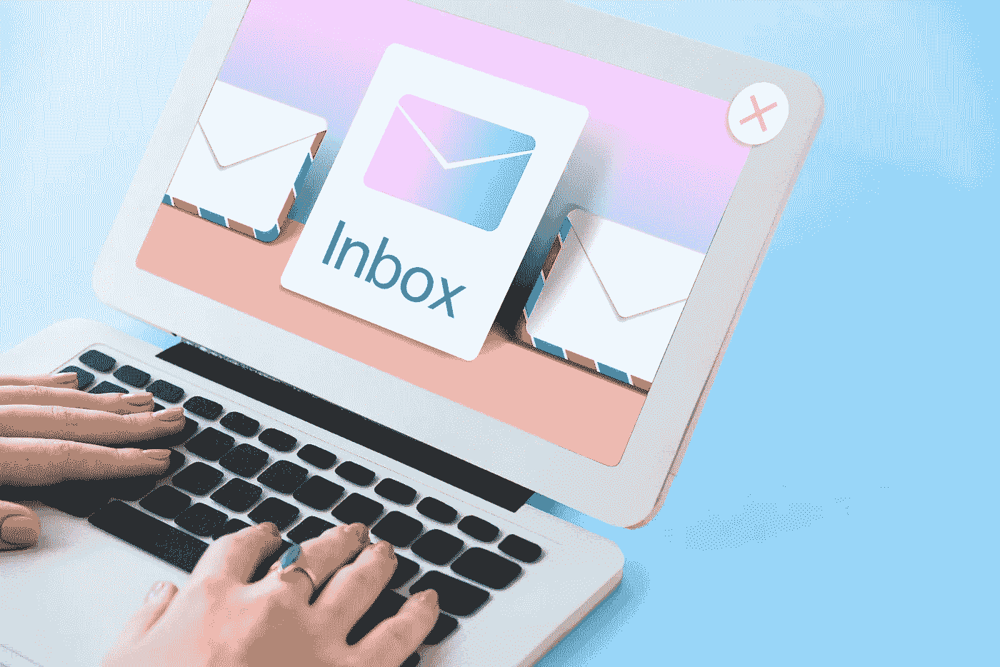

# 从你的电子邮件营销策略中获得最大收益的五种方法

> 原文：<https://medium.com/globant/five-ways-to-get-the-most-out-of-your-email-marketing-strategy-cbac9a6a3a61?source=collection_archive---------0----------------------->

Image by rawpixel.com

电子邮件不仅仅是一个虚拟邮箱，它已经成为我们在线生活中必不可少的一部分，因为它是我们主要的通信工具之一，也是访问大多数数字平台的识别系统。

据估计，全球有超过 40 亿电子邮件用户。此外，一些研究称，大多数员工[每六分钟](https://www.netflix.com/co/title/81098586)查看一次邮箱，这支持了一个事实，即根据[尼尔森的 2020 年营销报告](https://www.nielsen.com/es/insights/2020/nielsen-annual-marketing-report-the-age-of-dissonance/)，当衡量一项战略的投资回报(ROI) 时，**电子邮件是最可靠的渠道。**

这些统计数据使电子邮件成为你数字战略中需要考虑的重要媒介，所以如果你想利用它，下面这些最佳实践肯定会有所帮助。

# 1.个性化您的消息

个性化不仅仅是称呼用户的名字，还包括理解他们的兴趣和需求。要实现这一点，你可能认为依靠他们的购买历史、地理位置以及他们在与你的品牌互动时留下的其他线索等数据就足够了；然而，如果你想加强联系，**明确告诉他们你希望尽可能提供最满意的体验**，但要实现这一点，**你需要更好地了解他们**。

提示:直接问你的顾客。记住，良好的沟通是健康关系的关键，包括商业关系。因此，最好**询问用户的兴趣**和**根据他们的内容偏好和规律为他们提供不同的订阅选项**，便于细分和打开/点击跟踪。还有，**询问你的内容是否让他们受益**。你可以通过评分或问开放式问题来做到这一点。

假设你拥有一个教育应用，你可以通过简短的表格询问用户他们的中长期学习目标是什么，并在此基础上，推荐他们实现目标的最佳路线。

# 2.加强与观众的联系

电子邮件将品牌与其受众直接联系起来，从潜在客户到老客户，因此**对于检查所有转化漏斗阶段**，审查他们的状态，并根据他们的品牌认知水平和他们与品牌的互动为每种受众类型制定行动计划来说是完美的。

提示:奖励品牌忠诚度。数据分析可以揭示谁与一个品牌互动最多，或者谁购买频繁。**电子邮件是感谢他们并根据他们的需求与他们互动的最佳方式**。例如，你可以向对你提供的产品或服务感兴趣的人提供独家折扣，并解释为什么他们应该得到它。返现也是一个有价值的选择，或者为什么不创建一个使用你的产品的教程？

# 3.实施(重新)参与技巧:

想一想新鲜的、更新的内容，这些内容将你的品牌延伸到最初满足的需求之外。为此，**你必须深入了解你的目标受众和你的品牌所属的行业**，并不断了解最新的趋势，以及最先进的。

**提示:向订阅者提供独家内容。**集思广益，创建一个关于你的品牌的思维导图，然后用这些想法制作内容药丸**唤起用户的好奇心**。可以包含专家观点、真实案例、小技巧、Q & As 等。假设你有一家书店——你可以分享一份人们应该多读书的理由清单，并定期发给你的订户，同时附上你所提供的最热门的书籍。

# 4.投入你所有的创造力——没有限制:

每封电子邮件都是一张空白的画布，我们可以在上面探索我们品牌的所有视觉可能性，并将它的个性发挥到极致。当我们将**优质内容**、**精致设计**和**适量互动**相结合时，用户将获得**难忘的体验**，转化为高品牌召回率和最终转化率。如果你不知道从哪里开始，有许多在线工具可以让这项工作变得更容易管理(我稍后会提到其中的一些)。

提示:优先考虑响应式设计。外观并不代表一切，但当它失败并损害整体用户体验时，你就有麻烦了。因此，**遵循以下基本原则，让你的布局在所有设备上看起来完美无瑕**:

● **分发信息时，试着把你的邮件写在一栏**；有两个或更多这些可能会导致元素的混乱。

● **确保电子邮件不完全由图像组成:**它们可能不会总是加载。如果使用它们，在 HTML 代码中设置 [ALT(可选)文本。](https://moz.com/learn/seo/alt-text)

● **设计大小合适的按钮和链接。**2021 年移动端平均邮件打开率达到 78%，[根据 email Monday](https://www.emailmonday.com/mobile-email-usage-statistics/)；有鉴于此，行动号召应该足够大，以便用手指轻敲。

● **一次又一次的测试。一些有用的在线工具，如 Acid 上的电子邮件，向你展示了一封电子邮件在不同平台和设备上的外观。**

● **如果您自己编写电子邮件，请使用媒体查询**；他们会根据所使用的设备使其适应屏幕大小。您还拥有强大的工具，如 [Good email code](https://www.goodemailcode.com/) 、[I Can Email…](https://www.caniemail.com/)和 [Email-comb](https://codsen.com/os/email-comb/play) ，它们将是您在投身于充满挑战和迷人的编码世界时的好朋友。

● **不要在你的邮件里塞满太多的元素。这个可能会分散读者的注意力，让他们不知所措，最终会因为不知道该关注什么而离开。**

# 5.让你的邮件不可抗拒地打开，但对用户要有耐心。

一些广告类型可能是侵入性的，短暂的，并不总是针对我们。通过电子邮件营销，**用户已经知道了我们的品牌，并选择接收我们的信息**，因为他们对我们提供的东西感兴趣。只是不要在没有收件人同意的情况下继续发送电子邮件或以垃圾邮件为目的；这对任何品牌来说都可能适得其反。麦肯锡指出，如果计划得当，电子邮件营销在获得新客户方面的效率是社交媒体的 40 倍。

同样，用户查看收件箱的唯一目的是阅读他们的信息，确信他们会找到专门为他们创建的内容，并且多少有些益处。他们会把全部注意力放在那个任务上，那么我们怎么抓住它呢？

提示:你的主题就是你的封面。正如我们通过包装来判断一个产品一样，我们在邮件中首先看的是它的主题。争夺受众注意力的竞争是激烈的，所以**这些简短的词必须足够有力**。[关于 Acid](https://www.emailonacid.com/blog/article/email-marketing/increase-email-engagement/) 和 [Hubspot](https://offers.hubspot.com/email-subject-lines?hubs_post-cta=anchor&hsCtaTracking=c706e2ec-2e42-4977-a207-44505d19f1fe%7Cb8768eee-767a-4d98-ab59-53aba66e5d7c) 的邮件提出了一些创建成功主题行的策略:

● **利用** [**怕错过(FMO)**](https://en.wikipedia.org/wiki/Fear_of_missing_out) **对你有利:**
*【限时优惠:额外七五折+免费赠品】*

● **击中痛点然后提出解决方案:**
*“纠结于一个商业决策？我给你做了一个 1 页的框架来帮助你。”*

● **社会证明——每个人都在这么做；为什么不是你？:**
*“看看我们的客户在说些什么…”*

● **提问(邮件里面是谁的回答):**
*“你这是占便宜吗？”*

● **加入适度的幽默剂量:**
*“当你是健身房里的汗臭男时该怎么办”*

● **表情符号(适度过分):** *🍓浆果令人印象深刻的夏季食谱"*

请记住，即使确定了以上所有内容，总会有人想要取消订阅您的消息，没关系。不可能让 100%的人爱上你的品牌。你不想在没有附加值的用户身上浪费时间和精力，所以如果他们真的想离开，就给他们选择离开的机会。

最后，如果你仍然不确定你的活动是否成功，那就亲自体验一下。摆脱你的创造者角色，像其他用户或其他品牌一样阅读你的邮件。此外，**永远和其他人一起测试**，因为很可能另一双新鲜的眼睛会发现你一直忽略的东西。