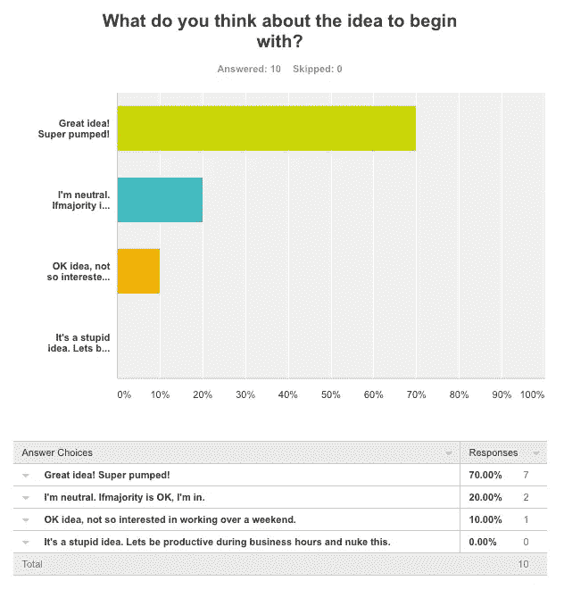
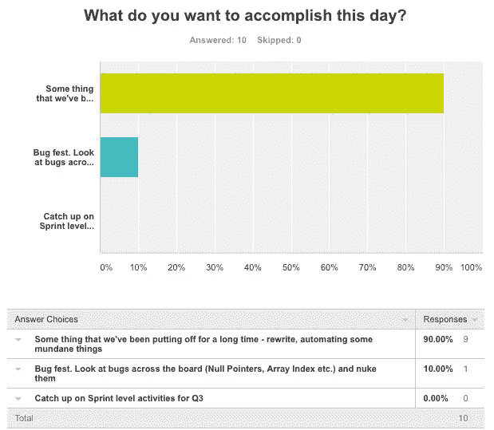
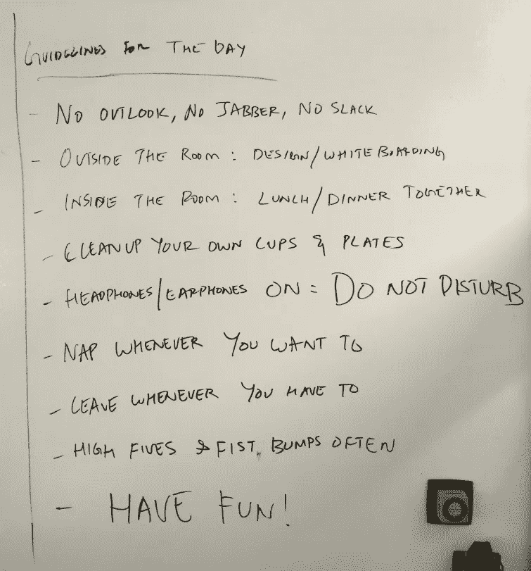
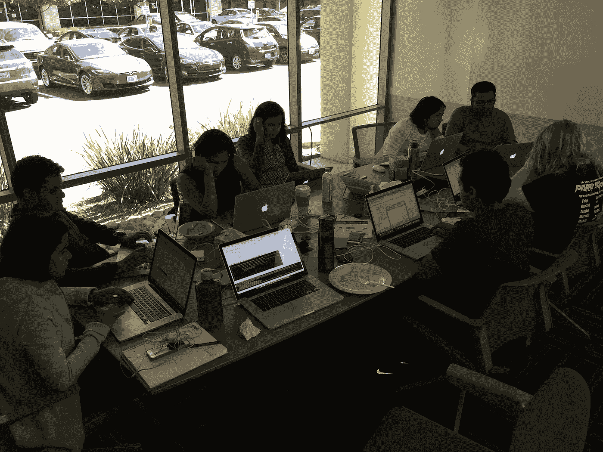
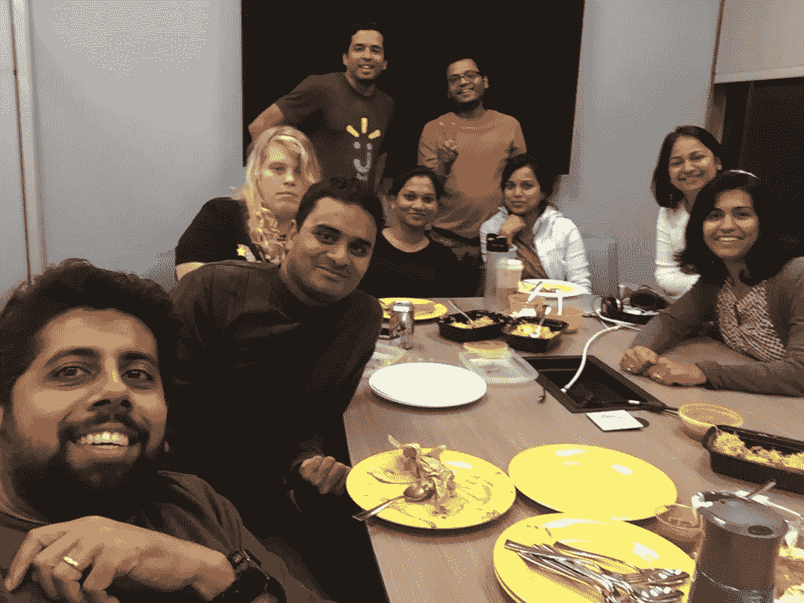

# Fixathon

> 原文：<https://medium.com/walmartglobaltech/fixathon-ed786be0984?source=collection_archive---------6----------------------->

Photo credit: [Viscious-Speed / 339 images](https://pixabay.com/en/users/Viscious-Speed-1744878/)

首先，我需要设置一个背景，说明我的团队是做什么的，以及为什么这篇文章是必要的。

除此之外，我的投资组合中有五种产品，它们对 Walmart.com 都非常重要。不，我这么说并不是为了证实我们的存在和/或价值，但是，这些产品确实决定了网站的成败。我们有各种各样的产品，包括消息传递、微服务、编排器、几种大数据技术和 APM 解决方案。我们使用从简单的 bash 脚本到 Apache Flink(我们新发现的爱！)以及其他很多介于两者之间的东西。不用说，我们通晓多种语言。折现我自己，支持这 5 个产品的工程师有 8 个。我们在流程上非常苗条，对会议非常挑剔，对效率低下直言不讳，从不羞于质疑现状。相信我，用废话说服这群人可不容易。

像任何其他地方的任何其他关键功能一样，我们总是被淹没在添加到我们平台的特性和功能中，并且我们自己有一长串事情要做。我的团队的工程领导不断提高标准(这本身就需要另一个职位！)，就像他们应该做的那样，我们的宠物项目一直在优先级列表中下降。

我们都同意，我们必须做些什么来解决这个问题。因此，这个 Fixathon。我们决定花一整天的时间做一些事情——这些事情是我们很久以来一直想做的，但是因为很多原因一直没有时间去做。

当涉及到这样的决定时，我们是真正民主的(有一些事情我要求他们去做，但不是为了这样的事情)。因此，我做了一项调查来衡量团队的兴趣，不出所料，他们的反应相当积极。

What do you think about the idea?

如你所见，人们从不羞于说出他们*的真实感受。此外，我们都集中在我们那天想做的事情上。*

What do you want to do that day?

在修复日的前几天，我们花了不到一个小时的时间，看看我们每个人都要做些什么，我们挑选了需要修复的东西，不是今天，而是昨天！无论我们选择什么，我们都同意它必须产生重大影响——减少 API 错误，缩短响应时间，改善我们的流管道以增加吞吐量/消除低效，提高开发人员的工作效率，并通过 *real* 警报在我们的平台上拥有更好的耳目。我们都强烈同意，我们应该躲在另一栋楼里，不是我们平常住的那栋，因为我们不想被任何人看到！我告诉我的老板，整个团队都藏起来了(直到晚上他想过来时才告诉他藏在哪里)。

我贴了一些当天的指南来帮助你集中精力做当天重要的事情！

Guidelines for the day

虽然在我们的日常工作中，懈怠并不令人惊讶，但当你只想进入状态时，它会变得非常喋喋不休。还有，我们都知道咖啡因和工程师是如何结合在一起的，所以，必须确保我们不留下任何痕迹。事后看来，我应该数一数消耗了多少杯子，看看它是否与我们当天编写的代码行成正比！

不出所料，当我们的一些消费者和运营团队在他们的老地方或 Slack 上找不到任何人时，他们吓坏了。我反复向每个人保证，团队是安全的，健康的&快乐的*在修复*的事情。我是唯一一个回答团队通常通过 Outlook 和 Slack 收到的所有问题/邮件的人。具有讽刺意味的是，同一天有两起火灾需要关注。但是，不，那天我不会让任何事情妨碍团队的发展！

我们想进行整整 24 小时，但是，我们只用了 16 个多小时就结束了。那天我们几乎完成了所有我们计划要做的事情。我们迫不及待地想在未来几天将这些部署到生产中(仍需要一些调整和操作)，并看到它将在我们的平台和我们的 API 消费者中产生的积极影响。我为这个团队取得的成就感到无比自豪！

如果我没有在我的团队中分享令人敬畏的 8，那将是我的失职。

Sitting (Clockwise): Myself, Shishupal, Mindy, Ramya, Sareeta, Himani, Sunila. Standing (Clockwise): Ganapathy, Shekhar

我已经等不及下一次了！