# 修复撰写文本中的字体填充

> 原文：<https://medium.com/androiddevelopers/fixing-font-padding-in-compose-text-768cd232425b?source=collection_archive---------2----------------------->


***TL；*博士**

*   *使用* `[*Compose 1.2.0*](https://android-developers.googleblog.com/2022/05/whats-new-in-jetpack-compose.html)` *中的* `[*PlatformTextStyle*](https://developer.android.com/reference/kotlin/androidx/compose/ui/text/PlatformTextStyle)` *API 来配置* `[*includeFontPadding*](https://developer.android.com/reference/kotlin/androidx/compose/ui/text/PlatformParagraphStyle#includeFontPadding())` *它是* ***弃用*** *故意表示它是一个* ***兼容*** *API。*
*   *目前来看，* `*includeFontPadding*` *在 Compose* ***中默认为 true，但在 Compose*** *的下一个版本中会改为 false，最终会移除兼容 API。*
*   *使用* `*includeFontPadding*` *设置为* `*false*` *来测试你的 UI，并做任何必要的调整。*
*   *使用* `[*LineHeightStyle*](https://developer.android.com/reference/kotlin/androidx/compose/ui/text/style/LineHeightStyle)` *API 更容易匹配您的设计。*

从头开始创建 Jetpack Compose，我们的新 UI 工具包，让我们有机会重新评估过去所做的选择。在这篇博文中，我们将深入探讨视图系统和 Compose 中文本对齐的细节。您将了解我们对字体填充所做的更多更改，这些更改将使文本呈现更加防错，并帮助您更轻松地从 Figma 或 Sketch 等常用设计工具中实现设计。

虽然迁移到新的 API 有很多好处，但这也可能意味着轻微的设计不一致，和/或自动截图测试中的破坏性变化。但是不用担心！我们将向您展示如何开始使用这些 API，并从今天开始测试您的文本，以最适合您的应用的速度进行迁移。

# 视图系统中的字体填充

`[includeFontPadding](https://developer.android.com/reference/android/widget/TextView#attr_android:includeFontPadding)`是一个`[TextView](https://developer.android.com/reference/android/widget/TextView)`参数，有效控制文本中第一行和最后一行的行高。通常，打开它会通过添加垂直填充使第一行和最后一行变高。

默认值为`true`，您可以按如下方式覆盖它:

如果我们看一下下面的例子:

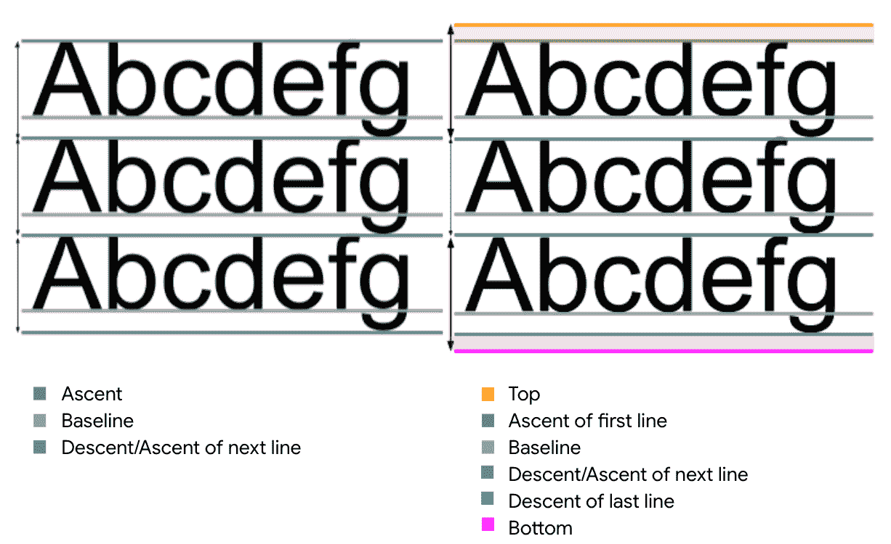

*Line height with includeFontPadding as false on the left and true on the right.*

当`includeFontPadding`为 ***假*** 时，首末行的行高等于( ***descent — ascent)。***

当`includeFontPadding`为**时*为真*时**就变得有趣了:

*   第一行的行高等于( ***下降—顶部*** )。
*   最后一行的行高等于( ***底部—上升*** )。
*   如果只有 1 行，则行高等于( ***底—顶*** )。
*   对于内部线条，其线条高度始终等于( ***下降—上升*** )。

顶端、上升和下降是*字体度量*的例子。这些度量提供了关于字体的信息，使得系统能够均匀地间隔和均匀地对齐文本行。它们对于每种字体都是不变的，你可以通过使用`[FontMetrics](https://developer.android.com/reference/android/graphics/Paint.FontMetrics)` API 或者类似 [ttx](https://fonttools.readthedocs.io/en/latest/ttx.html) 的工具来检索它们。

将`includeFontPadding`设置为 true 或 false 会影响文本在其父容器中的对齐方式，并导致对齐方式的细微差异。

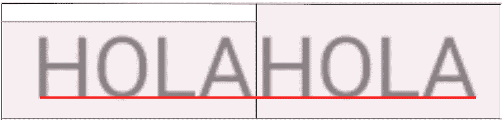

*2 TextViews side by side baseline aligned (by default) in a LinearLayout in Android API 30\. includeFontPadding is false to the left and true to the right.*

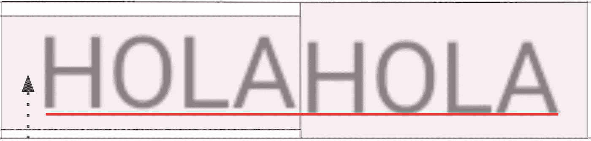

2 TextViews side by side with layout_gravity=”center_vertical” in a LinearLayout in Android API 30\. They’re aligned by view height instead of text baseline. The one on the left has room to float up to be centered.
includeFontPadding is false to the left and true to the right.

听起来，默认将`includeFontPadding`配置为 true 可能与您想要的正好相反。如果您需要遵循特定的设计准则，在文本中使用额外的填充会使这一点更难实现。默认情况下包含这种填充背后的原因是历史的。

# 背景

[Roboto](https://fonts.google.com/specimen/Roboto) 是 Android 平台上的标准字体和默认字体(或系统字体后备中的第一种字体)。

在 Android 27 之前，为了计算绘制字体的最大可用空间，系统使用 Roboto 的字体度量进行这些计算。它决定了可用空间的大小，并认为这个空间是“绘制文本的安全空间”。

这种解决方案并不适用于所有字体，因为通常比拉丁文高的设计字体或“脚本”会被“剪裁”。剪裁意味着部分字形(或字符)在可用绘图空间上不完全可见。贯穿本文，我们将使用缅甸语作为一个高大的脚本的例子。缅甸语的一个示例文本是၇ဤဩဦနိ.

**这是** `**includeFontPadding**` **被引入**的地方，防止高字体被剪切，允许你给文本添加顶部和底部填充。

我们可以看到这个例子中的行为:

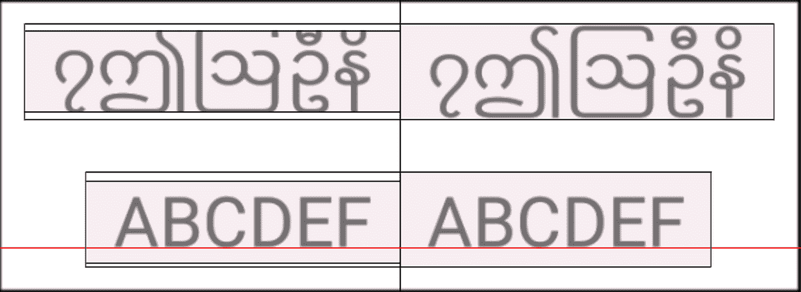

`*includeFontPadding*` *is false to the left (notice Burmese font clipping, and the white background color due to no added padding) — includeFontPadding is true to the right (Android API 25)*

因此，如果你曾经将`includeFontPadding`设置为 false，并且你的应用程序支持缅甸语，它可能会面临字体裁剪问题，这取决于你的 Android 版本。

# 将 includeFontPadding 设置为 false

有一些将`includeFontPadding`设置为 false 的有效用例，例如，解决垂直对齐问题或符合特定的设计规范。

让我们看两个例子:

当文本在父窗口小部件(例如按钮)中居中时，文本应该垂直居中。

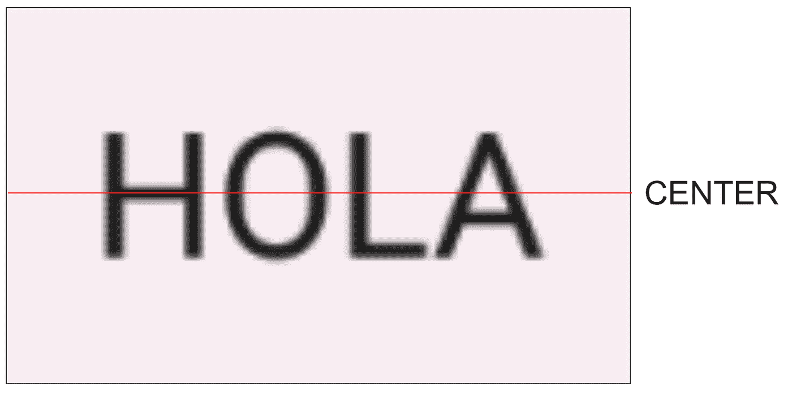

H 中的水平条应该垂直居中。然而，当`includeFontPadding`为真时，这种对齐将取决于字体及其字体度量。让我们看看顶部填充比底部多的[字体会发生什么:](https://fonts.google.com/specimen/Oswald)

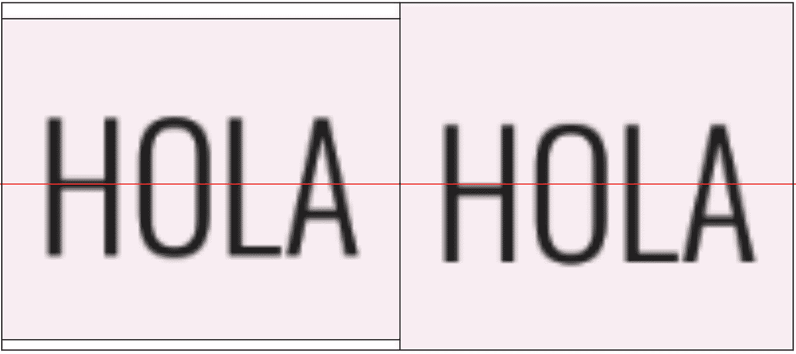

在这个例子中，`includeFontPadding`左边为假，右边为真。请注意，由于不均匀的字体填充，垂直对齐稍微偏右。根据所使用的字体和文本(例如小写拉丁文本自然更靠近绘图空间的下部)，这种差异可能会更明显。

另一个例子是文本必须与另一个视图(例如图像)的顶部或底部对齐。由于`includeFontPadding`添加的额外填充，文本和图像没有对齐。让我们来看看想要的设计:

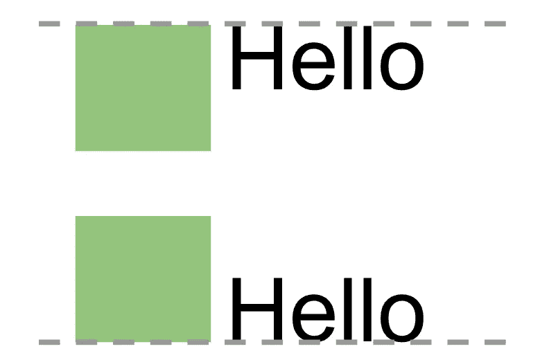

通常，为了达到上述效果，你可以将`includeFontPadding` 设置为 false，再加上一些硬编码填充。

# 视图系统的修复

`TextView`小部件构建在两个基本 Java 类`[StaticLayout](https://developer.android.com/reference/android/text/StaticLayout)`和`[BoringLayout](https://developer.android.com/reference/android/text/BoringLayout#BoringLayout)`之上，并根据屏幕上显示的文本的性质委托给其中一个。

从运行 Android 28 和更高版本的设备开始，我们为`[StaticLayout](https://developer.android.com/reference/android/text/StaticLayout)`添加了`[useLineSpacingFromFallbacks](https://developer.android.com/reference/android/text/StaticLayout.Builder#setUseLineSpacingFromFallbacks(boolean))`功能，因此文本的上升/下降将根据使用的字体而不是 Roboto 的字体度量进行调整。当设置为真时，即使`includeFontPadding`为假，该配置也会修复字体剪切问题。它还能防止`includeFontPadding`没有解决的连续线条相互碰撞。
然而这个特性当时并没有添加到`[BoringLayout](https://developer.android.com/reference/android/text/BoringLayout#BoringLayout)`(单行文字，从左到右字符)中。在这种情况下，仍然可能存在削波。[最近增加了对此的支持](https://developer.android.com/reference/android/text/BoringLayout#BoringLayout(java.lang.CharSequence,%20android.text.TextPaint,%20int,%20android.text.Layout.Alignment,%20float,%20float,%20android.text.BoringLayout.Metrics,%20boolean,%20android.text.TextUtils.TruncateAt,%20int,%20boolean))，并将推出 [Android T](https://developer.android.com/partners/google-apps/android-13/changes?hl=en#line-height-textview) 。

> 从 API 33 开始，`includeFontPadding`对于最初设计目的的`TextView`来说变得多余，因为裁剪问题将被自动处理。**直到你的 minSdk 为 33，你还需要在视图系统中设置** `**includeFontPadding**` **为真，以防止字体剪裁为高字体。**

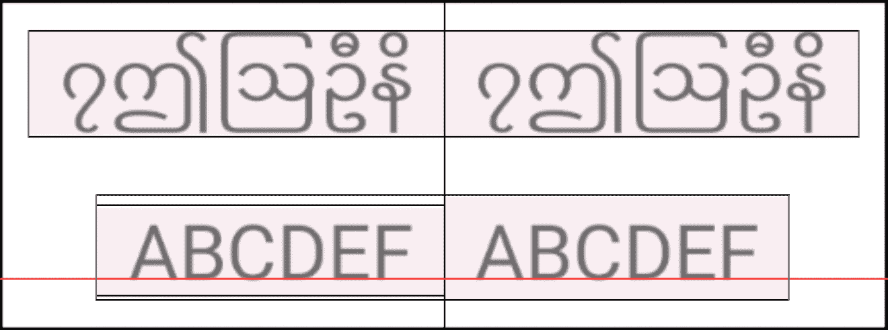

*includeFontPadding is false to the left (notice Burmese font clipping is fixed) and includeFontPadding and true to the right (Android API 33)*

`includeFontPadding`与`[fallbackLineSpacing](https://developer.android.com/reference/android/widget/TextView#attr_android:fallbackLineSpacing)`结合使用，也可与`[elegantTextHeight](https://developer.android.com/reference/android/widget/TextView#attr_android:elegantTextHeight)`结合使用。这两个参数的组合导致了复杂的行为。

为了增加灵活性(但也增加了混乱)，`TextView`还允许您配置`[firstBaselineToTopHeight](https://developer.android.com/reference/android/widget/TextView#attr_android:firstBaselineToTopHeight)`和`[lastBaselineToBottomHeight](https://developer.android.com/reference/android/widget/TextView#attr_android:lastBaselineToBottomHeight)`，这有助于分别定义顶部和底部文本行的额外填充。这些属性仅适用于 API 级别 28 及更高级别。

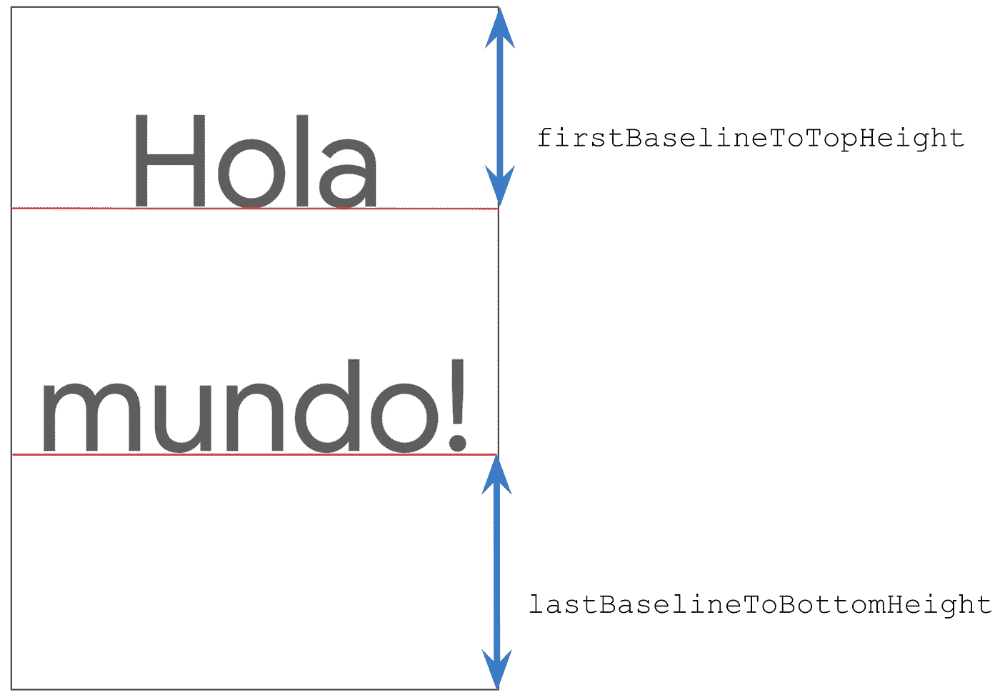

firstBaselineToTopHeight and lastBaselineToBottomHeight in a TextView

> 多个参数允许你在一个`TextView`中修改字体填充，它们可以以复杂的方式交互，并且**的行为可能在不同的 API 级别**之间有所不同。请务必根据各种 API 级别测试基于视图的 UI。

# 在 Compose 中实现

当在 Compose 中构建初始的`[Text](https://developer.android.com/reference/kotlin/androidx/compose/material/package-summary#Text(kotlin.String,androidx.compose.ui.Modifier,androidx.compose.ui.graphics.Color,androidx.compose.ui.unit.TextUnit,androidx.compose.ui.text.font.FontStyle,androidx.compose.ui.text.font.FontWeight,androidx.compose.ui.text.font.FontFamily,androidx.compose.ui.unit.TextUnit,androidx.compose.ui.text.style.TextDecoration,androidx.compose.ui.text.style.TextAlign,androidx.compose.ui.unit.TextUnit,androidx.compose.ui.text.style.TextOverflow,kotlin.Boolean,kotlin.Int,kotlin.Function1,androidx.compose.ui.text.TextStyle))`实现时，行为与`[TextView](https://developer.android.com/reference/android/widget/TextView)`的行为一致，在 Compose 的`[TextLayout](https://source.corp.google.com/androidx-platform-dev/text/text/src/main/java/androidx/compose/ui/text/android/TextLayout.kt?q=DEFAULT_INCLUDE_PADDING)`中默认添加字体填充。
**但是，它并没有公开一个参数来打开和关闭这个填充。社区很快指出了这一点，创建了一个与视图奇偶校验相关的 bug，引起了很多关注。这个请求是允许在使用`Text`可组合函数时打开和关闭`includeFontPadding`，就像在视图系统中一样。**

在考虑如何在 Compose 中实现这个切换特性时，我们分析了如何使用`includeFontPadding`以及它解决的主要用例。我们知道文本应该像预期的那样呈现，并且`includeFontPadding`是一个非常特定于 Android 的配置，不应该出现在通用 API 上。总的来说，这是一个令人困惑的参数，并且非常容易出错(它公开了一个难以理解、难以解释的 API，并且只适用于特定情况的子集)。

我们有以下目标:

*   删除不必要的填充，将控制权交还给你来实现你真正需要的填充。
*   自动防止高字体、斜体等的剪裁问题。

因此，我们发布了包括以下内容的变更:

*   创建一个新的 API `[PlatformTextStyle](https://developer.android.com/reference/kotlin/androidx/compose/ui/text/PlatformTextStyle)`来允许打开和关闭`[includeFontPadding](https://developer.android.com/reference/kotlin/androidx/compose/ui/text/PlatformParagraphStyle#includeFontPadding())`(默认值为 true)。
*   为了修复在撰写中关闭`includeFontPadding`时可能发生的所有高字体剪裁问题，我们仅在第一行和最后一行需要时应用额外的填充，并且根据给定行中包含的所有文本所使用的字体(而不是字体后备中第一种字体的`FontMetrics`)来计算最大行高。
*   我们已经应用了一个适用于所有 Android 版本的解决方案，直到 API 21(使用 [Jetpack Compose](https://developer.android.com/jetpack/compose) 库所需的最小 SDK 级别)。

> 如果您有兴趣仔细查看我们的解决方案的实现，请查看下面的更改列表:
> [第一个更改](https://android-review.googlesource.com/c/platform/frameworks/support/+/1992050/)，自动添加额外的填充
> [随着这个更改](https://android-review.googlesource.com/c/platform/frameworks/support/+/2028663/)我们在 text style/paragraph style
> [后续更改](https://android-review.googlesource.com/c/platform/frameworks/support/+/2059410/)中为`includeFontPadding`添加了临时兼容性配置，在 Compose 中默认保持`includeFontPadding`为真

# PlatformTextStyle API

作为 [Compose 1.2.0-alpha07](https://developer.android.com/jetpack/androidx/releases/compose-foundation#1.2.0-alpha07) 的一部分，我们在`[TextStyle](https://developer.android.com/reference/kotlin/androidx/compose/ui/text/TextStyle)` / `[PlatformTextStyle](https://developer.android.com/reference/kotlin/androidx/compose/ui/text/PlatformTextStyle)`中公开了一个 API，允许你打开和关闭`includeFontPadding`。默认值为 true，表示添加了字体填充。

该 API 被标记为实验性/不推荐使用，这只是为了兼容。当您将`includeFontPadding`设置为 false 并根据需要调整布局时，我们打算在即将发布的 Compose 中将`includeFontPadding`默认值更改为 false，并最终移除兼容性 API。

您可以在每个`Text`中进行配置，因此迁移是渐进的:

或者更笼统地说，在你的排版上:

由于这些 API 是实验性的，您需要用`[ExperimentalTextApi](https://developer.android.com/reference/kotlin/androidx/compose/ui/text/ExperimentalTextApi)`注释来注释这些用法。
或者，如果你正在用`Gradle`构建，你可以在你的应用程序的`build.gradle`文件中添加下面的异常到`kotlinOptions`:

```
kotlinOptions **{
    ...**
    freeCompilerArgs += ["-Xuse-experimental=androidx.compose.ui.text.ExperimentalTextApi"]
**}**
```

# LineHeightStyle API

随着我们不断评估我们的更改的影响，我们听取了社区的反馈，并开发了一个 API 来帮助您更容易地将您的设计与您的撰写应用程序中的文本相匹配。

2019 年，设计师工具 Figma 宣布，他们对测量和应用行高的方式进行了[更改](https://www.figma.com/blog/line-height-changes/)。简而言之，Figma 就像一般的 web 一样分配行高:顶部和底部各占一半。从那以后，许多设计师和开发人员一直在和我们谈论这篇博文。
2022 年 3 月，一名开发人员发布了一篇关于如何在 Compose 中使用 Figma 行为的文章，因为它不能开箱即用。

`[LineHeight](https://developer.android.com/reference/kotlin/androidx/compose/ui/text/TextStyle#lineHeight())`对于组合`Text`来说并不是一个新概念，它可以定义为文本基线之间的距离:

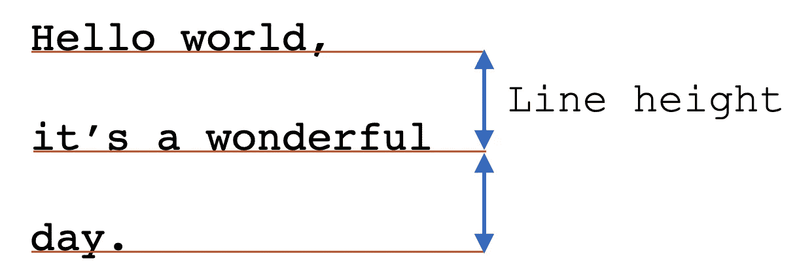

Definition of line height

这使得文本的第一行和最后一行处于特殊的情况下，因为它们的上方和下方没有基线。因此，为了使每行具有相同的行高，需要添加一些额外的空间，并按照给定的标准在每行中进行分配。该标准可通过新的 API `[LineHeightStyle](https://developer.android.com/reference/kotlin/androidx/compose/ui/text/style/LineHeightStyle)`进行配置。

`LineHeightStyle`控制如何分配每行文本的行高，以及行高是否应用于第一行的顶部和最后一行的底部。它定义了由`TextStyle(lineHeight)`提供的空间中的行的对齐方式，并提供了几个选项来修改可用绘图空间中的文本行为。

您可以如下配置`LineHeightStyle`:

*注意:我们建议通过使用* `[*LocalTextStyle*](https://developer.android.com/reference/kotlin/androidx/wear/compose/material/package-summary#LocalTextStyle())` *合并来定义* `*TextStyle*` *，因为如果不这样做将会使你丢失你的素材主题的样式，例如，如果你添加这个文本作为一个按钮的内容。你可以在这个特征请求* *中查看围绕这个* [*的讨论。*](https://issuetracker.google.com/233365719)

## 对齐

`[LineHeightStyle.Alignment](https://developer.android.com/reference/kotlin/androidx/compose/ui/text/style/LineHeightStyle.Alignment)`定义如何在行高提供的空间内对齐文本。

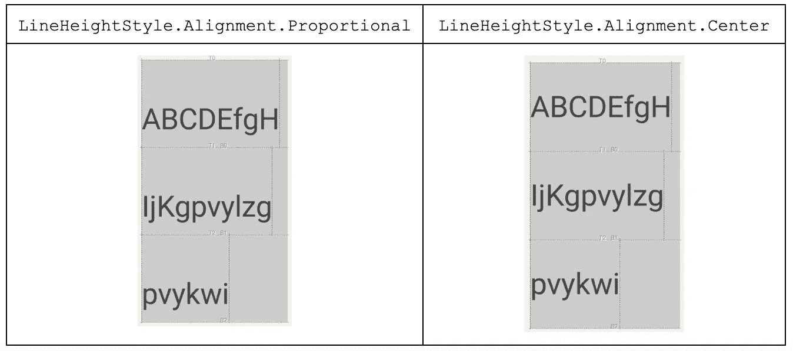

`[LineHeightStyle.Alignment.Proportional](https://developer.android.com/reference/kotlin/androidx/compose/ui/text/style/LineHeightStyle.Alignment#Proportional())`这是默认行为，按照字体规格分配行高。
`[LineHeightStyle.Alignment.Center](https://developer.android.com/reference/kotlin/androidx/compose/ui/text/style/LineHeightStyle.Alignment#Center())`在每行文本的顶部和底部添加等量的间距，将文本置于中间。

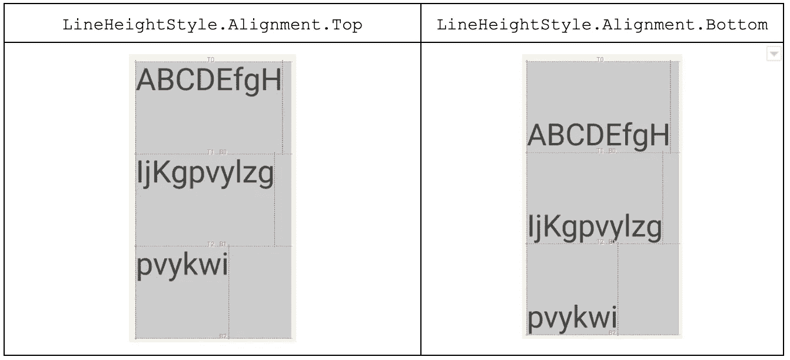

`[LineHeightStyle.Alignment.Top](https://developer.android.com/reference/kotlin/androidx/compose/ui/text/style/LineHeightStyle.Alignment#Top())`在每行文本的底部添加空格，将文本推到顶部。
`[LineHeightStyle.Alignment.Bottom](https://developer.android.com/reference/kotlin/androidx/compose/ui/text/style/LineHeightStyle.Alignment#Bottom())` [](https://developer.android.com/reference/kotlin/androidx/compose/ui/text/style/LineHeightStyle.Alignment#Bottom())在每行文本的顶部添加空格，将文本推到底部。

## 附加装饰

另一方面，`[LineHeightStyle.Trim](https://developer.android.com/reference/kotlin/androidx/compose/ui/text/style/LineHeightStyle.Trim)` 选项将允许你移除或保留第一行顶部和最后一行底部的额外填充。这些是可用的微调配置，与校准中心一起配置:

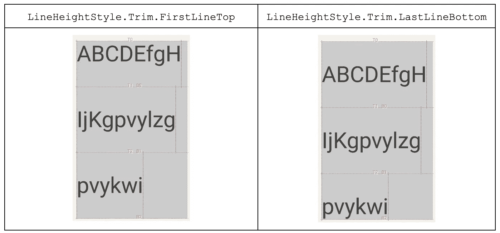

`[LineHeightStyle.Trim.FirstLineTop](https://developer.android.com/reference/kotlin/androidx/compose/ui/text/style/LineHeightStyle.Trim#FirstLineTop())`修剪由于行高而增加到第一行顶部的空间。
`[LineHeightStyle.Trim.LastLineBottom](https://developer.android.com/reference/kotlin/androidx/compose/ui/text/style/LineHeightStyle.Trim#LastLineBottom())`修剪由于行高而增加到最后一行底部的空间。

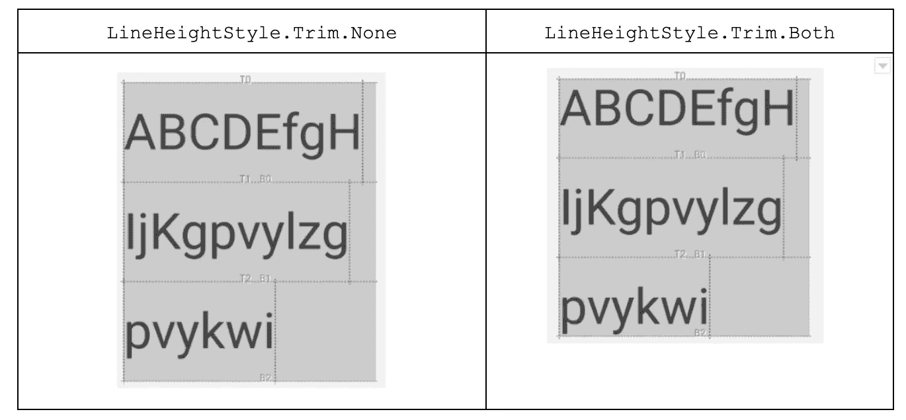

`[LineHeightStyle.Trim.None](https://developer.android.com/reference/kotlin/androidx/compose/ui/text/style/LineHeightStyle.Trim#None())`不删除空格。
`[LineHeightStyle.Trim.Both](https://developer.android.com/reference/kotlin/androidx/compose/ui/text/style/LineHeightStyle.Trim#Both())`修剪由于行高而增加到第一行顶部和最后一行底部的空间。

*注意:只有在文本上定义了行高时，才应用该配置。* `[*trim*](https://developer.android.com/reference/kotlin/androidx/compose/ui/text/style/LineHeightStyle#trim())` *功能仅在* `[*PlatformParagraphStyle.includeFontPadding*](https://developer.android.com/reference/kotlin/androidx/compose/ui/text/PlatformParagraphStyle#includeFontPadding())` *为假时可用。*

> `**includeFontPadding**` **与** `**lineHeight**` **和** `**LineHeightStyle**` **(对齐和修剪配置)一起产生多种组合，允许您更好地对齐和样式化任何给定字体的** `**Text**` **。请务必查看我们上面介绍的相关类的** [**文档**](https://developer.android.com/reference/kotlin/androidx/compose/ui/text/style/LineHeightStyle) **，以探索最有助于匹配您的设计的选项。**

# 结论

[Compose 1.2.0 beta 发布了](https://android-developers.googleblog.com/2022/05/whats-new-in-jetpack-compose.html)，默认情况下相当于`includeFontPadding`的 Compose 是启用的，可以关闭它，今天就开始调整和测试您的`Text`。

虽然`PlatformTextStyle`兼容性 API(允许您禁用`includeFontPadding`)将在未来版本中保持可用，但我们的目标是尽快将默认行为更改为默认关闭。您可以开始使用它来测试您的屏幕，并在需要时进行所有必要的调整。

此外，我们还添加了具有多个选项的`LineHeightStyle` API，这是另一个备受欢迎的功能，将帮助您更轻松地匹配您的设计。

如果您在关闭`includeFontPadding`时遇到问题/错误，请让我们知道并在[我们的问题跟踪器](https://issuetracker.google.com/issues/new?component=779818&template=1371638)上记录一个错误。

还有什么问题吗？请在下面留言或在 [Twitter](https://twitter.com/astamatok) 上联系我，我们希望收到您的来信！

快乐作曲！👋

*这篇文章是与 Jetpack 撰写文本团队的 Seigo Nonaka、* [*肖恩·麦克奎蓝*](https://twitter.com/objcode) *、* [*西亚梅德·西尼尔*](https://twitter.com/siyamed) *和阿纳斯塔西娅·索博列娃合作撰写的。特别感谢 DevRel 团队中的* [*约兰达·维尔霍夫*](https://twitter.com/lojanda) *和* [*弗洛里纳·芒特内斯库*](https://twitter.com/FMuntenescu) *的观点和评论。*