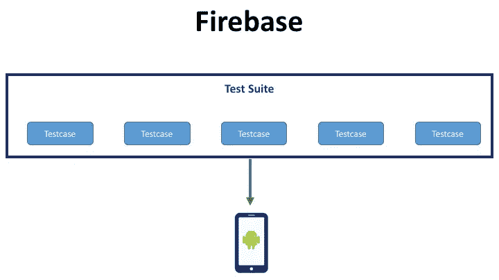
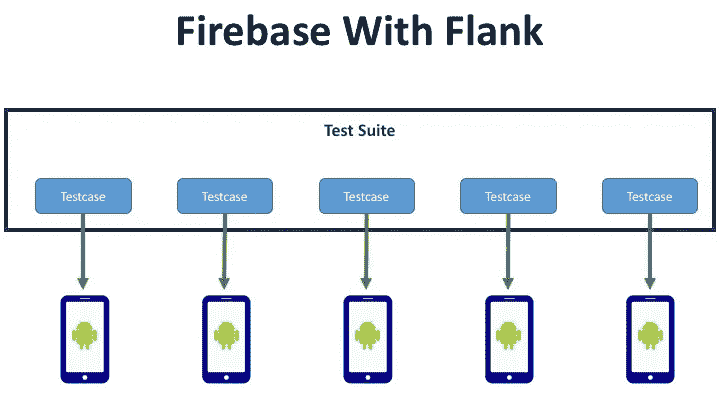
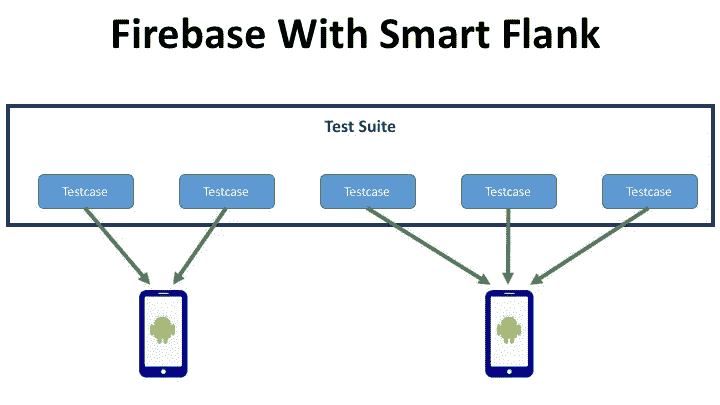

# 侧翼:Firebase 的智能测试运行程序

> 原文：<https://medium.com/walmartglobaltech/flank-smart-test-runner-for-firebase-cf65e1b1eca7?source=collection_archive---------0----------------------->

在航海术语中，船速是一艘船能达到的最大速度。这正是我们想要实现的 android 测试自动化，这一需求导致了我们最新加入 TestArmada 工具套件的 Flank 的诞生。

这篇文章详细介绍了我们的 android 测试自动化需求，为什么我们选择了 [firebase](https://firebase.google.com/) 并创建了 Flank，Flank 如何帮助我们，以及它如何帮助所有使用 android 开发人员的 firebase。

## Android 自动化@ WalmartLabs

对于我们的开发人员，我们支持基于仪器(Espresso)和非仪器(Appium)的测试自动化。Espresso 和任何其他基于仪器的测试框架总是比 Appium 功能更丰富，速度更快。然而，Appium 具有测试重用的吸引力。Appium 可以让你重用你的移动网络测试，或者 ios 和 android 的本地应用测试。以 iOS 和 android 或 web 和移动 web 的组合为目标的团队通常选择 Appium，而原生 Android 开发人员出于显而易见的原因更喜欢 Espresso。

我们使用外部设备云供应商来运行我们的移动网络和本地应用程序测试。我们一直在寻找新的工具/服务，使 WalmartLabs 的测试自动化更加高效。这就是我们如何了解 Firebase，并在去年年初成为他们测试计划的一部分。

## Firebase 测试实验室

我们评估所有测试自动化工具和服务的三个关键特征是:

1.  **速度**
2.  **可靠性**
3.  **可操作的见解**

Firebase TestLab 最吸引人的特点是完全不同的东西，那就是定价。当您使用外部供应商时，您的脑海中总是会出现构建还是购买的问题。虚拟设备每小时 1 美元，真实设备每小时 5 美元的 Firebase 让这个问题变得过时了。我提到过吗，他们按分钟计算测试执行时间，并且不收取设备安装和拆卸时间的费用。

成本节约非常显著，我们开始根据其他评估标准评估 firebase。它的得分很高，但是我们发现了一个问题:Firebase 不支持测试分片。

这对我们来说是一个大问题，因为我们对公关工作的执行时间有严格的 SLA。我们喜欢分布我们的测试，最好每个设备一个，以确保最快的测试执行时间。而 Firebase 只允许我们在给定的设备上连续运行测试。

这个需求/问题是我们创建 Flank 的核心原因。

## 侧面

我们开始与 Google Firebase 团队讨论我们的侧翼需求，他们非常合作，分享了许多关于如何创建一个支持分片的高效运行器的想法和技巧。

[我们团队的 Renas Reda](https://medium.com/u/cbfc2689c304?source=post_page-----cf65e1b1eca7--------------------------------) 开始着手这项工作，很快第一个版本的 Flank 就具备了这些特性:

1.  **测试分片**:你所有的 Espresso 测试都会自动分发到尽可能多的 Firebase 设备上，而 Flank 会输出综合测试报告，就好像它们在同一个设备上运行一样。
2.  **节流支持**:如果您有很多测试，并且您担心 Firebase 可能没有足够的设备来一次运行所有的测试。您可以指定一个限制数量，Flank 将确保您的测试套件永远不会使用超过指定数量的设备。
3.  **设备配置支持**:选择单个或多个设备，通过配置文件进行测试。
4.  **测试报告:** Flanks 输出标准的 XUnit 报告格式，因此您可以将其与您选择的任何 CI 系统集成。侧面还包括每个测试的设备名称、api 级别、地区和方向，以确保开发人员获得完整的图片。

这对我们很有用，我们的测试运行得更快，执行成本很低，每个人都很高兴。我们开始进行成本预测以获得财务批准，并注意到一件非常奇怪的事情。Firebase 向我们收取的费用是预期价格的 2 到 3 倍。

## 聪明的侧翼

我们开始调试价格差异。我们的用例是一个包含 312 个测试用例的测试套件，过去在单个设备上本地运行需要 2 个小时。我们用 312 个碎片在 Firebase 上运行相同的测试，我们的测试总共花费了大约 15 分钟。由于本地测试运行时间约为 2 小时，我们预计每次执行收费约为 2 美元，但我们的收费超过了 5 美元。

我们花了一些时间，但我们找到了罪魁祸首。记住，我在上面提到过 Firebase 如何将测试执行时间精确到分钟。这意味着任何设备的使用时间都不能少于一分钟。我们大多数测试的执行时间不到 30 秒，平均 10 秒。这种以分钟为单位的舍入意味着 312 个测试将花费 312 分钟，不考虑它们的执行时间。因此，在我们的例子中，我们被收取 312/60 = 5.2 美元的费用。

一旦我们了解到这一点，我们就开始在 Flank 中开发一个新特性，它考虑到了最后一次测试运行，然后以这样一种方式对测试进行分片，每个分片运行将近 X 分钟。这里 X 是可配置的，但默认为两分钟。我们内部称这个特性为“智能侧翼”。

Smart Flank 很快就准备好了，我们惊喜地发现，它不仅降低了我们的成本，还帮助我们缩短了测试执行时间。由于多个测试使用相同的设备，我们观察到安装/拆卸时间的节省，这反映在我们的总测试执行时间中。现在，我们的 15 分钟测试只需 7 分钟左右，成本降到了 2 美元。换句话说，这一新功能允许我们以两倍的速度运行测试，而成本仅为之前的 1/3。很聪明，对吧？

## 下一步是什么

我们有开源的侧翼，并愿意在社区支持和反馈下进一步发展它。Flank 应该可以与任何基于 JUnit 的 android 测试套件一起工作，这可能是在 Firebase 上运行 android 测试用例的最佳方式，无需对代码库进行任何更改。

下面是我们的 Github 回购:【https://github.com/TestArmada/flank 

## 承认

1.  [雷纳斯·瑞达](https://medium.com/u/cbfc2689c304?source=post_page-----cf65e1b1eca7--------------------------------):用于创造侧翼
2.  Google Firebase 团队(Louis Amira、Nalin Mittal 和 Ahmed Mounir Gad):感谢你们所有的支持和想法。