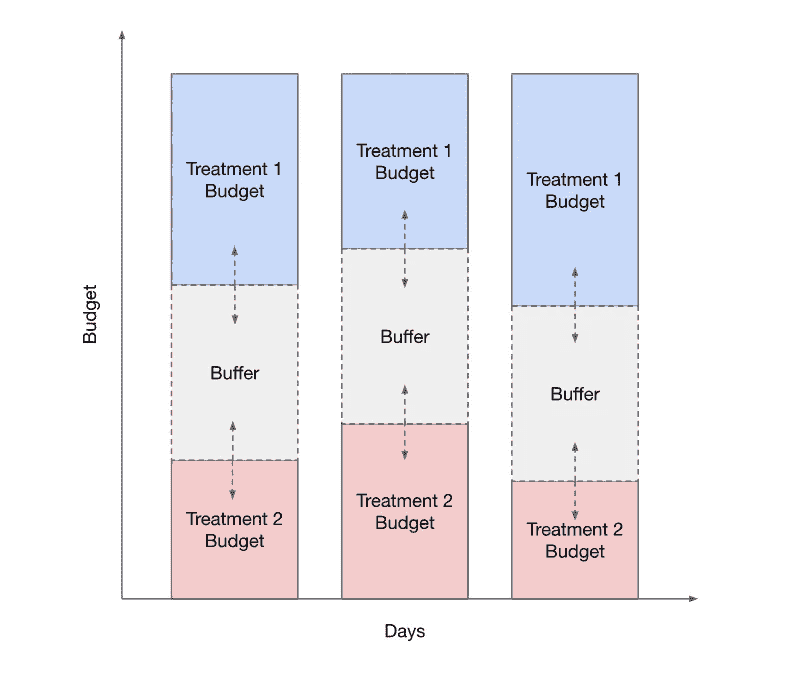

# Pinterest 灵活的每日预算

> 原文：<https://medium.com/pinterest-engineering/flexible-daily-budgeting-at-pinterest-91fc310c2e33?source=collection_archive---------1----------------------->

[Kelvin Jiang](https://www.linkedin.com/in/kjiang/) ，软件工程师，Ads Intelligence |[kesh ava subra manya](https://www.linkedin.com/in/keshavasubramanya/)，工程经理，Ads Intelligence |[Perrye ogun wole](https://www.linkedin.com/in/perrye-ogunwole-8358b357/)，产品经理，Ads Intelligence

# 介绍

Pinterest 的广告智能团队开发产品，帮助广告商从广告活动中获得最大价值。作为该计划的一部分，我们最近在公开测试中向美国广告商推出了灵活的每日预算(FDB)。

*Figure 1: Flexible daily budgets option in the campaign create flow*

FDB 是一个自动化的广告产品，通过以自动化的方式在多天内分配每个活动的广告预算，使广告商受益。该产品的目标是:

*   让广告商能够在一天的所有时间里
*   让广告客户能够“滚动”未支出的预算，同时在一段时间内达到他们的每日目标
*   通过允许广告活动在有更多机会的日子里花费更多，帮助广告商实现最低的每结果成本,反之亦然

# 问题陈述和动机

广告主在 Pinterest 上为广告活动设定预算有两种选择:

*   **每日预算:**“我想每天花费不超过 X 美元”，可以是无限期的，也可以是在指定的时间段内
*   **终生预算:**“我想在一段特定的时间内花费不超过$Y”

对于这两种预算类型，技术上的挑战是如何在分配的时间内花费广告商指定的预算金额，同时仍然全额花费预算。这一挑战通过我们的预算、节奏和投标系统得以解决。

在我们以前的每日预算方案下，广告商的每日预算在我们的系统中变成了严格的每日限额。如果广告客户使用自动竞价，我们的定速和竞价系统将致力于在一天结束前达到这一严格的每日限额，留下一些缓冲，以防我们需要更多的时间来完成金额。如果我们在某一天没有花完所有的钱，未花完的预算就没了，我们第二天重新开始，目标是再花同样的钱。

这个系统可能会给广告商带来两个不同的问题。

**问题 1:广告主 A 无法接触到他们的目标受众。**让我们假设广告商 A 为持续两天的假日活动设定了 100 美元的每日预算。可能会发生以下情况:

第一天:

*   我们的目标是在 21:00 前花掉 100 美元
*   在 21:00，实际花费是 99.07 美元
*   在 21:22，实际花费达到 100 美元，活动停止当天的花费

第二天:

*   我们的目标是在 21:00 前花掉 100 美元。
*   在 21:00，实际花费是 99.59 美元
*   在 21:04，实际支出达到 100 美元，活动停止当天的支出

广告商已经花费了他们整个活动的 200 美元预算，但在这两天，他们的广告在目标受众时区的下午 4 点左右停止显示，正好是广告商 A 知道他们最有可能出现在 Pinterest 上的时间。

问题 2:广告商 B 无法完成他们的预算。让我们假设广告商 B 为持续两天的假日活动设定了 500 美元的每日预算。可能会发生以下情况:

第一天:

*   我们的目标是在 21:00 前花掉 500 美元
*   在 21:00，实际花费是 399.52 美元
*   在 23:59，实际花费是 438.52 美元
*   广告客户调整他们的活动以提高绩效(即扩大他们的目标)

第二天:

*   我们的目标是在 21 点前花掉 500 美元。
*   在 21:00，实际花费是 499.73 美元
*   在 21:02，实际支出达到 500 美元，活动停止当天的支出

广告商仅花费了他们 1000 美元的总活动预算中的 938.52 美元，即使在他们观察到第一天交付不足后对他们的活动进行了一些改进。虽然第 2 天的表现更好，但第 1 天未用预算中的 61.48 美元无法使用，除非他们在第 2 天手动增加他们的每日预算。

# 我们的方法

FDB 通过改变每日预算活动的机制，使 Pinterest 的每日预算服务现代化。

首先，它通过允许结转每天的未用预算，取消了对广告活动支出的严格的每日上限，同时旨在将一周内的每日支出平均化为相当于广告客户的目标每日预算。

其次，它引入了灵活性，允许每天超支，直到某个限度。

此外，FDB 引入了一种机制来微调每项活动在一天中花费的速度，以便最大化它有资格花费的时间。这是由一个预测系统(建模为回归任务)提供支持的，该系统根据历史数据预测下一天活动的交付绩效。

该系统使用每个活动的预测递送表现来定制基础定步控制器，以允许每个活动在一整天中平稳且高效地递送广告。

有了 FDB 推出的功能，广告活动“提前”完成预算的广告商可以继续花费超过日常预算的金额，这样他们就可以在一天的任何时候接触到 Pinners。此外，广告客户的活动没有在当天结束时完成，可以自动将未支出的预算结转到第二天(无需在他们注意到一些支出不足后手动更新他们的日常预算)。

一旦营销活动获得了全天支出的能力，而不是被“限制”在一天的某个时间段内支出，随着其支出的分散，预计它将实现更低的成本。

# 实验

在用广告客户的直播活动测试 FDB 之前，我们进行了一项大规模实验来测试我们的假设，即滚动预算和支持全天支出可以提高日常预算活动的交付效率(降低每次结果的成本)，同时保持中性的总体支出。

由于测试所需的翻转机制在本实验中并不存在，我们开发了一种新的方法，使用终身预算活动(已经有这种机制)作为试验台来模拟日常预算活动行为。这是通过将每项活动的预算分配给不同的治疗体验来实现的，同时留出足够的缓冲，以考虑到预算中可能不均衡出现的超支或支出不足。

我们测试了多种 FDB 候选方案，这些方案利用每日预算为活动引入了全天预算滚动，尝试了基于启发式、数据驱动和基于模型的实施相结合。我们的实验表明，所有实验处理都显著降低了活动成本，对总体支出的影响最小。

# 未来的工作

FDB 是我们改进 Pinterest 广告预算产品之旅的第一步。在未来，我们计划探索使用更复杂的预测技术来积极地为平台上的每个活动寻找机会，并使用这些预测来优化分配广告客户的预算。摆在面前的挑战是跨越时间序列分析、机器学习和优化技术的令人耳目一新的问题组合。

如果您有兴趣帮助构建下一代 ML 驱动的广告客户解决方案，并构建像[广告客户推荐系统](/pinterest-engineering/advertiser-recommendation-systems-at-pinterest-ccb255fbde20)、[活动预算](/pinterest-engineering/campaign-budgets-at-pinterest-be94f15a4527)和[观众规模](/pinterest-engineering/estimating-potential-audience-size-of-an-ad-at-pinterest-f881aff6580f)这样的产品，请给我们写信！

# **致谢**

**Ads Intelligence:**Kelvin Jiang，Shi，Joey Huang，Keshava Subramanya

**广告质量:**克里斯蒂娜·黄，罗伯特·戈丹，尼提什·拉坦·阿帕纳萨米，安德烈·库雷利亚，阿康沙·拜德

**Ads Infra:** 刘明思、Sameer Bhide、Aniket Ketkar、、Priyan Agarwal、Marc Yang、Crystiane、Vincent Phan

**广告报道:** Sanchay Javeria，因苏李

**广告商自动化:**达尼·格尼布斯，贾扬特·梅图，埃里克·勒

PMM:吉米·奥卡拉汉

安德列亚·伯班克，坎达普·斯利瓦斯塔瓦，范·王

佩利·奥贡沃尔，德米特里·卢本斯基

*要在 Pinterest 上了解更多工程知识，请查看我们的* [*工程博客*](https://medium.com/pinterest-engineering) *，并访问我们的*[*Pinterest Labs*](https://www.pinterestlabs.com/)*网站。要探索 Pinterest 的生活，请访问我们的* [*职业*](https://www.pinterestcareers.com/) *页面。*