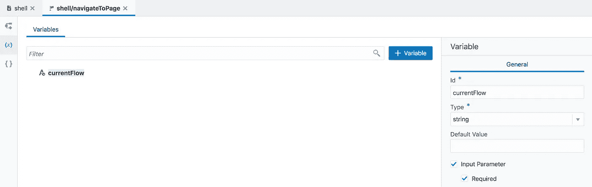

# Oracle VBCS 管理系统中的流程导航菜单控制

> 原文：<https://medium.com/oracledevs/flow-navigation-menu-control-in-oracle-vbcs-bf6aa9a9f36b?source=collection_archive---------0----------------------->

Oracle VBCS 允许我们在应用程序中构建多个流程。这很好——这有助于将应用程序逻辑分成不同的更小的模块。尽管 VBCS 没有提供(在当前版本中)声明性的支持来构建菜单结构以在流之间导航。幸运的是，这个要求可以通过几个简单的步骤来实现，请阅读 John Ceccarelli 的帖子— [在 VBCS 应用程序中添加导航栏](https://blogs.oracle.com/vbcs/adding-a-navigation-bar-to-a-vbcs-application)。我想仔细阅读约翰列出的说明并进行测试，今天的帖子就是基于此。在我的下一篇文章中，我将看看如何用更高级的东西来替换导航栏菜单结构，例如，左边的菜单滑块。

我认为 VBCS 作为 JavaScript 声明式开发 IDE 很有潜力。我看到许多概念类似于其他 Oracle 声明式开发工具，例如表单、Oracle ADF。VBCS 经营甲骨文喷气机，你在 VBCS 建造的都是甲骨文喷气机。Oracle 在 VBCS 升级 Oracle JET 版本时非常小心，我已经应用了最新的补丁(通过点击按钮),最新的 JET 版本在我们的 VBCS 环境中可用:

回到 VBCS 的心流。我们想创造多少流量就能创造多少流量。每个流可以基于一个或多个片段(HTML/JS 模块)。这里我创建了三个流，每个流都有一个片段:

我们可以选择流，这将为我们带来流程图，在其中我们可以在流元素/片段之间导航实现:

片段—这是完成 UI 部分的地方:

所以这是关于流动和片段的。对于具有 ADF 背景的人来说，这听起来非常类似于任务流和片段。接下来，我们应该看看如何实现流导航，能够从顶部菜单中选择流。VBCS 应用程序带有所谓的*外壳*页面。这个页面是顶层 UI 包装，包含应用程序名称、登录用户信息等。在这里，我们可以实现顶级菜单，它将在应用程序流中导航:

必须有默认的流程，一旦应用程序加载，就会显示。在*外壳*页面的设置中设置默认流程。转到设置并选择默认流程、仪表板-我的情况中的流程:

接下来，我们需要将 JET 组件——导航列表添加到 *shell* 页面，以呈现菜单 UI。您可以通过拖放来完成，但更容易的是将 *shell* 页面切换到源代码视图，并手动添加导航列表 HTML 部分(您可以从上传到 GitHub 的源代码中复制粘贴它，请参见本文末尾的链接)——突出显示的 HTML 将呈现菜单栏以在流之间导航:

最初，您会注意到与未识别的 JET 导航列表相关的错误，我们需要导入它。另一个错误—没有找到选择监听器，我们将实现它。

要导入 JET 导航列表组件，请转到 *shell* 页面的源代码实现，并在组件导入部分添加*OJ-navigation-list*—这将解决未知导航列表条目的问题:

要在 VBCS 执行行动，我们必须创建行动链。*外壳*页面内的克里特动作链—导航页面:

我们需要输入参数——流名称，它希望导航到。在动作链中创建变量—当前流程:

将“导航”类型的操作添加到操作链，这将触发导航逻辑:

转到动作链源，在动作下添加"*页面":" {{$variables.currentFlow}}"* 。这将强制导航到流，该流将通过参数:

最后，我们创建导航列表选择事件(在*外壳*页面内)，该事件将触发上面创建的动作链并传递当前流 ID。我们必须创建自定义事件，其名称甚至应与 HTML 中 JET 导航列表中定义的名称相匹配(见上文):

选择创建自定义事件(它在 Chrome 中对我不起作用，只在 Safari 浏览器中起作用。VBCS 虫？)并提供与导航列表组件监听器中相同的名称:

选择要从此事件触发的导航操作链:

提醒一下，事件是从导航列表选择中调用的:

事件正在从当前选定的选项卡项目传递流 ID:

在运行时，默认情况下会加载仪表板流:

我们可以换工作，等等。：

从 [GitHub](https://github.com/abaranovskis-redsamurai/vbcsmodularapp) repo 下载导出的(仅在 VBCS 可运行)VBCS 应用。

*原载于 2018 年 8 月 12 日*[*andrejusb.blogspot.com*](https://andrejusb.blogspot.com/2018/08/flow-navigation-menu-control-in-oracle.html)*。*