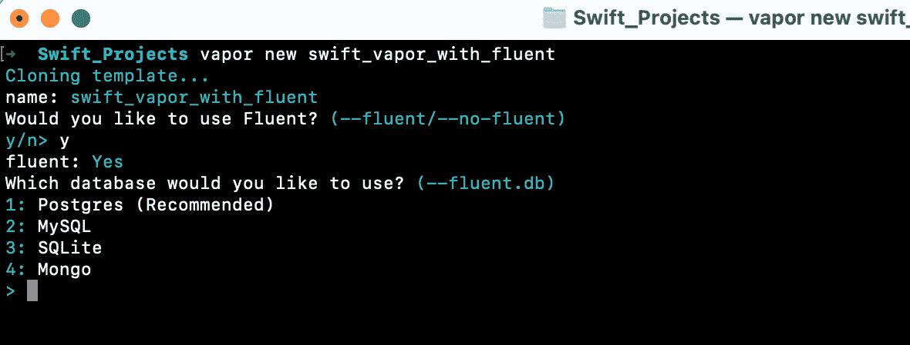

# Swift 中的流畅数据库

> 原文：<https://medium.com/globant/fluent-database-in-swift-464feb9c2952?source=collection_archive---------2----------------------->

image source: [https://github.com/vapor/fluent](https://github.com/vapor/fluent)

# 什么是流利？

Fluent 是一个开源的 ORM(对象关系映射器)框架，是 Vapor 项目的一部分。它在 Vapor 应用程序和数据库之间提供了一个抽象层。它使我们不必编写查询来直接与数据库交互，而是为我们的数据库提供了一个易于使用的接口。

虽然 Fluent 是 Vapor 项目的一部分，但它是独立的，并且有足够的能力独自管理数据库连接。

# ORM 是什么？

当我们有一个关系数据库时，我们总是可以使用 SQL 并编写我们的 SQL 查询来获取数据。但是如果我们不想自己写 SQL，想借助 Swift 或者其他任何编程语言的力量，只是使用一些辅助函数，以我们想要的方式获取所有数据，那该怎么办呢？比如只写 Movie.all()就可以得到所有的电影数据。这就是 ORM 出现的原因！

ORM 在关系数据库上工作，并允许我们以对象的形式交流关系数据库表和记录。所以换句话说，它是对象和关系数据库之间的映射。

**Fluent Driver** 可以用来连接上述两个东西，这意味着我们可以在我们的 swift 代码中创建这些模型和这些类，它们实际上可以与数据库对话，并从数据库中获取内容，就像从数据库中获取所有电影一样。

所以我们使用 ORM 的真正好处是我们不用写 SQL 查询，我们只处理对象和类，不管我们用的是 JavaScript 还是 Java 等等。每个类都有自己的形式，我们使用这些类来访问数据库表。在类模型中，每个表由类名表示，每个列由属性表示。

# 向 Vapor 项目添加 Fluent

要在我们的 Vapor 项目中使用 Fluent，我们需要在创建项目时包含 Fluent，或者可以在以后将它添加到现有项目中。

两者的步骤如下-

步骤 1:创建 Vapor 项目时添加 Fluent。

*   进入终端>运行蒸汽新 <project-name></project-name> 
*   按下回车键后，我们会得到一个提示，询问**“你要用 Fluent 吗？”**选择 **y**

*   然后我们会得到一个提示，询问**“您想使用哪个数据库？”**选择与提到的数据库名称相对应的数字。

*   按回车键后，我们会得到一个提示，询问**“你要使用 Leaf 吗？”**根据需要选择选项，按 enter 键。

*   按下 enter 键后，我们的具有流畅配置的项目将被创建。
*   导航到项目文件夹，键入命令“**open package . swift”**并按回车键。这将在 **Xcode** 编辑器中打开我们的项目。
*   可以在我们项目的根级别在 **Package.swift** 文件中验证 Fluent 配置，并且可以在**项目依赖关系**下验证 fluent 依赖关系，如下所示。

步骤 2:将 Fluent 添加到现有的 Vapor 项目中

要将 Fluent 添加到现有项目中，我们需要将两个依赖项添加到我们的包中:

*   蒸汽/流体@4.0.0
*   我们选择的一名(或多名)熟练驾驶员
*   这些可在 Fluent 的官方 Vapor 文档中通过以下链接获得—[https://docs . Vapor . codes/4.0/Fluent/overview/](https://docs.vapor.codes/4.0/fluent/overview/)

第二个 URL 中的 **< db >** 是我们用来连接 Fluent 和数据库的数据库驱动程序。例如:流利的英语。

这个驱动程序 URL 也可以在上面提到的 Fluent 的官方 Vapor 文档中找到。

*   将 Fluent 依赖项添加到 **Package.swift.** 中的目标依赖项，如下-

*   一旦这些包被添加为依赖项，我们就可以使用文件 **configure.swift** 中的 **app.databases** 来配置我们的数据库。

# Fluent 中的模型

在数据库中，我们有模型，它是数据库管理系统中的主要工件。模型显示了数据库的逻辑结构，包括确定如何存储和访问数据的关系和约束。数据库模型可以包括实体、它们的关系、数据流、表格等。

同样，我们在 Fluent 中也有模型。模特是流畅的核心。它们是我们数据的快速表示，并在整个 Fluent 中使用。根据 Vapor 的官方文档，“模型代表我们数据库中的固定数据结构，比如表或集合。”。下面是来自 Vapor docs 的一个模型，它代表了一个星系。

如果我们看上面的模型，它只是一个符合一个**模型协议的 Swift **类**。**一个**协议**定义了适合特定任务或功能的方法、属性和其他需求的蓝图。类、结构或枚举可以采用该协议来提供这些需求的实际实现。当我们扩展一个**协议时，**除了协议的实际实现，我们还可以根据我们的需求实现一些额外的功能。多个协议可以通过用逗号分隔来扩展。像下面这样-

所以总的来说，我们可以说模型是我们在数据库中保存和访问的对象。fluent 中的模型是类型安全的，所以当我们在 Fluent 中与数据库交互时，模型给了我们编译时的安全性。

在 swift 项目中，我们在 **Sources > Apps** 下创建模型目录，并存储我们的模型。没有必要创建一个单独的模型目录，这只是为了保持关注点的分离。

下面的代码片段显示了一个符合两个协议的 Todo 模型。

# 结论

这篇文章只是谈论 Fluent ORM，如何将它添加到我们的 Vapor 项目和 Fluent 中的模型。为了在项目中正确使用 Fluent，需要了解 Fluent 中的更多子主题，例如 Fluent 模式、Fluent 中的迁移等。这些可以参考 Vapor 在 Fluent 上的官方文档。

# 参考

*   Swift Vapor 官方文档— [Vapor: Fluent →概述](https://docs.vapor.codes/4.0/fluent/overview/)
*   [教程:如何使用 Fluent 编写模型|作者马丁·拉塞克| Medium](https://martinlasek.medium.com/tutorial-how-to-write-models-using-fluent-e9482d335a5f)
*   [https://www . raywenderlich . com/15249598-使用-流畅-持续-蒸汽模型](https://www.raywenderlich.com/15249598-using-fluent-and-persisting-models-in-vapor)