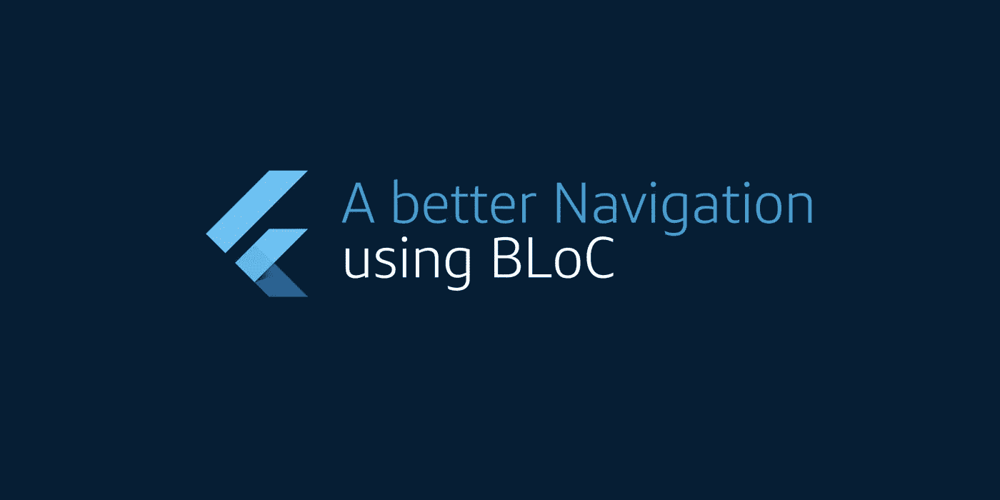

# 颤振:使用 BLoC 的更好导航

> 原文：<https://medium.com/capital-one-tech/flutter-a-better-navigation-using-bloc-733a73edc4da?source=collection_archive---------0----------------------->

## 如何让你的 Flutter 应用导航有状态，这样你的用户就不必为每个导航项打开一个新页面。

你将为你的移动应用构建的最重要的东西可能是导航。一个稳定可靠的导航架构给你的用户一个很好的体验，它让他们导航到…