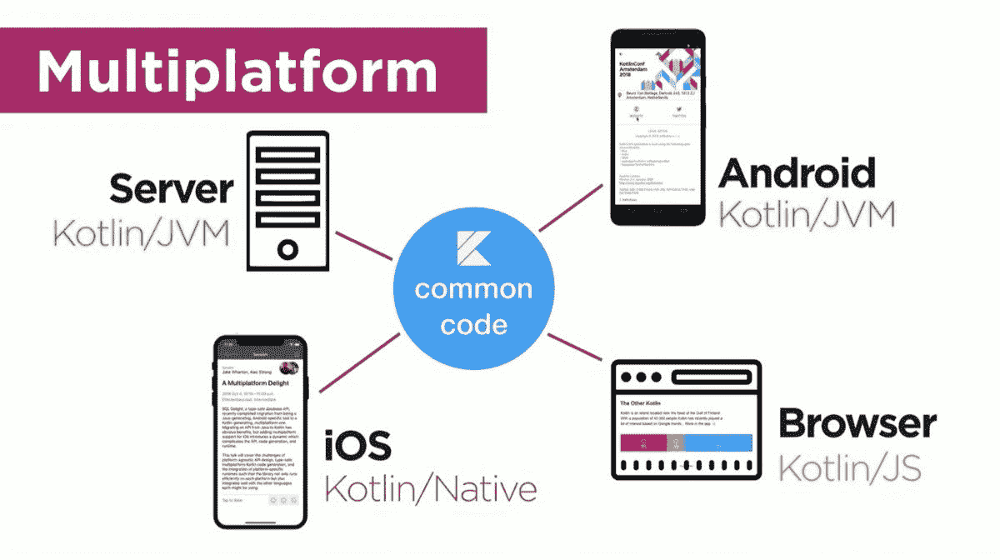
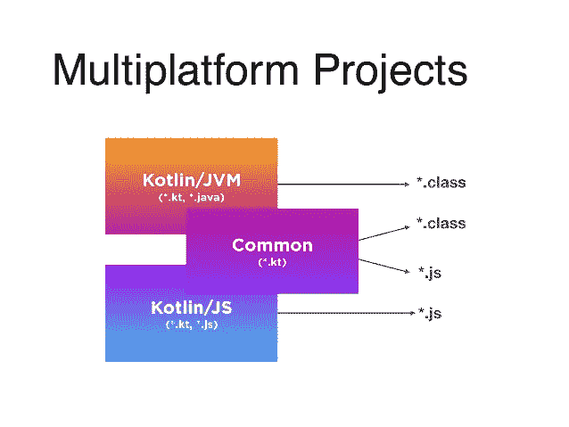

# 颤振和科特林多平台关系

> 原文：<https://blog.kotlin-academy.com/flutter-and-kotlin-multiplatform-relationship-890616005f57?source=collection_archive---------0----------------------->


科特林多平台和颤振经常被认为是竞争对手。恰恰相反。他们的目标没有重叠，他们可能会互相帮助。所需要的只是 Kotlin 和 Dart 的互操作性。只要不是，就是竞争对手。让我们来谈谈这种最有可能塑造 Android 未来的硬性关系。

# 什么是颤振？

[Flutter](https://flutter.dev/) 是一个面向 Android 和 iOS 开发的前端库(或者框架)(也有针对 Web 和桌面的实验性支持)。这个库提供了一个单一的 API 来一次为所有这些平台定义视图。它还提供了一个公共 API，像数据库或网络等常用服务。Flutter 的 API 是为 Dart 设计的——在 Android 上用 NDK 编译成 C/C++代码的语言，在 iOS 上用 LLVM。下面是一个颤振应用示例:

```
import 'package:flutter/material.dart';void main() => runApp(MyApp());class MyApp extends StatelessWidget {
  @override
  Widget build(BuildContext context) {
    return MaterialApp(
      title: 'Welcome to Flutter',
      home: Scaffold(
        appBar: AppBar(
          title: Text('Welcome to Flutter'),
        ),
        body: Center(
          child: Text('Hello World'),
        ),
      ),
    );
  }
}
```

# 科特林多平台

[Kotlin 多平台](https://kotlinlang.org/docs/reference/multiplatform.html)是 Kotlin 的一个特性。Kotlin 可以被编译成 JVM 字节码(比如 Java)、JavaScript 或本地 LLVM 代码。这样，我们可以在像 Spring 这样的 Java 框架中将其用于 Android、iOS、Web、桌面和后端开发。



我们也可以在这些平台之间共享一些部件。这样的部分被称为公共模块，它们被用在特定于平台的模块中。



平台可以用不同的语言编写，比如我们一般用 Swift 这种方式开发 iOS 应用。我们可以在这些平台上提取我们想要的数量，并一次性实施，而不是分别实施。Kotlin Multiplatform 对提取公共逻辑——应用程序如何运行——特别感兴趣。这种逻辑应该独立于框架，并且无论如何对所有平台都是相似或相同的，所以自然应该提取出来——在[这个视频](https://www.youtube.com/watch?v=UyTBXEZ983g)中有更多关于多平台 Kotlin 开发的内容。

# 他们是竞争对手吗？

这两个平台的目标并没有真正重叠。他们都试图提取平台之上的公共部分，但是 **Kotlin 多平台对逻辑提取感兴趣，而 Flutter 对视图定义提取感兴趣**。他们专注于相反的方面，他们可能会从合作中受益匪浅。

[](https://www.kt.academy/workshop/refactoringToPatterns)

# 他们如何互相帮助？

一个很大的 Flutter 问题是很难从 Android 迁移到 Flutter。对于开发良好的应用程序来说，改变语言和前端框架几乎是不可能的，重写一切又太昂贵了。Kotlin 多平台的情况是不同的——大多数 Android 应用程序已经在 Kotlin 中了(或者至少使用 Kotlin，根据上次的 Google IO)。当有像 MVP 或 MVVM 这样的好架构时，迁移到 Kotlin 多平台真的很便宜，因为一切都已经实现了，只需要在 iOS 上移动和重用。

Flutter 的另一个问题是历史——它表明前端库的平均寿命很短，公司不喜欢仅仅因为他们选择了没有经受住时间考验的框架和语言而重新实现应用程序。这些是颤振的最大问题:

*   很难迁移到，
*   很难预测这种解决方案的长期前景。

这里科特林多平台可以来救援！如果 Kotlin 可以与 Dart 互操作，那么典型的 Flutter 迁移如下所示:

1.  引入一个好的架构，比如 Clean、MVP 或 MVVM，如果还没有的话。
2.  将支持的逻辑和服务提取到 Kotlin 公共模块中(如果我们有一个适当的架构，要求这些部分独立于库，这是一个便宜的步骤)。
3.  在 Flutter 中重新实现视图，对于逻辑使用 Kotlin 公共模块。

如果这样做是正确的，我们的应用程序的最重要的部分应该在公共模块中，因此迁移应该不会很痛苦。在某种程度上，它将解决两个颤振问题:

*   迁移到 Flutter 会容易得多，因为我们只需要重新实现视图，而不是逻辑。
*   如果 Flutter 开始被其他前端框架取代，那么移植将会变得相对便宜，因为我们可以假设那里使用的最有可能的语言将会与 Kotlin 互操作。

可与 Kotlin 互操作的语言列表令人印象深刻，而且还在增加:

*   Java，Scala，Groovy，Clojure…
*   JavaScript，类型脚本…
*   Swift、C、C++、…

因此，我们将实现这两个世界的最佳状态:

*   我们将用 Kotlin 编写我们的逻辑，这很好，支持协程，几乎可以在任何地方重用，包括后端。
*   我们将用 Flutter 编写视图，为所有平台编写一次，拥有所有优秀的 Flutter 特性，比如热重载。

# 现在问题出在哪里？

在这种关系中，不和的根源是达特。科特林和达特之间爆发了圣战。还讨论了是否应该用 Kotlin 代替 Dart 来发展颤振。Kotlin 现在是 Android 开发的主要语言，所以重用 Android 代码和从 Android 迁移到 Flutter 会容易得多。它也是更发达和更有特色的语言。这种讨论是严肃的，而且经常是激烈的，特别是因为 Kotlin 允许 DSL 创建，这将为 Flutter 提供更短、更好的视图定义语法。如果 Kotlin 得到支持，Flutter 可能会是这样的(这只是我的想象):

```
import flutter.material.*fun main() = runApp(MyApp())class MyApp: StatelessWidget {
  fun build(context: BuildContext) = materialApp {
      title = "Welcome to Flutter"
      scaffold {
        appBar = AppBar(title = "Welcome to Flutter")
        center {
            text("Hello World")
        }
      }
  }
}
```

如果能够在 Flutter 上使用 Kotlin 而不是 Dart，这将让大多数 Android 社区感到高兴，但对于已经投资学习 Dart 而不是 Kotlin 的 Flutter 开发者来说，这不是一个好消息。还有，谷歌更喜欢 Dart，因为这是他们的语言，他们对它有完全的控制权。难怪 Kotlin 和 Flutter 社区在沟通上有问题。

我相信 Kotlin 和 Dart 之间的圣战是 Kotlin 和 Flutter 开发者之间冲突的最重要来源。我看不出有什么解决办法，除了……eee……kot Lin 和 Dart 之间适当的互操作性？它将允许我们在 Kotlin 中编写任何我们想要的 Flutter 部分，在 Dart 中编写任何我们想要的部分，并且我们将从 Android SDK 项目中获得更好的代码重用。

[](https://leanpub.com/effectivekotlin/c/3YYtCtqCC6a4)

# 怎么会？

老实说，我甚至不确定这样的互操作性是否可能。我的意思是如果它能在一个合理的时间内完成(因为在编程中一切皆有可能):P 虽然我很确定这需要 Flutter 和 Kotlin 团队的合作。这符合这两个团队的利益。Flutter 将从中受益，因为 Kotlin 多平台将使移植到 Flutter 更加容易，而且这种移植将更加安全。开发者喜欢 Kotlin，而缺乏 Kotlin 的支持阻碍了许多人。科特林也将从中受益匪浅，因为 Flutter 可能会越来越大，在这种情况下，科特林将随之增长。这也会让我更开心，因为我喜欢 Flutter，我喜欢 Kotlin，我喜欢同时使用它们。

## 单击👏说“谢谢！”并帮助他人找到这篇文章。

了解卡帕头最新的重大新闻。学院，[订阅时事通讯](https://kotlin-academy.us17.list-manage.com/subscribe?u=5d3a48e1893758cb5be5c2919&id=d2ba84960a)，[观察推特](https://twitter.com/ktdotacademy)并在媒体上关注我们。

如果你需要一个科特林工作室，看看我们如何能帮助你: [kt.academy](https://www.kt.academy/) 。

[](https://kotlin-academy.us17.list-manage.com/subscribe?u=5d3a48e1893758cb5be5c2919&id=d2ba84960a)