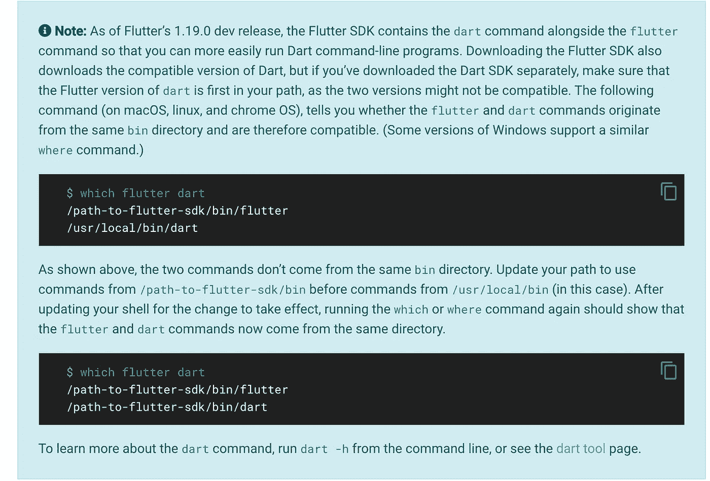
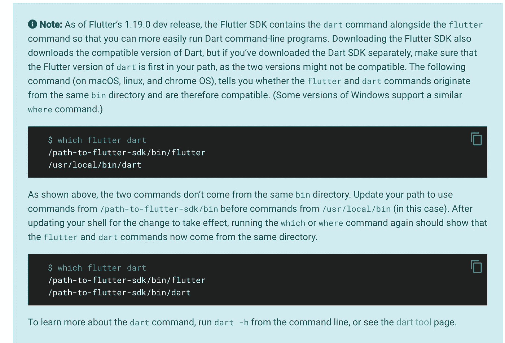

# 颤动:构建你的第一个应用

> 原文：<https://medium.com/quick-code/flutter-building-your-first-app-ee3dce82cd6?source=collection_archive---------0----------------------->


Flutter 是谷歌的 UI 工具包，用于从单个代码库为[移动](https://flutter.dev/docs)(Android&iOS)[web](https://flutter.dev/web)和[桌面](https://flutter.dev/desktop)构建漂亮的、本地编译的跨平台应用。

在本指南中，我将使用 android studio (IDE)进行环境设置。所以对于那些还没有设置他们的开发环境的人，我更喜欢你用 [Android Studio](https://developer.android.com/studio/install) 或者 VsCode(文本编辑器)。

# Windows 操作系统安装指南

# 系统需求

要安装和运行 Flutter，您的开发环境必须满足以下最低要求:

*   **操作系统** : Windows 7 SP1 或更高版本(64 位)
*   **磁盘空间** : 1.32 GB(不包括 IDE/tools 的磁盘空间)。
*   **工具** : Flutter 依赖于您环境中可用的这些工具。
*   [Windows PowerShell 5.0](https://docs.microsoft.com/en-us/powershell/scripting/install/installing-windows-powershell) 或更新版本(这是 Windows 10 预装的)
*   [Git for Windows](https://git-scm.com/download/win) 2.x，带**从 Windows 命令提示符下使用 Git**选项。
*   如果已经安装了 Git for Windows，请确保可以从命令提示符或 PowerShell 运行`git`命令。

# 获取 Flutter SDK

1.  下载下面的安装包以获得最新稳定发布的[颤振 SDK](https://storage.googleapis.com/flutter_infra/releases/stable/windows/flutter_windows_1.17.5-stable.zip) 。
2.  解压 zip 文件，并将包含的`flutter`放在 Flutter SDK 所需的安装位置(例如`C:\src\flutter`)；不要在像`C:\Program Files\`这样需要提升权限的目录中安装 Flutter)。

# 更新您的路径

如果您希望在常规的 Windows 控制台中运行 Flutter 命令，采取以下步骤将 Flutter 添加到`PATH`环境变量中:

*   从开始搜索栏，输入“env”并选择**编辑您帐户的环境变量**。
*   在**用户变量**下，检查是否有名为**路径**的条目:
*   如果条目存在，使用`;`作为现有值的分隔符，将完整路径附加到`flutter\bin`。
*   如果条目不存在，创建一个名为`Path`的新用户变量，并以`flutter\bin`的完整路径作为其值。

要使这些更改生效，您必须关闭并重新打开任何现有的控制台窗口。



# 跑`flutter doctor`

在路径中有 Flutter 目录的控制台窗口中(见上文)，运行以下命令，查看是否存在完成设置所需的任何平台依赖性

[-] Android toolchain —为 Android 设备开发
d 处的 Android SDK:\ Android \ SDK
✗Android SDK 缺少命令行工具；从[https://goo.gl/XxQghQ](https://goo.gl/XxQghQ)
下载。尝试重新安装或更新您的 Android SDK，
访问[https://flutter.dev/setup/#android-setup](https://flutter.dev/setup/#android-setup)获取详细说明。

# Android 设置

**注意:** Flutter 依赖于 Android Studio 的完整安装来提供其 Android 平台依赖性。然而，你可以在许多编辑器中编写你的 Flutter 应用程序；后面的步骤将对此进行讨论。

# 安装 Android Studio

1.  下载安装[安卓工作室](https://developer.android.com/studio)。
2.  启动 Android Studio，并通过“Android Studio 安装向导”。这将安装最新的 Android SDK、Android SDK 命令行工具和 Android SDK 构建工具，Flutter 在为 Android 开发时需要这些工具。

# 设置您的 Android 设备

要准备在 Android 设备上运行和测试您的 Flutter 应用程序，您需要一台运行 Android 4.1 (API level 16)或更高版本的 Android 设备。

1.  在您的设备上启用**开发者选项**和 **USB 调试**。详细说明见[安卓文档](https://developer.android.com/studio/debug/dev-options)。
2.  仅限 Windows:安装[谷歌 USB 驱动](https://developer.android.com/studio/run/win-usb)。
3.  使用 USB 电缆，将手机插入电脑。如果设备上出现提示，请授权您的计算机访问您的设备。
4.  在终端中，运行`flutter devices`命令来验证 Flutter 能够识别您连接的 Android 设备。默认情况下，Flutter 使用您的`adb`工具所基于的 Android SDK 版本。如果你想让 Flutter 使用 Android SDK 的不同安装，你必须设置`ANDROID_SDK_ROOT`环境变量到安装目录。

# 设置 Android 模拟器

要准备在 Android 模拟器上运行和测试您的 Flutter 应用程序，请遵循以下步骤:

1.  在您的机器上启用[虚拟机加速](https://developer.android.com/studio/run/emulator-acceleration)。
2.  启动 **Android Studio >工具> Android > AVD 管理器**并选择**创建虚拟设备**。( **Android** 子菜单仅在 Android 项目中出现。)
3.  选择一个设备定义并选择下一个的**。**
4.  为您想要模拟的 Android 版本选择一个或多个系统映像，然后选择下一步的**。建议使用 *x86* 或 *x86_64* 映像。**
5.  在仿真性能下，选择**硬件— GLES 2.0** 启用[硬件加速](https://developer.android.com/studio/run/emulator-acceleration)。
6.  验证 AVD 配置是否正确，并选择**完成**。
7.  有关上述步骤的详细信息，请参见[管理 AVDs](https://developer.android.com/studio/run/managing-avds) 。
8.  在 Android 虚拟设备管理器中，点击工具栏中的**运行**。模拟器启动并显示所选操作系统版本和设备的默认画布。

# Mac Os 的设置指南

# 系统需求

要安装和运行 Flutter，您的开发环境必须满足以下最低要求:

*   **操作系统** : macOS (64 位)
*   **磁盘空间** : 2.8 GB(不包括 IDE/tools 的磁盘空间)。
*   **工具** : Flutter 依赖于您环境中可用的这些命令行工具。
*   `bash`
*   `curl`
*   `git` 2.x
*   `mkdir`
*   `rm`
*   `unzip`
*   `which`
*   `zip`

# 获取 Flutter SDK

1.  下载下面的安装包以获得 [Flutter SDK](https://storage.googleapis.com/flutter_infra/releases/stable/macos/flutter_macos_1.17.5-stable.zip) 的最新稳定版本:
2.  将文件提取到所需的位置，例如:

CD ~/development
unzip ~/Downloads/flutter _ MAC OS _ 1 . 17 . 5-stable . zip

3.将`flutter`工具添加到您的路径中:

```
export PATH**=**"$PATH:`pwd`/flutter/bin"
```

该命令仅设置当前*终端窗口的`PATH`变量。要永久添加抖动到你的路径，请参见[更新你的路径](https://flutter.dev/docs/get-started/install/macos#update-your-path)。*

# 运行颤振医生

运行以下命令，查看是否需要安装任何依赖项来完成设置(对于详细输出，添加`-v`标志):

```
flutter doctor
```

该命令检查您的环境，并向终端窗口显示一份报告。Dart SDK 捆绑了 Flutter 没有必要单独安装 Dart。仔细检查您可能需要安装的其他软件或要执行的进一步任务的输出(如**粗体**文本所示)。

例如:

[-] Android toolchain —为 Android 设备开发
Android SDK at/users/obi wan/library/Android/SDK
✗Android SDK 缺少命令行工具；从[https://goo.gl/XxQghQ](https://goo.gl/XxQghQ)
下载。尝试重新安装或更新您的 Android SDK，
访问[https://flutter.dev/setup/#android-setup](https://flutter.dev/setup/#android-setup)获取详细说明。

# 更新您的路径

你可以在命令行为当前会话更新你的 PATH 变量，如[获取 Flutter SDK](https://flutter.dev/docs/get-started/install/macos#get-sdk) 所示。您可能希望永久更新这个变量，这样您就可以在任何终端会话中运行`flutter`命令。

为所有终端会话永久修改该变量的步骤是特定于机器的。通常，您会在文件中添加一行，每当您打开新窗口时都会执行该行。例如:

1.  确定放置 Flutter SDK 的目录。您需要在步骤 3 中使用它。
2.  打开(或创建)shell 的`rc`文件。在您的终端中键入`echo $SHELL`会告诉您正在使用哪个 shell。如果你使用 Bash，编辑`$HOME/.bash_profile`或`$HOME/.bashrc`。如果你用的是 Z shell，编辑`$HOME/.zshrc`。如果您使用不同的 shell，文件路径和文件名在您的机器上会有所不同。
3.  添加下面一行，并将`[PATH_TO_FLUTTER_GIT_DIRECTORY]`更改为克隆 Flutter 的 git repo 的路径:

导出路径= " $ PATH:[PATH _ TO _ FLUTTER _ GIT _ DIRECTORY]/FLUTTER/bin "

4.运行`source $HOME/.<rc file>`刷新当前窗口，或者打开一个新的终端窗口自动源文件。

5.通过运行以下命令，验证`flutter/bin`目录现在位于您的路径中:

echo $PATH



# 平台设置

macOS 支持在 iOS、Android 和 web(技术预览版)中开发 Flutter 应用。现在至少完成一个平台设置步骤，以便能够构建和运行您的第一个 Flutter 应用程序。

# iOS 设置

# 安装 Xcode

要为 iOS 开发 Flutter 应用，你需要一台安装了 Xcode 的 Mac。

1.  安装 Xcode 的最新稳定版本(使用[网络下载](https://developer.apple.com/xcode/)或 [Mac App Store](https://itunes.apple.com/us/app/xcode/id497799835) )。
2.  通过从命令行运行以下命令，配置 Xcode 命令行工具以使用新安装的 Xcode 版本:

```
sudo xcode-select --switch /Applications/Xcode.app/Contents/Developer
$ sudo xcodebuild -runFirstLaunch
```

当您想要使用最新版本的 Xcode 时，这是大多数情况下的正确路径。如果需要使用不同的版本，请指定该路径。

3.确保通过打开 Xcode 一次并确认或从命令行运行`sudo xcodebuild -license`来签署 Xcode 许可协议。

比最新稳定版本更老的版本可能仍然有效，但是不推荐用于颤振开发。不支持使用旧版本的 Xcode 来定位位代码，并且可能无法工作。

通过 Xcode，你可以在 iOS 设备或模拟器上运行 Flutter 应用程序。

# 设置 iOS 模拟器

要准备在 iOS 模拟器上运行和测试您的 Flutter 应用程序，请遵循以下步骤:

1.  在 Mac 上，通过 Spotlight 或使用以下命令找到模拟器:

打开一个模拟器

2.通过检查模拟器的**硬件>设备**菜单中的设置，确保您的模拟器使用的是 64 位设备(iPhone 5s 或更高版本)。

3.根据开发机器的屏幕大小，模拟的高屏幕密度 iOS 设备可能会溢出您的屏幕。在模拟器的**窗口>比例**菜单下设置器件比例。

# 创建并运行一个简单的 Flutter 应用

要创建您的第一个 Flutter 应用程序并测试您的设置，请遵循以下步骤:

1.  通过从命令行运行以下命令，创建一个新的 Flutter 应用程序:

flutter create first_app

2.创建第一个`_app`目录，包含 Flutter 的 starter 应用程序。输入此目录:

cd 优先 _ 应用程序

3.要在模拟器中启动应用程序，请确保模拟器正在运行，并输入:

颤动运行