# 用 GitLab 进行颤振连续积分

> 原文：<https://medium.com/version-1/flutter-continuous-integration-using-gitlab-80f3d896704a?source=collection_archive---------0----------------------->

## 第 1 部分——构建管道并运行我们的测试。

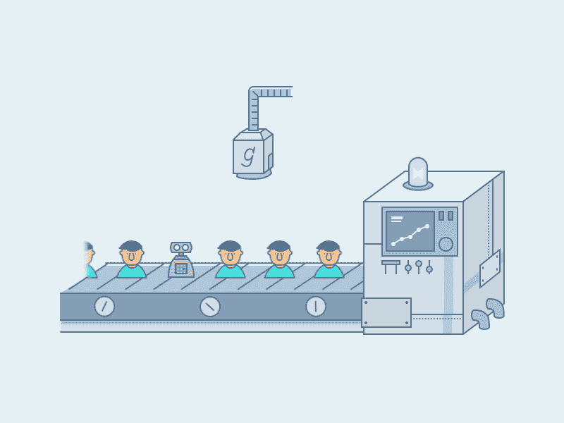

## 介绍

对于大大小小的项目，需要多个贡献者向[交付产品来构建出色的功能并交付突破性的产品](https://www.version1.com/)增加了如何整合单个变更的复杂性。优秀的工具通过持续集成降低了复杂性。DevOps 过程中的一个 cog 允许多个个体一天多次自动将他们代码的变更合并到一个中央存储库中。然后，每个签入都由一个自动构建来验证，允许团队尽早发现问题。

通过定期集成，您可以快速检测错误，并更容易地定位错误。这就是我将向您展示的如何使用 GitLab 构建 Flutter 应用程序。

## 先决条件

*   Flutter 安装在您的本地机器上。
*   GitLab 账户。
*   Git 安装在您的本地机器上。
*   SSH 密钥已创建。

## 项目设置

因此，作为开始，我们将从零开始创建一个全新的应用程序，它带有 Flutter scaffold 命令。但是请注意，您将能够遵循现有项目和应用程序的过程。

在你最喜欢的终端上创建一个新的 Flutter 应用程序，你可以随意命名，但我们的命名如下:

```
flutter create flutterclilab
```

这将为您提供一个使用以下文件夹结构的脚手架项目:

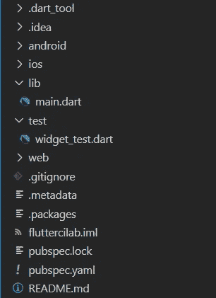

Folder structure for created scaffold application.

所以我想看看测试是什么样的，看看我在做什么。在 Flutter 中有一个名为 test 的文件夹，它告诉 Flutter/Dart SDK 在这个文件夹中查找，以运行它的测试命令“$ flutter test”。让我们看看现有的脚手架附带了哪些测试:

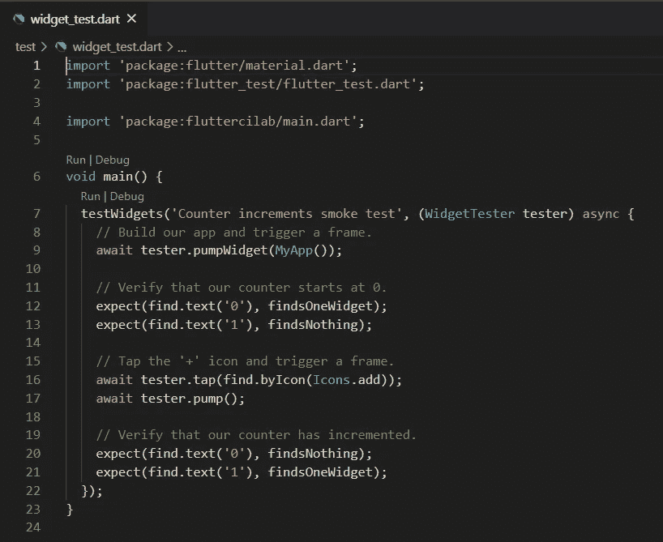

widget_test.darts contents.

好的，让我们启动它，进行一次测试运行，我说的测试运行是指单元测试运行！！

Visual Studio 代码是我选择的 IDE，所以当我想运行我的测试时，我打开 Test=>Run All Tests。让我们看看结果吧:

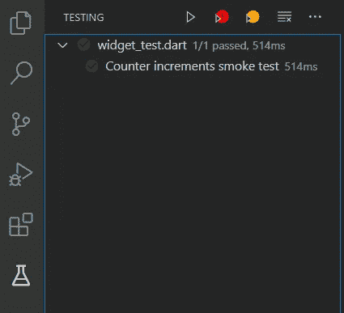

Passed all tests belonging to the project

太好了！单元测试直接通过了。我们现在可以设置我们的源代码控制。

就我个人而言，我喜欢 GitLab。自从我开始开发以来，我一直在使用它，我喜欢它给你提供的运行管道的工具以及界面的布局。所以让我们在 GitLab 中建立一个新的空项目。如果你还没有 GitLab 的帐户，建立一个帐户是非常容易的，而且是免费的…这是我喜欢 GitLab 的另一个原因，因为我所有的收入几乎都花在了我的咖啡爱好☕上🤯

在 GitLab 中，单击 New Project，然后单击 Create blank project/repository。然后会给你一张表格输入你的详细资料。为项目命名并选择可见性级别，然后单击创建:

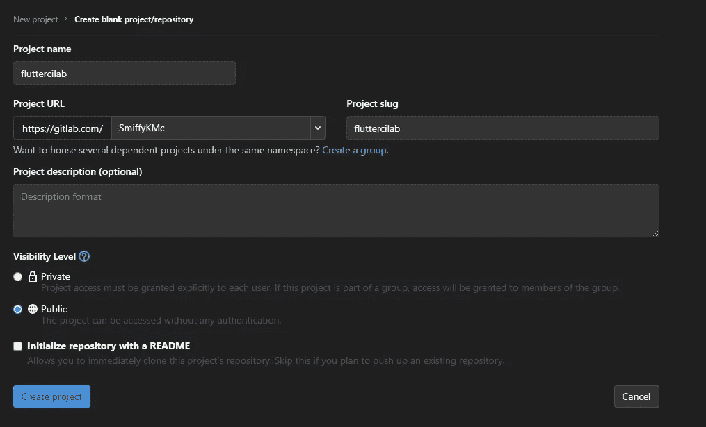

现在库已经建立起来了，我们可以把我们的代码库放到 GitLab 中，让其他人来处理。

在您的终端中，输入 GitLab 提供的命令来推送现有文件夹:

```
cd existing_folder
git init
git remote add origin git@gitlab.com:SmiffyKMc/fluttercilab.git
git add .
git commit -m "Initial commit"
git push -u origin master
```

如果一切顺利，您应该会看到存储在项目概述选项卡中的代码库！

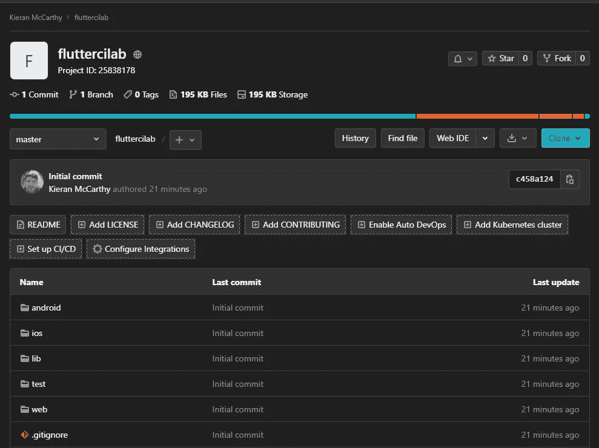

Visual proof of source code in our source control host.

## 建立质量关

现在是时候为其他人如何使用我们惊人的创新计数器应用程序添加一些礼仪和规则了！我们将通过引入质量关来做到这一点。

> 一个**质量关**是一组条件，表明被分析的项目是否“对你来说足够好”以交付到你的软件生命周期的下一个阶段。

因此，让我们创建一些分支，这些分支将受到保护，防止用户在没有进行一些验证的情况下推送他们的更改。在 GitLab 菜单中，点击 Repository=>Branches。在这里，点击新的分支，称之为**“发展”。**

我们现在可以在这两个分支之间切换，但是我们现在希望保护开发分支，避免在没有代码审查的情况下直接推送代码，因为我们希望我们的开发人员使用这个分支将他们的更改集成到。

点击设置= >存储库= >受保护的分支。选择开发分支并设置允许合并到维护人员和不允许推给任何人:

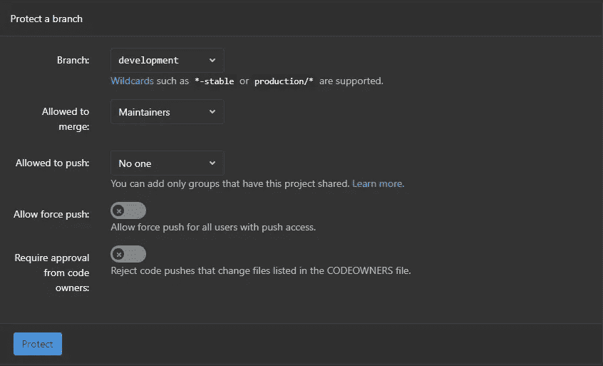

Example of the settings

这种改变保护了分支不被人直接推进，并且只允许存储库的维护者在合并请求发出后合并改变，我们很快就会看到。

我们现在准备通过构建 gitlab-ci.yaml 文件来创建我们的持续集成管道

## 与 YAML 一起建立 CI 渠道

对于要进行的新更改，我们需要创建一个新的分支来处理，然后推送到 GitLab 来创建我们的合并请求。要创建新分支，请输入:

```
git branch cipipeline
git checkout cipipeline
```

在项目的根目录中，创建一个名为 gitlab-ci.yaml 的新文件。在该文件中粘贴以下代码:

```
# This file is a template, and might need editing before it works on your project.
# https://hub.docker.com/r/google/dart
image: mobiledevops/flutter-sdk-image:2.0.1

variables:

# Cache downloaded dependencies and plugins between builds.
# To keep cache across branches add 'key: "$CI_JOB_NAME"'
cache:
  paths:
    - .pub-cache/global_packages

stages:
  - analyze_and_test

before_script:
  - export PATH="$PATH":"$HOME/.flutter-sdk/.pub-cache/bin"
  - flutter pub get
  - flutter pub global activate junitreport

analyze_and_test:
  stage: analyze_and_test
  script:
    - flutter analyze
    - flutter test --machine | tojunit -o report.xml
  artifacts:
    when: always
    reports:
      junit:
        - report.xml
  tags:
    - shared
  only:
    - merge_requests
```

## 提出合并请求

现在，我们可以创建一个合并请求来添加我们的新文件，这将为我们创建 CI 管道来分析我们的代码并确保没有错误，同时运行我们的测试！

运行以下命令添加我们的更改并将这些更改推送到 GitLab:

```
git add .
git commit -m "Added gitlab-ci.yaml file for ci pipeline"
git push --set-upstream origin cipipeline
```

您应该会收到一条从终端返回的消息，如下所示:

```
remote:
remote: To create a merge request for cipipeline, visit:
remote:   [**https://gitlab.com/SmiffyKMc/fluttercilab/-/merge_requests/new?merge_request%5Bsource_branch%5D=cipipeline**](https://gitlab.com/SmiffyKMc/fluttercilab/-/merge_requests/new?merge_request%5Bsource_branch%5D=cipipeline)remote:
```

点击返回的链接。这是创建合并请求的直接链接，请求将您的更改集成到现有的分支或功能中。点击它会显示如下内容:

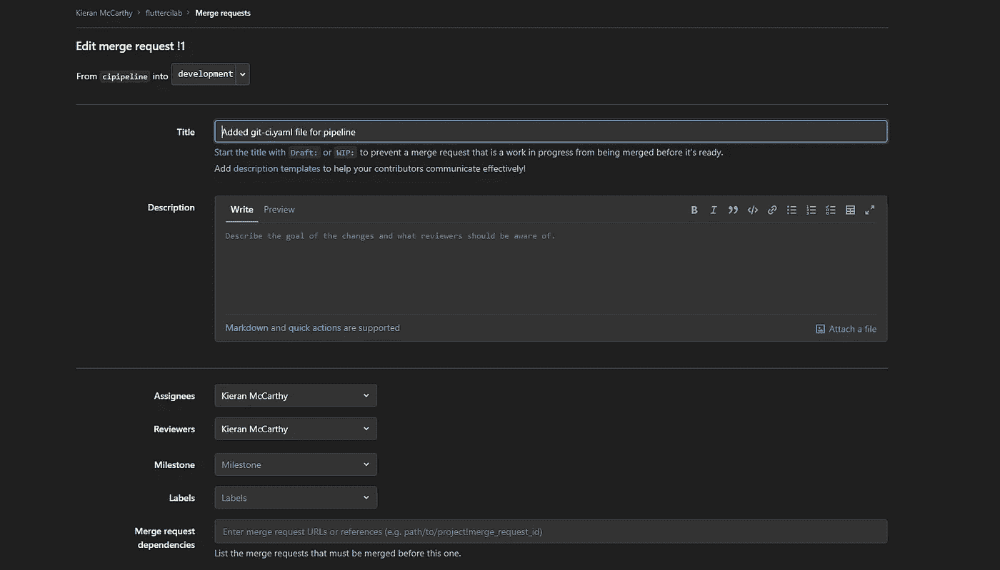

Detail entry for merge request.

填写完详细信息并设置了受理人和审阅人后，您就可以创建合并请求了。审阅者和受分配者(或本教程中的我)😜)将会收到一个通知，告知他们有一个新的合并请求需要审阅。我确实收到了通知，所以让我们检查一下！

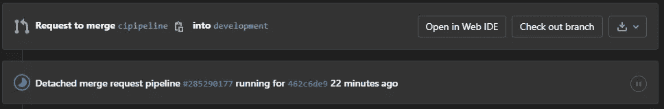

Showing the pipeline running after it was created.

喔呼🥳！我们可以看到一个管道已经创建并正在运行！我想在合并或审查更改之前看看管道是否成功，因为 GitLab 将能够告诉我们是否有任何东西被破坏或是否有任何测试因更改而失败！让我们单击带有散列的管道 ID 来查看构建的输出:

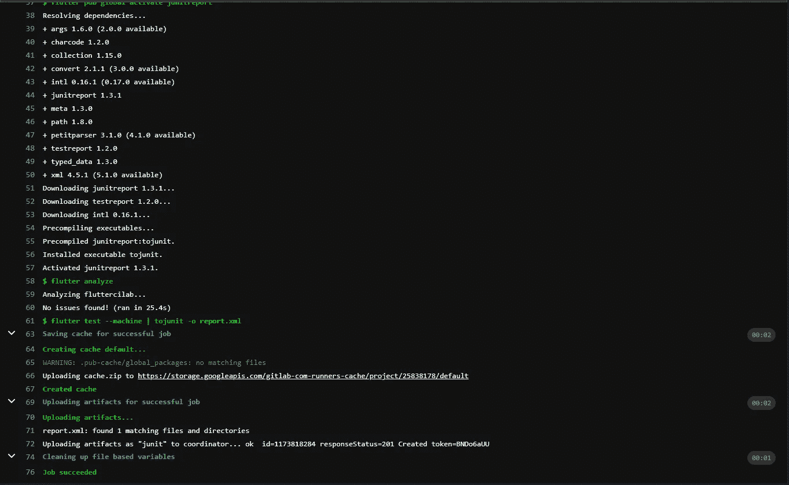

Output from pipeline build

我们可以看到 gitlab-ci.yaml 文件中的命令被输出到日志中，还可以看到作业成功了。但是测试在哪里呢？他们成功了吗？工作没有失败，所以他们一定失败了。在颤振测试命令之后，我们可以看到作业正在上传工件。

如果我们回到我们的合并请求，我们还会看到另一个部分:

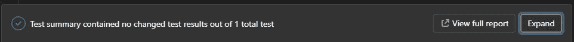

Section for our tests

点击“查看完整报告”，您将能够在一个漂亮的列表中看到所有通过、失败或跳过的测试，以便我们查看:

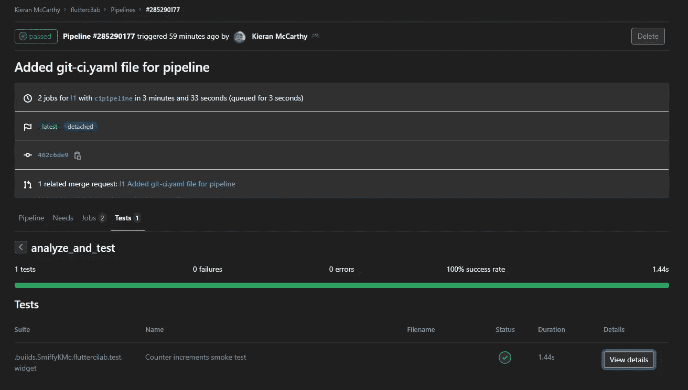

An overview of our tests being run and passed in GitLab

我认为我们现在已经准备好将这些变更合并到我们的开发分支中了。在我们的合并请求中，只需点击合并变更并给开发人员一个👍+1.

# 第一部分结束

我们创建了一个项目，为它建造了一个居所，保护了它的分支，并为它建造了一个管道来分析和运行与之相关的测试。对于一天的工作来说还不错！但是这里重要的是为一个可靠的高质量代码库打下基础，在这个基础上，多个开发人员将能够自动化他们的更改，并且在出错时快速得到结果，允许他们正确地进行更改。

在下一部分中，我们将实现一个代码覆盖集成，以从我们的测试中导出代码覆盖的报告，并添加一个覆盖徽章来炫耀。我们还将把林挺添加到我们的 Flutter 项目中，这样开发者就必须遵循代码所有者和技术领导者基于可变配置制定的标准和规则。这也会影响我们的构建，如果不遵循林挺规则，构建将会中断，你将得到一个👎！

所以跟着👍为了更好地保护您的项目，第 2 部分创建时会通知您这篇文章。