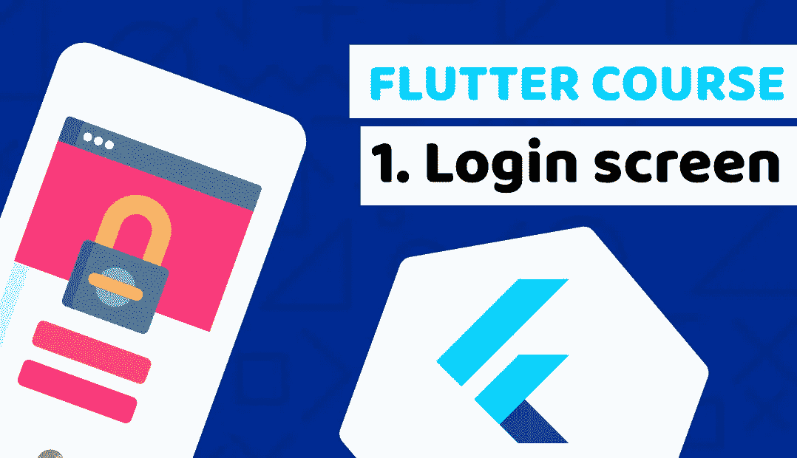

# Flutter 课程，学习构建金融科技移动应用程序—第 1 课:登录表单

> 原文：<https://medium.com/duomly-blockchain-online-courses/flutter-course-learn-to-build-a-fintech-mobile-app-lesson-1-login-form-dd8b43e2d738?source=collection_archive---------0----------------------->

[Duomly — Programming Online Courses](https://www.duomly.com)

本文最初发表于

[https://www . blog . duomly . com/flutter-course-building-a-fin tech-mobile-app-lesson-1-log in-form/](https://www.blog.duomly.com/flutter-course-building-a-fintech-mobile-app-lesson-1-login-form/)

# 颤振课程介绍

Flutter 是一个使用 Dart 编程语言为 Android 和 iOS 构建移动应用程序的框架。颤动…