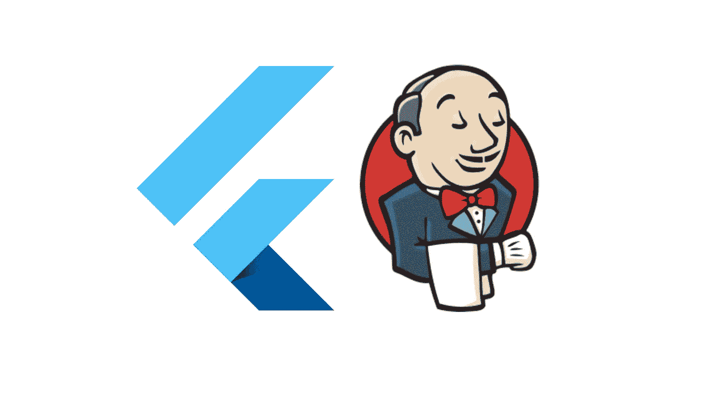
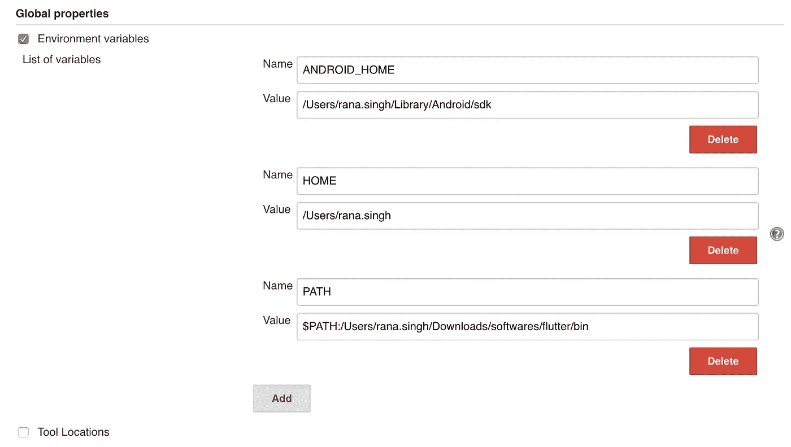
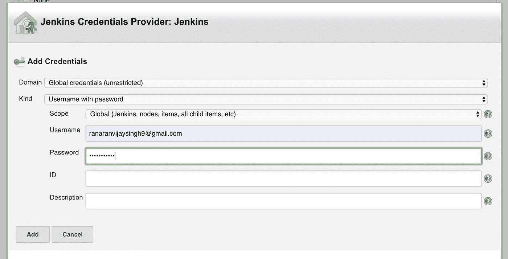
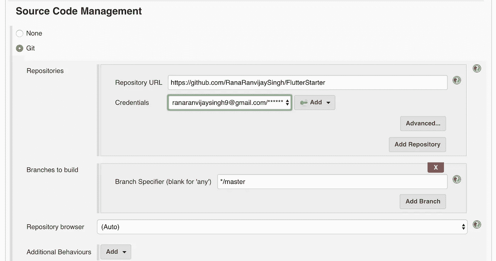
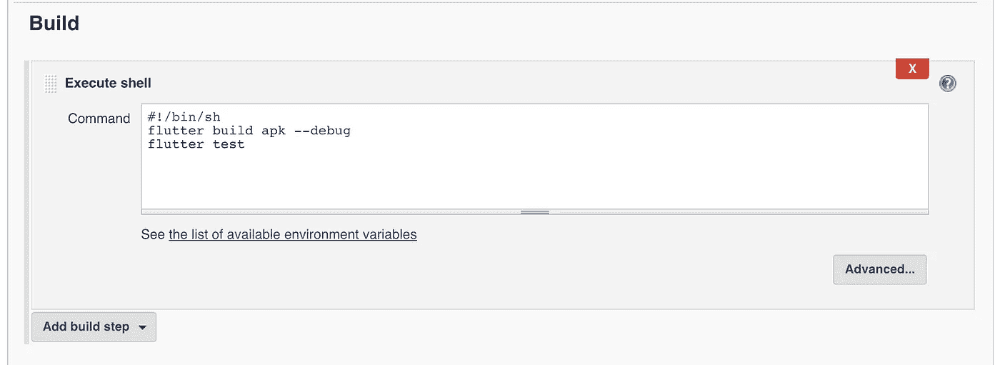
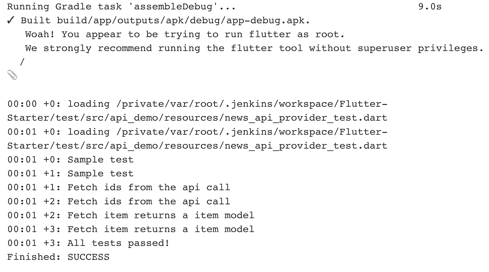

# 颤振—詹金斯:开始

> 原文：<https://medium.com/globant/flutter-jenkins-getting-started-4d2e036567b?source=collection_archive---------1----------------------->

最后，你会有一份詹金斯的工作，为你的颤振项目做好准备。

我假设你已经安装了你的 **Flutter** 并且正在你的系统上工作。

## 为 mac 安装 Jenkins

在你的终端上点击这个，你就设置好了。

> brew 安装 jenkins-lts
> 
> brew 服务启动 jenkins-lts

按照说明获取初始密码，并安装所有默认的东西。

## 先决条件

1.  从 Android Studio 或命令行创建一个新的 flutter 项目。
2.  将您的代码放到 Git 存储库中。

# 步骤 1:配置 Jenkins

1.  找到你家(***/Users/Rana . Singh***)的路径，使用这个命令。

> echo $HOME

3.找到你的 ANDROID _ HOME(***/Users/Rana . Singh/Library/ANDROID/SDK***)路径，使用这个命令。

> echo $ANDROID_HOME

或者

> echo $PATH

并检查 android 路径。

4.请注意您的颤振箱路径。

5.打开 [http://localhost:8080/](http://localhost:8080/) 进入詹金斯主页。

6.转到**詹金斯** > **管理詹金斯** > **配置系统** > **全局** **属性** >检查**环境变量**并添加所有路径。

# 步骤 2:创建工作

1.  转到 Jenkins 主屏幕，点击**创建新工作**。
2.  给你的工作**起名字**，选择**自由式项目。**
3.  在**源代码管理**中，选择 **Git** 选项，并给出你的**库 URL** 。
4.  在**凭证**中点击**添加**按钮>詹金斯**。**
5.  为你的 git repo 输入**用户名**和**密码**，剩下的保持原样。

6.选择您刚才提到的**凭证**。

7.向下滚动到**构建**并编写这个脚本。

> #!/bin/sh
> 颤振建立 apk - debug
> 颤振测试

您可以从不同的命令中进行选择，我想这是不言自明的。

**flutter build apk-debug* **flutter build apk-release* **flutter build IOs-debug* **flutter build IOs-release* 当然，您需要在项目中为 release builds 配置 Keystore 或 certificate。

**颤振测试:*运行测试用例。

8.点击**应用**和**保存。**

9.最后一步是点击**立即构建**选项。如果一切顺利，你应该能够看到成功日志。

我已经在一个视频中演示了这些步骤:[https://www.youtube.com/watch?v=NgoXMw7_RN4&t =](https://www.youtube.com/watch?v=NgoXMw7_RN4&t=)

> 接下来→ [颤振—詹金斯:git 推送触发构建](/@ranaranvijaysingh9/flutter-jenkins-trigger-build-on-git-push-8123684808df)