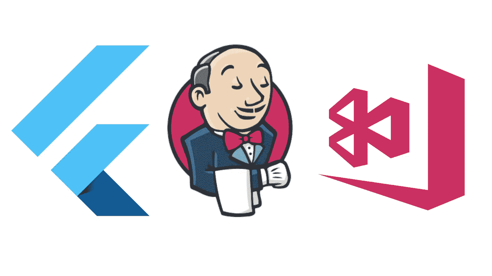
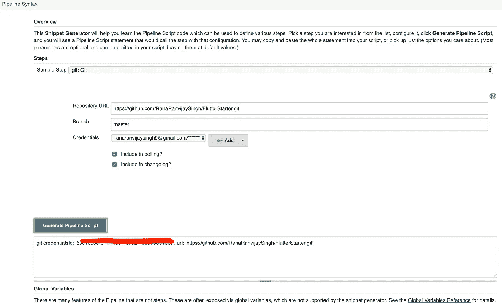
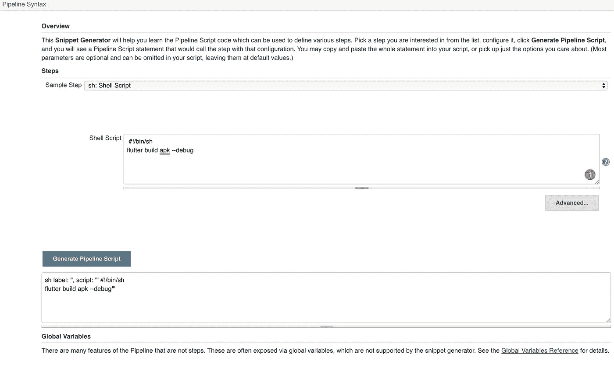
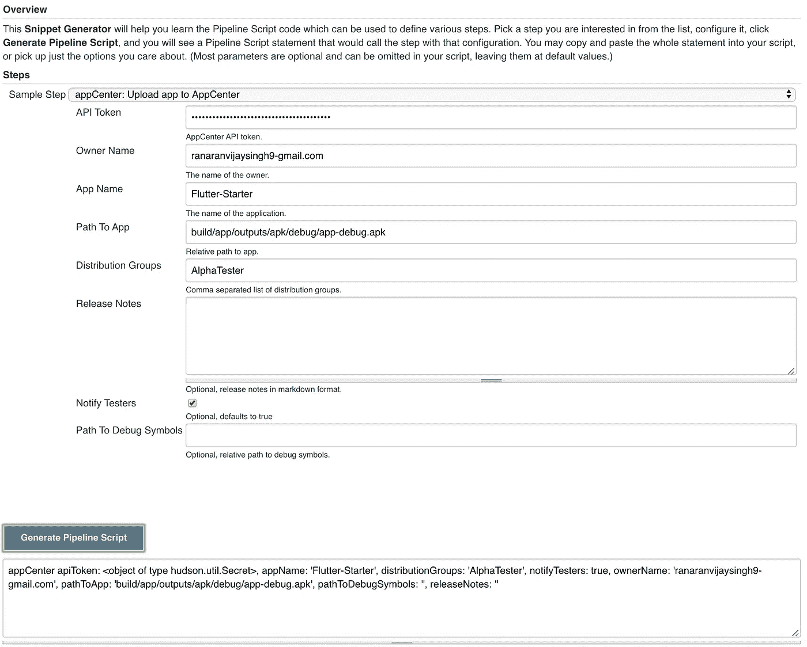

# Flutter — Jenkins:构建、测试和上传到 AppCenter 的管道

> 原文：<https://medium.com/globant/flutter-jenkins-pipeline-to-build-test-and-upload-to-appcenter-e4ef59c7dbdd?source=collection_archive---------0----------------------->

最后，你将有一个为你的颤振项目工作的詹金斯管道。我们将使用管道脚本从 Github 中提取代码，构建它，测试它并将构建上传到 AppCenter。

我假设您已经在您的系统上安装并运行了 Flutter 和 Jenkins。如果没有，您可以从这里参考 Jenkins 的安装步骤

> [颤振—詹金斯:入门](/@ranaranvijaysingh9/flutter-jenkins-getting-started-4d2e036567b)
> 
> [YouTube: Flutter — Jenkins:入门](https://www.youtube.com/watch?v=NgoXMw7_RN4&t=)

# 第一步:应用中心

1.  如果您没有帐户，请转到 [AppCenter 创建帐户](https://appcenter.ms/create-account)来创建您的帐户，或者转到 [AppCenter 登录](https://appcenter.ms/sign-in)。
2.  获取您的 ***API 令牌→*** 登录后
    > **账户设置** > **API 令牌** > **编辑** > **新的 API 令牌** > 给出**描述**例如【詹金斯】
    >
3.  **获取您的**所有者姓名/用户名** →
    > **帐户设置**
    > **个人资料**您的姓名下面的部分是您的所有者姓名，例如“ranaranvijysingh 9-Gmail . com”。**
4.  **创建项目→
    > **首页**
    >点击**添加新的**
    >点击**添加新的 app**
    >填写详细信息
    > **添加新的 app** 。**
5.  **获取您的**分发组名称** →
    >点击您在上面步骤
    > **中创建的**项目**分发**
    > **组**
    > **新建组**
    >给一个**组名称**(这就是您所需要的)【T77**

# **詹金斯**

****管道**:一套插件，支持将持续交付管道实现和集成到 Jenkins 中。**

**代理:指示詹金斯分配一个执行者的语法。**

****阶段**:阶段块定义了通过整个管道执行的任务的子集(例如，“构建”、“测试”和“部署”)。**

****步骤**:单个任务。从根本上说，一个步骤告诉 Jenkins 在特定的时间点做什么。**

**如果你想阅读更多参考[詹金斯管道。](https://jenkins.io/doc/book/pipeline/)**

1.  **安装 AppCenter 插件→
    > Jenkins
    >管理 Jenkins
    > **管理插件**
    >选择**可用**
    >搜索 **AppCenter**
    >点击**安装**
    >重启 Jenkins**
2.  **创建一个管道作业→
    >詹金斯
    >新项目
    >给出任何名称例如:第一个管道
    >从列表
    >中选择**管道**确定**
3.  **创建具有空白阶段的管道→
    >作业配置
    >管道
    >选择**定义**作为**管道脚本** >给出以下脚本**

> **完成了。你可以运行你的管道。**

**在 GIT PULL 阶段，我们在步骤中使用带有**分支**和 **url** 属性的 **git** 工具。**这种方式是针对公开回购的。****

**在 GIT PULL 阶段，我们使用带有**凭证 id、**和 **url 的 **git** 工具。这种方法适用于私人回购。** 凭证 id 由
> **管道作业**>**管道语法** >选择**样本步骤**
>**Git**
>填充细节
> **生成管道脚本****

****

**在阶段测试中，我们使用 **sh** 工具执行颤振测试命令。**

**在阶段构建中，我们使用 **sh** 工具来执行颤振构建命令。**

****

**在 stage DISTRIBUTE 中，我们使用在步骤 1 中安装的 **appCenter** 插件。这里将使用从步骤 1: AppCenter 设置中收集的所有数据。**

****