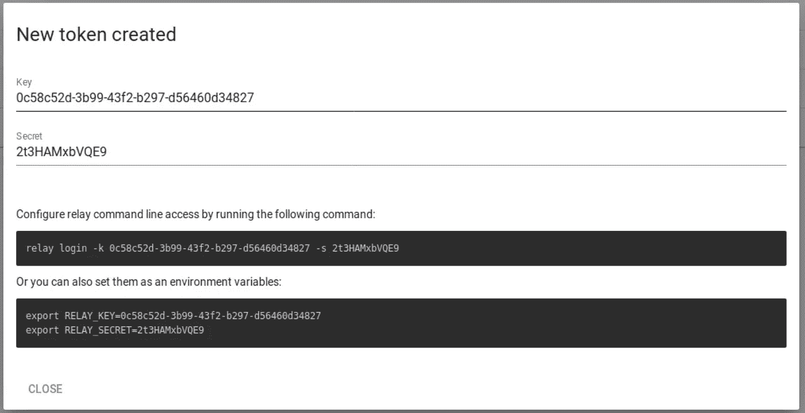
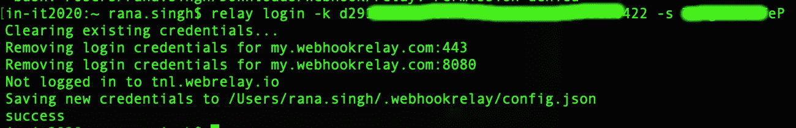
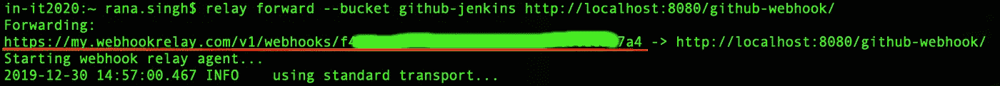
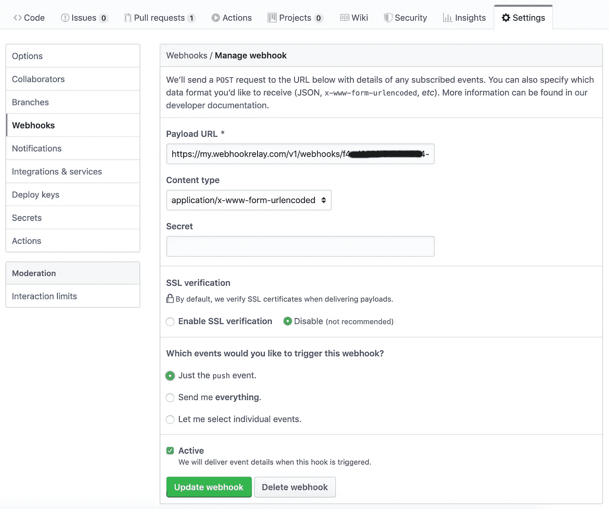
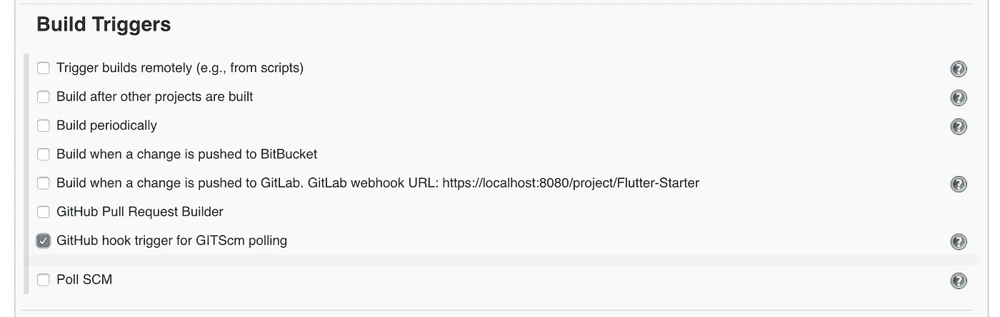

# Flutter — Jenkins:基于 git 推送的触发器构建

> 原文：<https://medium.com/globant/flutter-jenkins-trigger-build-on-git-push-8123684808df?source=collection_archive---------0----------------------->

最后，无论何时对存储库进行 git 推送，您都能够触发 Jenkins job。

我们已经在这里介绍了如何手动配置和触发构建。

> [颤振—詹金斯:入门](/@ranaranvijaysingh9/flutter-jenkins-getting-started-4d2e036567b)
> 
> [YouTube: Flutter — Jenkins:入门](https://www.youtube.com/watch?v=NgoXMw7_RN4&t=)

# 步骤 1:安装 Webhook 中继

这些步骤摘自 [Webhook 中继站点](https://webhookrelay.com/download/index.html)。

*   下载 [Webhook 中继客户端](https://storage.googleapis.com/webhookrelay/downloads/relay-darwin-amd64)
*   创建一个名为' **webhook** '的新目录。

> mkdir ~/Downloads/webhook

*   将下载的文件重命名为' **relay** ，并移动到 **webhook** 目录。

> mv ~/Downloads/relay-达尔文-amd64 ~/Downloads/web hook/relay

*   使文件可执行。

> chmod+x ~/Downloads/web hook/relay

*   将文件添加到环境变量中。

> 导出路径=$PATH:~/Downloads/webhook/

*   重新加载更改。

> 来源~/。bash_profile

*   转到 [Webhook 注册](https://my.webhookrelay.com/register)并创建一个新账户。
*   帐户创建后[生成一个新令牌](https://my.webhookrelay.com/tokens)。

*   使用**令牌密钥**和**令牌密码**从终端登录。

> 中继登录-k 令牌-密钥-这里-s 令牌-秘密-这里

*   启动中继代理。

> 中继转发—bucket github-Jenkins[http://localhost:8080/github-web hook/](http://localhost:8080/github-webhook/)

**/github-webhook/** :这是**非常重要的**，因为这是 Jenkins 在收到请求时搜索的内容。如果不存在，Jenkins 配置将不能识别请求目的。

## 以上所有的麻烦都是为了得到这个网址…

# 步骤 2:配置 GitHub

*   打开你的库，进入项目**设置** > **网页钩子** >点击**添加网页钩子**。
*   在**有效载荷 URL** 中:给出你在第一步中得到的 URL。
*   选择'**刚推事件**'和**更新 webhook** 。

# 步骤 3:配置 Jenkins

*   进入你的 J **ob** > **配置** > **构建触发器**并选择 **GitHub hook 触发器进行 GITScm 轮询**。

> 完成了。去做一个 git 推…

我已经在一个视频中演示了这些步骤:[https://www.youtube.com/watch?v=L2GNBKxln1Q&特征=](https://www.youtube.com/watch?v=L2GNBKxln1Q&feature=youtu.be)