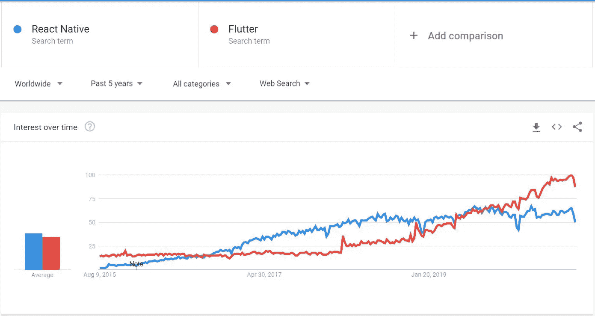
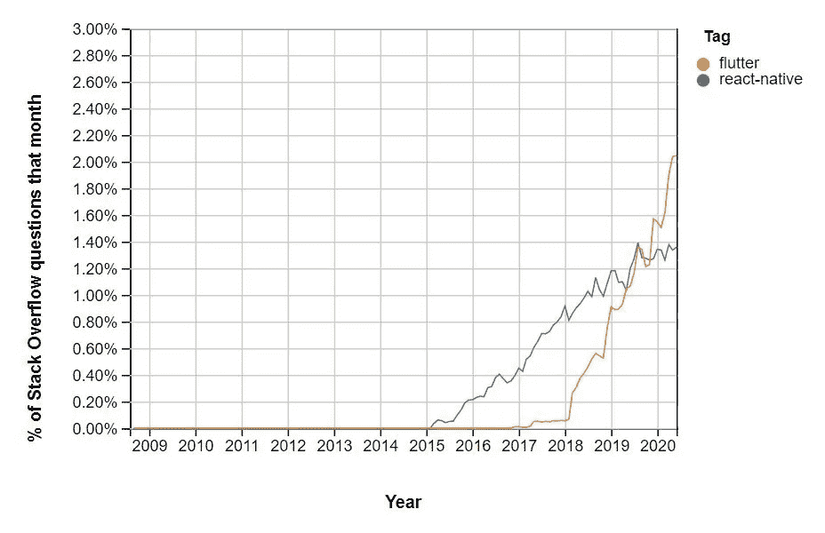
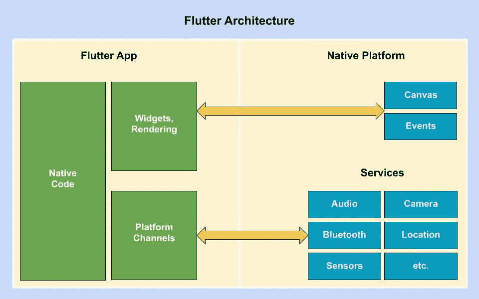
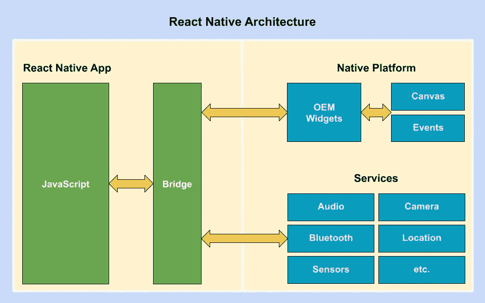

# 颤动还是反应土著:这是个问题？

> 原文：<https://medium.com/globant/flutter-or-react-native-that-is-the-question-ad41e29cc02e?source=collection_archive---------0----------------------->

## 确定最适合您业务需求的产品

Flutter or React Native

您是否计划开发一个移动应用程序，但发现很难选择一个适合您的业务需求和预算的框架？

在本文中，我们将讨论两种领先的跨平台技术，即 Flutter 和 React Native，这将帮助您确定最适合您的应用程序。

当谈到跨平台框架时，Flutter 和 React Native 的流行趋势呈指数级增长。下面可以看到两者的趋势对比。

[Google Trend](https://trends.google.com/trends/explore?date=today%205-y&q=React%20Native,Flutter)

[Stack Overflow Trends](https://insights.stackoverflow.com/trends?tags=react-native%2Cflutter)

# 1.建筑:

Architecture

在选择 app 开发框架时，框架的技术架构起着最重要的作用。它直接影响性能、开发速度、创建解决定制任务的扩展的钩子的可用性，以及产品最重要的东西——质量。

## 颤动:

Flutter Architecture

Flutter 使用 Dart 作为编程语言，拥有底层 Skia C++引擎。它也用于 Android 和 Chrome 浏览器中。Dart 框架几乎内置了所有组件，称为 widgets，Skia 拥有所有协议、组合和通道，因此它不需要桥来与本地系统和模块通信。Flutter 提供了与本地系统和服务(如定位、蓝牙、音频等)进行通信的平台通道。Dart 还打包了 Material 和 Cupertino，它们可以直接在本机画布上渲染，而不需要任何桥，因此该应用程序在不同的操作系统上看起来和行为都是一样的。

## 反应自然:

React Native Architecture

React Native 使用来自脸书的 [Flux](https://facebook.github.io/flux/) 架构。它是用于构建客户端 web 应用程序的应用程序架构。React Native 使用 Javascript 桥在 JS 代码和本机系统和服务之间进行通信。它还在运行时将 Javascript 代码编译成本机代码。React 本机应用程序与本机应用程序更加一致，因为它使用本机操作系统组件。另一方面，由于在应用程序运行时解释 JavaScript 代码的开销，这导致了与 Flutter 相比较差的性能。

# 2.编程语言:

Programming Languages

关于 Flutter 和 React Native 的讨论在我们谈到它们的编程语言之前是不完整的。Flutter 带有 Dart，而 React Native 带有 Javascript。

## 省道:

自 2011 年以来，谷歌一直使用 [Dart](https://dart.dev/) 作为编程语言来构建内部 web、服务器和移动应用程序。这就是为什么它几乎不为外界所知。但在 2017 年，谷歌正式宣布了针对[跨平台](https://en.wikipedia.org/wiki/Cross-platform_software)移动应用开发的 Flutter beta，Dart 突然开始获得更多[的关注](http://sotagtrends.com/?tags=%5Bdart,flutter%5D)。

与 Javascript 相比，Dart 对市场来说相对较新。Dart 对于来自 [OOP 背景的开发人员来说很容易学习，因为它有类似 Java 的语法。Google 已经为 Dart 提供了非常详细的](https://en.wikipedia.org/wiki/Object-oriented_programming)[文档](https://www.dartlang.org/guides/get-started)，因此任何开发者都可以轻松工作。除此之外，还有许多针对 Dart 的在线课程、教程和文章。

Dart 的社区支持相对较少，所以开发人员有时会发现很难找到解决方案。但是现在大多数开发者已经转向 Flutter，因为它提供了比其他交叉编译平台更好的特性和性能。

Dart 同时使用 [AOT](https://en.wikipedia.org/wiki/Ahead-of-time_compilation) 和 [JIT](https://en.wikipedia.org/wiki/Just-in-time_compilation) 进行编译，这使得它在开发、调试和部署方面速度超快。在许多基准测试中，与 Javascript 相比，Dart 是绝对的赢家。

Dart 既可以支持松散的原型，也可以支持强大的原型。这使得它与 Javascript 相比更加类型安全，因为它可以在编译时找到大多数代码错误。

## JavaScript:

JavaScript 最初是由网景公司于 1995 年 9 月开发的。它是一种轻量级的、[解释的](https://en.wikipedia.org/wiki/Interpreted_language)，或者即时编译的编程语言。由于它的灵活性，现在它被广泛用于 web、服务器和移动应用程序的开发。

Javascript 已经在市场上存在了很长时间，因此更加成熟和稳定。拥有基础编程语言的开发者可以轻松学习 Javascript。在市场上，有大量的框架、库和实用程序可供使用，it 开发人员可以提高他们的开发速度。

市场上活跃着许多不同的 Javascript 框架，如 [React](https://reactjs.org/) 、 [React Native](https://reactnative.dev/) 、 [NodeJS](https://nodejs.org/en/) 、 [Angular](https://angular.io/) 、 [Vue](https://vuejs.org/) 等。这就是为什么它有巨大的社区支持，这使得它在开发人员中很受欢迎。

Javascript 可能看起来更轻更快，因为它是一种解释型语言，而且它比许多编译型语言更快，如 [c#](https://en.wikipedia.org/wiki/C_Sharp_(programming_language)) 、 [Java](https://www.java.com/en/) 等。但就移动基准而言，Dart 遥遥领先于 Javascript。

Javascript 可以同时支持[动态](https://en.wikipedia.org/wiki/Type_system#DYNAMIC)和[鸭子打字](https://en.wikipedia.org/wiki/Duck_typing)。Javascript 中没有严格遵循类型检查，因此代码错误只能在运行时发现。这就是 Javascript 不是类型安全的原因。

# 3.性能:

> 曾经有一个传说说:“一个快的 app 很棒，但是一个流畅的 app 更棒。”

Performance

一个应用在目标设备上的性能是每个人都在寻找的最重要的参数。在性能方面，与其他交叉编译技术相比，Flutter 和 React Native 遥遥领先。

## 颤动:

Flutter 使用低级 Skia C++引擎进行编译，这类似于机器语言，并提供了更好的本机性能。此外，Dart 本身是一种性能语言，这也提升了 Flutter 的整体性能。与此同时，Flutter 并不总是需要一个桥来与本地组件和系统通信，这有助于它以每秒 60 帧的速度运行应用程序。就性能而言，Flutter 优于 React Native。

## 反应自然:

与其他语言相比，React Native 使用速度更快、性能更好的 Javascript，但它需要 Javascript bridge 来连接本地组件和系统，这导致与 Flutter 相比性能较差。

# 4.预设风格的用户界面组件:

Pre-styled UI Components

在跨平台技术中构建用户界面比在原生技术中更困难，因为它需要在不降低性能的情况下符合设计准则。每个平台都有开发人员需要遵循的标准，为 Android 设备构建的应用程序在苹果设备上的视觉和功能不会总是一样的。拥有良好的样式组件支持使开发人员的生活变得简单，因为它负责大部分的工作，所以开发人员只需要根据需求定制样式或主题。

市场上有许多内置的和第三方样式的组件库。

## 颤动:

Flutter SDK 提供了基本的[窗口小部件库](https://api.flutter.dev/flutter/widgets/widgets-library.html)以及两个风格小部件库，即[材质](https://flutter.dev/docs/development/ui/widgets/material)和[库比蒂诺](https://flutter.dev/docs/development/ui/widgets/cupertino)。这两个库都基于不同的设计准则。Material 实现了[材质设计](https://material.io/design)，可用于 Android、iOS、web、桌面。因此，当我们使用 Material design 创建一个 Flutter 应用程序时，它在包括 iOS 设备在内的任何平台上都将具有相同的外观和感觉。另一方面，Cupertino 实现了基于苹果[人机界面指南](https://developer.apple.com/design/human-interface-guidelines/)的 iOS 设计，所以如果你想制作一个看起来像 iOS 标准的应用程序，那么就用 Cupertino 吧。虽然 Cupertino 在技术上可以在 iOS 和 Android 上运行，但由于一些许可问题，Cupertino 没有正确的 Android 字体。

除了这些内置库，Flutter 还有一些不错的第三方库，比如 [FL 图](https://pub.dev/packages/fl_chart)、[液体滑动](https://pub.dev/packages/liquid_swipe)、 [BottomNavyBar](https://pub.dev/packages/bottom_navy_bar) 、之前[、](https://pub.dev/packages/before_after) [Giffy 对话框](https://pub.dev/packages/giffy_dialog)等。这些库易于使用和定制。

## 反应自然:

React Native 有自己的 [UI 组件库](https://reactnative.dev/docs/components-and-apis)，但是在行为以及观感方面非常有限。因此，React Native 主要依靠第三方库来创建视觉上吸引人的用户界面。这些组件是在原生 Android 和 iOS 组件之上编写的，这就是为什么你不会注意到任何性能方面的下降。由于大部分组件都是在原生组件之上编写的，所以可能有些 RN 组件只支持 Android 而不支持 iOS，反之亦然。

对于 React Native，市面上有很多第三方库可以使用，比如 [NativeBase 组件](https://nativebase.io/)、 [React Native Elements](https://react-native-elements.github.io/react-native-elements/docs/overview.html) 、 [React Native Paper](https://callstack.github.io/react-native-paper/) 、 [Shoutem UI 组件](https://shoutem.github.io/docs/extensions/tutorials/getting-started)等。

这些库可以根据需要的主题进行定制，并且有很好的社区支持。

# 5.本机设备功能:

Native device features

易于使用的本机设备特性和硬件 API 的可用性使得交叉编译技术在开发人员社区中很受欢迎。每天，工程师都会向移动设备引入新的功能和系统，如 NFC、生物识别、人脸识别、无接触交互等，因此保持 API 最新对技术供应商来说是一个巨大的挑战。交叉编译技术和本机系统之间的通信方式也会影响性能。

## 颤动:

大多数原生功能，如地理定位、音频、传感器等。要么已经在 Flutter 中可用，要么正处于开发和评审阶段。Flutter 使用 [Flutter Engine](https://github.com/flutter/engine) 作为托管的可移植运行时，它包括 Flutter 的核心库、文件和网络 I/O、辅助功能支持、动画、图形和插件架构，为本地通信提供了强大的基础。Flutter 不需要任何桥来与原生组件通信，因此在性能方面非常好。此外，市场上有许多第三方插件，或者您可以用 Java 或 Swift 编写自己的本机代码来与本机 API 通信。

## 反应自然:

React Native 提供了一些现成的本机 API，但是对于大多数本机特性，它强烈依赖于第三方支持。因为对相机、NFC、蓝牙、地理定位等原生功能的良好内部和外部支持。，开发者可以与原生系统进行通信。由于它为 iOS 和 Android 提供了 React 本机桥，通过使用它，开发人员可以在 Javascript 代码和本机系统之间创建一个通信桥。

# 6.社区支持:

Community Support

无论文档有多好，开发人员总是会遇到他们需要支持的问题，这就是社区发挥非常重要作用的地方。现在每种技术都有自己的社区论坛和小组，开发者可以在那里分享他们的知识。拥有一个强大的社区总是有助于开发人员相互学习。

## 颤动:

自 2017 年谷歌宣布 Flutter beta 以来，它在开发者社区中日益受到[的欢迎。相比之下，Flutter 有一个规模虽小但不断增长的](http://sotagtrends.com/?tags=flutter)[社区](https://flutter.dev/community)，官方支持多个渠道，开发者可以在那里分享他们的知识。Flutter 提供了非常详细的[文档](https://flutter.dev/docs)，这使得开发者的生活变得简单。尽管如此，有时这些资源不足以解决开发人员的常见问题。

## 反应自然:

[React Native](https://reactnative.dev/) 作为跨平台移动技术成为开发者的首选。它在 [GitHub](https://github.com/react-native-community) 上为开发者提供了大量的社区支持。React Native 使用 Javascript 作为编码语言，并且有大量的支持。[脸书](https://en.wikipedia.org/wiki/Facebook)在世界各地举办了许多聚会和会议，这有助于开发者了解最新动态。

# 总结:

Flutter 和 React Native 都是强大的跨平台框架，它们的即用型组件和第三方库有助于应用程序实现类似原生的性能。它们都有很好的交叉编译支持，不仅加快了开发速度，还降低了项目成本。

谢谢您们。