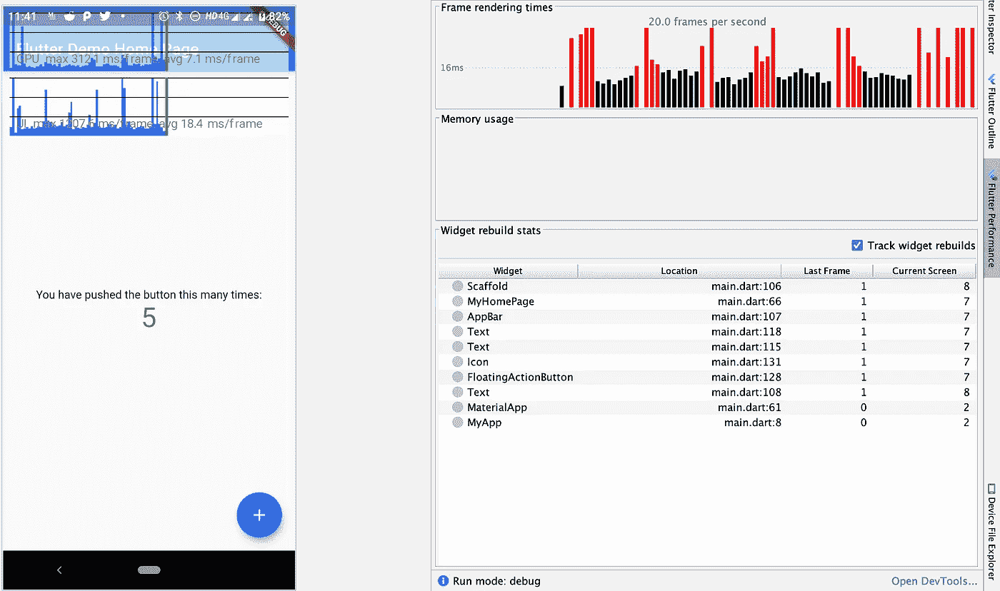
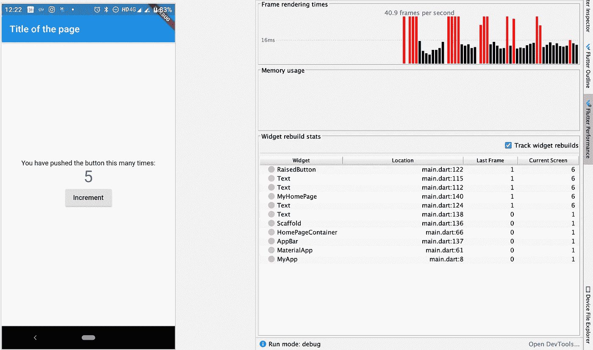
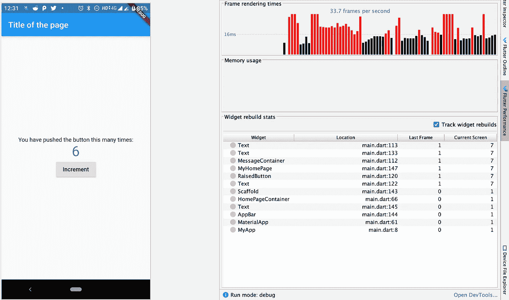
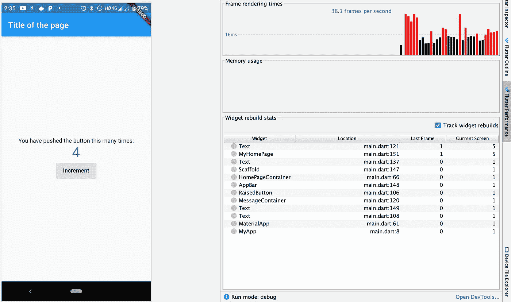

# 颤振性能检查第一部分

> 原文：<https://medium.com/globant/flutter-performance-checks-part-1-6a041fabf1aa?source=collection_archive---------0----------------------->

Flutter，市场上提供的一个可靠的跨平台。我们中的许多人正在开发应用程序，但不知道他们为什么要求我们做一些事情，我们将清除这些主题。

不要把所有东西都放在构建函数中。flutter devs 建议不要把所有东西都放在一个小部件构建方法中。但是为什么呢？
我们来看看。

使用“Flutter create app_name”创建一个 Flutter 应用程序，你会得到类似反例的东西。



如果我们检查 Android Studio 中的颤振性能选项卡(稍后将进入天文台——天文台是用于分析的 Dart 工具)。现在，每次我们点击增加计数器，它就会更新，我的主页，支架，应用程序栏，浮动操作按钮和一个文本小部件也是如此。这可能不是我们正在更新的，所以为什么它每次都在构建？

问题在于 setState 方法

```
**void** _incrementCounter(){
    setState(() {
      **_counter**++;
    });
}
```

当我们调用 setState 时，我们通知有状态小部件数据已经被更改，它需要重建树。因此，我们在一个构建方法中包含了所有的小部件，如下所示:

```
@override
Widget build(BuildContext context) {
  **return** Scaffold(
    appBar: AppBar(
      title: Text(**widget**.**title**),
    ),
    body: Center(
      child: Column(mainAxisAlignment: MainAxisAlignment.**center**,
        children: <Widget>[
          Text(
            **'You have pushed the button this many times:'**,
          ),
          Text(
            **'**$**_counter'**,
            style: Theme
                .*of*(context)
                .**textTheme** .**display1**,
          ),
        ],
      ),
    ),
    floatingActionButton: FloatingActionButton(
      onPressed: _incrementCounter,
      tooltip: **'Increment'**,
      child: Icon(Icons.*add*),
    ), );
}
```

它构建了所有的小部件。

解决方案可能是分离变化的元素并构建一个新的单独的类。

让我们稍微修改一下代码，看看这种方法会有什么问题。

```
**class** HomePageContainer **extends** StatelessWidget{
  @override
  Widget build(BuildContext context) {
    **return** Scaffold(
      appBar: AppBar(
        title: Text(**"Title of the page"**),
      ),
      body: MyHomePage(title: **'Flutter Demo Home Page'**), );
  }
}**class** _MyHomePageState **extends** State<MyHomePage> {
  int **_counter** = 0;**void** _incrementCounter() **async**{
    setState(() {
      **_counter**++;
    });
  }@override
  Widget build(BuildContext context) {
    **return** Center(
        child: Column(mainAxisAlignment: MainAxisAlignment.**center**,
          children: <Widget>[
            Text(
              **'You have pushed the button this many times:'**,
            ),
            Text(
              **'**$**_counter'**,
              style: Theme
                  .*of*(context)
                  .**textTheme** .**display1**,
            ),
            RaisedButton(
              onPressed: _incrementCounter,
              child: Text(**"Increment"**),
            )
          ],
        ),
      );
  }
}
```

我们已经创建了一个容器类，它将有一个 appbar 和 scaffold 以及一个子小部件，这是我们的 changing 小部件。目前来看，还不错。



脚手架和应用程序栏不再构建一次以上，所以这是一个好迹象，但为什么三个文本和一个凸起的按钮连续构建 6 次呢？让我们进入另一个层面，你可能会遇到这样的情况:

```
**class** _MyHomePageState **extends** State<MyHomePage> {
  ...@override
  Widget build(BuildContext context) {
    **return** Center(
        child: Column(
          *...*
          children: <Widget>[
            MessageContainer(),
            Text(
              **'**$**_counter'**,
              ...
            ),
            RaisedButton(
              ...
            )
          ],
        ),
      );
  }
}**class** MessageContainer **extends** StatelessWidget{
  @override
  Widget build(BuildContext context) {
    **return** Text(
      **'You have pushed the button this many times:'**,
    );
  }
}
```

在另一种情况下，您会看到这样的情况，一个有状态的小部件包含另一个有状态或无状态的小部件。

在执行这段代码之前，让我们想一想，如果我们单击凸起的按钮，MessageContainer 需要重新构建吗？我的意思是，没有任何变化，我们不想改变，因为我们把它分离到了另一个类中，对吗？

嗯，答案是否定的，每次都要重建。我们单击凸起的按钮，因为在构建方法中我们调用的 MessageContainer()根本不是一个常数。



所以现在我们最好的选择是让它成为我们不想更新的每个小部件的常量。

```
**class** _MyHomePageState **extends** State<MyHomePage> {
  ...Widget **_raisedButton**;**get raisedButton** {
    **if**(**_raisedButton** == **null**)
    **_raisedButton** =  RaisedButton(
      onPressed: _incrementCounter,
      child: **const** Text(**"Increment"**),
    );
    **return _raisedButton**;
  }@override
  Widget build(BuildContext context) {
    **return** Center(
      child: Column(
        mainAxisAlignment: MainAxisAlignment.**center**,
        children: <Widget>[
          **const** MessageContainer(),
          Text(
            **'**$**_counter'**,
            style: Theme.*of*(context).**textTheme**.**display1**,
          ),
          **raisedButton**,
        ],
      ),
    );
  }
}**class** MessageContainer **extends** StatelessWidget {
  **const** MessageContainer();@override
  Widget build(BuildContext context) {
    **return** Text(
      **'You have pushed the button this many times:'**,
    );
  }
}
```

注意:对于方法为:

```
**return const** RaisedButton(
  onPressed: _incrementCounter,
  child: **const** Text(**"Increment"**),
);
```

as _incrementCounter 不是一个静态方法，也不是一个常量，所以我们不能将 RaisedButton 声明为常量，但我们可以做的是当它为空时将它赋给一个变量，当它不为空时返回。

发布链接阅读常量函数文字的更多细节:【https://github.com/dart-lang/sdk/issues/4596 



优化这个级别可能并不坏，因为在大型应用程序中，如果我们不经常这样做，就会出现糟糕的性能问题。因此，在每次屏幕设计后，检查部件重建的次数以及是否需要重建。

我希望你喜欢它。我会带着其他类似的性能问题回来解释更多的工具，比如 Observatory。

还有其他问题，比如即使用户看不到小部件或屏幕，也会调用 build 方法。从这里开始读:

1.  [构建方法被多次调用](https://github.com/flutter/flutter/issues/14124)
2.  [扑:我的未来建筑继续燃烧！](/saugo360/flutter-my-futurebuilder-keeps-firing-6e774830bc2)

许多文章都有同样的问题，所以我希望你能远离这种令人讨厌的问题。

从下面的链接查看我们的第 2 部分:

[](/@parthdave93/flutter-performance-check-part-2-e81a645f6715) [## 颤振性能检查—第二部分

### 关于如何在颤振第 2 部分检查性能，解释一些基本的功能和检查，我们可以使用…

medium.com](/@parthdave93/flutter-performance-check-part-2-e81a645f6715) 

你知道你可以按拍手吗👏按钮 50 次？你走得越高，我就越有动力为你们写更多的东西！

你好，我是帕斯·戴夫。noob 开发者和 noob 摄影师。你可以在 [Linkedin](https://in.linkedin.com/in/parth-dave-907b8177) 上找到我，或者在 [GitHub](https://github.com/parthdave93) 上跟踪我，或者在 [Twitter](https://twitter.com/the_parth_dave) 上关注我？

祝你有一个愉快的飞行日！