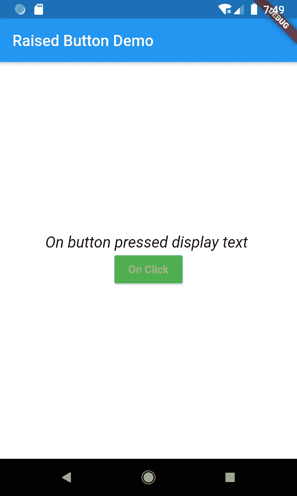

# 颤动:凸起的按钮部件

> 原文：<https://medium.com/globant/flutter-raisedbutton-widget-e3611121ae0d?source=collection_archive---------1----------------------->


*   凸起的按钮位于 UI 组件下。
*   是 Material UI 的一部分。
*   RaisedButton 有一个单一的构造函数，允许我们用许多不同的属性实例化小部件。
*   RaisedButton 元素需要在 MaterialApp 下使用。
*   一些最常用的属性，例如:

1.  **颜色** -为按钮提供颜色。
2.  **仰角** -用于按钮默认状态下的仰角。这是一个浮点值。
3.  **onPressed** -这是一个回调函数，用于在按钮被按下时接收事件。
4.  **splashColor** -为按下的按钮提供飞溅的颜色。

**让我们在小演示中使用这些属性来理解**

```
class RaisedButtonDemo extends StatefulWidget {
  @override
  _RaisedButtonState createState() => _RaisedButtonState();

}
```

*   创建 RaisedButtonDemo Dart 类扩展 Ststeful 小部件。

```
class _RaisedButtonState extends State {
  String text1 = 'First Display Text';

  @override
  Widget build(BuildContext context) {
    return Scaffold(
      backgroundColor: Colors.*white*,
      appBar: AppBar(
        title: Text('Raised Button Demo'),
      ),
      body: Container(
        child: Center(
          child: Column(
            mainAxisAlignment: MainAxisAlignment.center,
            children: [
              Text(
                text1,
                style: TextStyle(fontSize: 30),

              RaisedButton(
                child: Text("On Click"),
                onPressed: _textchange,
                color: Colors.*green*,
                textColor: Colors.*yellow*,
                splashColor: Colors.*white*,
              )
            ],
          ),
        ),
      ),
    );
  }
```

*   将首先显示字符串 text1。
*   正如你看到的 onPressed 回调用来接收事件，所以它调用 function _textchange。

```
_textchange() {
  setState(() {
    if (text1.startsWith('F')) {
      text1 = 'On button pressed display text ';
    } else {
      text1 = 'First Display Text';
    }
  });
}
```

*   当我们来到屏幕时，它显示文本"**首先显示文本**，但是在按钮点击后"**按下按钮显示文本**"文本将会显示。

随附的演示截图:


First image



on button click

谢谢…阅读愉快:)