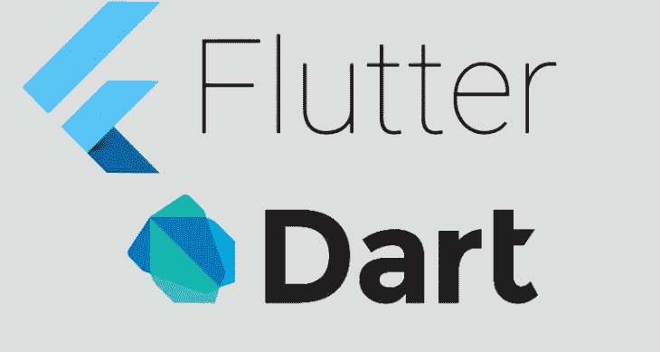

# 颤动:文本小部件

> 原文：<https://medium.com/globant/flutter-text-widgets-2ad8ed10267a?source=collection_archive---------0----------------------->



*   Flutter 文本小部件允许你在你的 Flutter 应用程序中显示文本。
*   在 Flutter 应用程序中，我们可以使用文本小部件来显示应用程序的标题文本和应用程序主体中的消息。
*   让我们看看文本小部件的例子:

```
class TextWidget extends StatelessWidget{
  @override
  Widget build(BuildContext context) {return Scaffold(
      appBar: AppBar(
        title: Text('Flutter Text Demo'),
      ),
      body: Center(
        child: Text('Hi , Welcome to Flutter Text Demo'),
    ),
    );

  }
}
```

*   所以在扩展 StatelessWidget 的 TextWidget 类中，我使用了包含文本 Widget **title 的 appbar 的 title:Text(“Flutter Text Demo”)。**
*   为了显示消息，我在正文中使用了 **child: Text('嗨，欢迎使用 Flutter Text Demo')** 。


Output

*   上面的输出在中间显示文本。
*   也可以在文本小工具中使用**textAlign:textAlign . center**。
*   您也可以使用**overflow:text overflow . ellipsis****text-overflow**属性指定如何将未显示的**溢出的**内容通知给用户。它可以被剪辑，显示一个**省略号** (…)，或者显示一个自定义字符串。
*   并且可以用**style:Text style(font weight:font weight . bold)为文本提供样式。**这将使我们的文本以粗体显示。

这是对文本小部件的一个小描述。

在我的下一篇博客中，我将解释 **RaisedButton** 和 **FlatButton** 小部件。

快乐阅读:)