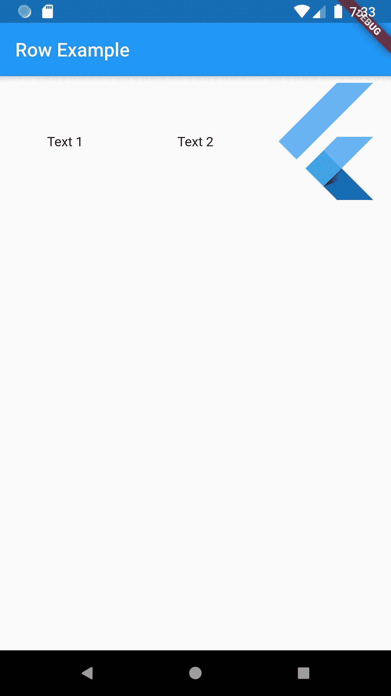
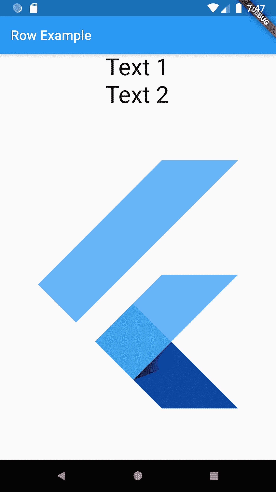
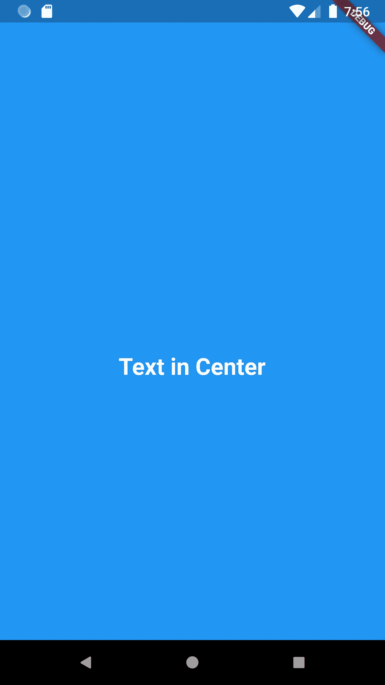
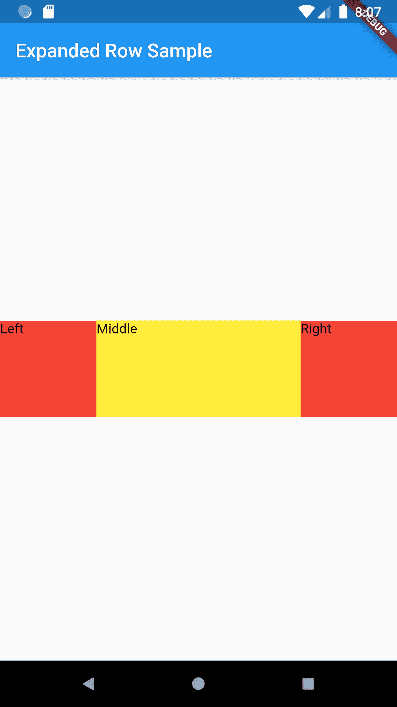

# 颤动:用户界面基本布局

> 原文：<https://medium.com/globant/flutter-ui-basic-layout-6511c6392fe9?source=collection_archive---------0----------------------->

我们将涵盖一些基本的布局，我们需要在我们的代码在日常生活中的例子**行，列，中心和扩展。**

*   那么我们就从**排**班开始吧:
*   如果你想水平分割你的屏幕，即几个元素在彼此的右边或左边，使用**行。**
*   以水平数组(或水平对齐)显示其子级的小部件。
*   这是一个简短的行小部件的例子，其中我使用子作为文本来显示输出内容，你可以看到 2 个文本和 1 个标志水平对齐。

```
return Scaffold(
    appBar: AppBar(
      title: Text("Row Example"),),
    body://used Row Widget
    Row(
      children: <Widget>[
        Expanded(
          child: Text(
              'Text 1', textAlign: TextAlign.center),
        ),//Text 1 for Row class
        Expanded(
          child: Text('Text 2', textAlign: TextAlign.center),
        ), //Text 2 for Row class
        Expanded(
          child: FittedBox(
            fit: BoxFit.contain,
            child: const FlutterLogo(),
          ),
        ),
      ],
    )

);
```



*   如果你只有一个孩子，那么考虑使用[对齐](https://api.flutter.dev/flutter/widgets/Align-class.html)或[居中](https://api.flutter.dev/flutter/widgets/Center-class.html)来定位孩子。
*   要使子元素扩展以填充可用的水平空间，请将子元素包装在一个[扩展的](https://api.flutter.dev/flutter/widgets/Expanded-class.html)小部件中。
*   行的宽度由 mainAxisSize 属性确定。如果 mainAxisSize 属性是 MainAxisSize.max，那么[行](https://api.flutter.dev/flutter/widgets/Row-class.html)的宽度就是传入约束的最大宽度。如果 mainAxisSize 属性是 MainAxisSize.min，那么[行](https://api.flutter.dev/flutter/widgets/Row-class.html)的宽度是子行宽度的总和(受传入约束的约束)。

— — — — — — — — — — — — — — — — — — — — — — — — — — — — — —

*   **列类:**
*   如果你想垂直分割你的屏幕，即几个元素上下重叠，使用**列。**
*   如果你只有一个孩子，那么考虑使用对齐或居中来定位孩子。
*   这是一个简短的列小部件的例子，其中我使用子作为文本来显示输出内容，你可以看到 2 个文本和 1 个标志垂直排列。

```
Column(
  children: <Widget>[
    Text('Text 1',style: TextStyle(fontSize: 35) ),
    Text('Text 2',style: TextStyle(fontSize: 35) ),
    Expanded(
      child: FittedBox(
        fit: BoxFit.contain, // otherwise the logo will be tiny
        child: const FlutterLogo(),
      ),
    ),
  ],
)
```



*   注意:Column 小部件不会滚动。如果你有一系列的窗口小部件，并且希望它们能够在空间不足的情况下滚动，可以考虑使用 ListView。

— — — — — — — — — — — — — — — — — — — — — — — — — — — — — —

*   **中心班:**
*   一个在其内部居中放置其子部件的小部件。
*   为了将任何部件居中对齐，我们使用了中心类。正如你在下面的例子中看到的，文本小部件是用来显示文本的。要在中心显示文本，我们必须使用中心小部件。

```
return Center(
  child: Container(
    margin: EdgeInsets.only(top: 100),
    child: Column(
      children: <Widget>[
        Text(
          "Text in Center",
          style: TextStyle(
            color: Colors.*white*,
            fontWeight: FontWeight.*bold*,
            fontSize: 25,
          ),
          // textAlign: TextAlign.center,
        ),
      ],
    ),
  ),
);
```



— — — — — — — — — — — — — — — — — — — — — — — — — — — — — —

*   **扩展类:**
*   扩展行、列的子元素的小部件，以便子元素填充可用空间。
*   正如您在行和列示例代码中看到的，我使用了扩展的小部件。使用扩展的小部件可以使行、列的子级扩展，以填充主轴上的可用空间(例如，水平方向的行或垂直方向的列)。

```
Widget build(BuildContext context) {
  return Scaffold(
    appBar: AppBar(
      title: Text('Expanded Row '),
    ),
    body: Center(
      child: Row(
        children: <Widget>[
          Container(
            color: Colors.*red*,
            height: 100,
            width: 100,
              child: Text("Left")
          ),
          Expanded(
            child: Container(
              color: Colors.*yellow*,
                height: 100,
                child: Text("Middle")
            ),
          ),
          Container(
            color: Colors.*red*,
            height: 100,
            width: 100,
              child: Text("Right")
          ),
        ],
      ),
    ),
  );
}
```



*   扩展的行样本输出。
*   我们将在下一篇博客中介绍更多的部件。

快乐阅读:)