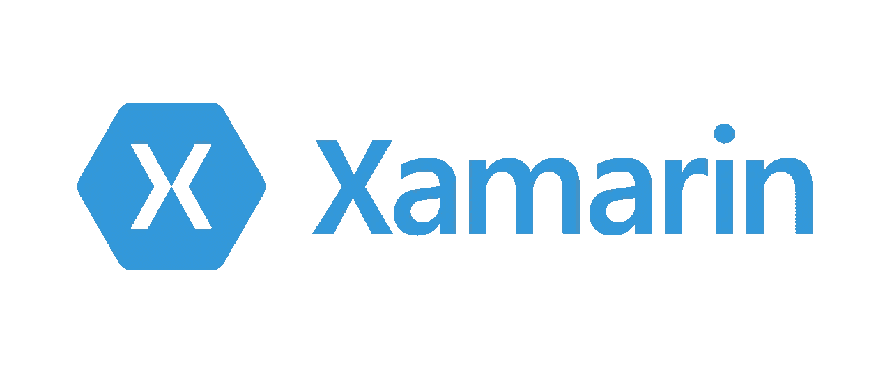
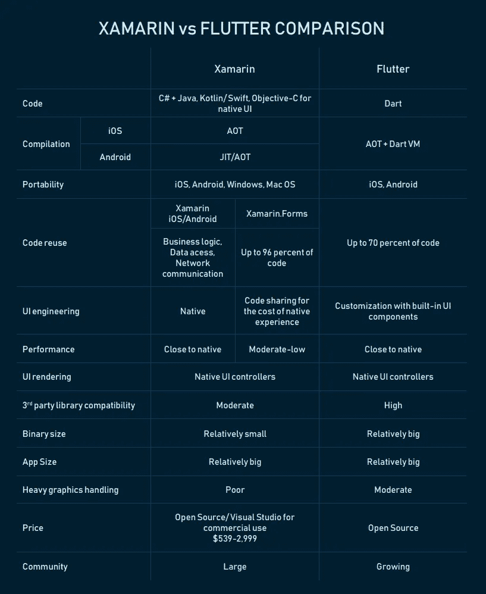

# 颤振 vs Xamarin:另一个大卫和歌利亚的故事

> 原文：<https://medium.com/version-1/flutter-vs-xamarin-another-david-and-goliath-story-b2a1b5a63aa3?source=collection_archive---------1----------------------->

[**David vs Goliath**](https://www.behance.net/gallery/49133033/David-vs-Goliath)by[Thivan Ly](https://www.behance.net/thivanly)

# 技术之战

多年来，许多开发人员和布道者都在比较能够经受时间考验的技术。聚集大量志同道合的人来权衡一种技术与另一种技术，类似于正义与邪恶，大卫与歌利亚之战，或者你应该喝加奶还是不加奶的茶。

唉！！这篇文章也不会有什么不同！

在戏剧性的开场白结束后，我想给出一个比较，我个人的反馈和我在为自己和客户构建移动应用程序时的观点。为了说明我在版本 1 中的专业经验，我主要与公共部门、农业行业和制药业的全球公司的客户打交道。在我们团队内部，我也为一家制药公司的客户管理过 2 个 MVP 产品。

我想谈谈这两个框架中的要点，作为一个移动开发者和一个真正喜欢创造东西的人，我觉得这些要点很重要。这些要点就像古代格斗评论员可以在我们的时代之战中比较扑动和沙玛林的回合。

战斗回合:

*   程序设计语言
*   发展速度
*   开发工具和文档
*   表演
*   汇编
*   用户界面
*   应用程序大小

让我们见见我们的大卫和歌利亚！

# 认识你的竞争者

## 强大的 Xamarin

Xamarin 最初是由工程师在 2011 年创建的，他们创建了 Xamarin 的跨平台实现。Android 和 Xamarin.iOS. Xamarin 是第一个跨平台的移动应用开发框架，公司可以在其中制作看起来几乎是原生的 Android 和 iOS 应用。2016 年晚些时候，微软收购了 Xamarin，它成为了微软 Visual Studios 的一部分。

## 奇妙的颤动

Flutter 是谷歌创建的免费开源移动 UI 框架，于 2017 年 5 月发布。简而言之，它允许你创建一个只有一个代码库的本地移动应用程序。这意味着您可以使用一种编程语言和一个代码库来创建两个不同的应用程序(适用于 iOS 和 Android)。

那我们还等什么！让战斗开始吧！

# 第一轮:编程语言

## Xamarin

Xamarin 一直在用 **C#(。NET)** 自时间之初(或自 Xamarin 出现以来)。C#非常受欢迎，在许多平台上使用，并且有大量的追随者被微软社区使用。我自己也使用 C#，发现从 Java 到 C#的转换相当简单，这对学习新语言很有帮助。

## 摆动

Flutter 使用一种叫做 Dart 的语言。Dart 的语法类似于 JavaScript 或 Java，开发人员发现它很容易上手，因为它支持大多数面向对象的概念。即使颤振是师里的新战士，学习的坡度也很浅。据说学习飞镖需要大约两周的时间。我给自己的任务是学习和建立一个与 Flutter 和 can confirm Dart 的应用程序非常容易学习，是一个很大的乐趣。你可以在这里自己查看 Dart】。

# 第二轮:开发速度

## Xamarin

Xamarin 已经在游戏中有一段时间了，有很好的开发 API。如果你不是来自面向对象的背景，学习 C#将需要很长的学习曲线。与编辑器相比，ide 很笨重，构建和编译需要时间。Xamarin 在 iOS 上使用 AOT 编译，在 Android 上使用 JIT/AOT，所以改变 UI 需要时间，让我等待改变布局或在应用程序中显示不同的消息。

Xamarin 的优势之一是，它允许开发人员通过微软 Xamarin Cloud 跨设备测试应用程序。但是，您必须支付订阅费才能使用该功能。

## 摆动

Flutter 中的热重新加载功能可以帮助开发人员构建用户界面，试验和添加不同的功能，以及快速检测和修复错误，而不会丢失物理电话或模拟器上的状态。开发人员还可以访问第三方 SDK 和库等原生特性，并可以重用现有的原生代码(Swift、Objective C、Java 和 Kotlin)。这确实有助于与 UI/UX 团队合作，因为被要求改变一个小部件的宽度或高度不需要花费几分钟来测试，而是几毫秒。这种开发速度确实有利于首先向市场快速发布应用程序或概念验证。

我以前写过一篇帖子，关于给自己一个设定的时间和一些限制来构建一个 Android 应用程序，你可以在这里阅读。

# 第 3 轮:工具和文档

## Xamarin

Xamarin 是幕后开发的，所以你不会马上获得一些原生功能，如 3D-touch、Force touch 等。Xamarin 完全依赖于 Visual Studio IDE，如果开发人员来自非微软堆栈，那么使用 VS 代码或类似 IDE 的概念是相当困难的。商业项目需要购买微软 Visual Studio IDE 的许可证，但它是免费的，有[限制](https://www.quora.com/Is-there-a-way-I-can-use-Xamarin-for-free)。

## 摆动

Flutter 内置了一套很棒的工具。方法来分析你的代码，运行测试，它甚至有一个医生来检查你的设置感觉如何。Flutter SDK 真的是来了一拳。它还允许您在任何支持 Dart 的编辑器上进行开发。

至于 ide 和编辑器，我个人使用 Visual Studio 代码。您可以添加 Dart 和 Flutter 扩展，这将真正赋予编辑器生命。它非常轻量级，允许您使用代码片段来加快开发速度。最重要的是，Flutter 不需要任何专有软件来运行。

真正让我眼前一亮的是 Flutter 的文档。在我看来，它是首屈一指的。非常详细的例子，你可以在浏览器中运行。Flutter 团队甚至制作了一个 [Widget of the Week](https://www.youtube.com/playlist?list=PLjxrf2q8roU23XGwz3Km7sQZFTdB996iG) 视频系列，在其中他们讨论了某些 Widget！

# 第 4 轮:绩效

## Xamarin

Xamarins 的性能可与 [**原生移动应用**](https://www.xicom.biz/offerings/mobile-app-development/?utm_source=SM14) 相媲美，这使其成为开发具有原生外观和感觉的高性能应用的首选。

## 摆动

人们普遍认为 Flutter 的性能优于 Xamarin。但是，这不是任何误解，事实上这是因为 Dart 代码是用[本机代码](https://flutter.dev/docs/resources/faq#run-android)编译的，因此不需要 Javascript 桥。

# 第 5 轮:汇编

## Xamarin

Xamarin profiler 拥有众多工具来分析性能，并阐明 iOS 和 Android 应用程序上呈现的数据的含义。

该框架使用本机组件进行 UI 设计，并直接在智能手机硬件上运行本机代码，从而实现接近本机应用的性能。

## 摆动

Flutter 将源代码[编译成 ARM 字节码](https://flutter.dev/docs/resources/faq#run-android)。这里的结果是非常高性能的应用程序。Flutter 在发布应用时依赖 Dart 的 AOT 编译，在开发 all 时依赖 Dart 的 JIT 编译。Dart 实际上是极少数能够同时被编译成 AOT 和 JIT 的语言之一，对于 Flutter 来说这是非常好的。

# 第 6 轮:用户界面

## Xamarin

作为最老的跨平台 SDK，Xamarin 拥有可靠的文档。Xamarin 支持多种平台，如 iOS、Android、forms、macOS、watchOS、tvOS 等，这些平台又有许多 UI 组件和模块可供开发人员构建。Xamarin 也有开发单个组件的文档，如布局、按钮、弹出窗口、数据库等。

## 摆动

Flutter 框架与 UI 渲染组件、设备 API 访问、导航、测试、状态管理和库加载捆绑在一起。这个丰富的组件集消除了使用第三方库的需要。如果你得到了 Flutter 框架，这意味着你将拥有开发移动应用所需的一切。Flutter 还拥有 for Material Design 和 Cupertino，允许开发人员在 iOS 和 Android 平台上轻松渲染 UI。

# 第 7 轮:应用程序大小

## Xamarin

Xamarin 支持许多平台，但是二进制文件的大小相对较小。然而，当 Xamarin 应用程序捆绑发布时，应用程序的大小会变得更大。在发布到应用商店之前，没有进行任何代码和性能优化。

## 摆动

与原生 iOS 和 Android 应用程序相比，Flutter 应用程序的二进制文件通常更大，应用程序的大小也更大。正如在 [Flutters FAQ](https://flutter.dev/docs/resources/faq#how-big-is-the-flutter-engine) 上提到的，Flutter 核心引擎占用 2.7 MB +还有框架和应用程序代码，这使得应用程序二进制文件的大小有点重。

# 战斗回顾

现在战斗结束了，我们来看看比赛回顾！

# 谁赢了？

通常人们会说“我们都是赢家”，甚至“这些都是工作的工具，请合理使用它们”。这是真的…但那很无聊。我想告诉你，作为一名移动开发者，我认为最重要的是什么。

扑！

在我看来毫无疑问。多亏了 Flutter，我对构建移动应用的热爱再次增长。致力于为 Google Play 商店开发我的应用程序，并实际上为自己设定了一个挑战，我开始真正享受移动开发过程了。我能够以如此快的速度将纸质文件转换成可在手机上使用的文件，这令人惊讶。使用大量现有的小部件创建 ui 是多么容易，令人惊叹。

想到我以前在其他框架中经历的痛苦，我能够如此轻松地创建动画让我发笑。我已经忘记了和 Flutter 一起工作的时间。

如果你正计划开始移动开发，或者甚至想开始开发供其他人使用的东西，我建议你去看看 Flutter ✌

如果你有兴趣听到更多关于 Flutter 和 life 的教训以及成为一个开发者的错误，给我一个关注和一些掌声，让我知道我在文章写作的正确方向上！