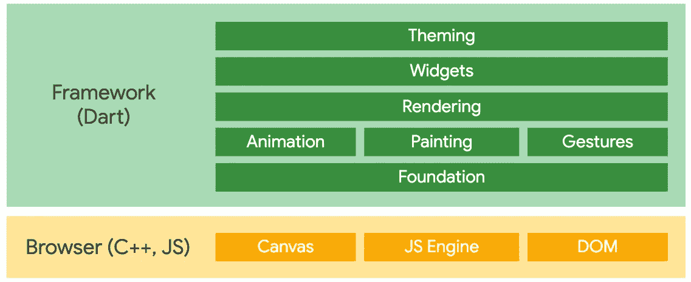

# 颤振腹板问题的研究

> 原文：<https://medium.com/globant/flutter-web-problem-deliberation-2f7cb05565f9?source=collection_archive---------0----------------------->

我喜欢作为移动应用程序开发者的 flutter，因为 android 很好，但 Flutter 帮助我在任何时候都可以创建漂亮的应用程序。它帮助我轻松获得多平台支持，如 iOS、桌面和 Web。大约 2-3 个月前，在观看了许多动画和社区的支持后，我开始使用 Flutter Web。我也喜欢 Flutter web，尽管 Flutter Web 仍处于早期阶段，这篇文章不是关于唱衰这项技术，而是关于我所面临的问题和我所使用的解决方案。如果你也面临这样的问题，请在评论中发表。

对我来说，flutter web 更像是移动领域的一种反应。是的，在发布时，dart UI 代码或多或少地被转换成 javascript，但它不是纯 HTML CSS，所以 UI 的每个部分都被 javascript DOM 操纵所操纵。



[Flutter Web Architecture](https://flutter.dev/web)

从设计问题这个主要问题开始。与 bootstrap 不同，flutter 没有预列和行特性，但您需要使用 **MediaQuery** 来划分列，这在您扩展应用程序时并不方便。没有并排渲染的视图很难改变 UI，你可能会说 flutter 有热重载，但相信我，flutter web 不支持热重载，你可能会发现自己会多次停止并启动 flutter web 应用程序。此外，在开发时，web 浏览器的后退和前进按钮不能正常工作，因此我们不能正确地调试内容。现在进入正题

几个问题:
1。偏好部件与使用网络 cookies。—得到解决方案
2。Dart 对 JS 和 JS 对 Dart 怎么沟通？—得到了解决方案
3。由于与渲染层相关的问题，堆栈小部件无法正常工作。—还是要想办法解决。
4。web 的颤振 SVG 替代品。—得到解决方案
5。将 GridView 的表格替换为多屏幕大小支持。
6。网络文件选择器
7。Web URL #暂时不会被删除。
8。在 macOS 或移动端运行 Flutter web app。
9。等待非未来函数返回—得到解决方案。

# 1.偏好控件与使用网络 cookie**？**

偏好库在这里也可以在网络上工作，但是它不在 cookies 中存储数据，因为它表明它有点像存储少量数据的本地存储。但是对于认证令牌和其他一些东西，我们将需要网络 cookies。这就是 JS 出现的原因。我们也许能找到 cookies 库，但我们最好不要，原因是过程。我们将无法理解如何与 Dart to JS 和 JS to Dart 进行通信。

下面是使用 JS 存储 cookies 的小代码

```
function setCookies(cookieKeyName, value, utcExpireTime, isSecureOnly){
    var expires = "";
    if (utcExpireTime!=null) {
        expires = "; expires=" + utcExpireTime;
    }
    var extraDetails = "";
    if(isSecureOnly){
        extraDetails = "Secure; HttpOnly; "
    }
    document.cookie = cookieKeyName + "=" + (value || "")  + expires + "; path=/; "+ extraDetails;
}function getCookies(cookieKeyName){
    var nameEQ = cookieKeyName + "=";
    var ca = document.cookie.split(';');
    for(var i=0;i < ca.length;i++) {
        var c = ca[i];
        while (c.charAt(0)==' ') c = c.substring(1,c.length);
        if (c.indexOf(nameEQ) == 0) return c.substring(nameEQ.length,c.length);
    }
    return null;
}function removeCookies(cookieKeyName){
    document.cookie = cookieKeyName+'=; Max-Age=-99999999;';
}
```

如果我们有了这段代码，我们就可以从 javascript 调用 JS 函数来获取或保存 flutter web 的 cookies。原因是，你可能有一个首选项或本地存储类，它包装了库类，如果你不想承担更改库和类的巨大负担，你只需要更改用于 web 的数据适配器，它的 cookies 或本地存储。但是你不能把所有东西都存储在 cookies 中，这就是为什么我提到 JS 函数来存储我们当时想要的东西。

# 2.Dart 对 JS 和 JS 对 Dart 怎么沟通？

步骤:
1。在项目/web 中创建一个 Javascript 文件，并在 index.html 中添加这个 Javascript 文件。
2。创建 dart Util 文件导入 dart: js 包。
3。从 js 包调用方法。
4。使用 interop 向 javascript 传递回调。

> 注意:dart 不能直接将函数传递给 javascript，因为它是一个不同的领域，但是我们可以传递 javascript interop，它有点像 dart 函数的包装器，这样 javascript 可以调用这个 interop，最终它会调用 Dart 函数。
> 我们可以直接使用文档中提到的 [js-interop](https://dart.dev/web/js-interop) 库，但对我们来说也很容易，这样我们可以理解新术语和幕后流程。

互操作就像是为网络隔离功能。

如果你不知道什么是分离菌，为什么会有分离菌，请阅读这篇文章:

[](https://link.medium.com/HA5UXLs3L7) [## 单线镖，什么？

### 我知道你们中的一些人可能会对我说有 Async Await 和 RxDart，所以不要担心兄弟。我当时……

link.medium.com](https://link.medium.com/HA5UXLs3L7) 

加入可理解的要点来理解。

# 3.由于与渲染层相关的问题，堆栈小部件无法正常工作。

我仍然没有找到这个问题的解决方案，但它值得一提，因为这个问题已经在 flutter 库中报告了。但是我们可能要花很多时间来调试这个问题。它更多地与小部件重画和焦点问题有关。我正在使用 iframe，我已经在后面添加了 pdf，并希望在前面添加单独的下载按钮(不希望 pdf 嵌入视图的默认工具栏在 iframe 上弹出)，所以我试图在堆栈布局中添加按钮，但不幸的是，即使按钮在 iframe 的顶部，单击也不起作用，我仍在试图找到解决方案。在我找到一些之后，我将发布决议。[这是 lib 报告的一个问题，我已经试过了](https://github.com/DavBfr/dart_pdf/issues/361)，但至今没有成功。

# 4.web 的颤振 SVG 替代

因为 flutter_svg 库目前不支持 web，所以我们需要这个平台小部件。而我们只要提一下 kIsWeb condition，检查一下这是不是 Web 平台 app，就很容易做到。

在这里，我们只是检查它是否是 web，然后通过网络加载图像，因为它将被转换为带有 SVG 路径的 HTML 图像标签，并且 HTML 默认情况下通过浏览器支持 SVG。我们也可以检查一下 [flutter safe web 库。](https://pub.dev/packages/websafe_svg)

# 5.将 GridView 的表格替换为多屏幕大小支持。

GridView 无疑是好的，但是当我们有 web 时，它是麻烦的，你可能会问为什么，因为我们需要给出一个比例，这是用宽度和高度值进行的计算。在某些情况下，我发现它很有用，但在这里，对于 web，我需要更多的控制，而不仅仅是一个方面，我需要的是为一行包装内容的功能。
如果我们使用 Table Widget，只需计算表格中的列，就可以很容易地在手机屏幕和网络屏幕之间切换，我们可以像这样添加孩子。相信我，当我们需要更多的宽度和高度时，最好使用桌子，而不是专注于儿童用品，因为有时你会发现自己在溢出的红线中。

# 6.文件选择器

文件拾取在手机和网络上的工作方式不同。

发布
1。对于 web，我们将会有相对路径，或者类似于内存中的文件。由于这个原因，我们将没有一个路径，也不能立即使用多部分请求。
2。dart:io 包暂时不支持 Flutter Web，我们挑选的文件会给我们 dart:html 包文件类。
3。所以问题是我们使用这个文件类有什么区别？不，我们不能使用它，因为多部分文件使用路径，而且因为没有路径方法，你不能使用它。另一个原因是多部分路径不适用于 HTML 包，它只是用于 IO 包。这就是我们在上传时要处理的动态对象类型解决方案。

我们已经理解了一半，所以我们需要的是
1。导入 dart:html 包
2。获取文件
3。有一个简便的方法，如果我们有文件字节，我们可以使用 HTTP 包通过多部分请求上传文件。MultipartFile.fromBytes

在 gist 示例中，我们有一个 PlatformDependentFilePicker 类，它将检查 web 或系统，如果是 web，那么它将创建一个输入元素，这对于从系统中选择一个文件很重要，我们将单击它。这将为我们带来选择文件的向导，选择完成后，我们将收到一个带有文件对象的事件，该对象将是 dart:html 包对象。我已经创建了自定义 FlutterWebFile 类来存储 html 文件对象以及我们读取的字节。一旦我们都有了，我们将简单地把这些东西添加到 HTTP 包中，并创建上传请求。我还将尝试将此代码放入改型发电机中，并为此创建一个拉取请求。但是现在正在讨论为 dart:io package for the web 添加支持或模拟支持，我正在等待。

# 7.Web URL #暂时不会被删除。

这里有一个已知的问题，这是由于 main.dart.js 造成的，即使你从其中删除#它仍然不能工作，因为 flutter 在那之后读取#/ content。但是，我们仍然需要给 URL 一些杠杆，所以请仔细阅读下一个内容。

web 应用程序的一个常见特性是能够根据 URL 改变屏幕。比如去`https://app/login`应该会给你和`https://app/anotherpage`不一样的东西。事实上，Flutter 支持**命名的路由**，这有两个目的:

1.  遍历到一个特定的页面，而不考虑像网飞的电影页面流，而不是进入列表，然后搜索电影。
2.  在任何应用程序中，它们都允许您为应用程序预定义路线，并给它们命名，然后只需指定它们的名称就可以导航到它们。

有很多关于 flutter web 的例子，所以我不会为它创建要点，但我们需要使用路径匹配，而不是我们在移动设备中使用的传统风格来打开下一个屏幕，因为在 web 中，用户可以直接来自特定的链接，如果我们这样做，我们可能无法提供支持。因此，对于每个屏幕，您需要使用 web API 获取数据。

[下面是了解这种方法的链接。](https://github.com/flutter/gallery/blob/master/lib/routes.dart)如果我们这样做了，那么我们就不需要回头支持网络链接和移动应用程序。很少东西，我们准备好了。

# 8.在 macOS 或移动端运行 Flutter web app。

我将为此写第二篇文章，因为理解这个过程需要很长时间。而且文章已经太长，无法添加更多的代码。所以请继续关注下一篇文章。

# **9。等待非未来函数返回—得到解决方案。**

一个非常快速的解决方案，可能会在将来困扰你。如果你有一个非未来函数，还想等结果呢？

```
void clickButton(Function callback){
  //... do something
  int value = 0;
  //post some value after the data fetching or computing
  callback(value);
}
```

如果是这种情况。我们想等待结果，然后我们可以使用完成函数。像这样

```
import 'dart:async';void main() async{
  Completer completer = new Completer();
  clickButton((value){
    print("return value from callback $value");
    completer.complete(value);
  });
  await completer.future;
  print("after completing future");
}void clickButton(Function callback){
  //... do something
  int value = 0;
  //post some value after the data fetching or computing
  callback(value);
}
```

这里我们调用 click button 函数，并希望在回调中等待结果。Completer 函数给了我们未来，这个未来将在我们调用 completer.complete 函数时完成。这样我们可以等待回调函数的结果。
控制台输出:

```
return value from callback 0 
after completing future
```

没有十全十美的技术，但是 flutter web 是有前途的。我确实喜欢解决这些问题，尽管这可能要花去我几天的时间。还会有很多这样的问题，所以请随意在评论中提出问题和你的解决方案。另外，不要忘了评论你在这篇文章中的收获，我很想听到你的意见。

希望你喜欢。

你知道你可以按拍手吗👏按钮 50 次？你走得越高，就越能激励我写更多的东西！

你好，我是帕斯·戴夫。noob 开发者和 noob 摄影师。你可以在 [Linkedin](https://in.linkedin.com/in/parth-dave-907b8177) 上找到我，或者在 [GitHub](https://github.com/parthdave93) 上跟踪我，或者在 [Twitter](https://twitter.com/the_parth_dave) 上关注我？

祝你有一个愉快的飞行日！