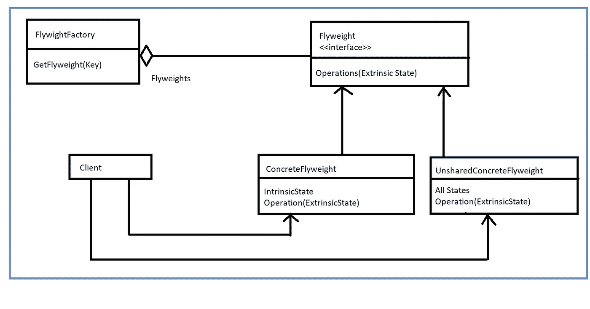
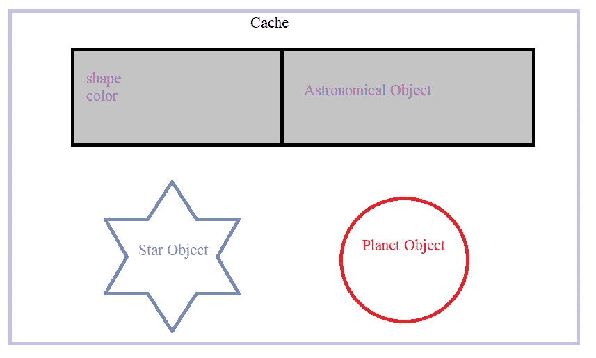
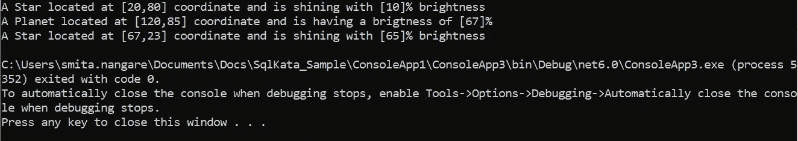

# 轻量级结构设计模式

> 原文：<https://medium.com/globant/flyweight-structural-design-pattern-b62b56b0a764?source=collection_archive---------1----------------------->


Photo by [Joel Fulgencio](https://unsplash.com/@joelft?utm_source=medium&utm_medium=referral) on [Unsplash](https://unsplash.com?utm_source=medium&utm_medium=referral)

当需要创建许多相似性质的对象时，使用 [Flyweight 模式](https://en.wikipedia.org/wiki/Flyweight_pattern)。它提供了通过共享对象来减少内存占用和提高性能的解决方案，因为许多对象会消耗大量内存。

# 图案本身

Flyweight 是一种结构设计模式，它通过在多个对象之间共享状态的公共部分，而不是将所有数据保存在每个对象中，让我们可以将更多的对象放入可用的 RAM 中。

下面是与这种设计模式相关的正在使用的例子。

*   在浏览器中，我们可以在网页的多个位置使用一个图像。浏览器将只加载图像一次，在其他时候，浏览器将重用缓存中的图像。现在图像是相同的，但是在多个地方使用。它的 URL 是一个固有属性，因为它是固定的和可共享的。图像的位置坐标、高度和宽度是外在的属性，根据它们必须呈现的上下文而变化。
*   英寸 NET 中，我们可以将 Flyweight 设计模式与由 [CLR](https://learn.microsoft.com/en-us/dotnet/standard/clr) (公共语言运行时)维护的实习生池联系起来，后者包含程序中的文字字符串。这确保了在我们的代码中重复使用相同的常量字符串将使用相同的字符串引用。`System.String`类提供了一个`Intern`方法，确保一个字符串在实习生池中，并返回它的引用。

# **UML 中的 Flyweight**

下面的 UML 图代表了 Flyweight 设计模式。



UML Diagram of the Flyweight Design Pattern

按照 Flyweight 设计模式的 UML 图，我们可以在下面找到这个模式中使用的术语的描述。

*   `Flyweight`接口支持共享，但并不将其作为实现该接口的具体对象来实施，无论是共享的还是非共享的。
*   `ConcreteFlyweight`类实现了`Flyweight`接口，并为固有状态增加了存储。
*   `unsharedConcreteFlyweight`类还实现了`Flyweight` 接口，并为不共享的实例增加了存储空间。
*   `FlyweightFactory` 有`GetFlyweight`方法，我们要传递这个方法的密钥。将根据键检查 flyweight 对象是否在缓存中。如果存在，那么它将返回现有 flyweight 对象。如果不存在，它将创建一个新的 flyweight 对象，将该对象添加到缓存中，并返回该 flyweight 对象。

以下是 Flyweight 设计模式的状态。

*   **内在:**这些是不变的东西，储存在记忆里。
*   **外在的:**这些东西不是常数，需要即时计算，因此不会存储在内存中。

# **c#中的一个例子**

下面是该示例的缓存表示。



Cache Representation of the Example.

假设我们正在构建一个小型游戏应用程序来代表银河系中的恒星和行星。在游戏过程中，每颗星星和行星都将被客户端应用程序定位。恒星和行星的特征如下:

*   所有的恒星和行星都将是天体。
*   星星的颜色是蓝色的，行星的颜色是红色的。
*   运行时，客户端将提供星星的位置和亮度。
*   客户端可以创建大量的恒星和行星对象。
*   该应用程序将在移动应用程序中使用，内存(RAM)是一个主要的限制。

按照要求，让我们首先把恒星和行星物体的属性结合成内在和外在状态。

*   **内禀天体:**这些数值在所有恒星和行星天体中都是通用的，不会改变。星星的颜色总是蓝色的，行星的颜色是红色的，它们的形状是固定的。
*   **外部对象:**这些值将由客户端在运行时提供，并且在恒星和行星对象中是唯一的。我们将研究恒星和行星的位置和亮度。

**IGalaxy.cs** :这是一个接口，定义了操纵对象外在状态的方法。

```
public interface IGalaxy
    {
        void SetBrightness(double brightness);
        void SetPosition(int x, int y);
    }
```

**AstronomicalObject.cs:** 这是一个表示恒星和行星物体固有状态的类。

```
public class AstronomicalObject
    {
        private readonly int height;
        private readonly int width;
        private readonly string color;
        public AstronomicalObject(int height, int width, string color)
        {
            this.height = height;
            this.width = width;
            this.color = color;
        }
    }
```

**AstronomicalObjectType:**枚举定义了天文对象的类型。

```
public enum AstronomicalObjectType
    {
        Star,
        Planet
    }
```

**Planet.cs:** 这个类表示 Planet 对象，实现 IGalaxy 接口来操作外部状态。

```
 public class Planet : IGalaxy
    {
        public static AstronomicalObject PlanetShape = new AstronomicalObject(30, 30, "red"); // Intrinsic State
        // These are the extrinsic states
        int positionX;
        int positionY;
        double brightness;
        public void SetBrightness(double brightness)
        {
            this.brightness = brightness;
        }
        public void SetPosition(int x, int y)
        {
            positionX = x;
            positionY = y;
        }
        public override string ToString()
        {
            return string.Format($"A Planet located at [{positionX},{positionY}] coordinate and is having a brigtness of [{brightness}]%");
        }
    }
```

Star.cs :这是一个表示星星对象的类，它还实现了 IGalaxy 接口，允许客户端操纵外在状态，比如亮度和星星的位置。

```
 public class Star : IGalaxy
    {
        public static AstronomicalObject StarShape = new AstronomicalObject(10, 10, "blue"); // Intrinsic State
        // These are the extrinsic states
        int positionX;
        int positionY;
        double brightness;
        public void SetBrightness(double brightness)
        {
            this.brightness = brightness;
        }
        public void SetPosition(int x, int y)
        {
            positionX = x;
            positionY = y;
        }
        public override string ToString()
        {
            return string.Format($"A Star located at [{positionX},{positionY}] coordinate and is shining with [{brightness}]% brightness");
        }
    }
```

**GalaxyFactory:** 这是一个工厂类，它维护行星对象的字典，如果它有一个引用，就为客户机创建一个新的字典，然后将它返回给客户机。

```
 public class GalaxyFactory
    {
        private static Dictionary<AstronomicalObjectType, IGalaxy> astronomicalObjects = new Dictionary<AstronomicalObjectType, IGalaxy>();
        public static IGalaxy GetAstronomicalObject(AstronomicalObjectType planetoryObject)
        {
            if (astronomicalObjects.ContainsKey(planetoryObject))
                return astronomicalObjects[planetoryObject];
            else
            {
                IGalaxy NewObject = null;
                if (planetoryObject == AstronomicalObjectType.Star)
                {
                    NewObject = new Star();
                    astronomicalObjects.Add(AstronomicalObjectType.Star, NewObject);
                }
                else
                {
                    NewObject = new Planet();
                    astronomicalObjects.Add(AstronomicalObjectType.Planet, NewObject);
                }
                return NewObject;
            }
        }
    }
```

**Client.cs:** 这是使用 GalaxyFactory 和 IGalaxy 接口与对象交互的客户端应用程序。

```
class Client
    {
        static void Main(string[] args)
        {
            IGalaxy star = GalaxyFactory.GetAstronomicalObject(AstronomicalObjectType.Star);
            star.SetBrightness(10);
            star.SetPosition(20, 80);
            Console.WriteLine(star);
            IGalaxy planet = GalaxyFactory.GetAstronomicalObject(AstronomicalObjectType.Planet);
            planet.SetBrightness(67);
            planet.SetPosition(120, 85);
            Console.WriteLine(planet);
            IGalaxy star2 = GalaxyFactory.GetAstronomicalObject(AstronomicalObjectType.Star);
            star2.SetBrightness(65);
            star2.SetPosition(67, 23);
            Console.WriteLine(star2);
        }
    }
```

## **输出**

下面是我们代码实现的输出。



Application Output

# **何时使用 Flyweight 设计模式**

下面是我们可以使用这种设计模式的一些原因。

*   需要很多类似的对象，存储成本高。
*   大多数状态可以保存在磁盘上或在运行时计算。
*   每个对象的大部分状态数据都可以是外部的。
*   几个共享的对象很容易取代许多非共享的对象。
*   每个对象的身份并不重要。

下面是这种模式的优点和缺点，这也有助于决定何时以及是否使用它。

## **优点**

*   Flyweight 模式通过减少对象的数量来提高应用程序的性能。
*   Flyweight 模式减少了内存占用并节省了 RAM，因为公共属性是使用内在属性在对象之间共享的。

## **缺点**

*   如果一个对象没有可共享的属性，这个模式就没有用了。
*   如果内存不是问题，那么实现 Flyweight 设计对应用程序来说可能是多余的。
*   该模式引入了代码复杂性。

# **结论**

本文告诉我们 Flyweight 设计模式如何通过共享相似的对象来提高性能和减少内存占用。