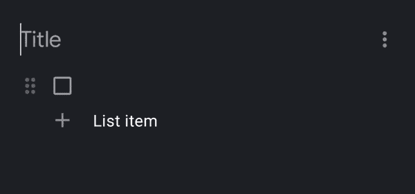

# Jetpack 撰写中的焦点

> 原文：<https://medium.com/google-developer-experts/focus-in-jetpack-compose-6584252257fe?source=collection_archive---------1----------------------->

真正开始写作需要心态的转变。当你开始以正确的方式思考时，使用声明式用户界面会非常快，而且很有收获。训练自己摆脱旧习惯需要时间，重新学习如何做事。Compose 中的焦点管理与我们在普通的旧 Android 中所习惯的略有不同，所以让我们来看看！


Photo by [Stefan Cosma](https://unsplash.com/@stefanbc?utm_source=unsplash&utm_medium=referral&utm_content=creditCopyText) on [Unsplash](https://unsplash.com/s/photos/focus?utm_source=unsplash&utm_medium=referral&utm_content=creditCopyText)

# 设置场景

有一段时间，我一直在做一个[待办事项应用](https://github.com/jamiesanson/tick)作为兼职项目。这个应用程序可以做很多有趣的事情，它的 UI 完全是在 Compose 中构建的。暂且抛开所有花里胡哨的东西，让我们*聚焦*使用这款 app 的核心体验。下面是描述基本待办事项列表的一段代码。

```
LazyColumn {
    items(todos) { todo -> 
        TodoRow(
            text = todo.text,
            isDone = todo.isDone, 
	    callbacks = TodoCallbacks(/* For things a row can do */)
        )
    } 
}
```

我今天早上开始改善这个列表的导航性。除了键盘之外，添加和删除待办事项应该是快速而简单的。这张 gif 展示了我所追求的行为类型，来自 Google Keep。



简而言之，如果我正在输入一件需要做的事情，然后按 enter 键，我希望我的光标移动到一个新的行，有一个新的 todo 项。如果我完全退格退出一个项目，我希望这个项目被删除，我的光标移动到上面的行。很明显，我们需要管理焦点，所以让我们看看我们的选择。

# 焦点管理器

Compose UI 包含一个`FocusManager`类型，允许您在一次调用中推动焦点，非常适合简单的内容遍历。

例如，您可能在一个表单中有一个简单的`TextField`列，当用户按下键盘上的“next”按钮时，您希望在其中导航。`FocusManager`将为你遍历你的关注层次，并在你要求的方向上找到下一件要关注的事情。下面是一些代码，用`FocusDirection.Down`将焦点移到列表中的下一个字段。

```
Column {
    val focusManager = LocalFocusManager.current

    for (i in 1..4) {
        TextField(
            // ...
            keyboardActions = KeyboardActions(
                onNext = {
                     focusManager.moveFocus(FocusDirection.Down)
                }    
            )
        )
    }	
}
```

如果你想让`Down`表示列表中下一个元素以外的东西呢？或者您希望您的自定义可组合组件是可聚焦的？好吧，你很幸运，因为焦点修改器是`FocusManager`的基础，可以用于任何事情。

# 焦点修改器

您可以通过几个不同的修改器与 Compose 中的焦点机制进行交互

*   `Modifier.focusTarget()` —这允许你使组件可聚焦
*   `Modifier.focusOrder()` —与`FocusRequester` s 结合使用，您可以改变对焦顺序
*   `Modifier.focusRequester()` —添加一个自定义`FocusRequester`，允许您观察焦点状态，并为单个组件请求焦点
*   `Modifier.onFocusEvent()`、`Modifier.onFocusChanged()` —观察聚焦状态内部或实际变化的更简单方法

为了理解这些是如何工作的，让我们看一些例子。

## 用`onFocusChanged`观察聚焦状态

`onFocusChanged`允许您对影响您的组件或其子组件的焦点变化做出反应:

```
TextField(
    value = "My text field",
	onValueChange = { },
	modifier = Modifier.onFocusChanged { focusState -> 
        when {
            focusState.isFocused -> 
                println("I'm focused!")
            focusState.hasFocus -> 
                println("A child of mine has focus!")
        }
    }
)
```

您可以通过`onFocusEvent`修改器获得更细粒度的更改，每当内部焦点状态被写入时，该修改器将发出一个新的`FocusState`。

## 为自定义布局实现聚焦

当实现一个定制的可组合组件时，你可以使它具有可聚焦的交互性。既然这样，`focusTarget()`就是你的朋友！

```
@Composable
fun CoolFocusableGraph(modifier: Modifier = Modifier) {
    // Make ensure our laid out component is focusable, and 
    // observe focus events to make it interactive
    val customComponentModifier = modifier
        .focusTarget() // Now focusable!
        .onFocusEvent { TODO("React to events") }
        .drawBehind { TODO("Draw something cool") }

    Layout(
        content = {},
        modifier = customComponentModifier,
        measurePolicy = TODO()
    )
}
```

## 更改焦点顺序

有些情况下，您可能希望焦点顺序不同于默认顺序。在大多数情况下，这是不可取的，但如果你需要它，这里是如何做到这一点。一个不好的例子可能是当字段填充了有效数据时跳过它们。

```
// First, get a reference to two focus requesters
val (first, second) = FocusRequester.createRefs()

Column {
    // Down should take us to the third component
    TextField(
        ...
        modifier = Modifier.focusOrder(first) { down = second }
    )

    // Skip this one when moving in the "down" direction
    TextField(...)

    // Set the requester to tie them together
    TextField(
        ...
        modifier = Modifier.focusOrder(second)
    )
}
```

## 以编程方式请求特定组件的焦点

更不明智的是，你可以选择自己管理焦点！如果您不够小心，这可能是一个坏主意，因为很容易错过焦点遍历应该如何工作的微妙之处。如果您足够小心，您最终会在不使用焦点内部机制的情况下重新实现焦点遍历逻辑——这并不有趣。总的来说，尽可能多的尝试一下`FocusManager`是值得的。

如果这绝对是您需要做的事情，那么您可以使用带有`focusRequester()`修饰符的`FocusRequester`以编程方式请求特定组件的焦点。

```
// Focus could be part of your state
data class InputField(val text: String, val isFocused: Boolean)

@Composable 
fun InputRow(item: InputField) {
    val requester = FocusRequester()

    TextField(
        ...
        modifier = Modifier.focusRequester(requester)
    )

    // Request focus as a SideEffect (after the composition)
    SideEffect {
        if (item.isFocused) {
            requester.requestFocus()
        }
    }
}
```

# 遍历待办事项列表

现在，我们已经看到了 focus 的所有内容，让我们尝试将它应用到我们的 todo list 问题中。

我想要的解决方案是`FocusManager`，当添加或删除项目时，我试图向上或向下移动焦点。这对于删除项目非常有效，因为下一个焦点目标已经存在。当把焦点转移到新添加的项目上时，事情开始变得有点复杂。我试图将焦点转移到一个目前并不存在的组件上，让我停留在原来的位置上。

我首先想到的解决办法是尝试在`SideEffect`中运行`focusManager.moveFocus`调用，这是一段在每次合成后运行的代码。这是有意义的，因为我有效地向外部发布了状态，但这使得事情变得更加棘手，因为我只想对添加到列表中的每个项目调用一次。实际上，我想要的是在一幅成功的作品中，项目列表发生变化后转移焦点。最终，我选择了`LaunchedEffect`和`focusManager.moveFocus`调用的组合，只在项目列表改变时才移动焦点。完整的代码可以在下面看到。

```
@Composable
fun ListScreen(lists: List<TodoList>) {
    // Get a reference to the current FocusManager
    val focusManager = LocalFocusManager.current
    var focusDirectionToMove by remember { mutableStateOf<FocusDirection?>(null) }

    // Redux dispatch - stay tuned for a blog about this
    val dispatch = LocalDispatch.current

    // When add or remove events are dispatched, move the focus
    val wrappedDispatch: (Any) -> Any = { action ->
        when (action) {
            is Action.AddTodo, 
            is Action.AddTodoAsSibling -> 
                focusDirectionToMove = FocusDirection.Down
            is Action.DeleteTodo -> 
                focusDirectionToMove = FocusDirection.Up
        }

        dispatch(action)
    }

    // My list of items
    TodoListColumn(lists, wrappedDispatch)

    // If we've previously asked to move the focus, do it when
    // the lists parameter changes
    LaunchedEffect(lists) {
        focusDirectionToMove?.let(focusManager::moveFocus)
        focusDirectionToMove = null
    }
}
```

聚焦是一个棘手的问题，如果处理不当，可能会对用户产生负面影响。Compose 中的 focus APIs 允许您配置任意多或任意少的焦点——希望这能让您了解什么是可能的！

如果你想看更多，请关注我的[媒体](/@jamiesanson)。或者，我会交叉发布到我自己的个人博客上，我偶尔会发微博。