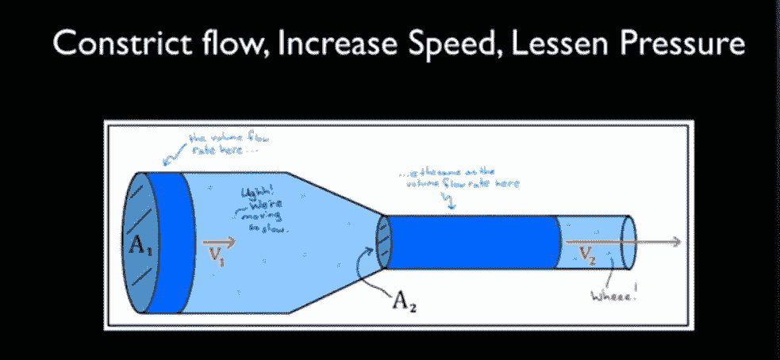
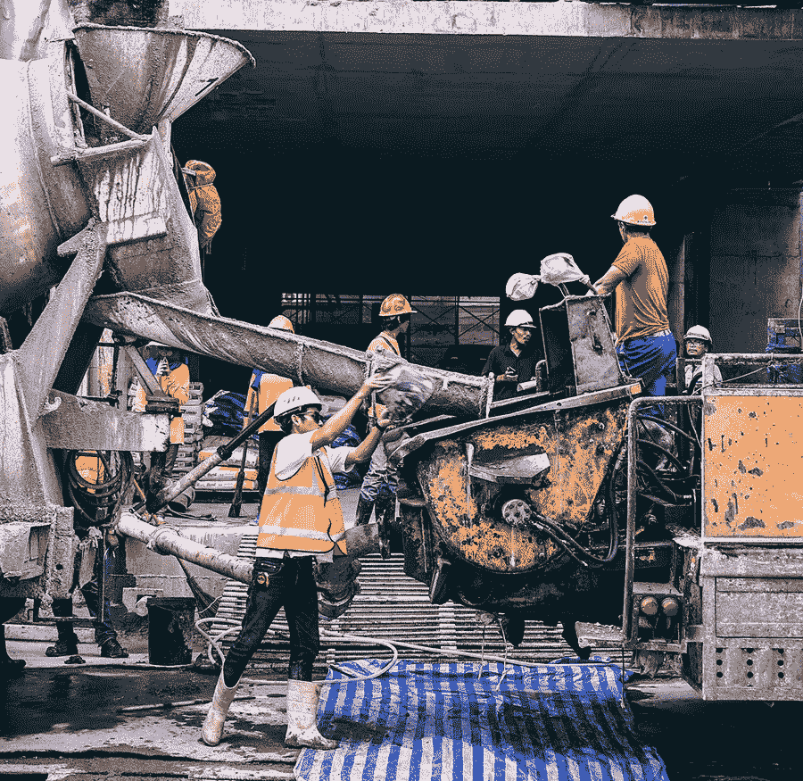

# 聚焦 DevOps 管道

> 原文：<https://medium.com/capital-one-tech/focusing-on-the-devops-pipeline-topo-pal-833d15edf0bd?source=collection_archive---------0----------------------->

## ***借助敏捷开发运维更快地交付高质量的工作软件***

当我们在 Capital One 谈论 DevOps 时，我们并不谈论 DevOps 的一般定义。我们谈论的是 DevOps 的*目标*—***更快地交付高质量的工作软件。*** 我们不去定义 DevOps，不去问 DevOps 是什么，而是专注于为什么 DevOps 对我们很重要。我们将“更快地交付高质量的工作软件”分解开来，我们将重点放在这句话中对我们很重要的单词或短语上:

*   *高质量*意味着无安全缺陷、合规、缺陷最少等。
*   *工作*意味着端到端，它确实适用于所有各方，已经过测试，并且所有依赖关系都得到满足。
*   *Faste* r 意为在不牺牲质量的情况下尽快完成。

现在如果你看看前两个短语，DevOps 的出现并没有改变什么。瀑布过程多年来一直在生产高质量的工作软件。新的是最后一个字——*更快*。在 DevOps 之前，我们通常每季度发布一次——现在我们每天、每周或每次冲刺发布一次。

够快了吗？比*快多少？我们如何衡量它，在哪里停下来？*

# 高质量与更快

行业智慧说，走得越快越好。我开始思考这个概念的科学证据，以及我以前见过的一些地方。原来丹尼尔·伯努利 T21 在 18 世纪就证明了这一点，远在我们出生之前。在他的流体力学原理中，如果你压缩一种流体的连续流动，那么你实际上可以增加速度并减轻压力。

你可以说，如果你有一个从提交到部署的管道，那么你可以通过确保一次交付更小的代码块来增加流程(并让你的开发人员感觉压力更小)。这是你可能熟悉的敏捷开发的一个基本原则，即使你不熟悉它背后的流体力学和物理学。

# 三种管道

自从我们开始 DevOps 之旅以来，我在 Capital One 内外看到了许多管道。我可以使用一些视觉辅助工具将有问题的管道分为三大类。

**类型 1:** 这个管道涉及一堆永远延续下去的并行分支。他们在哪里见面？他们没有。这是一种视错觉，他们在数学家所谓的[无穷远处](https://en.wikipedia.org/wiki/Infinity)相遇。这是不良分支策略的结果。

**类型 2:** 这涉及到相互依赖的组件的复杂管道，就像这样放在一起。每一个都有自己的代码库和分支，你不能总是知道管道在哪里开始，在哪里结束。

类型 3: 这是一种需要军队管理的管道。这条管道有漏洞，有失败的测试用例，有失败的构建，必须有人自己来修复所有这些。

# 创造更好的渠道

那么，我们如何设计、测量和改进我们的管道来避免上述问题呢？

## 管道设计

在 Capital One，我们使用“16 个门”的概念来设计管道。这些是我们的设计指导原则，它们是:

*   源代码版本控制
*   最佳分支策略
*   静态分析
*   超过 80%的代码覆盖率
*   漏洞扫描
*   开源扫描
*   工件版本控制
*   自动供应
*   不可变服务器
*   集成测试
*   性能试验
*   为每次提交自动构建部署测试
*   自动回滚
*   自动化变更单
*   零停机发布
*   功能切换

这些关口用于了解每个产品在 DevOps 流程中的进度。

## 管道测量

管道测量是我们开始关注并仍在研究的另一个领域。我们专注于查明哪里发生了停机，并将我们的关注点从试图加快速度转变为识别和减少等待时间。毕竟你永远不知道等待的时间在哪里，哪个等待的时间对你有意义。我见过开发人员努力将他们的构建时间从 25 分钟减少到 15 分钟，而他们的测试用例运行了几个小时。在这种情况下，您应该花费大量精力来加快构建时间还是减少测试时间？我们让开发人员通过仪表板和报告让事情变得透明，从而选择关注哪个等待时间。

此外，我们发现了两个可以改进的机会领域——我们的分支战略和流程。

## 流程改进

流水线改进其实就是*流程改进*。它在很大程度上侧重于自动化发布过程，并重新审查审计和法规遵从性。传统上，任何大企业中的发布管理过程都是一个复杂的过程。该流程强调治理和风险缓解。我们与我们的审计员和风险合规办公室合作，了解如何改进流程并实现完全自动化。我们共同达成了一项协议:

*   开发运维与 CICD 可以提供比手动流程更好的风险和安全缓解控制。
*   一组核心的实践和要求可以在管道内部和周围完全自动化，以满足并进一步加强审计和合规性。

# 最终目标

DevOps 的最终目标是创建一个成熟的、完全自动化的管道，从代码提交一直到生产。我们已经创建了一个模型，您可以通过使用管道产生的大量数据点来持续审计您的管道。我们已经开始在我们的[heagie ia](https://github.com/capitalone/Hygieia)开源项目下开源这些。

这使得我们能够实现 DevOps 的目标，即*更快地交付高质量的工作软件*，而不牺牲或牺牲我们管道的质量或速度。

*声明:这些观点仅代表作者个人观点。除非本帖中另有说明，否则 Capital One 不属于所提及的任何公司，也不被其认可。使用或展示的所有商标和其他知识产权都是其各自所有者的所有权。本文为 Capital One 2018。*