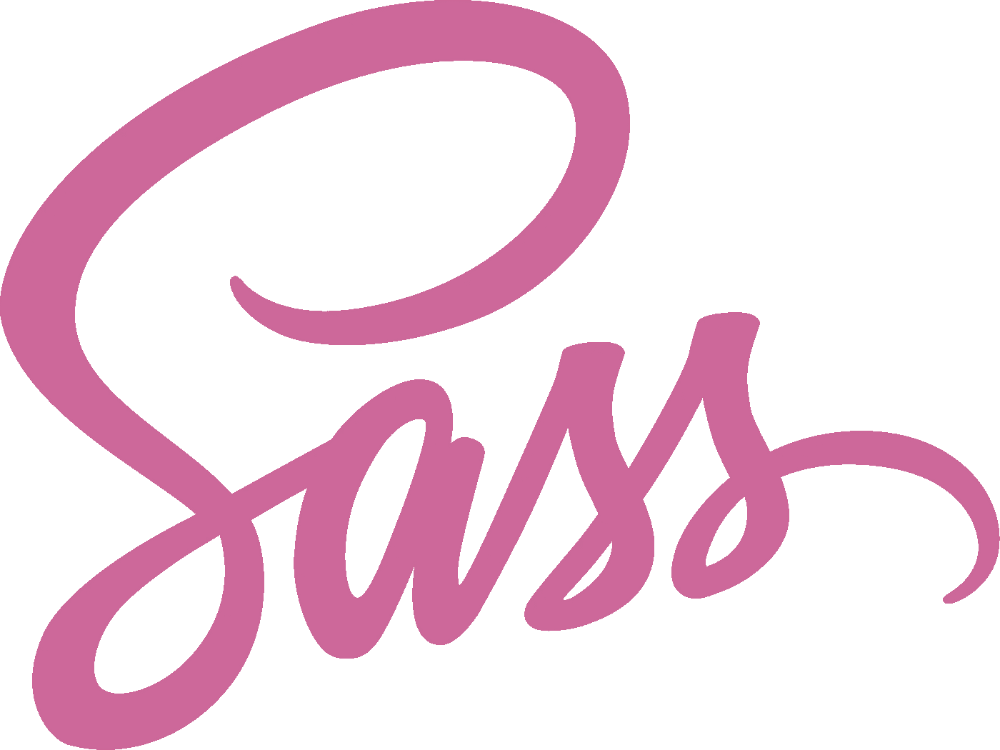
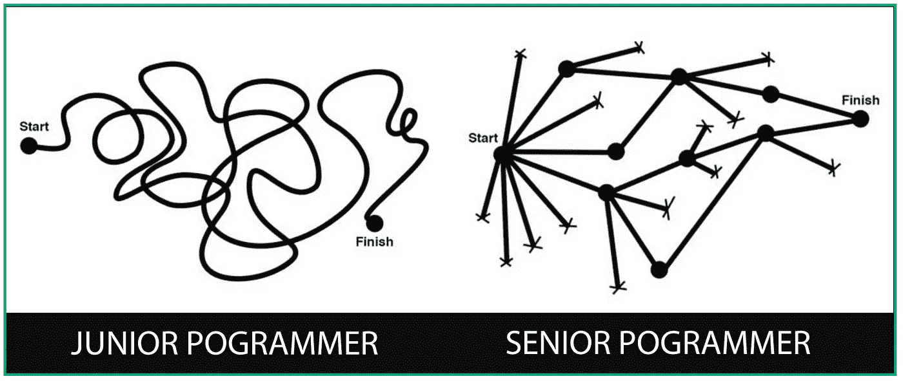
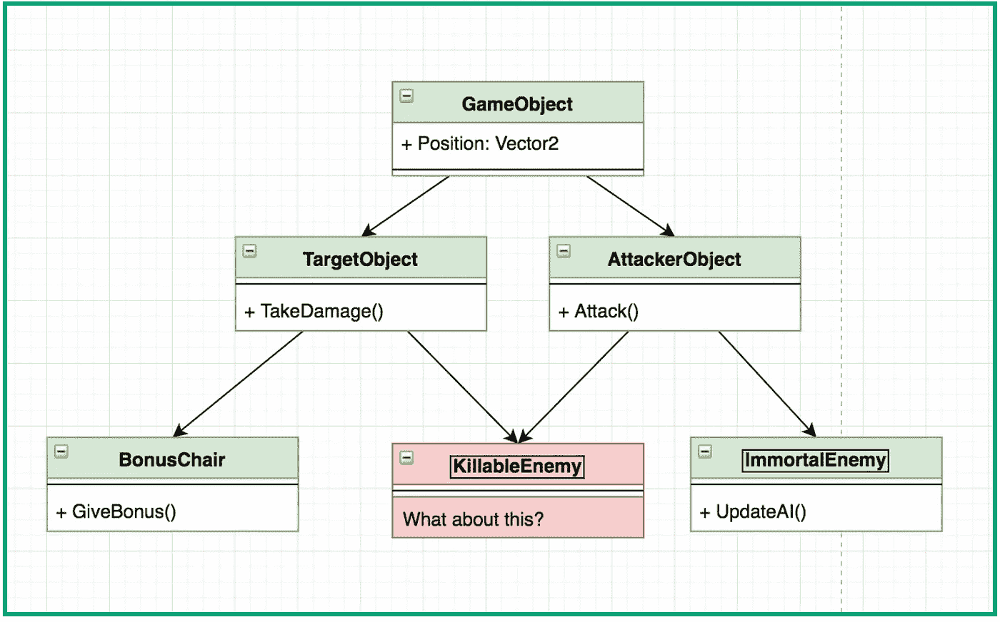
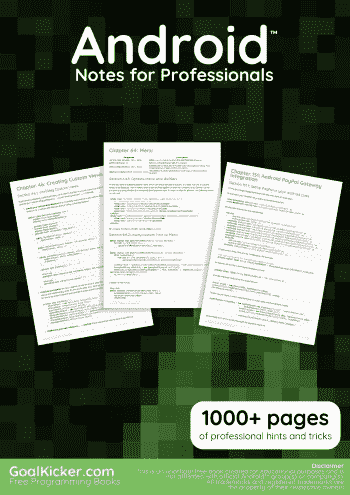

# Food For Thought Before Entering New Month

> 原文：<https://medium.easyread.co/food-for-thought-before-entering-new-month-4f4e35082e6e?source=collection_archive---------4----------------------->

Hello *Easyreaders*

Top Article in [Easyread](https://medium.com/easyread) in this month.

## JavaScript

[**The Other Side of JavaScript — Audio Signal Scope**](https://medium.com/easyread/the-other-side-of-javascript-audio-analyzer-b640a55ebaa5) by [Muhibbudin Suretno](https://medium.com/u/a0a4edcc618d?source=post_page-----4f4e35082e6e--------------------------------) .

Apa kamu seorang yang menyukai musik atau suara? ketika kamu menikmati alunan suara tersebut terkadang anggota badan kamu akan mengikuti ketukan dan irama yang di dengar oleh telingamu

## Frontend

[**Kenalan & Belajar Penggunaan Dasar SASS**](https://medium.com/easyread/kenalan-belajar-penggunaan-dasar-sass-9453ca64c991) by [Muhammad Farid Zia](https://medium.com/u/c26c3601c91e?source=post_page-----4f4e35082e6e--------------------------------) .

Pada kesempatan kali ini kita akan kenalan dan belajar tentang sebuah CSS preprocessor yang bernama Sass, kalo ada yang belum tau dengan Sass nih tak kasi apa itu mahluk yang bernama sass itu, Sass (Syntactically Awesome StyleSheets) adalah bahasa yang diadopsi dari CSS

[**Reaksi Pertama saat coba Vue js**](https://medium.com/easyread/reaksi-pertama-saat-coba-vue-js-4c2c1fbbd75a) by [Haidar Afif Maulana](https://medium.com/u/631846fabf4?source=post_page-----4f4e35082e6e--------------------------------) .

Sampai beberapa waktu yang lalu saya gak ngerti kenapa javascript bisa jadi bahasa pemrograman no 1 paling banyak di gunakan di dunia.

## Android

[**Konsep AsyncTask dan AsyncTaskLoader pada Android**](https://medium.com/easyread/konsep-asynctask-dan-asynctaskloader-pada-android-b5ba2744dcdb) by [Mahesa Iqbal Ridwansyah](https://medium.com/u/423a2702de9a?source=post_page-----4f4e35082e6e--------------------------------) .

*Hello Coders!* Pada kesempatan yang bagus disela-sela waktu pekerjaan saya, saya mau membagi kepada kalian tentang *AsyncTask* dan *AsyncTaskLoader* pada Android.

[**Tutorial Anko**](https://medium.com/easyread/tutorial-anko-20f61992f965) by [Wisnu Kurniawan](https://medium.com/u/bf894addbcbc?source=post_page-----4f4e35082e6e--------------------------------) .

Bagi kamu yang pernah menggunakan aplikasi Telegram pasti merasakan kelebihan dibandingkan beberapa aplikasi lainnya, yaitu performance sangat cepat. Kenapa bisa cepat? Salah satu faktor yang membuat Telegram bisa cepat adalah dalam mengkonstruksi layout tidak menggunakan XML namun dibangun secara programmatically. Kamu bisa lihat sendiri source code nya disini.

## Programmer Life

[**Alasan Mengapa Seorang Programmer Harus Mulai Menulis**](https://medium.com/easyread/alasan-mengapa-seorang-programmer-harus-mulai-menulis-cfee75c11b45) by [Eminarti Sianturi](https://medium.com/u/c621a1e3a342?source=post_page-----4f4e35082e6e--------------------------------) .

Kenapa sih programmer harus belajar dan mulai menulis?

[**Part 1: Jawaban untuk Junior Programmer**](https://medium.com/easyread/part-1-jawaban-untuk-junior-programmer-43a62aded2ab) by [Leo Pripos Marbun](https://medium.com/u/ea9a874c360d?source=post_page-----4f4e35082e6e--------------------------------) .

Selama pengalaman saya, saya seringkali ditanya oleh junior atau teman-teman saya tentang *“Bagaimana menjadi programmer?”* atau *“Bagaimana supaya saya jago programming?”* . Nah kali ini saya akan mencoba merangkum jawaban-jawaban yang pernah saya berikan untuk pertanyaan tersebut.

## Game Development Dan Design

[**Part 1 : Entity Component System (ECS)**](https://medium.com/easyread/part-1-entity-component-system-ecs-18f9a2d68bf9) by [Leo Pripos Marbun](https://medium.com/u/ea9a874c360d?source=post_page-----4f4e35082e6e--------------------------------) .

Paradigma yang pada umumnya digunakan dalam pemrograman adalah paradigma *Object Oriented Programming* (OOP)

## Ebook Gratis Programming

[**Rekomendasi Buku Gratis tentang Programming**](https://medium.com/easyread/ebook/home) **.**

Berikut kami berikan rekomendasi buku yang bagus dan gratis. Download sekarang.. 😇

> [Easyread](https://medium.com/easyread) adalah sebuah publication yang berbasis komunitas di Indonesia. Easyread berusaha menjadi wadah yang memberikan kemudahan buat rekan-rekan programmer untuk saling berbagi cerita dalam satu media, khususnya di Medium.com. ~ [More about us](https://medium.com/easyread/about-easyread-74b20960e180)

Ayo submit cerita kamu ke [Easyread](https://medium.com/easyread) sekarang juga… :)