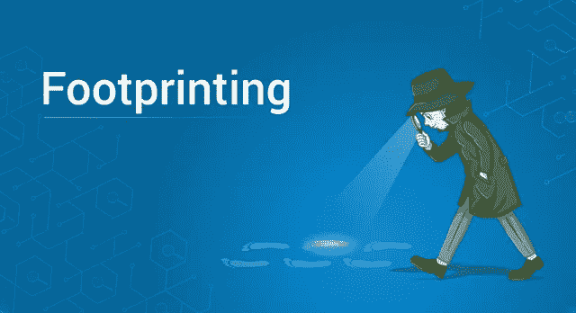
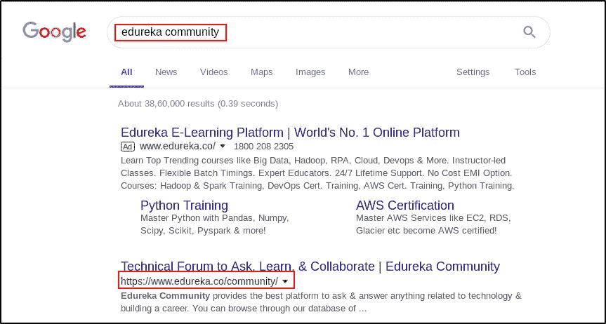
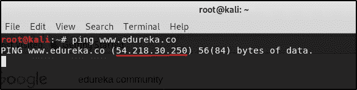
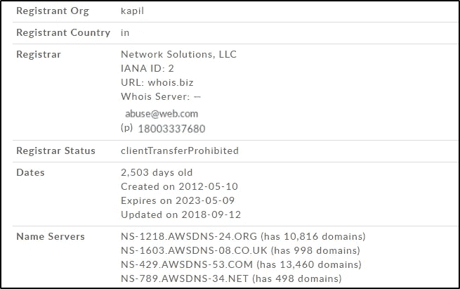
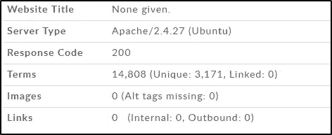

# 足迹——道德黑客的底层结构

> 原文：<https://medium.com/edureka/footprinting-in-ethical-hacking-6bea07de4362?source=collection_archive---------0----------------------->

Footprinting - Edureka

在上一篇文章中，我告诉了你如何在网上增加匿名性。本文将讲述如何从道德黑客开始。我将讨论足迹的阶段，以及收集关于您想要测试漏洞的应用程序的信息的一些方法。

本文涵盖的主题有:

*   什么是足迹？
*   为什么足迹很重要？
*   足迹的类型
*   如何在足迹中收集信息？

# 什么是足迹？

假设你是一个众所周知的道德黑客，你得到了一份检查 Web 应用程序漏洞的工作。你得到你要测试的网站的组织的名字。您将如何开始测试网站的漏洞？你可以从收集关于那个网站的信息开始。这就是足迹。

足迹是道德黑客的侦察阶段的一部分，在这个阶段你收集关于系统/应用的信息。足迹的主要目的是收集尽可能多的关于系统/应用程序的信息，以缩小攻击的范围和技术。

大多数人觉得足迹很无聊，但它是道德黑客的一个非常重要的部分。下一节将告诉你为什么。

# 为什么足迹很重要？

足迹被认为是道德黑客最重要的阶段之一。我们以一个电影情节为例。假设你正在看一部银行抢劫电影，里面有计划抢劫银行的人。像《十一罗汉》、《意大利人的工作》或者《速度与激情》这样的电影，人物是不是直接买枪和面具进银行抢劫？不要！如果他们这样做了，他们就不可能成功地抢劫银行。

那么他们在抢银行之前会做什么呢？他们就如何进入银行，如何处理安全问题制定了一个适当的计划，并准备了一个逃跑计划。为了计划抢劫，他们需要观察银行的某些事情，银行的运作方式，安全系统如何工作等等。了解银行在制定计划时起着重要的作用。

同样，了解系统/应用程序对于道德黑客攻击非常重要，因为这将让您知道可以找到什么类型的漏洞，以及什么攻击是合适的。

既然你已经了解了什么是足迹以及它为什么重要，那么是时候了解一下足迹的不同类型了。

# 足迹的类型

与侦察类似，足迹可以分为两种类型:

1.  **主动足迹**
2.  **被动足迹**

## 主动足迹

主动足迹是通过直接与系统交互来收集有关系统/应用程序的信息的足迹类型。当您使用主动足迹时，您试图收集信息的系统很可能会保存一些信息，如您的 IP 地址。

## 被动足迹

在被动足迹的情况下，您在没有与您试图了解的系统/应用程序交互的情况下收集信息。你通过搜索引擎或公共记录收集信息。当您使用被动足迹时，系统无法保存您的 IP 地址。

既然您已经了解了足迹的基本知识，那么就不要再拖延了，让我们开始足迹的实践部分吧

# 如何在足迹中收集信息？

在这一节中，我将向您展示一些收集信息的方法。为此，我将使用 Kali Linux 操作系统。

在本文中，我们将尝试收集关于 **Edureka 社区**的信息。假设你对 Edureka 社区一无所知，你会如何开始收集信息？第一步是使用搜索引擎。

## 使用搜索引擎的足迹

打开浏览器，搜索“Edureka 社区”。

你会找到爱德华卡社区的网址，即 www.edureka.co/community 的[**。这是您找到的第一条信息。**](http://www.edureka.co/community.)

**使用网站的 URL，您可以通过 ping 到它来找到该网站的 IP 地址。**

## **Ping 查找 IP 地址**

**要查找 Edureka 社区网站的 IP 地址，请打开终端并运行以下命令:**

**`$ ping [www.edureka.co](http://www.edureka.co)`**

**等等，我们想找到[**www.edureka.co/community**，](http://www.edureka.co/community,)的 IP 地址，那我们为什么要 ping 到[**www.edureka.co**？](http://www.edureka.co?)**

**这是因为 **Edureka 社区**属于[**www.edureka.co**](http://www.edureka.co)域，并且该 web 应用程序的结构使得社区的 IP 地址与域的 IP 地址相同。**

**运行上面提到的命令，您应该会看到类似的输出。**

****

**你可以看到我们找到了 Edureka 社区的 IP 地址。IP 地址是 54.218.30.250 的**。****

**IP 地址只是网站的一小部分信息。为了获得更多信息，我们将使用 **Whois 查找。****

## **Whois 查找**

**Whois Lookup 是一种用于查找 DNS、域名、名称服务器、IP 地址等信息的工具。让我们使用 Whois 查找来找到更多关于 Edureka 社区网站的信息，打开浏览器并进入[**http://whois.domaintools.com/**](http://whois.domaintools.com/)**

**输入网站名称(或 IP 地址)，点击**搜索****

****

**该搜索将显示网站的各种信息。**

********

**在上面的截图中可以看到，Edureka 社区正在使用的服务器类型是 **Apache/2.4.27。这给了一个有道德的黑客开始测试的机会。此外，您可以将攻击限制在适用于 **Apache/2.4.27 服务器的范围内。******

**这就是足迹帮助道德黑客的方式。使用足迹收集的信息越多，寻找漏洞的地方就越多。探索更多查找信息的方法，看看使用足迹还能收集到哪些信息。如果你希望查看更多关于人工智能、DevOps、云等市场最热门技术的文章，那么你可以参考 [Edureka 的官方网站。](https://www.edureka.co/blog/?utm_source=medium&utm_medium=content-link&utm_campaign=footprinting-ethical-hacking-kali-linux)**

**请留意本系列中的其他文章，它们将解释网络安全的各个方面。**

> **1.[什么是网络安全？](/edureka/what-is-cybersecurity-778feb0da72)**
> 
> **2.[网络安全框架](/edureka/cybersecurity-framework-89bbab5aaf17)**
> 
> **3.[隐写术教程](/edureka/steganography-tutorial-1a3c5214a00f)**
> 
> **4.[什么是网络安全？](/edureka/what-is-network-security-1f659407dcc)**
> 
> **5.[什么是计算机安全？](/edureka/what-is-computer-security-c8eb1b38de5)**
> 
> **6.[什么是应用安全？](/edureka/application-security-tutorial-e6a0dda25f5c)**
> 
> **7.[渗透测试](/edureka/what-is-penetration-testing-f91668e2291a)**
> 
> **8.[道德黑客教程](/edureka/ethical-hacking-tutorial-1081f4aacc53)**
> 
> **9.[关于 Kali Linux 你需要知道的一切](/edureka/ethical-hacking-using-kali-linux-fc140eff3300)**
> 
> **10.[使用 Python 的道德黑客](/edureka/ethical-hacking-using-python-c489dfe77340)**
> 
> **11. [DDOS 攻击](/edureka/what-is-ddos-attack-9b73bd7b9ba1)**
> 
> **12.[使用 Python 的 MacChanger】](/edureka/macchanger-with-python-ethical-hacking-7551f12da315)**
> 
> **13 [ARP 欺骗](/edureka/python-arp-spoofer-for-ethical-hacking-58b0bbd81272)**
> 
> **14. [Proxychains，Anonsurf & MacChange](/edureka/proxychains-anonsurf-macchanger-ethical-hacking-53fe663b734)**
> 
> **15.[什么是密码学？](/edureka/what-is-cryptography-c94dae2d5974)**
> 
> **16.[50 大网络安全面试问答](/edureka/cybersecurity-interview-questions-233fbdb928d3)**

***原载于 2019 年 3 月 26 日*[*www.edureka.co*](https://www.edureka.co/blog/footprinting-ethical-hacking-kali-linux/)*。***