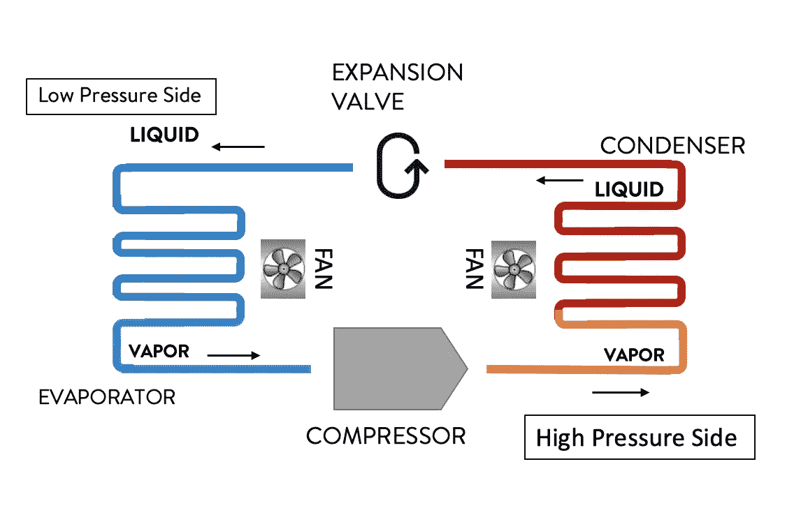
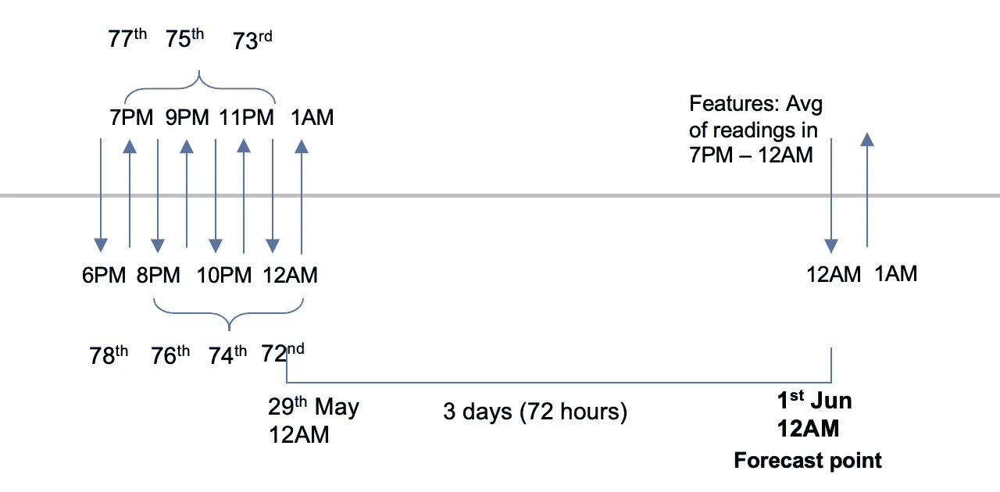
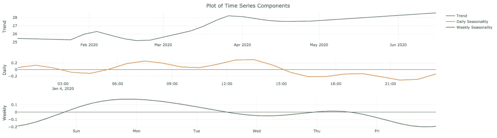
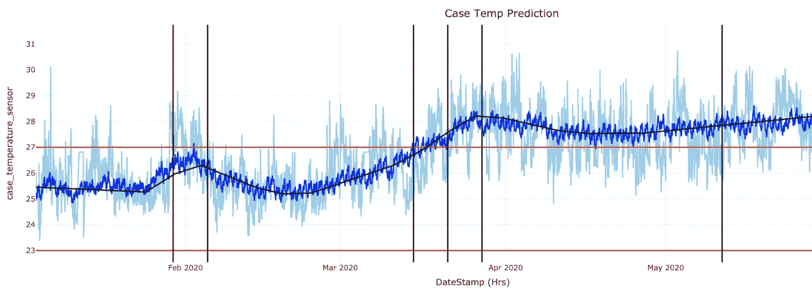
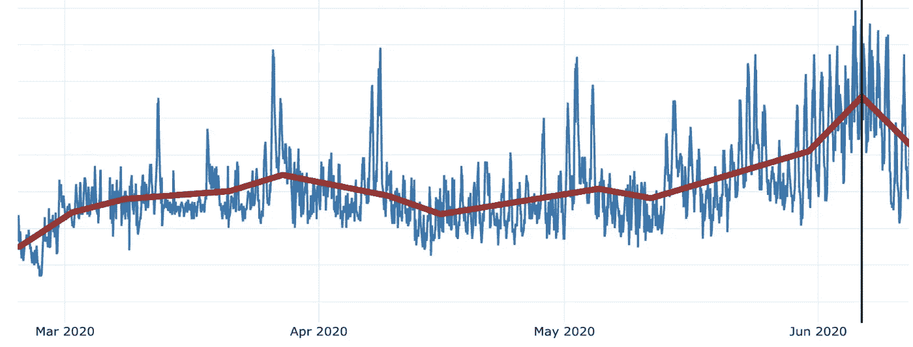
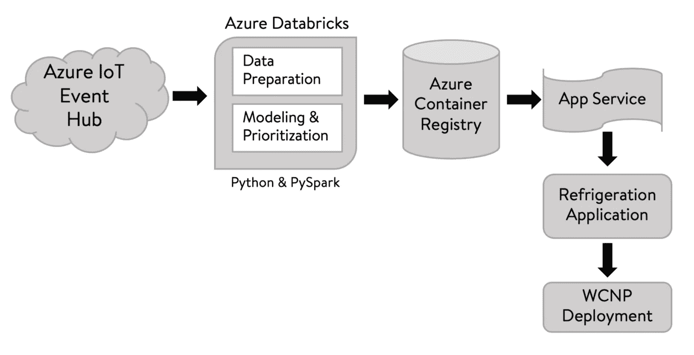

# 利用 PySpark 和传感器数据预测制冷异常

> 原文：<https://medium.com/walmartglobaltech/forecast-anomalies-in-refrigeration-with-pyspark-sensor-data-195f23ae24e2?source=collection_archive---------0----------------------->

***简介***

沃尔玛的足迹遍布美国，每年销售价值数十亿美元的易腐商品。大多数易腐烂的货物都储存在冰箱里以保持新鲜和长久。为了满足客户需求和改善客户体验，制冷系统通过远程设置配置或物理维护进行调节，减少食物浪费、高温问题、机械故障等。

这个问题是从规模和多样性的角度来看的。大约有 50 万种不同类型的制冷系统，例如多层冰柜、步入式冰柜、棺材冰柜等。每一个都包含不同类型的食物(如肉类、熟食、冷冻食品、冰淇淋等。)并因此在不同的温度设置下运行。为了避免故障，这种规模的维护需要人力，而且非常耗时。现在，由于闪存尚未上市，所以我们需要找出解决大量并发问题的最佳方法。


Photo Credit: [Pixabay](https://pixabay.com/)

在这篇博客中，我将谈谈我们为解决这个问题而建立的框架。

***遥测传感器信息***

制冷系统有四个重要部件:压缩机、冷凝器风扇、蒸发器风扇和膨胀阀。不严格地说，他们一起试图将压力保持在一个合理的水平，以便将温度保持在内(记住，PV = nRT)。在沃尔玛，我们每隔 10 分钟收集一次所有这些组件的传感器数据(如压力、风扇转速、温度),以及系统是否处于除霜状态、压缩机是否锁定等指标。我们还捕捉外部空气温度，因为它会影响冷凝器风扇速度，进而影响温度。



Refrigeration Cycle — Four components

当温度高于默认设置时，除霜非常重要，以清除系统中的多冰。如果不解冻，冬天的风将会产生大量可怕的不新鲜食物。与除霜相关的特性，例如最高除霜温度、达到最高温度所需的时间以及回到正常温度所需的时间，所有这些都会影响系统的整体健康状况。

***目标***

目标是最大限度地减少故障数量，并提出可能的解决方案以节省时间。因此，我们利用这一遥测信息来*预测*温度异常，这将有助于确定问题的优先顺序，并且是主动的而不是被动的。

***数据准备***

我们使用了过去两年的遥测信息，并从 10 分钟开始每小时汇总一次。原因是，数据越细，噪音就越大。此外，像每个传感器信息一样，这些数据容易丢失和错误的传感器值。因此，通过每小时一次的汇总，我们试图将这些数据的插补次数减到最少。由于我们希望预测温度异常，因此，将温度建模为我在遥测传感器信息部分提到的功能的函数，并预测未来 72 小时的温度。

挑战在于，除了室外气温，我们没有任何特征的未来值。我们使用了第三方供应商对未来 72 小时气温的预测，非常准确。现在，单变量预测或仅以气温为特征的预测可能是一种选择，但这样一来，我们将失去压力或风扇速度等变化的信息。因此，对于预测，我们使用最后 96 小时数据的滞后，并保留每 6 小时的滚动平均值作为特征值。例如，如果我想预测 6 月 1 日上午 12 点的天气，我将使用 5 月 28 日下午 7 点到 5 月 29 日上午 12 点的平均值来预测某个特定的特性。



Feature calculation at forecast point

***造型***

我们试验了不同的建模技术，从 ARIMAX 开始，然后是贝叶斯结构时间序列(BSTS)和 Prophet。这些算法的细节可以在这里找到: [ARIMAX](https://robjhyndman.com/hyndsight/arimax/) ， [BSTS](https://www.unofficialgoogledatascience.com/2017/07/fitting-bayesian-structural-time-series.html) ，[先知](https://facebook.github.io/prophet/docs/quick_start.html)。嵌入代码片段是为了便于执行。

`Pseudo code for ARIMAX & BSTS in ***R***:`

```
library(dplyr)
library(forecast)
library(bsts) # df : dataframe consisting 'ds'(timestamp), 'y' and other exogenous variables
# future_df : dataframe consisting lagged feature variables for forecast ############# ARIMAX ############# Create ts object
train.ts <- ts(df$y, frequency = 24) # Fit & Forecast
fit <- try(auto.arima(train.ts, 
                      xreg = as.matrix(df[, 3:ncol(df)]), seasonal=TRUE), silent = TRUE) if(inherits(fit, "try-error")){  
  print('Fit Failed')
}else{  
  # Forecast the model  
  fc <- forecast(fit, 
                 xreg = future_df %>% as.matrix(), h = nrow(future_df))  
  y_hat <- fc$mean # forecasted value
} ############# BSTS ############### # ss: state space
ss <- AddLocalLinearTrend(list(), df$y)
ss <- AddSeasonal(ss, df$y, nseasons = 24) # Fit Model
setseed <- 2021
model_fit <- bsts(y~., 
                  state.specification = ss, 
                  niter = 5000, 
                  data = df[, 3:ncol(df)], 
                  seed = setseed) #, expected.model.size = 5)burn_fit <- SuggestBurn(0.1, model_fit) fc_bsts <- bsts::predict.bsts(model_fit, 
                              horizon = nrow(future_df), 
                              newdata = future_df, 
                              seed = setseed, 
                              burn = burn_fit, quantiles = c(.05, .95))
future_df$bsts_yhat <- fc_bsts$mean
```

先知是*被选中的人*。字面意思！！但如果你不相信先知，看看下一节背后的逻辑。

插补和*多重共线性*检查的初步步骤已经完成。对于我们正在处理的每小时数据，我们已经结合了每日和每周的季节性。



Trend & Seasonality

每个制冷系统都有一个基于其类型和食物含量的预定义的有利温度范围。假设，

*d1:与有利温度带的预报差异，d2:与近期平均温度的差异*

如果最近的气温在范围之内，我们就用 *d1、*来衡量预测，但如果它们已经超出范围，就用 *d2* 来衡量。当除霜关闭时，基于这些差异，预测被标记为异常(无论如何除霜打开意味着高温！).除霜时间或多或少保持不变，因此在产生异常时这些时间点被排除在外。

根据这些差异的大小和超出范围的持续时间(以小时为单位),对异常进行优先排序。

***型号选择***

我们选择了一个具有良好数据质量的制冷系统样本来评估不同的算法。ARIMAX、BSTS 和 Prophet 对 MAPE 的平均预测分别约为 4-6%、2.5-4%和 3.5-5%。通常我们使用精度指标来选择模型，但这里我们也需要考虑其他重要因素。

在这种情况下，准确性与执行时间同样重要，因为我们每天要处理大约 3600 家商店中大约 50 万个系统的预测。由于 BSTS 依赖于 *MCMC 采样*，所以运行时间比其他方法要长得多，但准确性几乎没有提高。因此，我们放弃了 BSTS！

另一个重要方面是能够提供异常的*原因*，而不仅仅是预测。在任何模型的情况下，我们都会得到基于 *p 值*的重要变量列表，但它依赖于整个训练数据，并不关注最近的变化。

Prophet 有一个称为*变点*检测的特性，即它允许趋势随着时间的推移改变方向。Prophet 通过首先指定速率允许变化的大量*潜在变化点*来检测变化点。然后，它在速率变化的幅度上放置一个稀疏的先验(相当于 L1 正则化)，这实质上意味着 Prophet 有大量速率可能变化的*可能*位置，但将使用尽可能少的位置。更多详情[此处](https://facebook.github.io/prophet/docs/trend_changepoints.html)。



Light Blue:Actual, Dark Blue:Predicted, Black:Trend, Red:Favorable Temperature Band

上图中*垂直*黑线为温度变化点。这很有用，因为它有助于通知温度模式的任何突然变化。默认情况下，Prophet 指定了 25 个潜在的变化点，这些点均匀地位于时间序列的前 80%。这些超参数可以通过 *n_changepoints* 和 *changepoint_range 进行更改。*

`Pseudo code for model change-point in ***Python***:`

```
from fbprophet import Prophet

# df : dataframe consisting 'ds'(timestamp), 'y' and other exogenous variables
# future_df : dataframe consisting lagged feature variables for forecast
# features : list of features to be included in the model after multi-collinearity checks # create an expression instead of including each regressor separately all_fea = [str(".add_regressor('") + str(features[i]) + str("')") for i in range(0, len(features))]
all_fea = ''.join(all_fea) # No need to put seasonalities separately. 
# Prophet detects the frequency of the data itself
# If the frequency is less than daily, then it includes daily & weekly seasonality automatically exp = str("Prophet(changepoint_prior_scale = 0.05, changepoint_range=0.8)") + all_fea + str(".fit(df)") # Fit & Predictmodel_prophet = eval(exp)
fcst_all = model_prophet.predict(future_df) # It will contain yhat, trend, seasonalities
```

我们使用了相同的特征来检测潜在的特征，该特征可能是这种突然变化的*原因*。因此，每一个特性将分别通过 Prophet 模型并搜索最近的变化点。



Plot of one of the feature variables — Blue:Actual, Maroon:Trend

只要温度模式有任何变化，我们就会在 2-3 天内寻找特征变量的变化，并提供它们作为潜在的原因。因为这种内在的神圣属性，我们选择了先知而不是 ARIMAX。

***验证***

对于大约 85%的系统，验证集上的模型预测准确度*高于* *90%。但是，要了解模型诊断异常的能力，预测的准确性是不够的。因此，我们通过对已经记录的故障问题进行回溯测试来验证异常检测性能。对于回溯测试，我们使用 *recall* 来了解模型可以捕获多少实际问题！*

平均而言，如果最近的历史温度*在带内，则 67%的时间异常被准确预测，如果最近的历史温度*在带外，则 84%的时间异常被准确预测。后者更高，因为系统在有利温度带之外运行时变得更容易异常。

中小企业也验证了产生的异常现象。这是必需的，因为并非所有异常都被记录为故障问题。有些是小问题，可以通过远程配置更改来解决。

***缩放&部署***

集合时间到了！！已经建立了一个自动化框架，通过批处理每天生成异常。使用 *PandasUDF* 并通过 *PySpark* 进行并行化(参见[此处](https://databricks.com/blog/2020/01/27/time-series-forecasting-prophet-spark.html))。从数据提取到模型存储，Azure Cloud 得到了充分利用。



Architecture Diagram

前端应用已经部署到沃尔玛云原生平台(WCNP)。

***结论***

异常的预测和优先排序大大简化了维护流程。但是在提高维护过程本身的有效性方面，仍然有很大的空间。我们正在探索通过识别*机械层面*异常的根本原因并推荐正确的措施来解决这些问题，从而最大限度地缩短每个问题的解决时间并防止问题再次出现。

***参考文献***

这里有一些关于详细的 Prophet 方程和 PySpark 缩放的参考资料。

[](/future-vision/the-math-of-prophet-46864fa9c55a) [## 先知的数学

### 打破脸书开源时间序列预测程序背后的方程式

medium.com](/future-vision/the-math-of-prophet-46864fa9c55a) [](https://databricks.com/blog/2020/01/27/time-series-forecasting-prophet-spark.html) [## 用 Prophet & Spark 进行时间序列预测

### 试试 Databricks 中的时间序列预测笔记本时间序列预测的进步使零售商能够…

databricks.com](https://databricks.com/blog/2020/01/27/time-series-forecasting-prophet-spark.html)