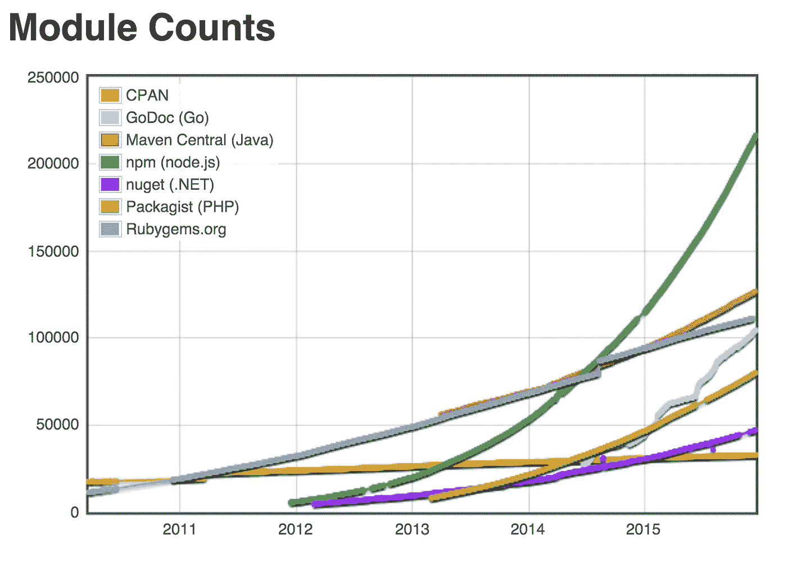

# 别管点击诱饵了。以下是 JavaScript 就业市场的真实情况。

> 原文：<https://medium.com/javascript-scene/forget-the-click-bait-here-s-what-the-javascript-job-market-really-looks-like-in-2016-ddfe0d39b467?source=collection_archive---------0----------------------->

今天，Mashable 发布了一篇关于软件开发人员就业市场的文章，名为“成为 2016 年的明星程序员，学习 Javascript 并搬到犹他州”。它描绘了一幅非常误导人的画面。让我们澄清一些事情。

> 这是一个候选人的市场，在可预见的未来不会改变。

一点背景。我是一名软件开发人员。在过去的几年里，我做了很多面试来雇佣其他软件开发人员。我还培训 JavaScript 开发人员获得好工作所需的技能。我有深厚的背景，为各种初创公司和财富 500 强公司建立并指导[高速开发团队](/javascript-scene/how-to-build-a-high-velocity-development-team-4b2360d34021)。

我也是杰出科技人才经纪人[的技术顾问(我的经纪人——如果你想写你自己的票，找她)。她经常与业内顶尖的科技公司交流，让我了解他们在寻找什么。除此之外，从学生的反馈来看，我对 JavaScript 就业市场的两个方面都有很好的看法。](https://twitter.com/js_cheerleader)

## 你应该学习 JavaScript

Mashable 文章并没有完全弄错。“学习 JavaScript”的建议是可靠的。大约 1/3 的开发人员工作需要一些 JavaScript 知识(来源:indeed.com)。JavaScript 是目前最流行的编程语言，具有最丰富的 OSS 模块生态系统，也是唯一一种具有真正令人信服的通用部署故事的编程语言:Java 渴望的“编写一次，到处运行”的梦想——Java 功亏一篑。JavaScript 成功了。

通用 JavaScript 是一个运行在服务器、web 平台甚至本地设备上的应用程序(查看 React Native ),在所有目标平台上共享大量相同的应用程序逻辑(不仅仅是库)。如果你没有使用通用的 JavaScript 来编写你的应用程序，你就是在浪费大量的时间和金钱。

Growth of npm — JavaScript’s standard OSS package repository

## 不仅仅是犹他州，软件在任何地方都很热门

我知道这是一个不错的点击标题，软件开发工作在犹他州迅速增长是事实，但你也需要考虑，这种增长来自什么基线？在全国范围内，犹他州是一个相对较小的市场，总共只有 2000-3000 个**软件开发人员职位空缺。与纽约市 12k-20k 的空缺职位或旧金山相比，旧金山的长期需求为 10k-15k。有很多其他城市让盐湖城的程序员就业前景看起来糟糕透顶。**

我现在将只讨论 JavaScript 工作，因为我已经有了可用的数据(通过 indeed.com 求职网收集，2015 年 12 月):

*华盛顿 DC，5.3k
*加州奥克兰，4.7k
*加州圣何塞，4k
*马萨诸塞州波士顿，3k
*加州洛杉矶，2k

相比之下，盐湖城的 JavaScript 开发需求:约 500 个空缺。整个犹他州加起来只有大约 800 个 JS 空缺。如果你在找一份编程工作，“搬到犹他州”是一个短视的建议。

> 想要一份编程工作？从字面上移动到任何地方。

更重要的是，即使你的当地市场很糟糕，你也不必搬家。全美各地对数千名远程 JavaScript 开发人员有长期需求，全球各地也有类似的远程职位空缺，这为远程工作者提供了更多机会。如果你是一名优秀的开发人员，你应该认真考虑远程工作机会。他们当然更难找到，竞争也更激烈，但绝对值得研究。

## 人才缺口是真实存在的。而且很大。

> 进入该领域的新前景并没有填补人才缺口。

Mashable 让人们觉得有这么多人在学习编码，竞争变得非常激烈。残酷的事实是:

**软件开发一直是一项极具挑战性的工作**，它需要多种技能，包括沟通、协作和技术写作。程序员的收入是全国平均工资的两倍是有原因的: ***这并不容易。***

*   你必须有**动力**和高度的自我激励。
*   你一定是一个快速而又渴望学习的人。(科技变化快)。
*   你一定是一个伟大的沟通者和合作者。
*   你必须既**注重细节**(用于实现&调试)，又**注重大局**(用于架构)。
*   你必须具备**数学、逻辑、&抽象的工作知识。**
*   你必须**愿意&能够投入一些业余时间**来保持你的技能。

如果这听起来像你，T21，你会做得很好。如果这听起来不像你，你仍然可以从学习一点点代码中受益，但是你可能应该考虑其他的职业选择。没有一种职业适合所有人，这没关系。

如果你找工作有困难，也许你需要提高你的技能或者一些 OSS 软件样本来证明你能胜任这份工作。参见[“为什么科技行业招聘这么难”](/javascript-scene/why-hiring-is-so-hard-in-tech-c462c3230017)[“每个 JavaScript 开发人员都应该知道的 10 个面试问题”](/javascript-scene/10-interview-questions-every-javascript-developer-should-know-6fa6bdf5ad95)，以及[“每个开发人员都需要一个代码组合”](/javascript-scene/every-developer-needs-a-code-portfolio-cc79c3d92110)如果你真的想增加胜算。

> 你不能把你的编程求职烦恼归咎于市场。

以我的经验来看，并不是公司在“做更多的过滤”(好吧，也许如果你只看 JavaScript，大约 2008 年与今天相比。JavaScript 只是在最近才成为重要应用程序开发的主导语言。

实际情况是，公司越来越擅长筛选工作一直需要的技能。

进入该领域的新前景并没有填补人才缺口(然而，我们正在努力解决这个问题)。不幸的是，就业增长仍然远远超过合格候选人的数量。换句话说，从招聘的角度来看，仍然很难找到合适的人选。

在竞争最激烈的城市，填补职位空缺非常困难，因此我们经常扩大搜索范围，在全球范围内寻找合格的候选人。在前 20 大全球生态系统中，科技创业公司的外籍员工平均占 29%。在硅谷，这个数字是 45%。

用 H1 B 签证从另一个国家雇佣一个人，T2 要多花几万美元，T4 要等好几个月。如果在本地很容易找到合格的人，你真的认为我们会去找麻烦吗？

如果整个行业、政府和美国总统(参见[tech hire initiative](https://www.whitehouse.gov/the-press-office/2015/03/09/fact-sheet-president-obama-launches-new-techhire-initiative))都在说我们缺少训练有素的软件开发人员，你可能应该更重视这一点，而不是一篇耸人听闻、研究不足的博客文章。

## 为什么很难找到工作

很容易找到文章令人屏息地否认人才缺口，因为作者听说很难找到技术工作。现实检查:你的室友没有被录用还有其他原因。以下是真正常见的:

1.  **由于流行但毫无价值的技术，如白板编码挑战或难题，公司经常错过非常好的前景**(如果你正在这样做，现在停止。它们不起作用，而且让你付出了高昂的代价)。偏见也拒绝了大量潜在的伟大程序员。我们需要更好地识别整个行业的优秀候选人。
2.  这个候选人还不够好。 [JavaScript 培训烂](/javascript-scene/javascript-training-sucks-284b53666245)。我采访的 99/100 的开发人员不能回答关于 JavaScript 的两大支柱的基本问题:原型继承和函数式编程。这两者在我见过的所有大型 JS 应用中都被广泛使用。对于每个 JS 开发人员来说，这两方面的工作知识都是必不可少的。
3.  入门级的学习职位很少。尽管公司在招聘普通开发人员方面做得很差，但在招聘初级开发人员和培养在职学习文化方面做得更差——最有效的技术培训实际上是在这方面进行的。

为什么公司雇佣 Jr 开发人员并对其进行培训这么难？除非有一个优秀的导师环境，否则 Jr 开发者通常需要一年的时间*才能开始为团队做出有成效的贡献*。不幸的是，Jr 开发人员在他们的第一个职位上的平均时间只有一年多一点。换句话说，除非公司特别擅长寻找、指导和留住初级开发人员，否则这么做在财务上没有意义。

好消息是，最优秀的候选人会被吸引到那些挑战他们学到很多东西的团队。[高速开发团队](/javascript-scene/how-to-build-a-high-velocity-development-team-4b2360d34021)培养学习文化，给团队配备优秀的导师，并根据学习新事物的渴望来招聘员工。这样的团队做的很好&更好的留住员工。这些团队中的新人很快就爬到了导师的位置，感受到更多的挑战和成就感，并在公司呆得更久。

如果你是一个弱势的候选人，你在任何市场都会遇到困难，但是如果你有一些样本代码要看，并且你知道你的东西，知道这一点:

这是一个候选人的市场，在可预见的未来不会改变。

## 证据

*   2012 年至 2022 年，软件开发人员的就业增长前景:22%——**是所有工作类别平均水平的两倍多**:[http://www . bls . gov/ooh/computer-and-information-technology/software-developers . htm](http://www.bls.gov/ooh/computer-and-information-technology/software-developers.htm)
*   软件开发人员是美国第二大增长的工作类别。只有注册护士岗位增长较快。[http://www . fast company . com/3054142/the-future-of-work/这些将是 2016 年最受欢迎的工作岗位](http://www.fastcompany.com/3054142/the-future-of-work/these-will-be-the-most-in-demand-jobs-in-2016)
*   目前对成千上万的软件开发人员有长期需求，**预计到 2020 年，空缺职位将超过 100 万个**:[http://www . wsj . com/articles/computer-programming-is-a-trade-let-act-like-it-1407109947](http://www.wsj.com/articles/computer-programming-is-a-trade-lets-act-like-it-1407109947)

甚至所有这些令人信服的证据都是对程序员就业前景的非常短视的看法。让我们退一步，看看更大的画面。

## 未来

我将与你们分享一些我演讲中的幻灯片，关于代码的重要性，以及为什么我们仍然需要培训更多的人来做这件事。

> 软件正在吞噬世界
> 网络正在吞噬软件
> & JavaScript 统治着网络。

2000 年，驾驶几乎是每个州最常见的工作:

[npr — “The Most Common Job in Every State”](http://www.npr.org/sections/money/2015/02/05/382664837/map-the-most-common-job-in-every-state)

软件开发商甚至不在地图上。到 2014 年，软件开发人员是 4 个州最常见的工作:

[npr — “The Most Common Job in Every State”](http://www.npr.org/sections/money/2015/02/05/382664837/map-the-most-common-job-in-every-state)

到 2045 年，人类驾驶汽车将看起来像一匹拉着童车的马。

Mercedes F 015 — Ars Electronica (CC BY-NC-ND 2.0)

优步已经给全球出租车行业带来了巨大压力。优步计划到 2020 年购买 50 万辆无人驾驶汽车:

[Will Uber Partner with Tesla on Self Driving Cars?](http://www.bizjournals.com/sanjose/blog/techflash/2015/08/will-uber-partner-with-tesla-on-self-driving-cars.html)

[Oxdford Programme on the Impacts of Future Technology](http://www.technologyreview.com/view/519241/report-suggests-nearly-half-of-us-jobs-are-vulnerable-to-computerization/)

学校没有教给人们未来工作所需的技能:

Code.org

## 变化的速度正在加快

实际上，所有行业都被代码彻底颠覆或彻底根除，尽管有人认为摩尔定律有一个小平台，并宣布它已经死亡(我已经见过无数次这种情况)，但技术变革的速度仍在呈指数增长。

对于我看到的每一篇宣称摩尔定律死亡的文章，我都能看到 3 种技术将它拉回正轨。这是最近的头条:

[“谷歌:我们的量子计算机比传统系统快 1 亿倍”](http://www.extremetech.com/extreme/219160-googles-quantum-computer-is-100-million-times-faster-than-a-conventional-system)

我们正在进入一个技术爆炸的时期，在这个时期，对我们和我们的孩子来说，技术发展的速度比任何人都快，而且在我们或我们的孩子的一生中，没有任何迹象表明它会减慢。

这里有一个小小的技术清单，它将在 2016 年带来数以千计的新角色:

*   人工智能
*   嗡嗡声
*   虚拟现实
*   增强现实
*   3d 打印和机器人制造
*   移动支付
*   加密货币、比特币和区块链

关于这些技术的更多信息，以及为什么它们将改变我们所知的世界并扩大爆炸式增长的编程就业市场，请阅读[“为未来做好准备:来自我未来自我的高科技视频时间胶囊”](/javascript-scene/get-ready-for-the-future-f4cf7610b985)。

是时候面对事实了:

> 计算机是新的纸张和墨水，编程是新的文化。

认为我们可以训练“太多”人去编码的想法是荒谬的。如果程序员多了，就会有更多的软件公司需要雇佣更多的程序员。

如果你只从这篇文章中得到一样东西，那就是:

**软件培训是一个良性循环，不会被领域内更多的编码员累死。将会有更多的 Facebooks、更多的谷歌和更多的特斯拉来雇佣他们。**

> 你还在等什么？
> [*马上学习 JavaScript。*](/javascript-scene/learn-javascript-b631a4af11f2)

***Eric Elliott*** *著有* [*【编程 JavaScript 应用】*](http://pjabook.com) *(O'Reilly)，以及* [*【学习 JavaScript 通用 App 开发用节点，ES6，&*](https://leanpub.com/learn-javascript-react-nodejs-es6/)*。他为 Adobe Systems****Adobe Systems*******Zumba Fitness*******华尔街日报*******【ESPN*******BBC****等顶级录音师贡献了软件经验*****

**他大部分时间都在旧金山湾区和世界上最美丽的女人在一起。**