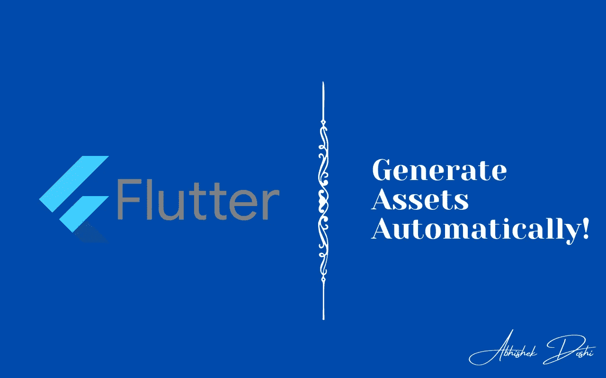
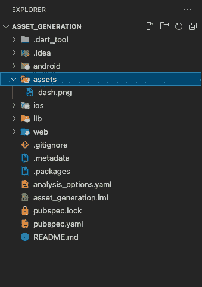
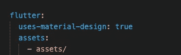

# 忘记资产的痛苦——波动💙

> 原文：<https://medium.com/google-developer-experts/forget-the-pain-of-assets-flutter-91414b9741aa?source=collection_archive---------0----------------------->

当我们使用资产时，添加所有的资产，然后在我们的 UI 中用所有的路径字符串等来使用它们，真的变得很痛苦。让我们看看如何自动生成资产，这样你就可以原谅这种痛苦了😉



所以，我们先来看看我们通常怎么做才能在我们的应用程序中拥有资产。资源可以是您想要使用的图像或字体。

# 方案一:手动痛！

所以在这里，我们通常做我们开始时学过的手工作业。因此，我们制造了痛苦😂

让我们看看怎样才能给自己制造痛苦！

## 步骤 1:将图像添加到资产文件夹



## 步骤 2:向 pubspec.yaml 添加图像



提及`assets/`将添加资产文件夹中所有可用的图像！

## 步骤 3:直接在代码中使用它

我们还创建了另一个名为`Page2`的页面，并在其中添加了相同的代码。

输出:


现在，让我们假设我想改变文件名。因此，一旦我更改了 assets 文件夹中的文件名，我还必须在每个添加了图像路径的地方对其进行重命名。那太痛苦了！！！在这个例子中，我们只有 2 个屏幕，所以这很容易，但当你有一个大型应用程序，你必须重命名资产，这将是一个巨大的任务！

# 选项 2:为资产创建一个常量变量！

现在我们正转向一些不太痛苦或更简单的解决方案。我们可以创建一个保存资产路径的常量变量，然后在我们的 UI 代码中使用它！

## 步骤 1:创建 constants.dart

```
class Constants {
  static String dashImage = 'assets/dash.png';
}
```

## 第二步:在第一页和第二页使用:

```
Center(
  child: Image.asset(Constants.dashImage),
),
```

在这种情况下，如果你想重命名文件，你只需要改变一个地方的路径，即在常数类！

# 方案三:动态生成资产！

现在是魔法时间了！！

## 第一步:在 pubspec.yaml 中添加 [flutter_gen](https://pub.dev/packages/flutter_gen)

首先，在依赖项中添加 flutter_gen，然后在应用程序的 dev_dependencies 中添加 flutter_gen_runner 和 build_runner。

## 步骤 2:生成资产

一旦你添加了包并运行了`flutter pub get`，就该生成资产了。在终端中运行以下命令:

```
flutter packages pub run build_runner build
```

这将创建一个文件夹`lib/gen`，在该文件夹中，将有一个名为`assets.gen.dart`的文件。该文件夹包含所有资产信息！

## 步骤 3:在代码中使用它

现在，要使用生成的资产，您可以通过以下方式访问它们:

```
Center(
   child: Image.asset(Assets.dash.path),
),
```

现在，在这种情况下，如果您重命名文件，只需再次运行命令，它就完成了！

希望你喜欢这篇文章！

如果这篇文章对你有帮助，并且你希望在你的应用程序中使用它，请随意克隆 [GitHub 库](https://github.com/AbhishekDoshi26/asset_generation)！

如果你喜欢，你可以 [**给我买杯咖啡**](https://www.buymeacoffee.com/abhishekdoshi26) **！**

[](https://www.buymeacoffee.com/abhishekdoshi26)

# 不要忘记通过以下方式与我联系:

*   [**Instagram**](https://www.instagram.com/abhishekdoshi26/)
*   [**推特**](https://twitter.com/AbhishekDoshi26)
*   [**LinkedIn**](https://www.linkedin.com/in/AbhishekDoshi26)
*   [**GitHub**](https://github.com/AbhishekDoshi26)

> 不要停止，直到你在呼吸！💙
> -阿布舍克·多希