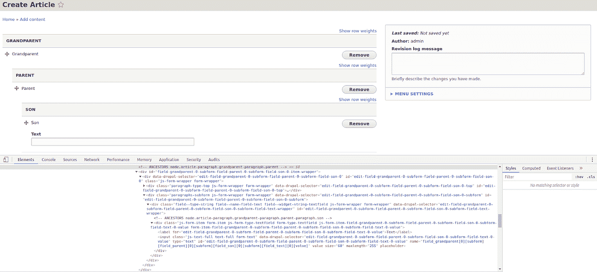
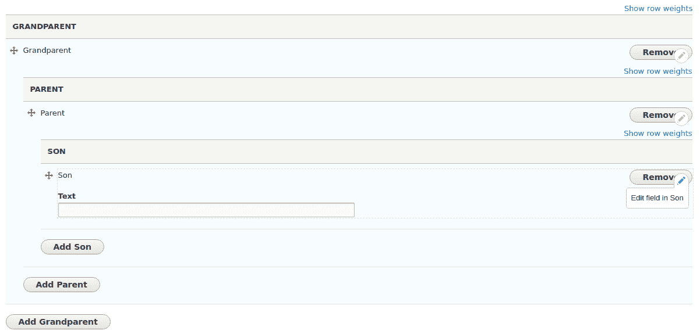
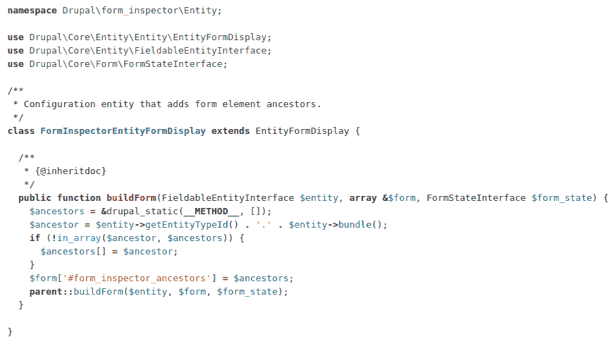
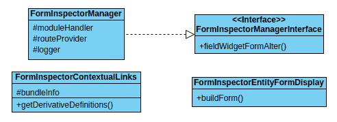
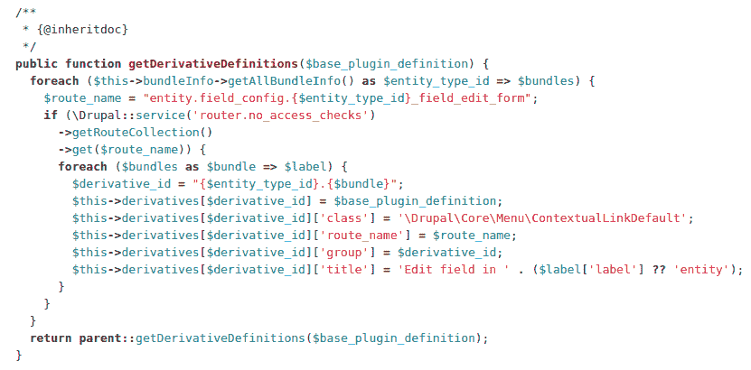

# 表单检查器模块，当表单增长失控时。为 Drupal 社区做贡献

> 原文：<https://medium.com/globant/form-inspector-module-when-forms-grow-out-of-control-contributing-to-the-drupal-community-7348d4c3ec46?source=collection_archive---------4----------------------->

Drupal 最大的吸引力之一是其不断增长和活跃的社区，这是毫无疑问的，感觉像这样的项目背后的一个忠诚和热情的团体的支持允许我们毫无保留地推荐它。正是因为这个原因，对 CMS 的改进和发展做出贡献是一个完美的选择，通过吸引新的开发者和增加这个大家庭的质量和数量来回馈一点已经收到的东西。

实现这一目的的良好实践是对编程经验进行详细的回顾性诊断，确定在整个开发过程中常见的需求或持续的困难。一旦发现，问自己一些问题是必要的，比如我在这些重复的任务中损失了多少时间？它们有必要吗？这个过程应该是怎样的？

在我的特殊情况下，很明显，优化表单管理将是改善我的工作和那些面对复杂和不断发展的表单的人的条件的一个极好的选择。

毫无疑问，Drupal 为使用表单的内容管理提供的多功能性是一个显著的优势，受到了开发人员和发行商的广泛重视。然而，当我们在不断扩展的项目中使用它们时，它们的管理会变得非常令人头疼。

尽管段落模块非常有助于为内容提供活力，并允许通过从较小的片段构建表单来重用字段，但过度使用它会导致强嵌套结构，在这种情况下，查找字段来源变得复杂。

为了使这种类型的表单的维护更容易，表单检查器已经到来，该模块通过 HTML 注释为开发人员提供了每个字段的祖先的清晰而精确的视图。通过这种方式，可以找到特定的字段位置，并对整个表单结构有一个总体的了解。

此外，该模块提供了上下文链接，允许您快速有效地编辑字段，无论它们是简单的输入字段还是精心制作的小部件。

其实现的第一步是通过在负责递归表单构建的方法中包含一个静态变量来存储每个字段祖先。在基于 EntityFormDisplay 的类中，变量的值被添加到表单属性中，以便在后续的更改中可以访问它。

接下来，实现了 FormInspectorManager，负责修改表单以添加 HTML 注释和上下文链接。确保 data-contextual-id 是唯一的非常重要，这样链接才能在多值段落字段中正确工作。

为了创建上下文链接，一个新的 FormInspectorContextualLinks 类负责为每个包生成派生。

这一单元的贡献是一次积极和丰富的经历。它挑战了我的技术知识，激发了我的创造力，并产生了强烈的归属感。总之，即使一个想法看起来简单而不重要，它也能对许多人的日常生活产生巨大的影响。只需要采取主动，开始建立一个能够将社区成员团结在同一目标周围的遗产，并持续一段时间。

更多信息，请访问[https://www.drupal.org/project/form_inspector](https://www.drupal.org/project/form_inspector)。