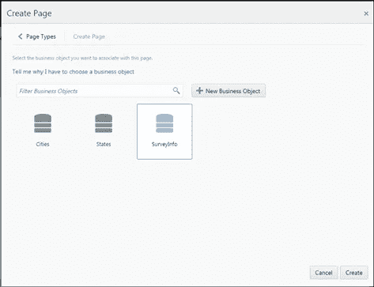

# Oracle Visual Builder Cloud Service 中带有依赖列表的表单

> 原文：<https://medium.com/oracledevs/forms-with-dependent-lists-in-oracle-visual-builder-cloud-service-c0dbccb996e0?source=collection_archive---------0----------------------->

依赖列表是现代表单的典型组件，有时需要显示选择列表，下拉列表中的值取决于用户在之前的选择列表中选择的值。一个常见的例子是根据用户选择的州值列出城市。在这篇博客中，我们重现了这个场景，并演示了 Visual Builder Cloud service 如何在用户调查表单中启用依赖列表。


Dependent Lists- Cities depend on value of State

## 数据模型

这个博客将展示一个数据模型，它允许读者理解不同的对象和数据值，以多种可能的方式构建数据模型来创建这个表单。可以有几种其他的数据建模方式，但基本概念将保持不变。

该应用程序利用三个自定义业务对象——州、城市和调查信息。Cities 通过引用字段引用州，如图所示。


State Reference in Cities Custom Business Object

同样，SurveyInfo 既引用州也引用城市。这允许用户查看所有州和城市的列表，并根据所选的州值调整城市值。

这些业务对象的详细结构可以在下图中看到。


Relationship Diagram between States, Cities and SurveyInfo Business Objects

州和城市已经填充了一些对应于美国州和城市的示例数据，类似于图表中所示


Sample Data in States Business Object


Sample Data in Cities Business Object

## 创建页面和自定义代码

在主登录页面上，选择创建一个“创建”类型的新页面。这一页是我们设计调查表的地方。


Configure a Create Page

出现提示时，将 SurveyInfo 对象与此页面相关联。



Associate SurveyInfo Business Object

将面板从左侧的组件面板拖放到画布上，以便为表单创建一个结构。(这是可选的)


Drag and Drop a Panel to the canvas

单击“数据”图标，将除城市之外的业务对象的所有必填字段拖放到面板中。


The Data tab on the palette allows users to drag and drop fields from associated Business Object

如下图所示对齐标签。将自定义代码拖放到状态下拉菜单正下方的面板中。“城市”下拉菜单的视图和模型代码是一个 JET 组合框组件，只需稍加修改即可将 VBCS 数据访问合并到自定义业务对象中。component = combobox&demo = foreach


Drag and Drop a Custom Code below the State Input Field

将下面的模型和模板或视图代码分别复制到自定义代码模型和模板部分。

自定义代码有三个关键代码片段-

1.**监听父下拉列表中的变化**

为了监听所选“State”值的变化，代码利用了 subscribe 方法。每当从下拉列表中选择的 State 值发生变化时，就会调用 subscribe 方法。

```
this._listener = this.pageViewModel.Observables.SurveyInfoEntityDetailArchetype. record.ref2State.subscribe(function(value) {..}
```

2.**使用 VBCS 操作 API**从定制业务对象获取数据

READ 方法根据任何给定的条件读取所有数据。根据选择的州值，可以使用操作 API 读取相应的城市。

关于 API 的更多信息可以在这里看到:[http://docs . Oracle . com/en/cloud/PAAs/app-builder-cloud/abcsb/module-API _ js _ operations . html](http://docs.oracle.com/en/cloud/paas/app-builder-cloud/abcsb/module-api_js_Operations.html)

```
var condition = Conditions.SIMPLE(ref2State, Operator.EQUALS, value);
var operation = Abcs.Operations().read({
entity: cities, 
condition: condition
 });
```

随后，带有城市的 observableArray 用于绑定到组合框。

**3。设定城市参考值**

valueChangeHandler 是在选项更改时调用的方法，是在原型记录中设置字段值的地方。在拖放输入字段中，这些值是自动设置的，但是因为我们使用组合框的自定义代码，我们必须手动设置。

```
self.valueChangeHandler = function (context, valueParam) { 
if (valueParam.option == “value”) { 
var $SurveyInfoEntityDetailArchetypeRecord = self.pageViewModel.Archetypes.SurveyInfoEntityDetailArchetype. getRecord(); $SurveyInfoEntityDetailArchetypeRecord.setValue(‘ref2City’, valueParam.value[0]); 
}//End If 
};//End Handler
```

这就完成了创建页面的设计。通过导航到“实时”模式并填充输入字段中的值来验证依赖列表场景


“Live” mode Survey page

点击保存并关闭。这将保存 SurveyInfo 自定义业务对象中的数据。导航到菜单中的业务对象以查看数据。


Data in SurveyInfo Business Object

至此，我们完成了带有依赖列表的表单的示例场景。可以修改代码以适应各种场景和多个下拉菜单。

要了解更多关于 Oracle Visual Builder 云服务的信息，请访问链接【https://cloud.oracle.com/ApplicationBuilder 

> 本文表达的观点是我个人的观点，不一定代表甲骨文的观点。