# Excel 中有哪些公式和函数，如何使用？

> 原文：<https://medium.com/edureka/formulas-and-functions-in-excel-ab1dce7628c1?source=collection_archive---------4----------------------->

只有当你能真正处理数据时，数据才会派上用场，而 Excel 是一种工具，无论是在你必须自己制定方程还是利用内置方程时，它都能提供极大的便利。在本文中，您将学习如何实际使用这些 Excel 公式和函数。

下面是对这里讨论的主题的快速浏览:

*   什么是公式？
*   编写 Excel 公式
*   编辑公式
*   复制/粘贴公式
*   隐藏 Excel 中的公式
*   运算符优先级 Excel 公式
*   Excel 中有哪些函数？
*   最重要的功能

# 什么是公式？

一般来说，公式是用符号来表示某些信息的一种浓缩方式。在 Excel 中，公式是可以输入到 Excel 工作表的单元格中的表达式，其输出显示为结果。

Excel 公式可以是以下类型:

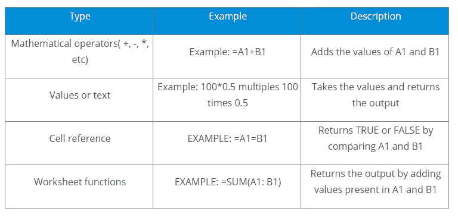

# 编写 Excel 公式:

要将公式写入 Excel 工作表单元格，您可以执行以下操作:

*   选择要显示结果的单元格
*   最初键入一个“=”号，让 Excel 知道您将在该单元格中输入公式
*   之后，您可以键入单元格地址或指定要计算的值
*   例如，如果要将两个单元格的值相加，可以按如下方式键入单元格地址:

*   您也可以选择要计算其总和的单元格，方法是在按住 Ctrl 键的同时选择所有所需的单元格:

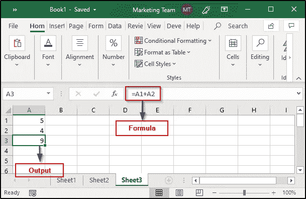

# 编辑公式:

如果您想要编辑一些先前输入的公式，只需选择包含目标公式的单元格，然后在公式栏中进行所需的更改。在前面的例子中，我已经计算了 A1 和 A2 的总和。现在，我将对其进行编辑，并更改公式以计算这两个单元格中的值的乘积:

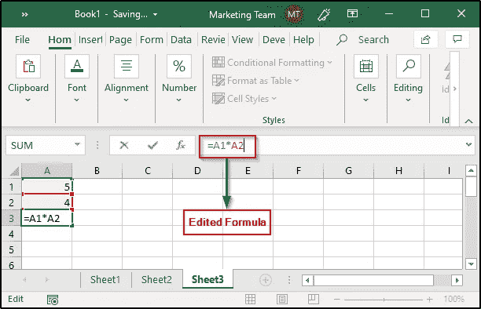

完成后，按 Enter 查看所需的输出。

# 复制或粘贴公式:

当你需要复制/粘贴公式时，Excel 非常方便。每当复制公式时，Excel 会自动处理该位置所需的单元格引用。这是通过一个叫做相对单元地址的系统来实现的。

要复制公式，请选择保存原始公式的单元格，然后将其拖到需要该公式副本的单元格，如下所示:

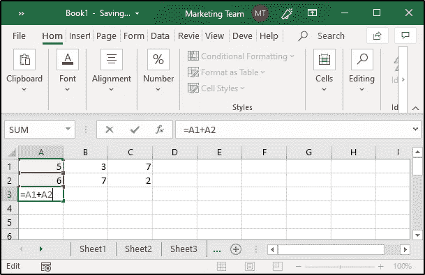

正如您在图像中看到的，该公式最初是用 A3 书写的，然后我沿着 B3 和 C3 向下拖动它，以计算 B2 的 B1 和 C2 的 C1 的总和，而没有专门写下单元格地址。

如果我更改了任何单元格的值，Excel 将根据相对单元格地址、绝对单元格地址或混合单元格地址自动更新输出。

# 隐藏 Excel 中的公式:

如果您想在 excel 表中隐藏一些公式，可以按如下方式操作:

*   选择要隐藏其公式的单元格
*   打开“字体”窗口并选择“保护”面板
*   选中隐藏选项，然后单击确定
*   然后，从功能区选项卡中，选择“审阅”
*   单击保护工作表(如果不这样做，公式将不起作用)
*   Excel 将要求您输入密码，以便取消隐藏公式供将来使用

# Excel 公式的运算符优先级:

Excel 公式遵循 BODMAS(括号顺序除法乘法加法减法)规则。如果您有一个包含括号的公式，括号中的表达式将在整个公式的任何其他部分之前被求解。请看下图:

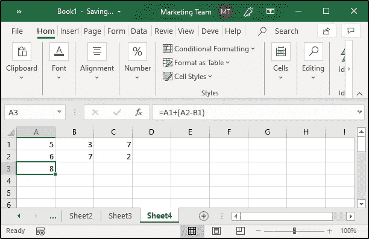

正如你在上面的例子中看到的，我有一个由括号组成的公式。因此，根据 BODMAS 规则，Excel 将首先找出 A2 和 B1 之间的差异，然后将结果与 A1 相加。

# Excel 中的“函数”是什么？

一般来说，函数定义了一个以某种给定顺序执行的公式。Excel 提供了大量的内置函数，可以用来计算各种公式的结果。

Excel 中的公式分为以下几类:

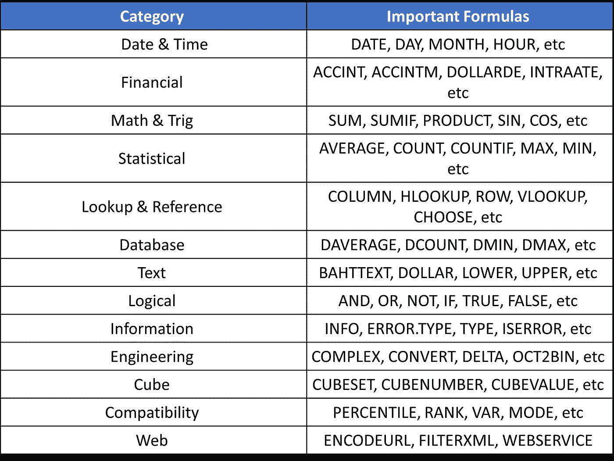

现在，让我们看看如何利用一些最重要和最常用的 Excel 公式。

# 最重要的 Excel 函数:

以下是一些最重要的 Excel 函数及其描述和示例。

## 日期:

Excel 中最重要且使用最广泛的日期函数之一是 Date 函数。它的语法如下:

*日期(年、月、日)*

该函数返回一个数字，该数字代表 MS Excel 日期-时间格式中的给定日期。日期函数可以按如下方式使用:

**举例:**

1.  =日期(2019，11，7)
2.  =DATE(2019，11，7)-7(返回当前日期—七天)

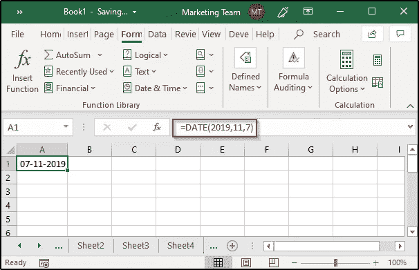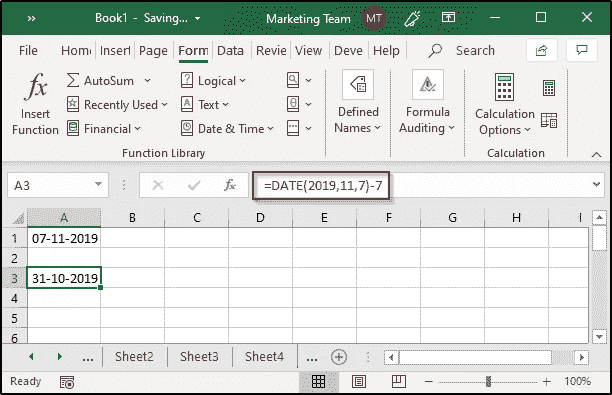

## 日期:

此函数返回一个月中的日值(1–31)。它的语法如下:

*日(序号)*

这里，serial_number 是要检索的日期。它可以以任何方式给出，例如由日期函数提供的某个其他函数的结果，或者单元格引用。

**举例:**

1.  =天(A7)
2.  =DAY(TODAY())
3.  =日(日期(2019，11，8))

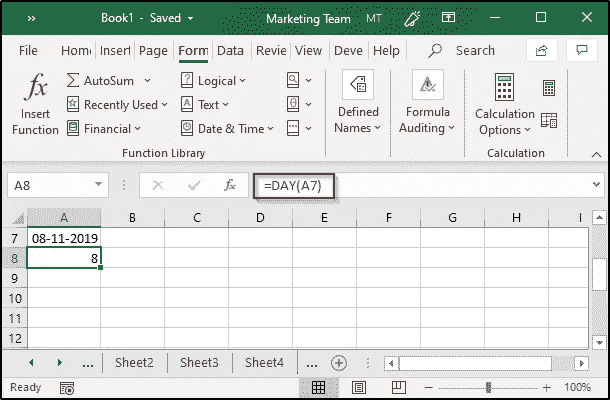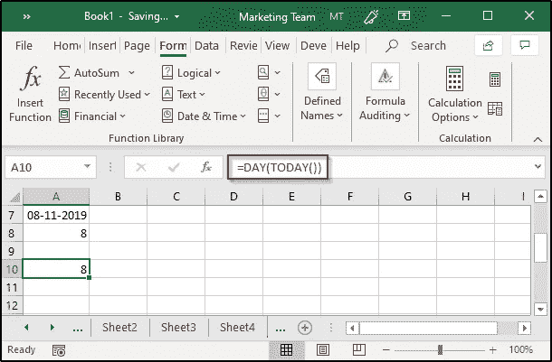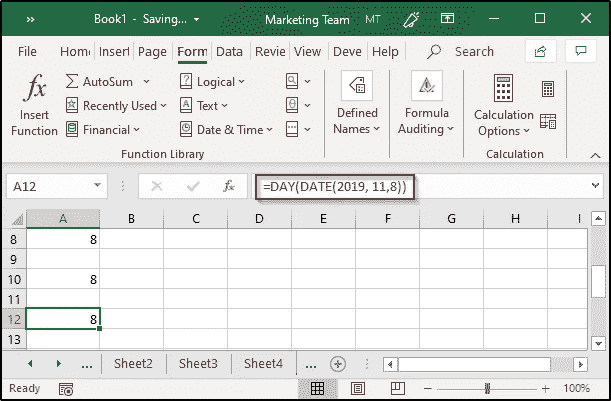

## 月份:

就像日函数一样，Excel 提供了另一个函数，即月函数，用于从特定日期检索月份。语法如下:

*月(序号)*

**示例:**

1.  =月(今天())
2.  =月(日期(2019，11，8))

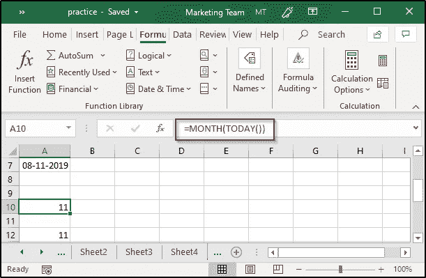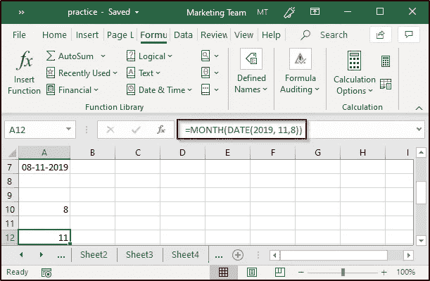

## 百分比:

众所周知，百分比是以 100 的分数计算出来的比率。它可以表示如下:

*百分比=(部分/整体)x 100*

在 Excel 中，您可以计算任何所需值的百分比。例如，如果 A1 和 A2 中有部分值和整体值，并且您想要计算百分比，您可以执行以下操作:

*   选择要显示结果的单元格
*   键入“=”符号
*   然后，键入公式 A1/ A2，并按回车键
*   从主页选项卡编号组中，选择“%”符号

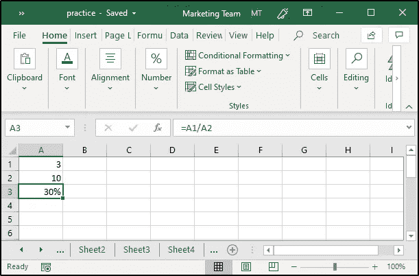

## 如果:

IF 语句是一个条件语句，当满足指定的条件时返回 True，当条件不满足时返回 Flase。Excel 提供了一个内置的“IF”函数来实现这一目的。其语法如下:

*IF(逻辑 _ 测试，值 _ IF _ 真，值 _ IF _ 假)*

这里，*逻辑测试*是要检查的条件

**举例:**

*   输入要比较的值
*   选择将显示输出的单元格
*   在公式栏中键入“=IF(A1=A2，“Yes”，“No”)”，然后按 enter 键

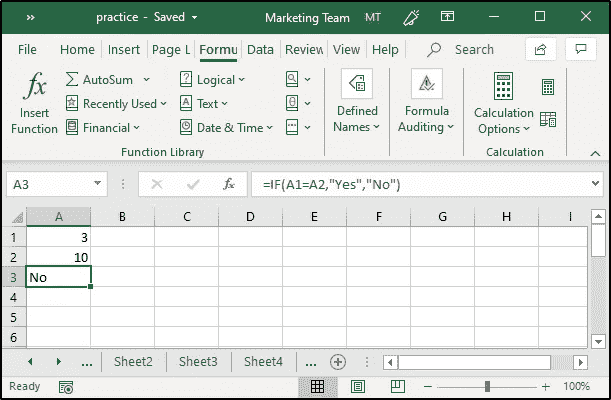

## VLOOKUP:

该函数用于从 Excel 表的列中查找和获取某些特定数据。VLOOKUP 中的“V”代表垂直查找。这是 Excel 中最重要也是最广泛使用的公式之一，为了使用这个函数，表格必须按升序排序。该函数的语法如下:

*VLOOKUP(查找值，表数组，列索引，数量范围，查找)*

在哪里，

**lookup_value** 是要搜索的值

**table_array** 是要搜索的表

**col_index** 是要从中检索值的列

**range_lookup** (可选)大约返回 TRUE。match 和 FALSE 表示完全匹配

**例如:**

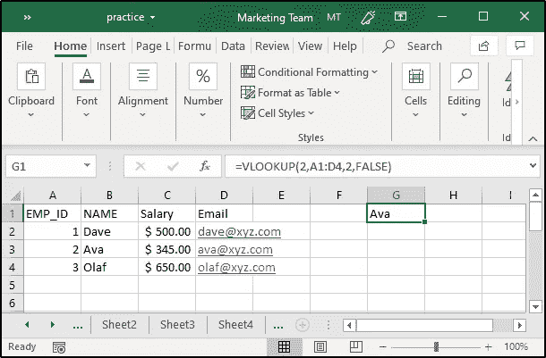

正如您在图像中看到的，我指定的值是 2，表的范围在 A1 和 D4 之间。我想获取雇员的姓名，因此我将列值设为 2，因为我希望它完全匹配，所以我使用 False 进行范围查找。

## 所得税:

假设你想计算一个人的总工资是 300 美元的所得税。您需要按照以下方式计算所得税:

*   列出工资总额、工资扣除额、应税收入和所得税的百分比
*   指定总薪资、薪资扣减
*   然后通过找出工资总额和工资扣除额之间的差额来计算应税收入
*   最后，计算税额

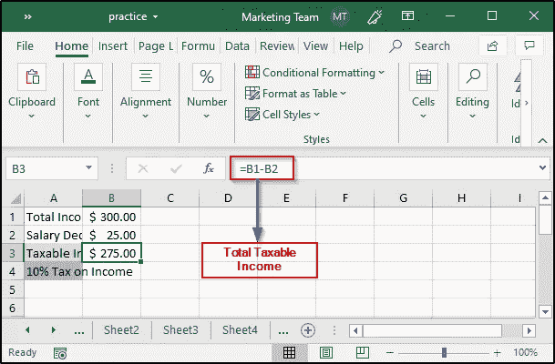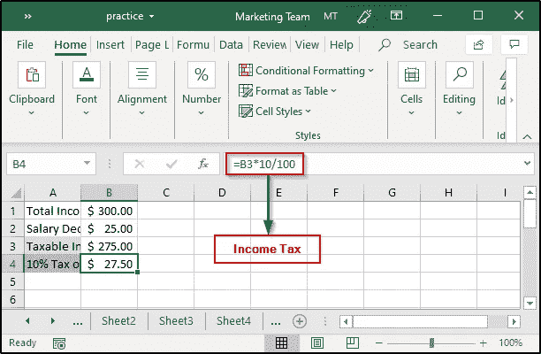

## 总和:

Excel 中的 SUM 函数通过将 Excel 中所有指定的值相加来计算结果。该函数的语法如下:

*SUM(数字 1，数字 2，…)*

将指定为参数的所有数字添加到其中。

**例子:**

如果你想计算你在购买蔬菜上花费的总数，列出所有的价格，然后使用如下的总数公式:

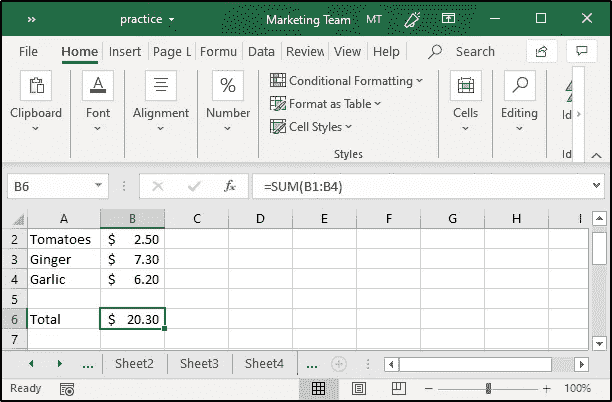

## 复利:

为了计算复利，你可以使用一个叫做 FV 的 Excel 公式。该函数将根据定期、恒定的利率和付款返回投资的未来值。该函数的语法如下:

*FV(利率、nper、pmt、pv、类型)*

为了计算利率，您需要将年利率除以周期数，即年利率/周期数。周期数或 nper 的计算方法是将期限(年数)乘以周期，即期限*周期。pmt 代表定期付款，可以是包括零在内的任何值。

考虑下面的例子:

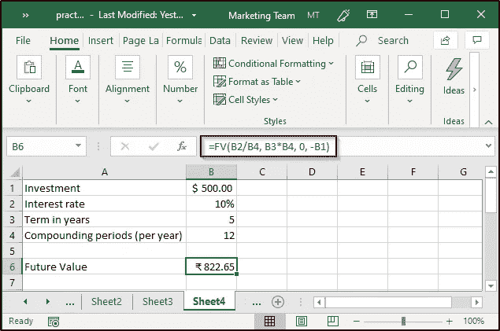

在上面的例子中，我计算了 500 美元的复利，利率为 10%，为期 5 年，并假设定期支付值为 0。请注意，我使用了-B1，意思是从我这里拿走了 500 美元。

## 平均值:

众所周知，平均值描述了多个值的中间值。在 Excel 中，可以使用名为“average”的内置函数轻松计算平均值。该函数的语法如下:

*平均值(数字 1，数字 2，…)*

**举例:**

如果您想计算学生在所有考试中获得的平均分数，您可以简单地创建一个表，然后使用平均值公式来计算每个学生获得的平均分数。

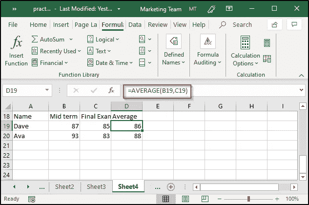

在上面的例子中，我计算了两个学生在两次考试中的平均分数。如果需要确定两个以上数值的平均值，只需指定这些数值所在的单元格范围。例如:

## 计数:

Excel 中的 count 函数将计算给定范围内包含数字的单元格的数量。该函数的语法如下:

*COUNT(值 1，值 2，…)*

**举例:**

如果我想从上一个示例中创建的表中计算包含数字的单元格的数量，我只需选择要显示结果的单元格，然后使用 COUNT 函数，如下所示:

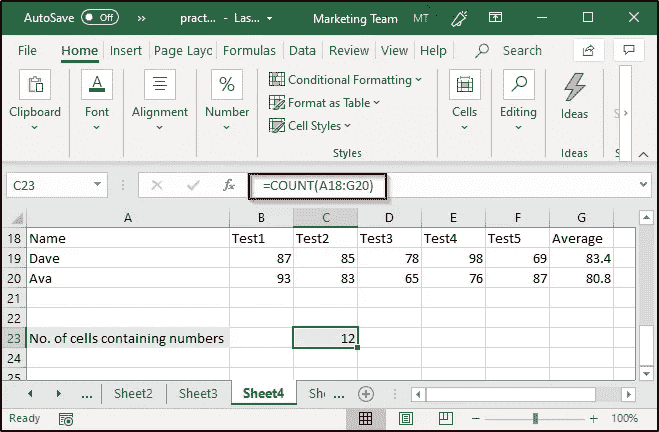

## 圆形:

为了将数值四舍五入到特定的小数位，可以使用 round 函数。该函数将返回一个数字，将其四舍五入到指定的小数位数。该函数的语法如下:

*ROUND(num，num_digits)*

**示例:**

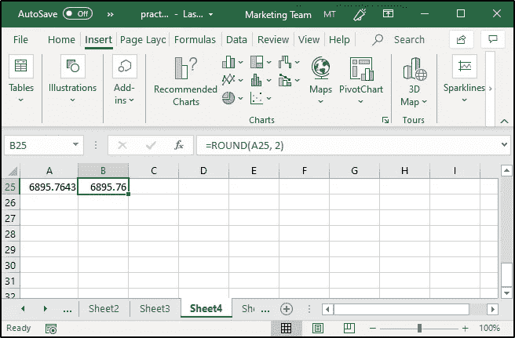

## 查找等级:

为了找到分数，你必须在 Excel 中使用嵌套的 IF 语句。例如，在平均示例中，我计算了学生在测试中的平均分数。现在，为了找出这些学生的成绩，我必须创建一个嵌套的 IF 函数，如下所示:

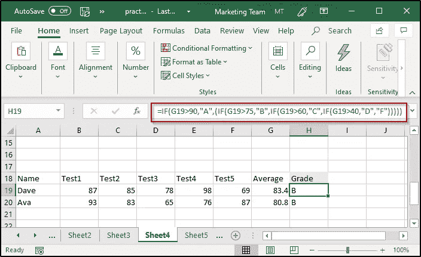

如您所见，g 列显示了平均分数。为了计算分数，我使用了一个嵌套的 IF 公式。代码如下:

=IF(G19>90，" A "，)(IF(G19>75，" B "，IF(G19>60，" C "，IF(G19>40，" D "，" F)))))

完成后，您只需将公式复制到所有要显示分数的单元格中。

## 排名:

如果你想知道一个班级的学生的排名，你可以使用 Excel 内置的公式，即排名。该函数将通过按升序或降序比较给定范围来返回指定范围的排名。该函数的语法如下:

*RANK(ref，number，order)*

**举例:**

正如您所看到的，在上面的例子中，我已经找到了值大于 80 的单元格的数量。您还可以为 criteria 参数提供一些文本值。

## 索引:

INDEX 函数返回指定范围内某个特定位置的值或单元格引用。该函数的语法如下:

*INDEX(array，row_num，column_num)* ***或***

*索引(引用，行数，列数，面积数)*

对于*数组*表单，索引函数的工作方式如下:

*   如果同时提供了行号和列号，它将返回交集单元格中的值
*   如果行值设置为零，它将返回指定范围内整列中的值
*   如果列值设置为零，它将返回指定范围内整行中的值

对于*参考*表单，索引功能工作如下:

*   返回行值和列值相交的单元格的引用
*   area_num 将指示在提供多个范围的情况下使用哪个范围

**例如:**

如您所见，在上面的示例中，我使用了 INDEX 函数来确定第 2 行第 4 列中 A18 到 G20 单元格区域的值。

同样，您也可以通过指定多个引用来使用 INDEX 函数，如下所示:

这就把我们带到了这篇关于 Excel 公式和函数的文章的结尾。我希望你清楚已经与你分享的一切。 ***一定要尽可能多的练习，还原经验。***

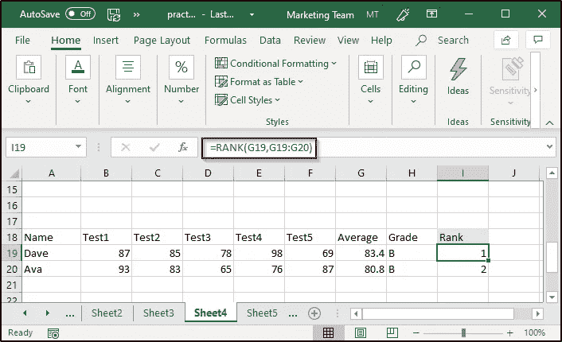

正如您所看到的，在上面的例子中，我已经使用 Rank 函数计算了学生的排名。这里，第一个参数是每个学生获得的平均分数，数组是该班所有其他学生获得的平均分数。我没有指定任何顺序，因此，输出将按降序排列。对于升序排列，您必须指定任何非零值。

## COUNTIF:

为了根据给定的条件对单元格进行计数，可以使用一个名为“COUNTIF”的内置 Excel 公式。该函数将返回给定范围内满足某些条件的单元格的数量。该函数的语法如下:

*COUNTIF(范围，标准)*

**例如:**

# [高级 MS Excel 2016 认证培训](https://www.edureka.co/advanced-ms-excel-self-paced)

[工作日/周末批量查看批量详情](https://www.edureka.co/advanced-ms-excel-self-paced)

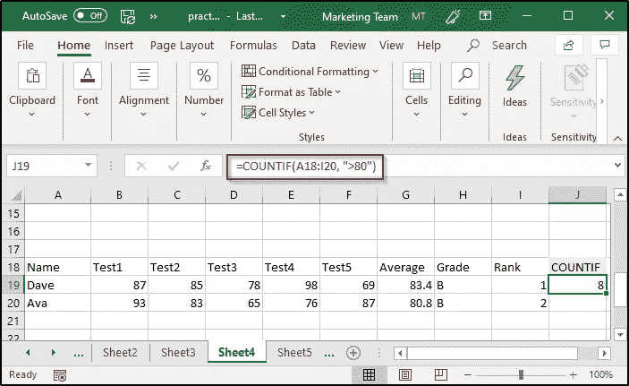

正如您所看到的，在上面的例子中，我已经找到了值大于 80 的单元格的数量。您还可以为 criteria 参数赋予一些文本值。

# 索引:

INDEX 函数返回指定范围内某个特定位置的值或单元格引用。该函数的语法如下:

*INDEX(array，row_num，column_num)* ***或***

*索引(引用，行数，列数，面积数)*

对于*数组*表单，索引函数的工作方式如下:

*   如果同时提供了行号和列号，它将返回交集单元格中的值
*   如果行值设置为零，它将返回指定范围内整列中的值
*   如果列值设置为零，它将返回指定范围内整行中的值

对于*参考*表单，索引功能工作如下:

*   返回行值和列值相交的单元格的引用
*   area_num 将指示在提供多个范围的情况下使用哪个范围

**例如:**

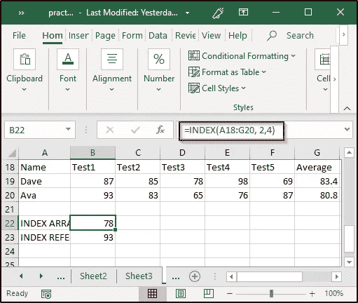

如您所见，在上面的示例中，我使用了 INDEX 函数来确定第 2 行第 4 列中 A18 到 G20 单元格区域的值。

同样，您也可以通过指定多个引用来使用 INDEX 函数，如下所示:

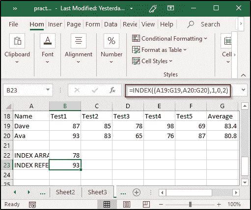

这就把我们带到了这篇关于 Excel 公式和函数的文章的结尾。我希望你清楚已经与你分享的一切。 ***一定要尽可能多的练习，还原经验。*** 如果你想查看更多关于人工智能、DevOps、道德黑客等市场最热门技术的文章，你可以参考 [Edureka 的官方网站。](https://www.edureka.co/blog/?utm_source=medium&utm_medium=content-link&utm_campaign=basic-excel-formulas-functions)

请留意本系列中解释 Excel 其他各方面的其他文章。

> *1。* [*利用 Excel 进行数据可视化*](/edureka/data-visualization-using-excel-724b96a8f85e)

*原载于 2019 年 11 月 26 日*[*https://www.edureka.co*](https://www.edureka.co/blog/excel-tutorial/)*。*