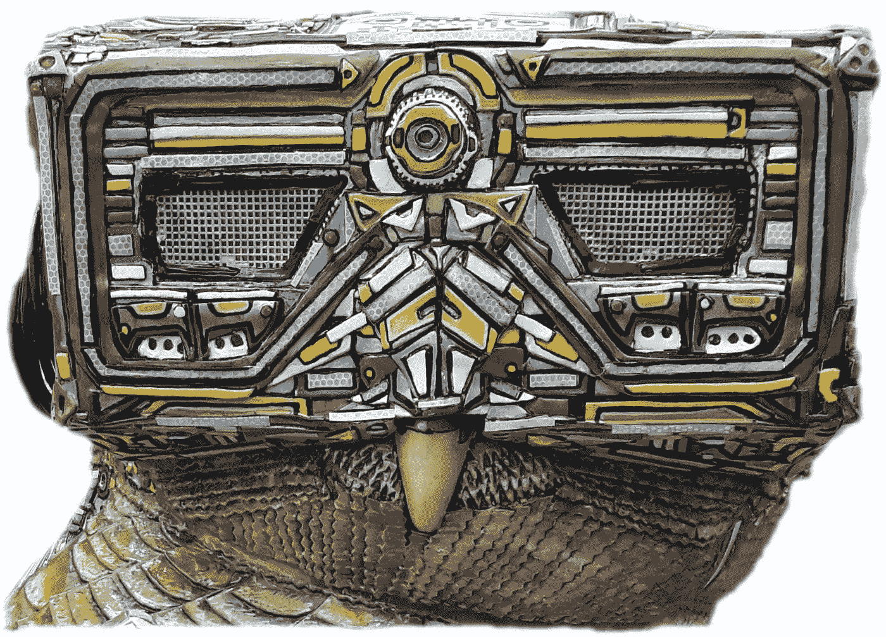

# 前沿控制论

> 原文：<https://medium.com/quick-code/forward-cybernetica-9303c4325be8?source=collection_archive---------7----------------------->

## 计算的个人历史—第 2 部分

Statue of a Cyborg Owl — Minerva’s Owls Bath Sculpture Trail | Bath, UK, Summer 2018

# 建立直觉的生物学实验

从开发人员/工程师的角度来看，机器学习有无数种方法可以访问，这些方法可能与统计学家或科学家使用的方法不同；最终的共同点是我们都喜欢写的代码。虽然，在…