# 高效使用草图库的四个步骤

> 原文：<https://medium.com/square-corner-blog/four-steps-to-use-sketch-libraries-efficiently-8aaaf2f08fb8?source=collection_archive---------4----------------------->

> 注意，我们已经行动了！如果您想继续了解 Square 的最新技术内容，请访问我们的新家[https://developer.squareup.com/blog](https://developer.squareup.com/blog)

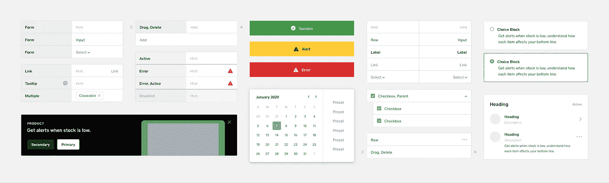

> 一个按钮的高度是多少？
> 
> 我在哪里可以找到这个日历？
> 
> 灰色是什么时候更新的？
> 
> 为什么标题大小不一致？

很长一段时间以来，共享 UI 库和系统是一个非常手工的过程，在维护和保持一切更新的努力下经常崩溃。陈旧的风格指南非常普遍；每次创建一个新的，每个人都会再次坚持，这一次，所有的东西都会保持最新。你知道之后会发生什么。

为了帮助解决这些问题，Square 的产品设计团队希望新发布的草图库能够帮助我们进一步开发设计系统。这是我们在设计 Square 的仪表板 web 体验演进的过程中学到的提高生产力和协作的四个步骤。

# 进行审计

要构建软件，通常需要个人或团队。创建一致体验的挑战随着多个参与者的增加而增加。不管一个系统有多成熟，总是需要新的解决方案和风格。这可能会导致体验不同。

为了避免这种情况，对你的生态系统中的每一个风格、组件和布局进行审核。收集从最新到最老的所有变化。对我们来说，我们发现了许多定制版本的颜色、字体比例、图标粗细、按钮大小等等。您可能会遇到外观不同但功能相似的组件。目标是提供一个具有良好定义和可重用组件的真实的单一来源。

统一的设计系统对于更好更快地构建是必不可少的:更好是因为内聚的体验更容易被用户理解，更快是因为它给了我们一个共同的工作语言。

*Avoid having component variations that share the same purpose.*

# 构建您的图书馆

## 高级文件夹

在 Square，我们的产品设计团队使用草图库来分享我们的风格、组件和布局。对于设计师来说，这是一种轻松跟上潮流的方式。风格指南分为两类——**桌面**和**移动**。每个类别都包括布局和组件，我们将会介绍。

明智地命名你的层。当您在名称中输入“/”时，Sketch 会自动将符号组织成组。这样，设计师就不需要为了维持一个集中的工作流程而不断地在类别之间切换。默认情况下，菜单项按字母顺序排序。在名称前添加标志符号将对列表项重新排序。当结构就位后，[符号管理器](https://github.com/sonburn/symbol-organizer)是一个很好的插件，可以组织你的符号页面和图层列表，既可以按字母顺序也可以分组。

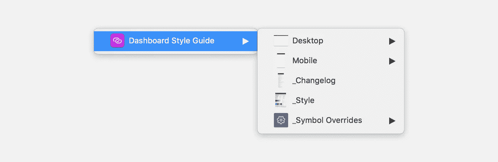

*Use the ‘_’ glyph before the name to push secondary content below.*

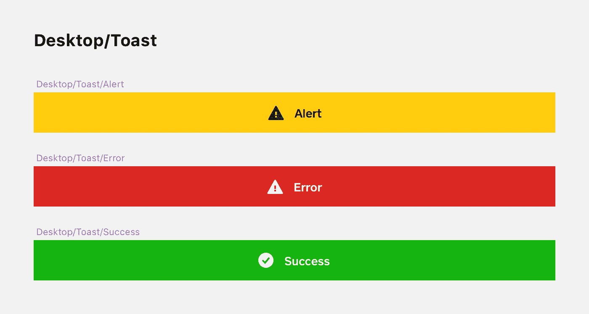

*Use ‘/’ to group components.*

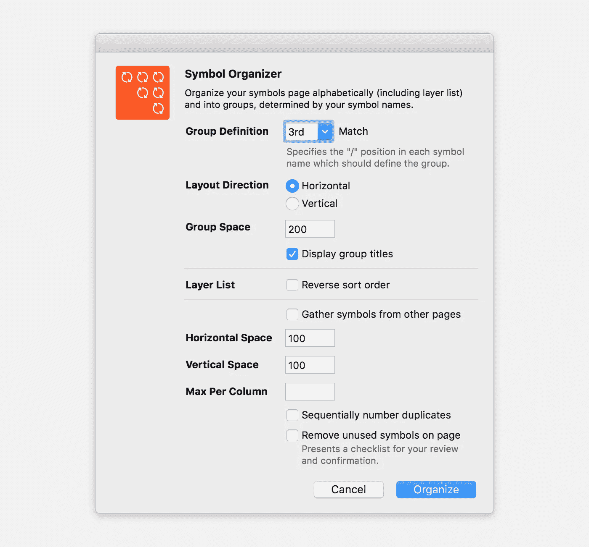

*Using* [*Symbol Organizer*](https://github.com/sonburn/symbol-organizer) *to automate arrange.*

弄清楚结构后，我们与 UI 工程师合作，为布局和组件找到一个通用名称。因此，设计和工程可以说同一种语言，这将有助于加速实现。

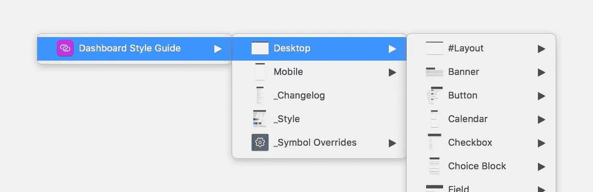

*Sketch and Code share the same component name.*

## #布局

设计师经常重复使用非常常见的布局。例如，在 Square Dashboard 上，布局定义得非常好——页面、菜单、刀片、模态和表。为了帮助设计者快速使用常用布局而无需重新创建它们，在桌面和移动设备下创建一个#Layouts 部分。这些布局应作为符号构建，并由较低级别的组件符号组成。要编辑布局，您可以使用右侧的检查器面板选择“从符号分离”,或者在双击符号后选择“从库取消链接”。然后，嵌套组件已准备好进行编辑，但仍保持与全局库的链接。

*Jump between layouts quickly before selecting ‘Detaching from Symbol’ with the Inspector panel.*

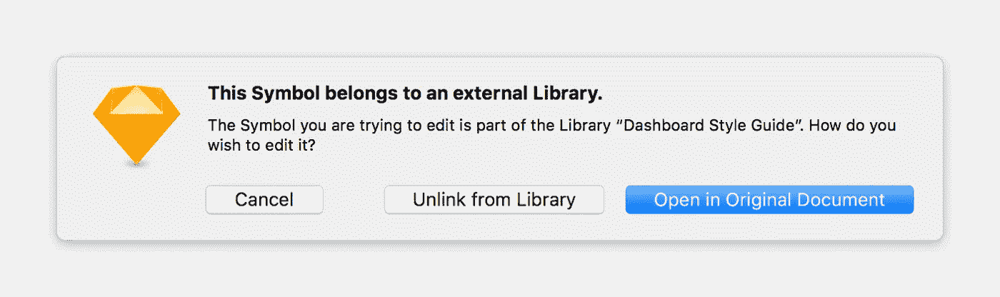

*Double-click the linked symbol and click Unlink from Library.*

## **组件:#所有和个人**

在每个组件中，#All 类别确实有助于发现。它是单个符号中组件的所有单个变体的组合。这有助于确定你在找什么。如果您已经知道要查找什么，您可以选择插入单个符号。

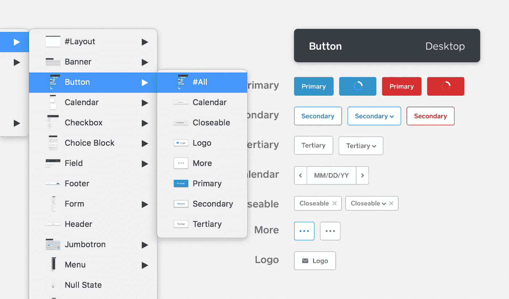

*Use the #All symbol to see the all the components in a collection.*

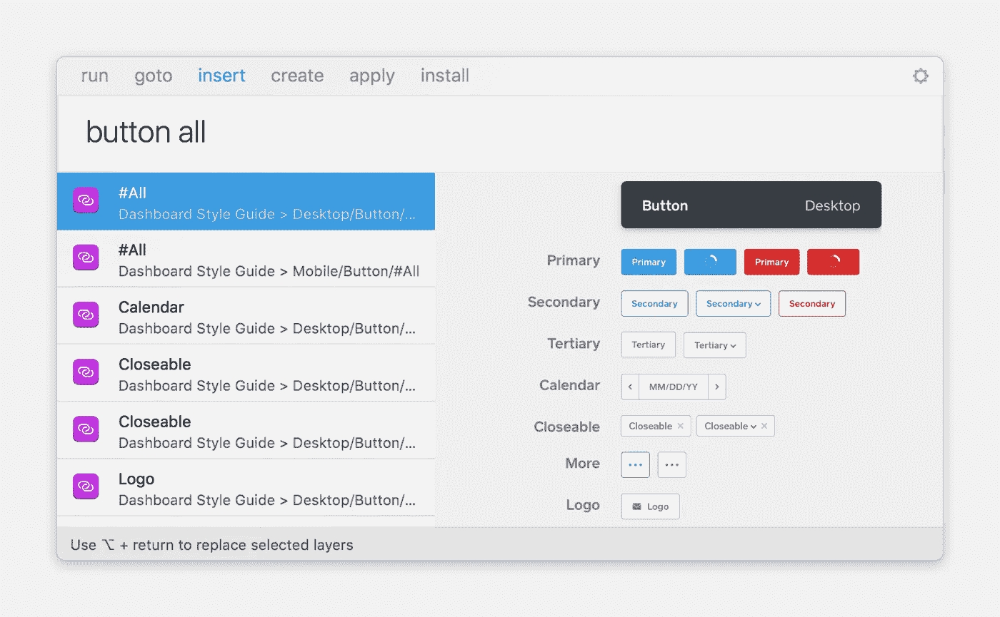

*With Sketch Runner, you can quickly add a collection or an individual symbol.*

# 允许变体

作为产品设计师，我们使用符号来创建和遵循我们自己的约束。一个有多种变化的形式依赖于一个良好组织和结构的系统。符号替代允许您自定义文本、颜色、边框和背景。这些替代是嵌套在符号中的子符号。当重写在组件中显式列出时，此方法可防止设计器断开符号。

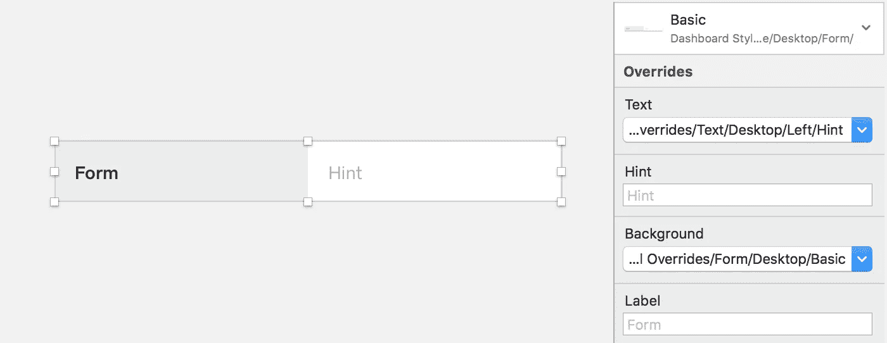

With one symbol, you can easily switch between states with symbol overrides. This Form consists of two child symbols, Text, and State.

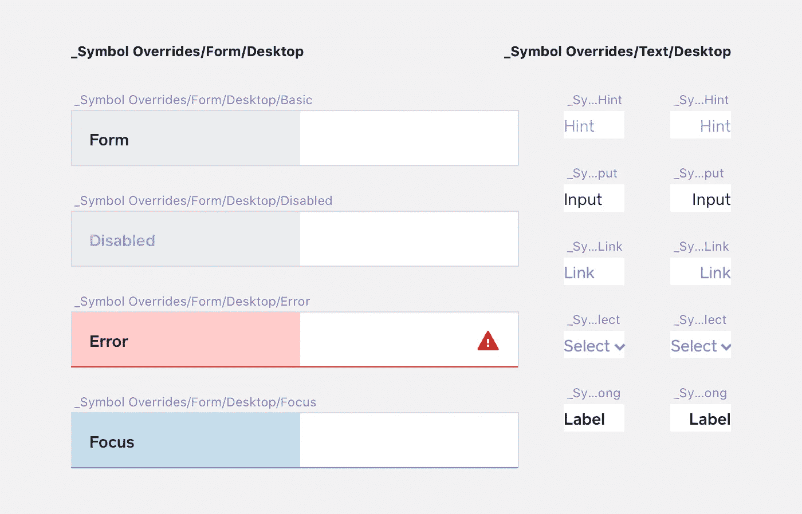

*Use similar artboard sizes to categorize child symbols. The Text symbols are reusable in other components.*

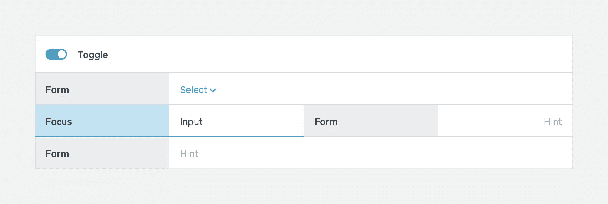

*Form borders have a right and bottom offset of 1px to stack seamlessly.*

# 沟通

没有解决所有问题的单一方法。有时，组件会针对特定的用例进行调整。设计师经常与工程师合作进行这些改变；如果几个产品团队都在这么做，就会产生一个组件的多个版本。为了避免这种情况，鼓励设计师和工程师在发布任何更改之前，先查阅 Square 的用户界面指南。这确保了一致的用户体验并保持了代码质量。

通过在草图库之前更新代码库，工程师将总是拥有最新的资产。这样，设计和工程之间的交流就很清楚了。对于设计，带有链接到样式指南的符号的草图文件可以通过单击进行更新。这是毫不费力和自动化的。但是，图层和字符样式目前不会从库中移植。我们使用一个风格符号来分享这些风格。这些样式的层有一个命名约定。当您在名称中输入“/”时，Sketch 会自动将样式组织成组。

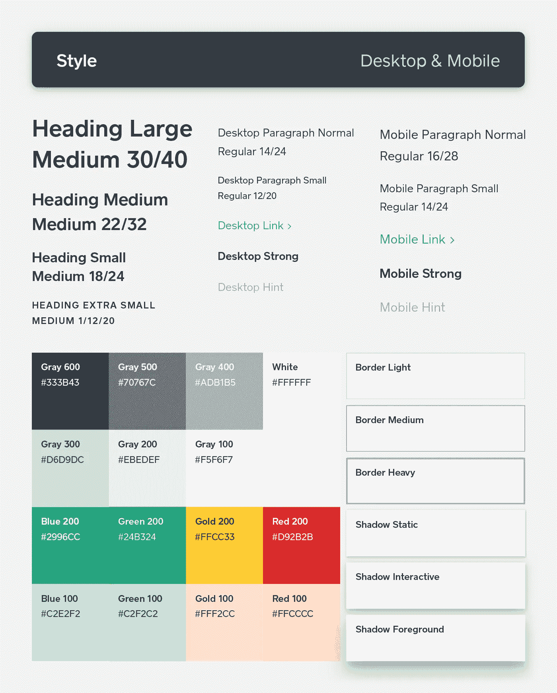

*Detach the symbol before adding the styles.*

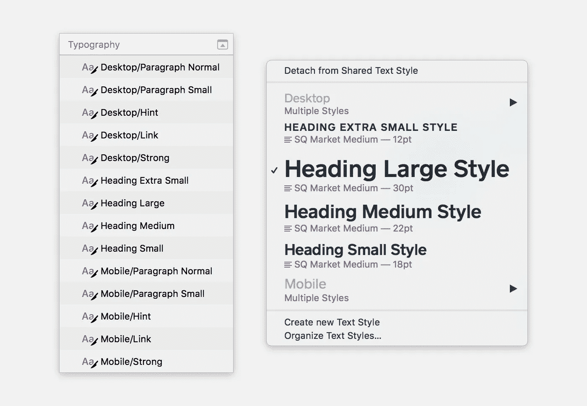

*Use ‘/’ to group character and layer styles.*

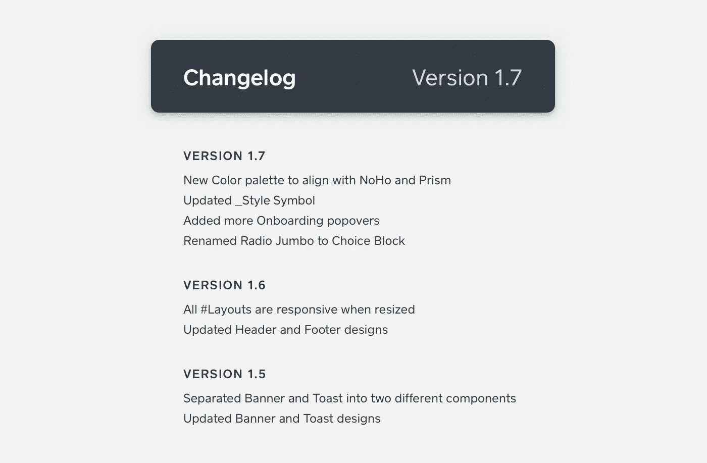

*Stay updated with changelog.*