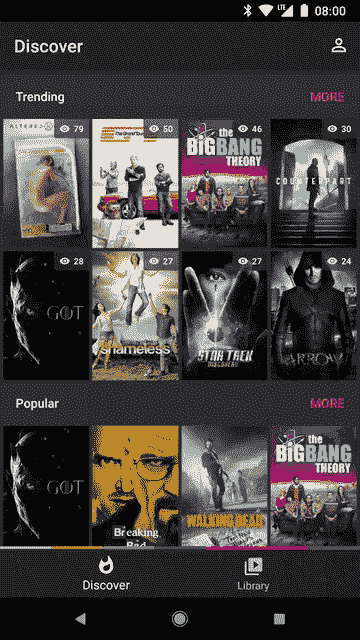
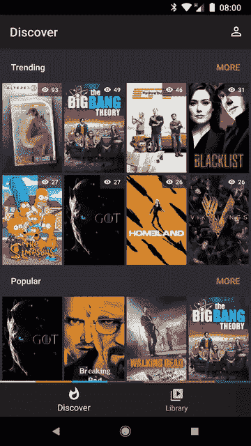

# 片段转换

> 原文：<https://medium.com/androiddevelopers/fragment-transitions-ea2726c3f36f?source=collection_archive---------1----------------------->

## 让他们工作


[Natures Glory](https://flic.kr/p/dmmUwS) by Dirkus

这是我探索如何让片段很好地过渡的一个小系列的第一篇文章。这篇文章就是要让他们跑起来。

几个月前，我展示了我正在开发的名为 Tivi 的应用程序的网格到网格的转换。

然而，在我设法做到这一点之前，我一直在为工作做任何过渡。在应用程序中，我对非边界变化使用片段变化，所以像扩展数据集和底部导航事件这样的事情。当数据类型发生重大变化时(例如，深入到单个项目的细节)，我开始一项活动。

你在上面看到的变化是一个片段替换。片段 A 是概览屏幕，然后当用户点击“更多”按钮时，它被片段 B 替换，片段 B 包含项目的完整网格。

我现有的片段事务代码如下所示:

```
supportFragmentManager.beginTransaction()
    .replace(R.id.home_content, fragment)
    .addToBackStack(tag)
    .commit()
```

还没什么令人兴奋的。

所以我查阅了转换 API 并添加了一些共享元素。在这种情况下，共享元素是包含海报的正方形图像:

```
supportFragmentManager.beginTransaction() 
    .replace(R.id.home_content, fragment)
    .addToBackStack(tag)
    .apply {
      for (view in sharedElementViews) {
        **addSharedElement(view)**
      }
    }
    .commit()
```

然后我在进入的片段(片段 B)上设置了一个共享元素转换。在这种情况下，我使用了一个 [ChangedBounds](https://developer.android.com/reference/android/support/transition/ChangeBounds.html) 来开始，因为视图刚刚从点 a 移动到➡️ B，并且改变了大小。

```
class GridFragment : Fragment() {
  override fun onCreate(savedInstanceState: Bundle?) { 
    super.onCreate(savedInstanceState)
    **sharedElementEnterTransition = ChangeBounds()**
  }
}
```

在这一点上，我乐观地期望它只是工作，但我实际上得到这个:



The enter transition doesn’t work, but the return does

因此，它在进入时根本不起作用，但在返回过渡时工作得很好。这是一个开始。

# 延缓

在这一点上，我想起了我的同事[尼克·布彻](https://twitter.com/crafty)以前在为[格纹](https://github.com/nickbutcher/plaid)写过渡时向我提起过的一些事情。特别是在视图准备好(布局、数据加载等)之前，不得不推迟转换。

所以我走了，在我的片段中加入了推迟和开始:

```
override fun onViewCreated(view: View, icicle: Bundle?) {
  // View is created so postpone the transition for now
  **postponeEnterTransition()**

  viewModel.liveList.observe(this) {
    controller.setList(it) // Data is loaded so we’re ready to start our transition
    **startPostponedEnterTransition()**
  }
}
```

我们必须对进入和退出的片段都这样做，以便进入(单击)和退出(后退按钮)都能按预期工作。

但是仍然没有进入跃迁。🤦

# 再订购

我在这里做了一点手脚，并联系了 Android 团队的活动片段转换先生[乔治·芒特](https://twitter.com/georgemount1)。他指出了我需要做什么来让它工作:*重新排序*。

事实证明，您必须为推迟的片段转换启用重新排序片段事务才能工作。幸运的是，这很容易做到(但很容易忘记):

```
supportFragmentManager.beginTransaction() 
  **.setReorderingAllowed(true)**
  .replace(R.id.home_content, fragment)
  .addToBackStack(tag)
  .apply { 
    for (view in sharedElementViews) {
      addSharedElement(view)
    }
  }
  .commit()
```

在那之后，输入过渡偶尔会工作，但大多数时候我只是得到一个交叉渐变。不过，至少现在过渡还在进行。

# 等待你的父母

在我的转换至少有时在运行的事实的激励下，我开始调试。我推断，在过渡运行的时候，视图已经被布置好(`isLaidOut == true`)并且已经被绘制好了。

所以这里的最后一块拼图是……*等待*。

如果您回顾我们的推迟调用，我们实际上是在数据加载后立即开始推迟的转换。我们需要给视图一个更新、布局的机会，更重要的是，在我们开始转换之前绘制视图。

所以我们新的延期电话变成了:

```
override fun onViewCreated(view: View, icicle: Bundle?) {
  // View is created so postpone the transition 
  postponeEnterTransition() viewModel.liveList.observe(this) {
    controller.setList(it)
    // Data is loaded so lets wait for our parent to be drawn 
    **(view?.parent as? ViewGroup)?.doOnPreDraw {**
      // Parent has been drawn. Start transitioning! 
      startPostponedEnterTransition()
    }
  }
}
```

您可能想知道为什么我们在父视图上设置`OnPreDrawListener`,而不是视图本身。那是因为你的视图可能实际上没有被画出来，因此听者永远不会发火，交易会永远推迟。为了解决这个问题，我们将侦听器设置在父节点上，这将(可能)被绘制出来。

瞧，我们有一个工作过渡:



It works!

你可能想知道为什么这看起来不像我上面的推文。我将在以后的文章中讨论这个问题。✨⚡.下一篇文章将着眼于获得窗口插入和片段转换。

如果你想知道`doOnPreDraw`方法来自哪里，它来自于 [android-ktx](https://github.com/android/android-ktx) 。如果你在你的应用中使用 Kotlin，一定要检查一下。