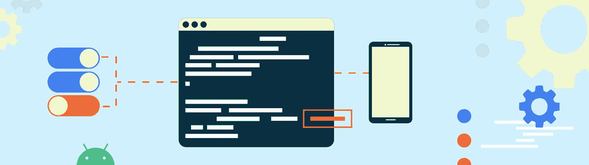
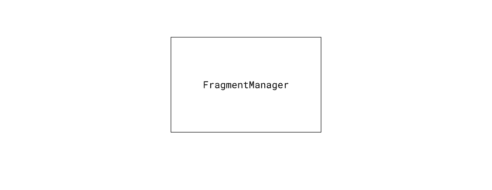
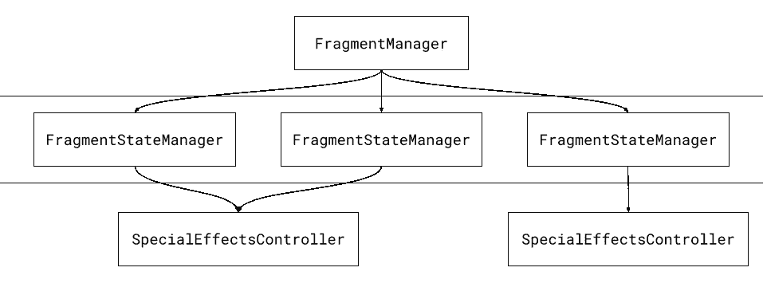

# 片段:重建内部

> 原文：<https://medium.com/androiddevelopers/fragments-rebuilding-the-internals-61913f8bf48e?source=collection_archive---------0----------------------->



## 介绍:新的状态管理器

多年来，片段比大多数 Android APIs 进化得更加有机。它们开始是 Android 平台本身的一部分，成为 Android 平台中的镜像存在和 Android 支持库的一部分，现在作为 Jetpack 的一部分作为 [AndroidX 片段](https://developer.android.com/jetpack/androidx/releases/fragment)单独存在。

> **注意**:你在任何情况下都不应该使用 Android 框架版本的碎片。除了在 Android 10 中被完全否决之外，在此之前的相当长一段时间内，它们都没有收到修复程序，并且被纳入框架中，预计不会有修复程序的反向移植或跨设备和 API 级别的一致性。

虽然[架构组件](https://developer.android.com/topic/libraries/architecture)已经接管了许多传统上需要片段的角色(比如使用`LifecycleObserver`进行生命周期回调，或者使用`ViewModel`进行保留状态)，但是如果你使用片段，你就要通过`FragmentManager`来添加、删除片段，并与之交互。

随着[碎片](https://developer.android.com/jetpack/androidx/releases/fragment#1.3.0-alpha08) `[1.3.0-alpha08](https://developer.android.com/jetpack/androidx/releases/fragment#1.3.0-alpha08)`，`FragmentManager`内部一些最重大的重组已经完成。这个版本用更小的、可测试的、可维护的(内部)类取代了过去直接存在于`FragmentManager`中的许多逻辑，其核心是`[FragmentStateManager](https://cs.android.com/androidx/platform/frameworks/support/+/androidx-master-dev:fragment/fragment/src/main/java/androidx/fragment/app/FragmentStateManager.java?ss=androidx)`。

> **注意:**我将在这篇文章中谈论很多关于`FragmentManager`的内部情况。TL/DR:如果您发现任何回归，请尽快额外关注带有片段`1.3.0-alpha08`和[文件问题](https://issuetracker.google.com/issues/new?component=460964)的回归测试。

这个新的状态管理器负责片段的一些非常关键的部分:

*   通过它们的生命周期方法移动片段
*   运行动画和过渡
*   处理延期交易

我们彻底研究了这些系统以前是如何工作的，发现[它们缺少](https://issuetracker.google.com/issues/147749580)，并从头开始重写它们。他们现在比以往任何时候都更好，我们能够解决 10 多个长期存在的相关问题，内部重组为在单个 `[FragmentManager](https://issuetracker.google.com/issues/80029773)`和[中构建对多个后台堆栈的支持扫清了道路](https://youtu.be/RS1IACnZLy4?t=956)[简化了片段生命周期](https://issuetracker.google.com/issues/80029773)。

# FragmentManager 的 moveToState()

每个`FragmentManager`都与一个主机相关联。在绝大多数情况下，对于片段来说，这是一个`FragmentActivity`(有一整层的`FragmentController`和`FragmentHostCallback`用于构建你自己的定制主机，但是让我们在这里避免讨论)。随着活动移动到`CREATED`、`STARTED`和`RESUMED` , `FragmentManager`将那些变更向下分派到它的片段。这就是`moveToState()`的作用。

当然，这并不那么简单。有许多条件逻辑来确定片段应该处于什么状态——活动生命周期状态(或者嵌套片段的父片段的状态)只是第一部分，是片段可以处于的最大状态。这个最大值是为了确保活动、片段以及它们的子片段的生命周期都被恰当地嵌套。

因此，我们在[简化](https://issuetracker.google.com/139536619) `[moveToState()](https://issuetracker.google.com/139536619)`的第一步是将所有的逻辑整合到一个地方。就这样诞生了`[FragmentStateManager](https://cs.android.com/androidx/platform/frameworks/support/+/androidx-master-dev:fragment/fragment/src/main/java/androidx/fragment/app/FragmentStateManager.java?ss=androidx)`。每个片段实例都与一个`FragmentStateManager`联系在一起。通过在内部引入这个类，我们能够将许多与片段交互的代码(比如调用片段的`onCreateView`和其他生命周期方法)从`FragmentManager`本身中取出。

这种分离还允许我们编写一个方法，这个方法将获取所有向后兼容的所需逻辑，以确定片段实际上应该处于什么状态，并将它集中在一个地方:`[computeExpectedState()](https://cs.android.com/androidx/platform/frameworks/support/+/androidx-master-dev:fragment/fragment/src/main/java/androidx/fragment/app/FragmentStateManager.java;l=165?ss=androidx)`。这种方法跟踪所有的当前状态，并确定片段应该处于什么状态。98%的时候，它与主机/父片段处于相同的状态，但这 2%对于那些构建在片段上的应用程序来说有很大的不同。

然而，我们遇到了一种情况，我们没有办法确定正确的状态:推迟的片段。

# 延期片段

无论好坏，片段继承了许多与活动相同的术语和 API 表面。这种继承的一部分是关于过渡和推迟进入过渡直到你准备好的能力。这对于共享元素的过渡是至关重要的(在开始过渡到那个位置之前，您真的希望加载一个图像，以了解它在屏幕上的尺寸和位置)，但也允许您确保更密集的加载调用不会与您的过渡同时发生，从而避免 jank。

被推迟的片段有两个重要的特性:

1.  它的视图已创建，但不可见
2.  它的生命周期在`STARTED`结束

一旦您调用`startPostponedEnterTransition()`，片段的转换将运行，视图将变得可见，并且片段将能够移动到`RESUMED`。事实上，这正是新的状态管理器所做的，但是以前片段不是这样工作的。引用[推迟的片段使片段和片段管理器处于不一致的状态 bug](https://issuetracker.google.com/147749580) :

> 当使用`postponeEnterTransition()`延迟一个片段时，预期的行为是该片段被添加到的容器不运行任何进入动画或先前排队的退出动画(例如，对于一个`replace()`操作)，直到该片段调用`startPostponedEnterTransition()`。还期望该片段在其容器被推迟时不会达到`RESUMED`状态。
> 
> 然而，看起来 FragmentManager 不仅仅是在做这件事，而是将这个片段和整个 FragmentManager 移动到一个奇怪的、不一致的状态。
> 
> 也就是说，任何触及被推迟片段的容器的 FragmentTransaction 都被“回滚”(即，反向完成)，但是这些片段实际上并没有移动到它们正确的状态。

这导致了一连串的问题:

*   片段的视图被创建，但是片段没有被添加(`isAdded()`返回 false)
*   `findFragmentById()`不会返回新添加的片段，即使使用了`commitNow()`
*   当 FragmentManager 启动时，停留在这种中间状态的片段不会启动([https://issuetracker.google.com/issues/129035555](https://issuetracker.google.com/issues/129035555))
*   碎片事务可以无序执行([https://issuetracker.google.com/issues/147297731](https://issuetracker.google.com/issues/147297731))
*   容器上的其他动画(例如先前启动的 pop 动画)仍然运行([https://issuetracker.google.com/issues/37140383](https://issuetracker.google.com/issues/37140383))
*   `onCreateView()`可称为第二次([https://issuetracker.google.com/issues/143915710](https://issuetracker.google.com/issues/143915710))

实际上，修复这些问题意味着用一个保持`FragmentManager`一致、最新状态的系统来替换被推迟片段使用的整个回滚过程，同时仍然保持被推迟片段的重要质量。

# 在容器级别工作

`FragmentManager`有一个很好的属性(读起来很方便，但是作为维护者来说并不有趣),它允许你在你想要放置片段的地方传入任何容器 ID。甚至对于一个单独的`FragmentTransaction`，你可以`add`一个片段到一个容器，`remove`另一个来自不同的容器，`replace`第三个容器的最上面的片段，等等。当涉及到动画片段的输入/输出时，问题就来了——这种事情只发生在容器级别。

片段支持许多动画系统:

*   旧的[终结了](https://issuetracker.google.com/163084315#comment4)框架`Animation` API
*   框架`Animator` API
*   框架`Transition` API(只有 API 21+，也很烂)
*   [AndroidX](https://developer.android.com/jetpack/androidx/releases/transition)API

正如你可能知道的，命名是计算机科学中最困难的问题之一，所以当我们去构建一个可以控制所有这些 API 的类时，花了一段时间才决定使用`[SpecialEffectsControlle](https://cs.android.com/androidx/platform/frameworks/support/+/androidx-master-dev:fragment/fragment/src/main/java/androidx/fragment/app/SpecialEffectsController.java)r`(谢天谢地，这个类不是公共 API 的一部分，所以名称仍然会改变)。这个类存在于容器级别，协调所有与进入和退出片段相关的“特殊效果”。

`SpecialEffectsController`是关于该容器应该发生什么的唯一来源。这意味着如果最上面的添加片段被推迟，整个容器也被推迟。在`FragmentManager`层不需要更多的逻辑，也不需要任何事务回滚(正如我们提到的，这会影响多个容器)。因此，`FragmentManager`处于正确的状态，我们仍然得到被推迟片段的所有特殊属性。

然后，这个基础 API 允许我们将 fragment 拥有的所有疯狂的特效 API 集中到一个负责运行过渡、动画和动画师的`[DefaultSpecialEffectsController](https://cs.android.com/androidx/platform/frameworks/support/+/androidx-master-dev:fragment/fragment/src/main/java/androidx/fragment/app/DefaultSpecialEffectsController.java)`中。再一次，将过去分散在`FragmentManager`的逻辑转移到一个地方。

# 那么，“新国家经理”意味着什么

嗯，这意味着代替这种架构:



The old state manager: everything is in FragmentManager

它看起来更像这样:



The new state manager: FragmentManager talks to individual FragmentStateManager instances, which coordinate with other fragments in their container via SpecialEffectsController

通过拆分`FragmentManager`的内部，每一层的逻辑都得到了极大的简化:

*   `FragmentManager`只有适用于所有片段的状态
*   `FragmentStateManager`在片段级别管理状态
*   `SpecialEffectsController`管理容器级别的状态

这种职责分离让我们将测试套件扩展了近 30%,覆盖了更多几乎不可能单独测试的场景。

# 我应该期待行为改变吗？

**否**。事实上，我们针对新旧状态管理器运行了大量的内部片段测试，以确保我们有一套强大的回归测试。

然而，如果你依赖于不一致的状态，一个被推迟的片段将`FragmentManager`放入其中，那么是的，你会发现你现在实际上获得了正确的状态。作为[发行说明](https://developer.android.com/jetpack/androidx/releases/fragment#1.3.0-alpha08)的一部分，您将找到与新状态管理器相关的错误修复列表，因此请仔细查看，以确保您的问题不是由您自己对旧的错误行为的解决方法引起的，您现在可以删除这些错误行为。

类似于对[片段](https://developer.android.com/jetpack/androidx/releases/fragment#1.2.0) `[1.2.0](https://developer.android.com/jetpack/androidx/releases/fragment#1.2.0)`中`onDestroyView`计时的更改，新的状态管理器将使您的片段保持在`STARTED`状态，直到其过渡/动画/动画制作者/特效全部完成，从而使所有片段保持一致，无论它们是直接推迟还是因为同一容器中的其他片段而推迟。

# 如果我*确实*看到了行为变化怎么办？

升级到[片段](https://developer.android.com/jetpack/androidx/releases/fragment#1.3.0-alpha08) `[1.3.0-alpha08](https://developer.android.com/jetpack/androidx/releases/fragment#1.3.0-alpha08)`后，默认启用新的状态管理器。如果您发现应用程序中存在差异，第一步是通过使用新的实验性 API 来查看它是否与新的状态管理器相关:

```
FragmentManager.enableNewStateManager(false)
```

这个 API 是回到旧世界的一个出口，让您验证您看到的任何更改都与新的状态管理器相关联。这解除了您升级片段`1.3.0-alpha08`的障碍，并让您构建一个示例项目，该项目再现了当您[针对片段](https://issuetracker.google.com/issues/new?component=460964)提交问题时可以附加的问题。

> 注意:`FragmentManager.enableNewStateManager()` API 是**实验性的**。这意味着它不被认为是片段的稳定 API 表面的一部分，可以在**任何**点移除。删除所有的旧代码是一个重要的代码减少，但是考虑到做好这一点的重要性，我们可能不会删除 API，直到 Fragment 1.3.0 稳定发布之后——也就是说，考虑在 Fragment 1.3.1 发布中删除它。

在 11 个月的时间里，有超过 100 个单独的变更，这绝对是一段时间以来最大的内部变更，并且为我们建立了一个更加可维护、可持续和可理解的代码库。这意味着跨片段的更一致的行为，以及在构建应用程序时可以依赖的坚实基础。如果你能继续[提交问题](https://issuetracker.google.com/issues/new?component=460964)并提供反馈，以确保这个新的状态管理器是最好的，我们将不胜感激。