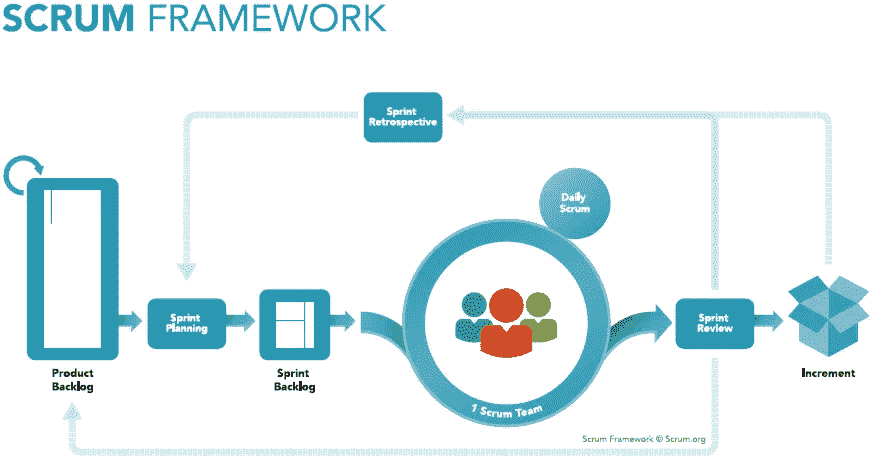
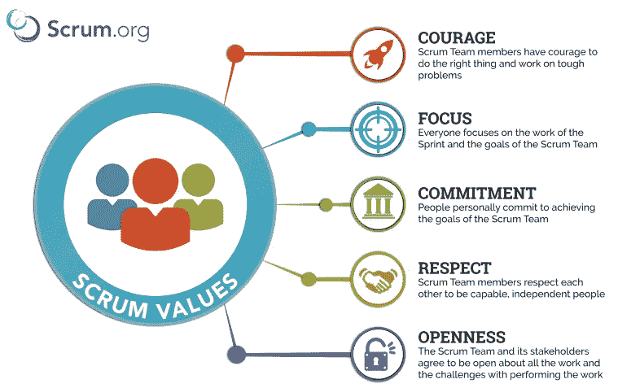

# Berkenalan dengan Scrum

> 原文：<https://medium.easyread.co/framework-scrum-d3a11ae1629d?source=collection_archive---------0----------------------->

## Apa itu Scrum?

Saat pertama kali mendengar kata “ *scrum* ” di tempat saya magang, saya merasa *WOW* . Akhirnya saya bisa merasakan secara *real* bagaimana *scrum* yang sesungguhnya, tidak hanya meraba-raba melalui teori belaka saja (itupun masih abu-abu).

***Nah, setelah merasakan secara real bagaimana scrum itu diterapkan, sebelumnya apa sih framework scrum itu?***

Menurut [scrum.org](http://scrum.org) ,

> “ Scrum is a framework within which people can address complex adaptive problems, while productively and creatively delivering products of the highest possible value.”

Yang berarti *scrum* itu adalah cara kerja beberapa orang (dari berbagai latar belakang pekerjaan) yang tergabung dalam satu tim, fokus dalam memberikan hasil kerja yang produktif, kreatif, memiliki *value* yang setinggi mungkin dan dapat beradaptasi dengan cepat terhadap setiap perubahan ( *flexible* ). Biasanya dalam satu tim *scrum* tidak melebihi lebih dari 10 -12 orang. Supaya setiap anggota tim dapat lebih fokus dan saling menghargai. Jika terlalu banyak anggota dalam tim, maka semakin besar peluang anggota untuk tidak saling peduli.

Saya ingin berbagi pengetahuan mengenai penerapan *framework scrum* berdasarkan pengalaman di perusahaan saya magang sebagai *IT Developer* . Dari *sharing session* saya bersama para *scrum master* di perusahaan tempat saya magang, penerapan *scrum* dapat berbeda-beda dan disesuaikan dengan kebutuhan perusahaan, tetapi tidak boleh berbeda jauh dengan *framework* aslinya.

Sebelumnya saya ingin menjabarkan terlebih dahulu *scrum role* yang ada di perusahaan.

*   S *crum master.* Di setiap perusahaan yang menerapkan *framework scrum* pada setiap tim/divisi yang ada diperusahaan tersebut, pastinya (wajib) ada yang namanya *scrum master* . Tugas dari *role* ini ialah memastikan bahwa setiap harinya dalam setiap kegiatan, semua anggota tim yang termasuk dalam tim *scrum* melaksanakan *framework scrum* . *Scrum master* juga dapat dikatakan sebagai fasilitator tim, yaitu membantu setiap anggota tim untuk lebih mengerti teoritikal dari *scrum* dan implementasinya. Selain itu, *scrum master* juga bertanggung jawab untuk memimpin tim agar tim dapat lebih *mature* dalam menjalankan *scrum framework.*
*   *Product Owner* (PO). Kalau didivisi saya magang, PO itu adalah orang yang mengerti secara bisnis apa yang dikerjakan oleh tim dan bagaimana pengaruh setiap pekerjaan yang dilakukan tim terhadap keberlangsungan bisnis perusahaan, yah dapat dikatakan PO itu *master-* nya bisnis dalam tim. Tugas dari PO ini membuat *Product Backlog,* seperti daftar pengembangan bisnis yang akan berdampak terhadap pekerjaan tim yang akan dikerjakan oleh tim. *Product Owner* juga menyampaikan setiap progress pekerjaan tim terhadap *client* (pengguna) dari produk yang dikerjakan/dikembangkan oleh tim.
*   *Development team* . Disini kami terdiri dari beberapa latar belakang pekerjaan, yaitu *Back End Developer, Front End Developer* (Android dan iOS), *System Analyst, Software Tester* , UI/UX *Designer* . Di bagian inilah saya berada, yaitu sebagai *Back End Developer* . Pertama kami bertugas untuk memberikan penilaian tingkat kesulitan setiap *backlog* yang dibuat oleh PO. Kemudian kami melist *backlog* mana saja yang akan kami kerjakan selama satu *sprint.* Biasanya satu sprint dilaksanakan dalam dua minggu sesuai dengan kemampuan tim. Tahapan ini dinamakan *sprint planning* dan menjadikannya sebagai *sprint backlog.* Setelah itu, kami mengerjakan setiap *task* yang telah kami *commit* untuk mengerjakannya.

Setiap hari dalam dua minggu *sprint* berjalan, tim akan melakukan *daily standup* (kami melaksanakannya di pagi hari) yang dimana setiap anggota *development* mengkomunikasikan pekerjaan yang dilakukan pada hari sebelumnya dan apa yang akan dikerjakan pada hari ini, serta apa saja masalah/kendala yang dihadapi setiap anggota selama mengerjakan pekerjaannya. Hal ini bertujuan agar setiap anggota tim mengetahui progress pekerjaan antar anggota dan dapat membantu menyelesaikan setiap permasalahan yang dihadapi anggota tim secara bersama-sama, jikalau ada.

Setelah dua minggu berjalan, tim akan melaksanakan *sprint review* untuk meninjau kembali hasil pekerjaan dari tim (apakah sudah sesuai dengan *defenition of done* yang telah ditetapkan tim secara bersama). Setelah *review* , tim akan melakukan *retrospective* untuk melihat kembali proses pekerjaan yang dilakukan tim, apa yang harus dipertahankan oleh tim, apa yang harus ditingkatkan lagi oleh tim, dan apa yang menjadi kendala tim selama satu *sprint* tersebut.

Untuk visualnya dapat dilihat pada gambar berikut:

visual of scrum framework

Nah, kita masuk ke bagian *value* yang ada dalam *framework scrum* . Yaitu:

*   *Courage* : yaitu setiap anggota tim harus berani, saling semangat dan menyemangati untuk mengerjakan setiap pekerjaan. Hal ini penting agar setiap anggota dapat mengerjakan tasknya dengan keadaan gembira dan tidak tertekan secara emotional.
*   *Focus* : berarti setiap anggota tim harus bisa fokus dalam mengerjakan setiap tugasnya untuk menghasilkan produk yang sesuai dengan kesepakatan tim.
*   *Commitment* : setiap anggota tim harus berkomitmen menjalankan tugasnya untuk mecapai tujuan yang ditetapkan oleh tim secara bersama-sama.
*   *Respect* : berarti setiap anggota tim harus saling menghormati, dan menghargai pekerjaan setiap anggota tim serta memberikan kepercayaan kepada setiap pribadi anggota tim.
*   *Openness* : setiap anggota harus terbuka terhadap segala sesuatu yang dikerjakannya kepada anggota tim maupun orang yang berada diluar tim. Terbuka akan apa yang dikerjakan, permasalahan apa yang dihadapi dan terbuka untuk memohon bantuan dan memberikan bantuan terhadap orang lain.

Untuk visualnya dapat dilihat pada gambar berikut:

visual of scrum values

Terkadang sangat sulit untuk menerapkan kelima nilai yang yang didefenisikan oleh *scrum* itu sendiri. Disaat karakter setiap anggota tim yang berbeda-beda dan harus cepat menyesuaikan diri terhadap setiap perubahan. Akan tetapi, disitulah salah satu tantangan yang membuat *scrum* ini menjadi *framework* bekerja yang jauh lebih baik dari *framework* lainnya. Secara perlahan, apabila setiap anggota tim menerapkan nilai-nilai tersebut dalam kehidupan bekerja setiap harinya, maka akan terbentuk tim yang *mature* dan siap untuk menghadapi setiap perubahan yang terjadi (karena dunia IT akan selalu mengalami perubahan).

Demikian tulisan saya mengenai *framework scrum* yang saya peroleh dari pengalaman bekerja di tempat saya magang (Home Credit Indonesia). Saya berterimakasih kepada setiap pihak yang telah membantu saya membuat tulisan ini dan semoga dapat membantu pembaca lebih memahami *framework scrum* .

Terimakasih dan salam *agile!*

# Referensi

*   [scrum.org](http://scrum.org)
*   scrum master of HCI