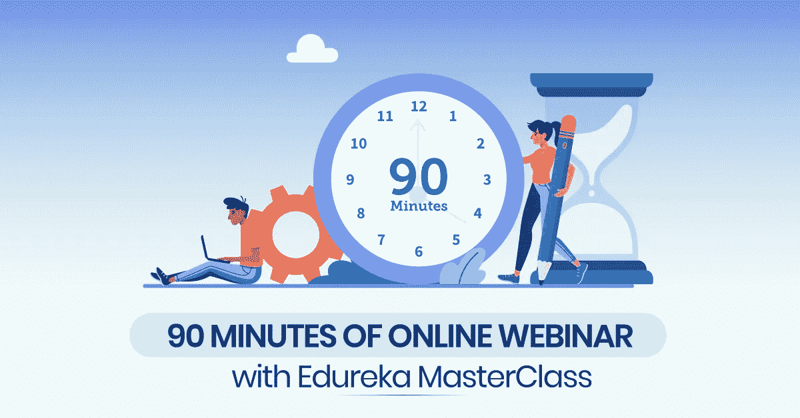

# 免费技术网络研讨会@ Edureka

> 原文：<https://medium.com/edureka/free-tech-webinars-edureka-f38244d86a33?source=collection_archive---------0----------------------->

技术的发展正在席卷培训行业。

但在早期阶段，人们不熟悉技术的革命性变化，因此，在线学习没有进入人们的生活。

因此，我们在行业需求和专业人士获得的技能之间存在巨大的差距。

你生活在一个变化是唯一不变的世界。你必须不断提升自己。靠一项技术就能活一辈子的日子已经一去不复返了。我想你们已经意识到了升级的重要性，以及你的技能过时的速度有多快。

我觉得我已经给了你足够的动力去学习新的东西，但是在某些情况下，你现在的工作会夺走你本可以用来学习的宝贵时间。

我说得更清楚一点，假设你在一家公司工作了差不多半天，你愿意学习一些新技术。

你有没有想过你可能要处理多少问题？

让我给你列举一些你将面临的挑战:

1.  从繁忙的日程中抽出时间来学习
2.  参加线下课程意味着你浪费了很多时间去旅行，如果你错过了一节课怎么办。你没有权利看录音。此外，你在上课时间方面受到限制，也许你喜欢在下班后的晚上或清晨学习。
3.  好吧，如果你决定通过 YouTube 视频学习，如果你有问题，或者你需要一些用例方面的帮助呢

除了上述挑战，最大的问题是—

> **我应该学什么？**

像 DevOps、AI、大数据等这样的趋势性技术太多了。你需要选择一个与你的背景相符并且有前途的工作。

看吧！从当前的工作中学习新的东西是一件非常忙碌的任务。

生活在这个科技的世界里，没有知识的人无法在人群中脱颖而出..！

我认为，与其把时间浪费在旅行上，不如**把时间投入到学习中去……！！！**

唯一的解决方案是，只要你愿意，随时花些时间通过在线网络研讨会学习，最好的将与你同在！

所以，为什么你不能坐在家里，通过点击播放按钮来掌握趋势科技，这样你就可以与众不同了…！

是的，你没看错..！

只需在 Edureka 大师班在线度过 90 分钟，就能改变你的生活方式。

一定会消除你心中的疑问:

> **“下一步我应该掌握什么技能，以及如何组织它……？？?"**

嗯，Edureka 大师班是一个人可以选择的最好的学习方式之一..！

Edureka 大师班克服了所有的障碍，给你最好的学习途径。

关于我们的大师班，需要了解的一些事实如下:

1.  我们有 28000 多名网络研讨会学习者。
2.  举办了近 200 场免费在线网络研讨会，讨论大数据、人工智能、道德黑客、数据科学等最新技术
3.  每个在线网络研讨会时长 90 分钟，根据地理区域的不同，每天举行三次
4.  迄今为止，平均已举办了 14000 小时的网络研讨会
5.  此外，主要的优势是我们拥有行业级专家，他们拥有 10 年以上的经验。很有可能从他们的经历中获得一些有用的东西
6.  此外，对您的查询的所有回答都同时被标记和清除

现在问题来了，我如何报名参加这些在线互动在线研讨会，我将获得什么回报？

您可以免费加入我们的 Meetup 群组，参加所有的技术网络研讨会。

以下是加入 Meetup 社区的一些好处:

> 1.每月 100 多次免费技术网络研讨会
> 
> 2.了解最新的技术网络研讨会、工作、角色、职业和技术新闻
> 
> 3.加入一个由 **25000 多名技术爱好者**组成的充满活力的团队，团结学习
> 
> 4.获得离线 Edureka 的邀请！Meetup 活动，学习并赢取奖品
> 
> 5.获得 Edureka 的独家折扣！课程
> 
> 6.在我们的博客和社区中访问精选的个性化内容

[***加入 EDUREKA MEETUP 社区***](http://bit.ly/32yJHj7) 了解所有最新技术

如果你想查看更多关于人工智能、DevOps、道德黑客等市场最热门技术的文章，你可以参考 [Edureka 的官方网站。](https://www.edureka.co/blog?utm_source=medium&utm_medium=content-link&utm_campaign=webinar)